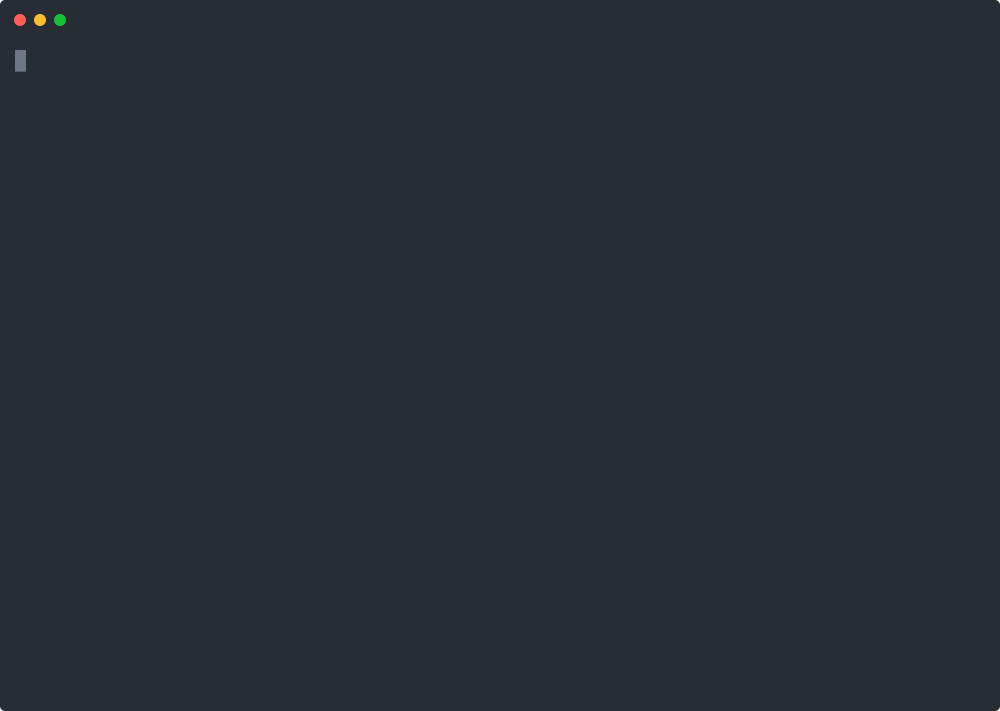

<p align="center">
  
</p>

# Leopold

**Brief it like a teammate. It conducts Claude Code in your seat.**

<p align="center">
  <a href="https://github.com/Jonhvmp/leopold/actions/workflows/ci.yml"></a>
  <a href="https://www.npmjs.com/package/leopold-driver"></a>
  <a href="LICENSE"></a>
  <a href="https://claude.com/claude-code"></a>
  <a href="https://github.com/Jonhvmp/leopold/stargazers"></a>
</p>

<p align="center">
  
</p>

Leopold is an autonomous orchestration harness for [Claude Code](https://claude.com/claude-code). You debate the work with it — goals, constraints, taste, what "done" means — and that becomes a durable brief. Then it takes the seat and drives Claude Code continuously, deciding the way you would instead of stopping at every fork, until the plan is done or a stop condition fires — **with your git locked the whole time.**

> The name nods to Bugs Bunny: in *Long-Haired Hare* (1949) he seizes the podium as the conductor **Leopold** and runs the orchestra with a wave of the baton. You are the composer, Leopold the conductor, Claude Code the orchestra.

> **Status: alpha.** The in-session engine (skills + hooks) works today; the SDK driver (`packages/driver/`) typechecks against the Agent SDK. See [Roadmap](#roadmap).

---

## Quickstart

```bash
curl -fsSL https://raw.githubusercontent.com/Jonhvmp/leopold/main/install.sh | bash
```

The installer copies the skills + hooks into `~/.claude/`, merges the `settings.json` snippet, and offers to open the toolchain manager.

<details><summary>Other ways to install</summary>

```bash
# clone (transparent)
git clone https://github.com/Jonhvmp/leopold.git && cd leopold && ./install.sh
# as a Claude Code plugin (auto-wires skills + hooks)
claude plugin marketplace add Jonhvmp/leopold && claude plugin install leopold@leopold
# just the external SDK driver
npm i -g leopold-driver
```
</details>

Then, in any project:

```
/leopold-brief    # debate the mission, write the brief
/leopold-run      # hand over the seat
/leopold-status   # see where it is
/leopold-stop     # take the seat back
```

> The cast at the top is a scripted walkthrough ([regenerate it](scripts/record-demo.sh)).
> For a full reproducible run — a real brief and the `DECISIONS.md` it produced — see
> [`examples/add-json-output/`](examples/add-json-output/).

---

## How it works

**Phase 1 — Brief (`/leopold-brief`).** A structured debate, not a form. Leopold pushes back and writes four durable artifacts: `MISSION.md` (what + definition of done), `CHARTER.md` (your priorities, taste, hard *never*/*always* rules — the part that "becomes you"), `GUARDRAILS.md` (autonomous vs gated, stop conditions, kill switch), and `PLAN.md` (the backlog). The run's quality is capped by the brief's, so this phase matters.

**Phase 2 — Run (`/leopold-run`).** Leopold loops: pick the next `PLAN.md` item → do the work, reaching for the right [gstack](https://github.com/garrytan/gstack) skill → at a fork, consult `CHARTER.md`; if the call is reversible and the charter is clear, **decide, log it to `DECISIONS.md`, and keep going** → mark it done, pick the next. A **Stop hook** re-injects "continue" while work remains; a **PreToolUse guard** keeps git and destructive ops locked. Everything it decided for you is in `DECISIONS.md` to review.

---

## Safety — autonomy you can trust

Because Leopold sells autonomy, guardrails are the product, not an afterthought.

- **Git stays locked.** Commit, push, force-push, `reset --hard`, recursive `rm` (any spelling), `find … -delete`, `gh pr create/merge`, and package publish are blocked while autonomous — regardless of permission mode. You opt in explicitly, per session, or they never run.
- **Red-teamed.** The guard ships a bypass-attempt test suite — **59 cases run in CI** (`make test-guard`), plus unit tests for the TS driver guard — covering tricks like `git -c user.name=x commit`, `rm --recursive --force`, `/bin/rm -rf`, and `find -exec rm`. Think you can slip one past it? [Open an issue](https://github.com/Jonhvmp/leopold/issues) — break it.
- **Cost-capped (both axes).** An autonomous run runs up a bill two ways: how much context each unit carries, and how many spawn. Leopold caps both — it stops when the transcript passes `max_context_mb` (5, resume fresh from the brief); forks (which clone the whole session) are capped at 2; oversized subagent prompts are denied; and total `Task` spawns are capped at `max_subagents` (8), continuing serially past it.
- **Fails closed.** A malformed run-state file blocks loudly; it never silently lets autonomy through.
- **Kill switch + audit.** `/leopold-stop` (or `touch .leopold/STOP`) halts at the next turn boundary; every autonomous decision is logged with its reasoning.

Leopold never weakens Claude Code's own permissions — it adds a second lock on top. Details: [`docs/guardrails.md`](docs/guardrails.md).

---

## What is a harness?

`Agent = Model + Harness` — everything around the model: orchestration, memory, guardrails, observability. Claude Code is a great harness for one *interactive* turn. Leopold adds the layer it lacks for *unattended* work: a **decider** (your charter, so it chooses instead of asking), **continuity** (a stop hook, so a finished turn rolls into the next item), behind **guardrails** (the gate above). More in [What is a harness](https://jonhvmp.github.io/leopold/concepts/harness/).

## gstack + the toolchain manager

[gstack](https://github.com/garrytan/gstack) is a battle-tested suite of Claude Code skills (`/spec`, `/code-review`, `/qa`, `/ship`, `/investigate`, …). Leopold doesn't replace it — it **conducts** it: gstack skills auto-switch to "pick the recommended option and report" inside an orchestrator, so the whole toolchain runs autonomously. Optional, but it's where planning shines (`/autoplan`, `/plan-*-review`).

A small interactive menu installs and manages the toolchain + companion extensions:

```bash
make menu     # or: bash ~/.claude/leopold/scripts/leopold-menu.sh
```

Each component lives under [`extensions/`](extensions/) (an `extension.json` + a `manage.sh`). Built in: **gstack**, and **ovmem** — autonomous RAG long-term memory (OpenViking + 4 hooks; OpenAI or AWS Bedrock; runs entirely on `127.0.0.1`). Walkthrough: [Toolchain Manager](docs/getting-started/toolchain-manager.md).

---

## Architecture at a glance

| Harness layer | v0.1 (in-session) | Roadmap (SDK driver) |
|---|---|---|
| Orchestration | Stop hook loop + `PLAN.md` | DAG executor, multi-worker waves |
| Memory / Context | Brief artifacts (the "System of Context") | + indexed long-term memory |
| Tooling / MCP | gstack skills + Claude Code tools | + dynamic MCP routing |
| Guardrails | PreToolUse gate + stop conditions | + per-tenant policy, budgets |
| Observability | `DECISIONS.md` + JSONL event log | SSE event stream + dashboard |
| Execution / Sandbox | Claude Code's own sandbox | E2B / Daytona runners |

Full design in [`docs/architecture.md`](docs/architecture.md).

## Roadmap

- [x] In-session engine: skills + Stop/PreToolUse hooks
- [x] `leopold doctor` — verify install, hooks, gstack wiring
- [x] Guard red-team suite — bypass attempts blocked in CI
- [x] SDK driver (v0.1 built) — external orchestrator on the [Claude Agent SDK](https://docs.claude.com/en/api/agent-sdk)
- [x] SDK driver unit tests (status parser + `canUseTool` guard)
- [ ] Multi-worker fan-out, web dashboard for the decision log

---

## Documentation

Full docs (Material + Mermaid): **https://jonhvmp.github.io/leopold/** — [Quickstart](https://jonhvmp.github.io/leopold/getting-started/quickstart/) · [What is a harness](https://jonhvmp.github.io/leopold/concepts/harness/) · [Architecture](https://jonhvmp.github.io/leopold/architecture/) · [Leopold vs Ralph](https://jonhvmp.github.io/leopold/comparisons/ralph/)

## License

MIT. See [LICENSE](LICENSE).

<p align="center">
  <a href="https://www.star-history.com/?type=date&repos=Jonhvmp%2Fleopold">
    <picture>
      <source media="(prefers-color-scheme: dark)" srcset="https://api.star-history.com/chart?repos=Jonhvmp/leopold&type=date&theme=dark&legend=top-left" />
      
    </picture>
  </a>
</p>
