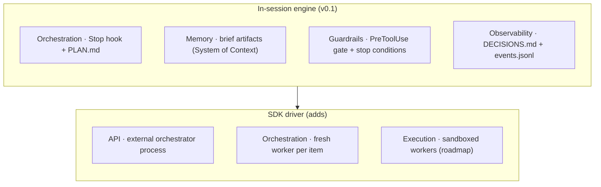
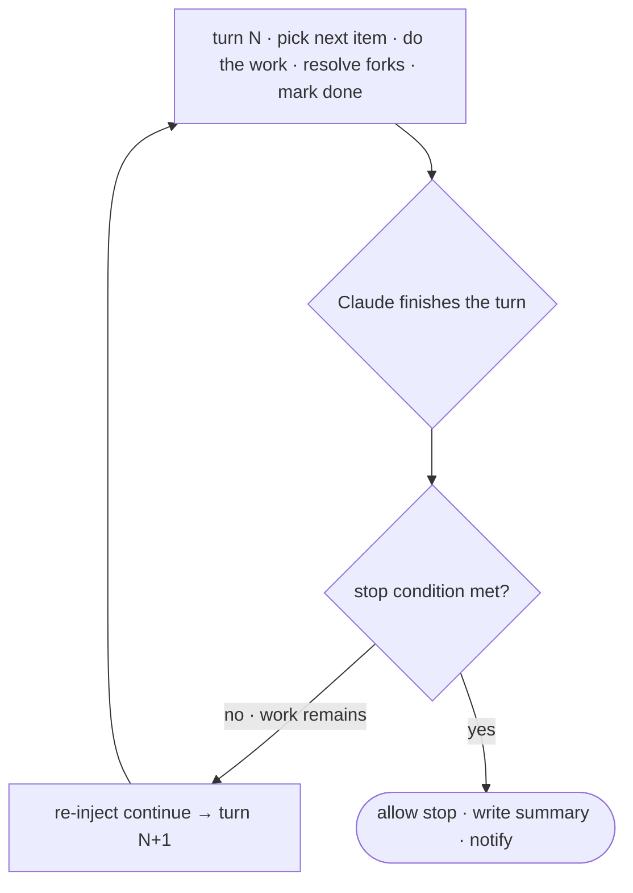

# Architecture Overview

Leopold is an agent harness. A harness is everything wrapped around the model
except the model itself: tool execution, memory and state, orchestration,
guardrails, and observability (`Agent = Model + Harness`). Claude Code is already
a strong harness for a single interactive turn. Leopold extends it for
unattended, long-running work.

## Design principles

1. **Conduct, do not replace.** Leopold drives Claude Code and the gstack skill
   library through their own public surfaces (skills, hooks, environment). No
   fork of Claude Code, no patched skill.
2. **Model-driven, not hardcoded.** Orchestration logic lives in prompts, the
   charter, and natural-language tool descriptions, not a rigid coded router. As
   the model improves, Leopold improves with it.
3. **The brief is the contract.** Everything autonomous flows from the four brief
   artifacts. The run never invents intent.
4. **Guardrails are first-class.** The git lock is enforced by a hook, not a
   prompt the model could rationalize past.
5. **Every decision is auditable.** A decision the human did not make must be
   recoverable later, with its reasoning. `DECISIONS.md` is the trail.

## The harness layers, mapped

Leopold maps onto the standard harness layers. The v0.1 in-session engine
implements the orchestration, memory, guardrails, and observability layers
entirely through Claude Code's own skills and hooks. The SDK driver
(`packages/driver/`) adds the API and sandbox layers.



| Harness layer | v0.1 (in-session) | SDK driver |
| --- | --- | --- |
| Orchestration | Stop hook loop + `PLAN.md` | persistent conductor, fresh worker per item |
| Memory / Context | brief artifacts | + indexed long-term memory (roadmap) |
| Tooling / MCP | gstack skills + Claude Code tools | + dynamic MCP routing (roadmap) |
| Guardrails | PreToolUse gate + stop conditions | `canUseTool` gate, same policy |
| Observability | `DECISIONS.md` + JSONL | + SSE stream + dashboard (roadmap) |
| Execution / Sandbox | Claude Code's own sandbox | E2B / Daytona runners (roadmap) |

## The run loop

The loop is **state-coupled**: continuation is a function of `PLAN.md` and the
stop conditions, never an unconditional "keep going" flag. This is the single
most important reliability property.



## State on disk

Everything a run needs lives under `.leopold/` in the target project (gitignored
by default), so a run is inspectable, resumable, and reviewable with a text
editor:

```text
.leopold/
  MISSION.md        # what
  CHARTER.md        # how you would choose
  GUARDRAILS.md     # what stays locked
  PLAN.md           # the work queue
  DECISIONS.md      # the audit trail (append-only)
  state.json        # active, iteration, counters, timestamps
  events.jsonl      # structured event stream
  STOP              # kill switch (presence halts the loop)
  ALLOW_GIT         # per-session opt-in token (absent by default)
```

## Why in-session first, SDK driver second

The in-session engine proves the hard part (a charter-driven decider plus
state-coupled continuity plus a hard git lock) with zero new infrastructure: it
is skills and hooks, and it runs anywhere Claude Code runs. The SDK driver is a
strict superset that adds parallelism, an API surface, and sandboxed workers for
missions that outgrow a single session.

Continue: the [In-Session Engine](architecture/in-session.md), the
[SDK Driver](architecture/driver.md), or the
[Conductor & Worker Protocol](architecture/protocol.md).
