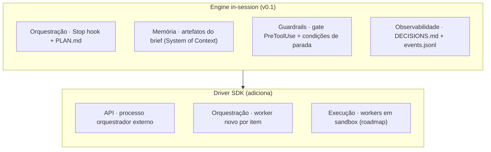
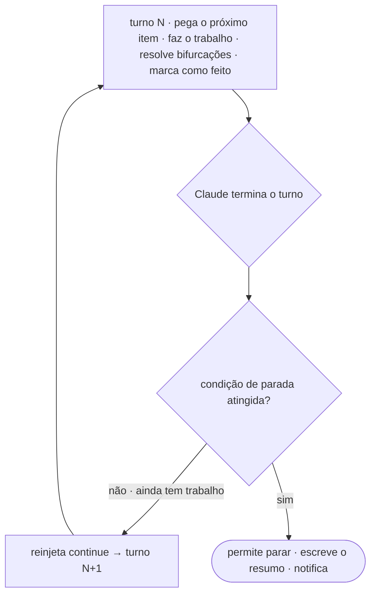

# Visão Geral da Arquitetura

Leopold é um harness de agente. Um harness é tudo que envolve o modelo, exceto
o próprio modelo: execução de ferramentas, memória e estado, orquestração,
guardrails e observabilidade (`Agent = Model + Harness`). O Claude Code já é
um harness forte para um único turno interativo. O Leopold o estende para
trabalho longo e sem supervisão.

## Princípios de design

1. **Reger, não substituir.** O Leopold conduz o Claude Code e a biblioteca de
   skills gstack pelas suas próprias superfícies públicas (skills, hooks,
   ambiente). Nada de fork do Claude Code, nada de skill remendada.
2. **Orientado pelo modelo, não hardcoded.** A lógica de orquestração vive em
   prompts, no charter e em descrições de ferramenta em linguagem natural, não
   num roteador rígido em código. Conforme o modelo melhora, o Leopold melhora
   junto.
3. **O brief é o contrato.** Tudo que é autônomo deriva dos quatro artefatos do
   brief. A run nunca inventa intenção.
4. **Guardrails são cidadãos de primeira classe.** O lock de git é imposto por
   um hook, não por um prompt que o modelo poderia racionalizar e contornar.
5. **Toda decisão é auditável.** Uma decisão que o humano não tomou precisa ser
   recuperável depois, com o raciocínio. O `DECISIONS.md` é essa trilha.

## As camadas do harness, mapeadas

O Leopold se mapeia nas camadas padrão de um harness. O engine in-session da
v0.1 implementa as camadas de orquestração, memória, guardrails e
observabilidade inteiramente com as skills e hooks do próprio Claude Code. O
driver SDK (`packages/driver/`) adiciona as camadas de API e sandbox.



| Camada do harness | v0.1 (in-session) | Driver SDK |
| --- | --- | --- |
| Orquestração | loop do Stop hook + `PLAN.md` | maestro persistente, worker novo por item |
| Memória / Contexto | artefatos do brief | + memória de longo prazo indexada (roadmap) |
| Ferramentas / MCP | skills do gstack + ferramentas do Claude Code | + roteamento MCP dinâmico (roadmap) |
| Guardrails | gate PreToolUse + condições de parada | gate `canUseTool`, mesma política |
| Observabilidade | `DECISIONS.md` + JSONL | + stream SSE + dashboard (roadmap) |
| Execução / Sandbox | o sandbox do próprio Claude Code | runners E2B / Daytona (roadmap) |

## O loop da run

O loop é **acoplado ao estado**: a continuação é função do `PLAN.md` e das
condições de parada, nunca uma flag incondicional de "continua sempre". Essa é
a propriedade de confiabilidade mais importante de todas.



## Estado em disco

Tudo que uma run precisa vive em `.leopold/` no projeto alvo (gitignored por
padrão), então uma run é inspecionável, retomável e revisável com um editor de
texto:

```text
.leopold/
  MISSION.md        # what
  CHARTER.md        # how you would choose
  GUARDRAILS.md     # what stays locked
  PLAN.md           # the work queue
  DECISIONS.md      # the audit trail (append-only)
  state.json        # active, iteration, counters, timestamps
  events.jsonl      # structured event stream
  STOP              # kill switch (presence halts the loop)
  ALLOW_GIT         # per-session opt-in token (absent by default)
```

## Por que in-session primeiro e driver SDK depois

O engine in-session prova a parte difícil (um decisor guiado pelo charter, mais
continuidade acoplada ao estado, mais um lock de git rígido) com zero
infraestrutura nova: são skills e hooks, e roda em qualquer lugar onde o Claude
Code roda. O driver SDK é um superconjunto estrito que adiciona paralelismo,
uma superfície de API e workers em sandbox para missões que não cabem mais numa
única sessão.

Continue em: [Engine In-Session](architecture/in-session.md),
[Driver SDK](architecture/driver.md) ou o
[Protocolo Maestro & Worker](architecture/protocol.md).
