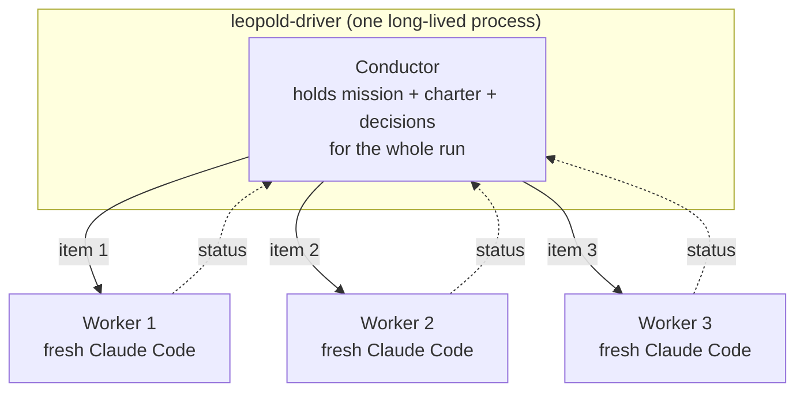
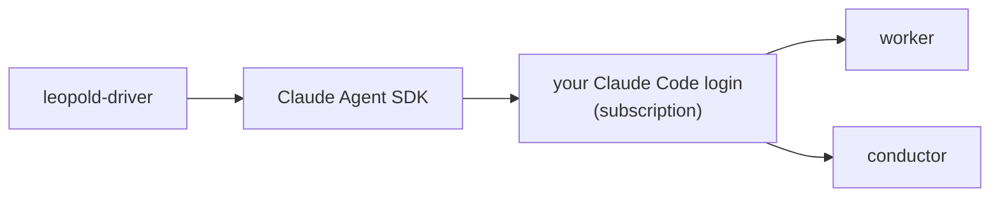

# SDK Driver

The SDK driver is the tier that turns Leopold from "a better loop" into a real
harness you brief and walk away from. It is an external Node process built on the
[Claude Agent SDK](https://docs.claude.com/en/api/agent-sdk).

## The core idea: persistent conductor, fresh workers

Each plan item gets a **brand-new worker with clean context**, so quality does
not rot as the run grows. The **conductor is persistent**: it remembers the
mission, charter, and every decision across the whole run. This is the best of
both worlds — fresh context per task, plus a conductor holding the thread.

## Modules

| Module | Responsibility |
| --- | --- |
| `loop.ts` | the orchestration loop; burns down the plan (serial or `--parallel`), applies stop conditions |
| `worker.ts` | runs one item as a back-and-forth with a fresh worker |
| `conductor.ts` | reads a worker status, decides from the charter (structured verdict) |
| `review.ts` | the diverse-lens review panel (correctness / security / does-it-actually-work) |
| `hypotheses.ts` | the root-cause panel: disjoint-evidence investigators + refuters on a retry |
| `classify.ts` | deterministic per-item risk → effort / critical / sensitive |
| `route.ts` | opt-in smart routing: research the item's real blast radius (keyword fallback) |
| `learn.ts` | learn-on-finish: mine the run into proposed charter amendments |
| `compile.ts` | brief→workflow compiler: `PLAN.md` → dependency waves + classified `args` |
| `runtime.ts` | experimental in-driver workflow runtime (`agent`/`pipeline`/`parallel`/`budget`) |
| `workflow-cmd.ts` | the `leopold workflow` subcommand (emit / `--print` / `--run`) |
| `plan.ts` | `PLAN.md` as a dependency-aware work list |
| `worktree.ts` / `git.ts` | per-item worktree isolation + staged-patch replay |
| `channel.ts` | a driver-controlled async iterable feeding the worker session |
| `protocol.ts` | parses the worker's status block |
| `guard.ts` | the git lock as a `canUseTool` callback |
| `config.ts` | loads the brief and run config (CLI/env > GUARDRAILS > defaults) |
| `budget.ts` / `secrets.ts` / `reaper.ts` | USD hard-stop, encrypted vault, orphan-run reaper |
| `insights.ts` | `events.jsonl` → post-run report (incl. persona runs) |
| `persona-testing/` | the [persona harness](../concepts/persona-testing.md): journey journal, flow parser, contract gate, deterministic report, cast conduction (`leopold persona`) |
| `log.ts` | `DECISIONS.md`, `events.jsonl`, plan bookkeeping |
| `notify.ts` | completion / escalation notifications |

## Auth: your Claude Code, not an API key

Both the worker and the conductor run through the Agent SDK, which uses your
existing Claude Code login. There is **no separate API key and no split
billing**. `ANTHROPIC_API_KEY` is only needed in a headless environment with no
Claude Code auth.

## Quality machinery around each item

An item doesn't just run — it is classified, conducted, and gated:

1. **Classify** (`classify.ts`, or `route.ts` with `--smart-routing`) sets the worker's
   reasoning effort and marks critical/sensitive items.
2. **Conduct** — the persistent conductor answers every worker status from the charter.
3. **Review panel** (`review.ts`) — independent skeptics with distinct lenses read the
   diff; blocking findings go back to the worker, unparseable verdicts fail closed.
4. **On a retry** (`hypotheses.ts`) — a root-cause panel forms hypotheses over disjoint
   evidence and hands the next attempt a concrete lead.
5. **On a clean finish** (`learn.ts`, opt-in) — the run is mined into proposed charter
   amendments; `CHARTER.md` itself is never edited.

## The workflow path

`leopold workflow` compiles the same brief into a [dynamic
workflow](../concepts/dynamic-workflows.md): `compile.ts` turns `PLAN.md` into dependency
waves with per-item classification (deterministic, unit-tested), emits
`.claude/workflows/leopold-run.js` + `.leopold/workflow-args.json`, and `--run` executes it
headlessly through `runtime.ts` — an experimental executor for the workflow globals with a
real concurrency cap and the same git guard.

## Status

Alpha. Verified: typechecks against `@anthropic-ai/claude-agent-sdk`; 113 unit tests
(`make driver-test`) cover the status parser, the `canUseTool` guard (same bypass attempts
as the bash red-team suite), classification, review-panel helpers, the hypothesis and learn
parsers, the brief→workflow compiler, and the experimental runtime's orchestration; and a
CLI smoke test (`make driver-smoke`) executes the built binary end to end against a fixture
brief on every CI run (Ubuntu + macOS). The `workflow --run` query shim is the one path not
exercised end to end — experimental by design.

See [Driver Config](../reference/driver-config.md) to run it, and the
[Conductor & Worker Protocol](protocol.md) for the exchange.
