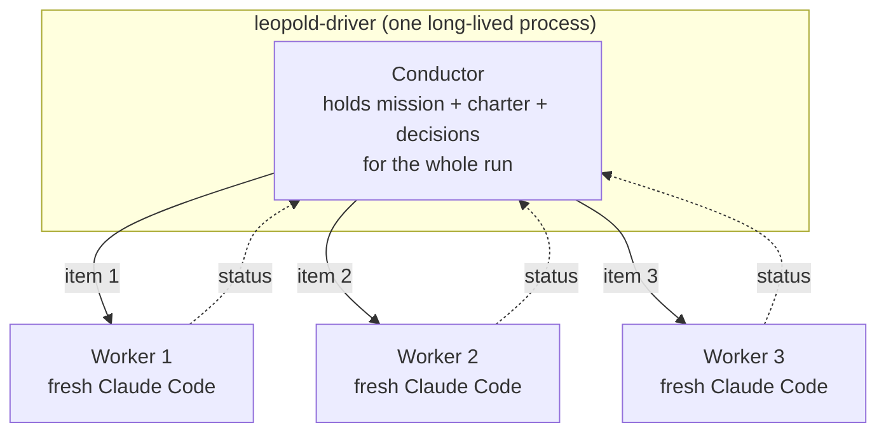
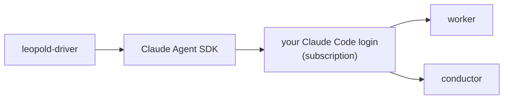

# SDK Driver

The SDK driver is the tier that turns Leopold from "a better loop" into a real
harness you brief and walk away from. It is an external Node process built on the
[Claude Agent SDK](https://docs.claude.com/en/api/agent-sdk).

## The core idea: persistent conductor, fresh workers

Each plan item gets a **brand-new worker with clean context**, so quality does
not rot as the run grows. The **conductor is persistent**: it remembers the
mission, charter, and every decision across the whole run. This is the best of
both worlds — fresh context per task, plus a conductor holding the thread.

## Modules

| Module | Responsibility |
| --- | --- |
| `loop.ts` | the orchestration loop; burns down the plan, applies stop conditions |
| `worker.ts` | runs one item as a back-and-forth with a fresh worker |
| `conductor.ts` | reads a worker status, decides from the charter (structured verdict) |
| `channel.ts` | a driver-controlled async iterable feeding the worker session |
| `protocol.ts` | parses the worker's status block |
| `guard.ts` | the git lock as a `canUseTool` callback |
| `config.ts` | loads the brief and run config |
| `log.ts` | `DECISIONS.md`, `events.jsonl`, plan bookkeeping |
| `notify.ts` | completion / escalation notifications |

## Auth: your Claude Code, not an API key

Both the worker and the conductor run through the Agent SDK, which uses your
existing Claude Code login. There is **no separate API key and no split
billing**. `ANTHROPIC_API_KEY` is only needed in a headless environment with no
Claude Code auth.

## Status

Alpha. Verified: typechecks against `@anthropic-ai/claude-agent-sdk`, the CLI and
dry-run work, and the status parser + `canUseTool` guard have unit tests
(`make driver-test`) covering the same bypass attempts as the bash guard's red-team
suite. Roadmap: a watchdog for
a worker that ends a turn without a status block, parallel multi-worker waves, and
a live dashboard.

See [Driver Config](../reference/driver-config.md) to run it, and the
[Conductor & Worker Protocol](protocol.md) for the exchange.
