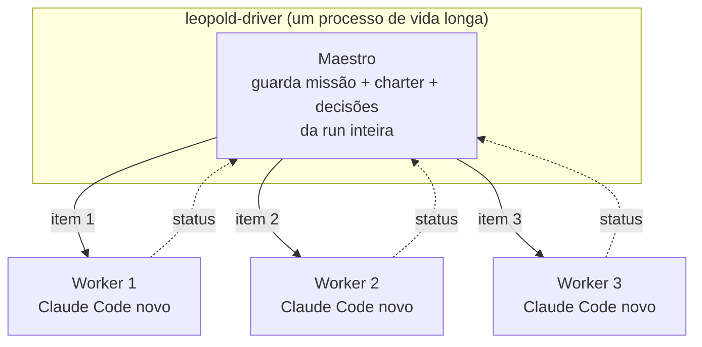
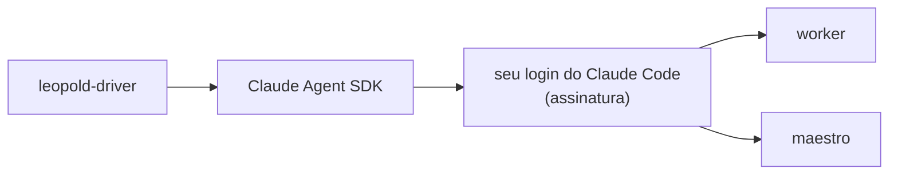

# Driver SDK

O driver SDK é o tier que transforma o Leopold de "um loop melhor" num harness
de verdade: você entrega o brief e sai de perto. É um processo Node externo
construído sobre o [Claude Agent SDK](https://docs.claude.com/en/api/agent-sdk).

## A ideia central: maestro persistente, workers novos

Cada item do plano ganha um **worker zerado, com contexto limpo**, então a
qualidade não apodrece conforme a run cresce. O **maestro é persistente**: ele
lembra a missão, o charter e cada decisão ao longo da run inteira. É o melhor
dos dois mundos — contexto novo por tarefa, mais um maestro segurando o fio da
meada.

## Módulos

| Módulo | Responsabilidade |
| --- | --- |
| `loop.ts` | o loop de orquestração; consome o plano (serial ou `--parallel`), aplica as condições de parada |
| `worker.ts` | executa um item como uma conversa de ida e volta com um worker novo |
| `conductor.ts` | lê o status de um worker, decide a partir do charter (veredito estruturado) |
| `review.ts` | o painel de revisão com lentes diversas (correção / segurança / funciona-de-verdade) |
| `hypotheses.ts` | o painel de causa raiz: investigadores com evidências disjuntas + refutadores numa nova tentativa |
| `classify.ts` | risco determinístico por item → esforço / crítico / sensível |
| `route.ts` | roteamento inteligente opt-in: pesquisa o raio de impacto real do item (fallback por palavra-chave) |
| `learn.ts` | learn-on-finish: minera a run em emendas propostas ao charter |
| `compile.ts` | compilador brief→workflow: `PLAN.md` → ondas de dependência + `args` classificados |
| `runtime.ts` | runtime de workflow experimental dentro do driver (`agent`/`pipeline`/`parallel`/`budget`) |
| `workflow-cmd.ts` | o subcomando `leopold workflow` (emitir / `--print` / `--run`) |
| `plan.ts` | o `PLAN.md` como lista de trabalho ciente de dependências |
| `worktree.ts` / `git.ts` | isolamento por worktree por item + replay do patch staged |
| `channel.ts` | um iterável assíncrono controlado pelo driver que alimenta a sessão do worker |
| `protocol.ts` | faz o parse do bloco de status do worker |
| `guard.ts` | o lock de git como callback de `canUseTool` |
| `config.ts` | carrega o brief e a config da run (CLI/env > GUARDRAILS > padrões) |
| `budget.ts` / `secrets.ts` / `reaper.ts` | hard-stop em USD, cofre criptografado, reaper de runs órfãs |
| `insights.ts` | `events.jsonl` → relatório pós-run |
| `log.ts` | `DECISIONS.md`, `events.jsonl`, contabilidade do plano |
| `notify.ts` | notificações de conclusão / escalação |

## Auth: seu Claude Code, não uma chave de API

Tanto o worker quanto o maestro rodam pelo Agent SDK, que usa o seu login
existente do Claude Code. **Não há chave de API separada nem cobrança
dividida.** `ANTHROPIC_API_KEY` só é necessária num ambiente headless sem auth
do Claude Code.

## A maquinaria de qualidade em volta de cada item

Um item não é simplesmente executado — ele é classificado, regido e passa por
gates:

1. **Classificação** (`classify.ts`, ou `route.ts` com `--smart-routing`) define o
   esforço de raciocínio do worker e marca itens críticos/sensíveis.
2. **Regência** — o maestro persistente responde cada status de worker a partir do
   charter.
3. **Painel de revisão** (`review.ts`) — céticos independentes, com lentes distintas,
   leem o diff; achados bloqueantes voltam para o worker, vereditos improcessáveis
   falham fechado.
4. **Numa nova tentativa** (`hypotheses.ts`) — um painel de causa raiz forma hipóteses
   sobre evidências disjuntas e entrega uma pista concreta para a próxima tentativa.
5. **Num término limpo** (`learn.ts`, opt-in) — a run é minerada em emendas propostas
   ao charter; o `CHARTER.md` em si nunca é editado.

## O caminho do workflow

`leopold workflow` compila o mesmo brief num [workflow
dinâmico](../concepts/dynamic-workflows.md): o `compile.ts` transforma o `PLAN.md` em
ondas de dependência com classificação por item (determinístico, com testes unitários),
emite `.claude/workflows/leopold-run.js` + `.leopold/workflow-args.json`, e `--run`
executa tudo de forma headless pelo `runtime.ts` — um executor experimental para os
globals de workflow, com um teto real de concorrência e o mesmo guard de git.

## Status

Alpha. Verificado: passa no typecheck contra `@anthropic-ai/claude-agent-sdk`; 113
testes unitários (`make driver-test`) cobrem o parser de status, o guard de
`canUseTool` (as mesmas tentativas de bypass da suíte de red team em bash), a
classificação, os helpers do painel de revisão, os parsers de hipóteses e de learn, o
compilador brief→workflow e a orquestração do runtime experimental; e um smoke test de
CLI (`make driver-smoke`) executa o binário compilado de ponta a ponta contra um brief
de fixture em toda execução do CI (Ubuntu + macOS). O shim de query do `workflow --run`
é o único caminho não exercitado de ponta a ponta — experimental por design.

Veja [Driver Config](../reference/driver-config.md) para rodá-lo, e o
[Protocolo Maestro & Worker](protocol.md) para a troca de mensagens.
