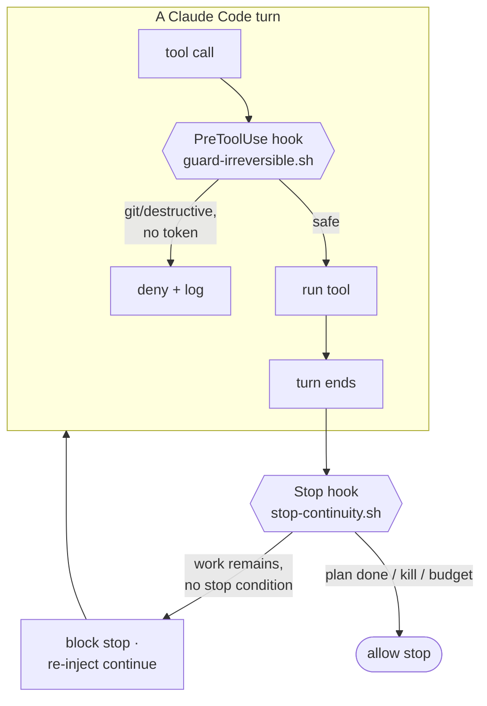
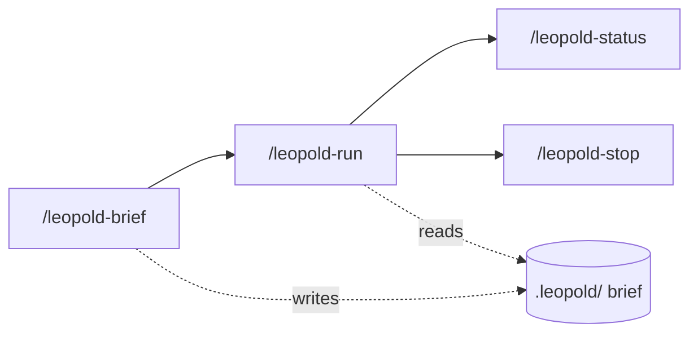

# In-Session Engine

The in-session engine is the v0.1 tier: it runs entirely inside one Claude Code
session, using two hooks and four skills. No external process, no API key, no
new infrastructure.

## The two hooks

### Stop hook — continuity

When the agent finishes a turn, the `Stop` hook reads `.leopold/state.json` and
`PLAN.md`. If a run is active and the plan has open items and no stop condition is
met, it returns `{"decision":"block","reason":"..."}`. The `reason` is **not** a
bare "continue"; it is a compact instruction that tells the agent to read the
plan, take the next item, apply the decision protocol, log, and not ask. Each
continuation increments an iteration counter, which feeds the budget stop
condition.

!!! info "Fail-open by design"
    A broken Stop hook must never trap a session in a loop, so any unexpected
    error makes it allow the stop. Continuity is best-effort; halting is safe.

### PreToolUse hook — the git lock

The `PreToolUse` hook inspects every Bash command and edit while a run is active.
Irreversible or destructive operations are denied unless an explicit per-session
token is present.

| Operation | Default | Token to allow |
| --- | --- | --- |
| `git commit` | denied | `.leopold/ALLOW_GIT` |
| `git push` | denied | `.leopold/ALLOW_PUSH` |
| force-push, `reset --hard`, `rm -rf` | denied | none (forbidden) |
| `gh pr create/merge`, release | denied | `.leopold/ALLOW_PUSH` |
| publish (`npm`/`cargo`/...) | denied | `.leopold/ALLOW_PUBLISH` |

## The skills

- **`/leopold-brief`** — Phase 1. Debates the mission and writes the brief.
- **`/leopold-run`** — Phase 2. Activates the run and does turn 1; the Stop hook
  carries it forward.
- **`/leopold-status`** — read-only dashboard of the run.
- **`/leopold-stop`** — clean shutdown at the next turn boundary.

## Known limit

The loop runs while the Claude Code session is open. State persists on disk, so a
run is resumable, but the in-session engine is not a background daemon. For
unattended runs, use the [SDK driver](driver.md).
