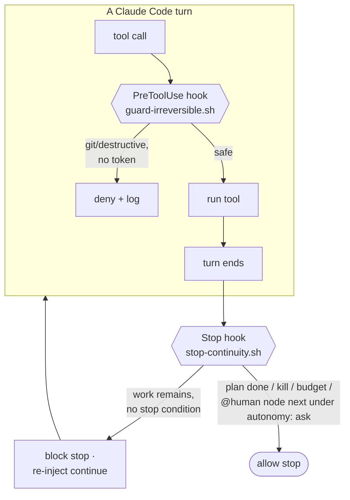
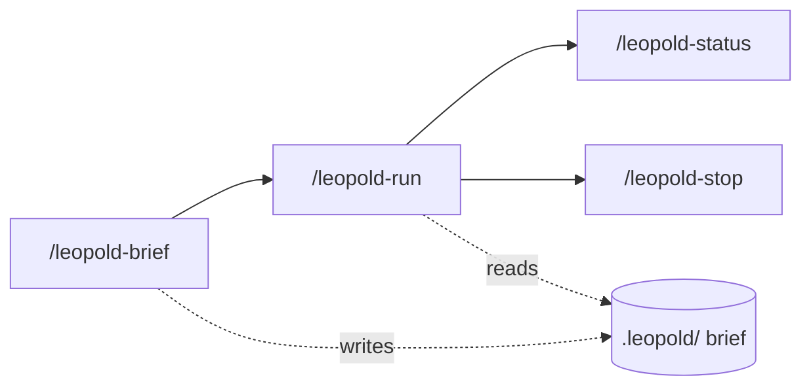

# In-Session Engine

The in-session engine is the v0.1 tier: it runs entirely inside one Claude Code
session, using two hooks and a set of skills. No external process, no API key, no
new infrastructure.

!!! info "Two more hooks ship alongside the engine"
    The installer also wires the [prompt enhancer](../reference/enhance.md) — a
    `UserPromptSubmit` hook independent of the run engine (it improves *your*
    everyday prompts, off by default) — and the repo carries
    [`persona-guard.sh`](../reference/persona-guard-hooks.md), armed only while a
    [persona run](../concepts/persona-testing.md) is active. This page covers the
    two hooks that implement the autonomous run.

## The two hooks

### Stop hook — continuity

When the agent finishes a turn, the `Stop` hook reads `.leopold/state.json` and
`PLAN.md`. If a run is active and the plan has open items and no stop condition is
met, it returns `{"decision":"block","reason":"..."}`. The `reason` is **not** a
bare "continue"; it is a compact instruction that tells the agent to read the
plan, take the next item, apply the decision protocol, log, and not ask. Each
continuation increments an iteration counter, which feeds the budget stop
condition.

One plan construct changes what that instruction says: a **`@human`** node. Under
the default posture (`autonomy: full`) nobody is coming to decide it, so the hook
still blocks the stop — but the re-injected instruction tells the agent to
synthesize the role that decision needs, take it, do the item, and record the call
in `DECISIONS.md` with a **Reversal** line. Under `autonomy: ask` the hook allows
the stop with `awaiting_human` and names the item instead. Either way it matches
what the driver does at the same node. See
[Hooks → Node kinds](../reference/hooks.md#node-kinds).

!!! info "Fail-open by design"
    A broken Stop hook must never trap a session in a loop, so any unexpected
    error makes it allow the stop. Continuity is best-effort; halting is safe.

### PreToolUse hook — the git lock

The `PreToolUse` hook inspects every Bash command and edit while a run is active.
Irreversible or destructive operations are denied unless an explicit per-session
token is present.

| Operation | Default | Token to allow |
| --- | --- | --- |
| `git commit` | denied | `.leopold/ALLOW_GIT` |
| `git push` | denied | `.leopold/ALLOW_PUSH` |
| force-push | denied | none (always denied) |
| everything else (`rm -rf`, `reset --hard`, `gh pr`, publish, …) | allowed | — (the run's own call) |

## The skills

- **`/leopold-brief`** — Phase 1. Debates the mission and writes the brief.
- **`/leopold-run`** — Phase 2. Activates the run and does turn 1; the Stop hook
  carries it forward.
- **`/leopold-status`** — read-only dashboard of the run.
- **`/leopold-stop`** — clean shutdown at the next turn boundary.

These four are the engine's core loop. The full family — `/leopold-workflow`,
`/leopold-learn`, `/leopold-triage`, `/leopold-enhance`, `/leopold-watch`,
`/leopold-up`, `/leopold-update`, `/leopold-doctor` — is documented in the
[Skills reference](../reference/skills.md).

## Known limit

The loop runs while the Claude Code session is open. State persists on disk, so a
run is resumable, but the in-session engine is not a background daemon. For
unattended runs, use the [SDK driver](driver.md).
