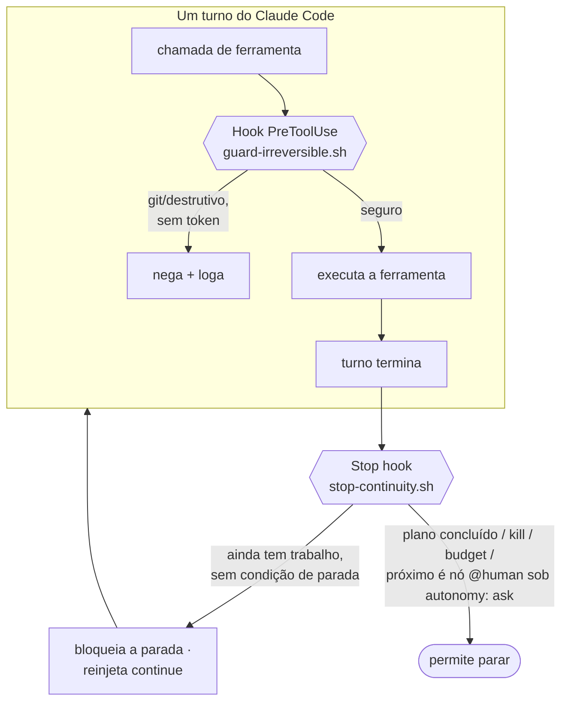
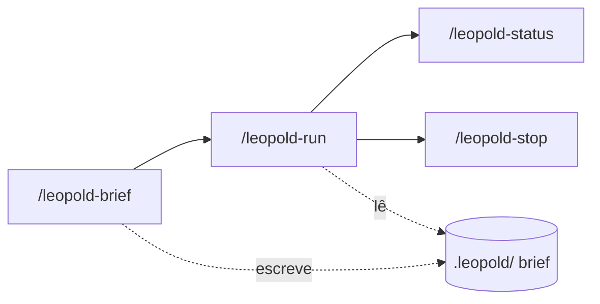

# Engine In-Session

O engine in-session é o tier da v0.1: ele roda inteiramente dentro de uma
sessão do Claude Code, usando dois hooks e um conjunto de skills. Sem processo
externo, sem chave de API, sem infraestrutura nova.

!!! info "Um terceiro hook vem junto com o engine"
    O instalador também conecta o [prompt enhancer](../reference/enhance.md) —
    um hook de `UserPromptSubmit` independente do engine de run (ele melhora os
    *seus* prompts do dia a dia, desligado por padrão). Esta página cobre os
    dois hooks que implementam a run autônoma.

## Os dois hooks

### Stop hook — continuidade

Quando o agente termina um turno, o hook de `Stop` lê `.leopold/state.json` e
o `PLAN.md`. Se há uma run ativa, o plano tem itens abertos e nenhuma condição
de parada foi atingida, ele retorna `{"decision":"block","reason":"..."}`. O
`reason` **não** é um "continue" seco; é uma instrução compacta que manda o
agente ler o plano, pegar o próximo item, aplicar o protocolo de decisão, logar
e não perguntar. Cada continuação incrementa um contador de iteração, que
alimenta a condição de parada por budget.

Um construto do plano muda o que essa instrução diz: um nó **`@human`**. Sob a
postura padrão (`autonomy: full`), ninguém vai vir decidir, então o hook continua
bloqueando a parada — mas a instrução reinjetada manda o agente sintetizar o papel
que aquela decisão exige, assumi-lo, fazer o item e registrar a decisão no
`DECISIONS.md` com uma linha **Reversal**. Sob `autonomy: ask`, o hook permite a
parada com `awaiting_human` e nomeia o item. Nos dois casos, é exatamente o que o
driver faz no mesmo nó. Veja
[Hooks → Tipos de nó](../reference/hooks.pt-BR.md#tipos-de-no).

!!! info "Fail-open por design"
    Um Stop hook quebrado nunca pode prender uma sessão num loop, então
    qualquer erro inesperado faz ele permitir a parada. Continuidade é melhor
    esforço; parar é seguro.

### Hook PreToolUse — o lock de git

O hook de `PreToolUse` inspeciona todo comando Bash e toda edição enquanto uma
run está ativa. Operações irreversíveis ou destrutivas são negadas, a menos que
um token explícito por sessão esteja presente.

| Operação | Padrão | Token para permitir |
| --- | --- | --- |
| `git commit` | negado | `.leopold/ALLOW_GIT` |
| `git push` | negado | `.leopold/ALLOW_PUSH` |
| force-push | negado | nenhum (sempre negado) |
| todo o resto (`rm -rf`, `reset --hard`, `gh pr`, publicar, …) | permitido | — (chamada da própria run) |

## As skills

- **`/leopold-brief`** — Fase 1. Debate a missão e escreve o brief.
- **`/leopold-run`** — Fase 2. Ativa a run e faz o turno 1; o Stop hook a leva
  adiante.
- **`/leopold-status`** — dashboard somente leitura da run.
- **`/leopold-stop`** — desligamento limpo na próxima fronteira de turno.

Essas quatro são o loop central do engine. A família completa —
`/leopold-workflow`, `/leopold-learn`, `/leopold-triage`, `/leopold-enhance`,
`/leopold-watch`, `/leopold-up`, `/leopold-update`, `/leopold-doctor` — está
documentada na [referência de Skills](../reference/skills.md).

## Limite conhecido

O loop roda enquanto a sessão do Claude Code está aberta. O estado persiste em
disco, então uma run é retomável, mas o engine in-session não é um daemon em
background. Para runs sem supervisão, use o [driver SDK](driver.md).
