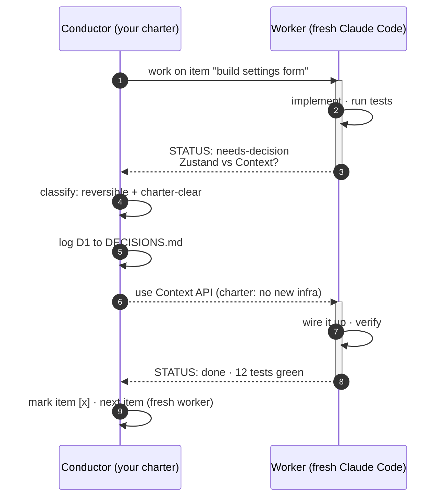
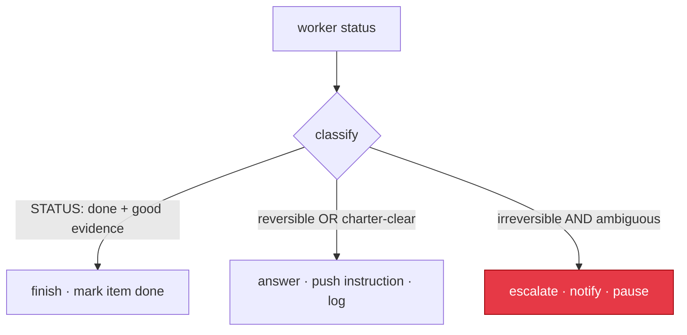

# Conductor & Worker Protocol

This is how the driver's two agents talk. It is a real message exchange, not a
blind "continue": the worker reports, the conductor reads and judges, the
conductor replies.

## The exchange



## The status contract

The worker closes **every turn** with a fenced status block, then stops and waits
for the conductor:

````text
```leopold-status
STATUS: done | needs-decision | blocked
ITEM: <the item you are on>
SUMMARY: <what you did this turn, 1-3 lines>
DECISION-NEEDED: <if needs-decision: the question + options A/B + tradeoff; else empty>
NEXT: <what you think comes next>
EVIDENCE: <build/lint/test result if relevant>
```
````

The driver parses this deterministically (a fenced block, or a bare `STATUS:`
fallback), then the conductor reasons over the parsed result.

## The conductor's verdict

The conductor returns one of three actions:



| Action | When | Effect |
| --- | --- | --- |
| `answer` | reversible or the charter covers it | push a concrete instruction back into the same worker session, log the decision |
| `finish` | item complete with evidence | mark the plan item done, start the next item with a fresh worker |
| `escalate` | irreversible and ambiguous, or a charter contradiction | notify the human, pause the run |

Why it works: the conductor is **itself a reasoning model** reading the full
message with your charter as its system prompt, not a regex. The structured
status block makes the *signal* reliable; the charter makes the *judgment* yours.
