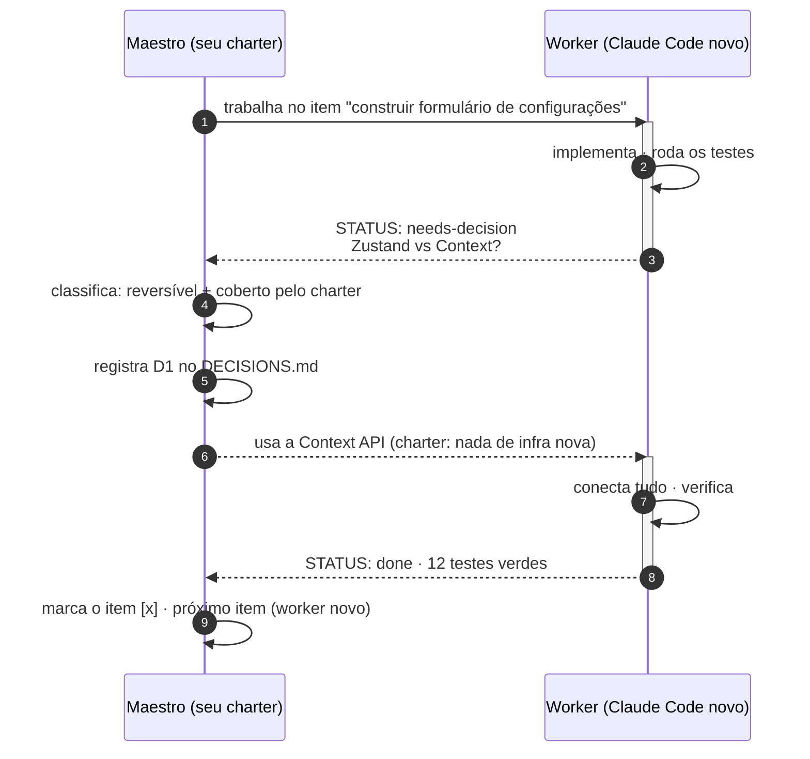
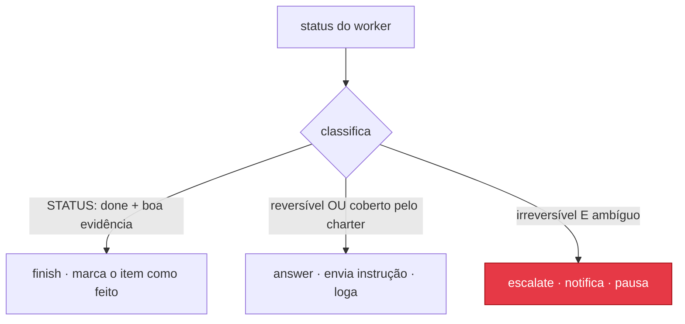

# Protocolo Maestro & Worker

É assim que os dois agentes do driver conversam. É uma troca de mensagens de
verdade, não um "continue" cego: o worker reporta, o maestro lê e julga, o
maestro responde.

## A troca



## O contrato de status

O worker fecha **todo turno** com um bloco de status em fence, depois para e
espera o maestro:

````text
```leopold-status
STATUS: done | needs-decision | blocked
ITEM: <the item you are on>
SUMMARY: <what you did this turn, 1-3 lines>
DECISION-NEEDED: <if needs-decision: the question + options A/B + tradeoff; else empty>
NEXT: <what you think comes next>
EVIDENCE: <build/lint/test result if relevant>
```
````

O driver faz o parse disso de forma determinística (um bloco em fence, ou um
fallback de `STATUS:` puro), e então o maestro raciocina sobre o resultado do
parse.

## O veredito do maestro

O maestro retorna uma de três ações:



| Ação | Quando | Efeito |
| --- | --- | --- |
| `answer` | reversível, ou o charter cobre o caso | envia uma instrução concreta de volta para a mesma sessão do worker, loga a decisão |
| `finish` | item completo com evidência | marca o item do plano como feito, inicia o próximo item com um worker novo |
| `escalate` | irreversível e ambíguo, ou uma contradição com o charter | notifica o humano, pausa a run |

Por que funciona: o maestro é **ele mesmo um modelo de raciocínio**, lendo a
mensagem completa com o seu charter como system prompt, não um regex. O bloco
de status estruturado torna o *sinal* confiável; o charter torna o
*julgamento* seu.
