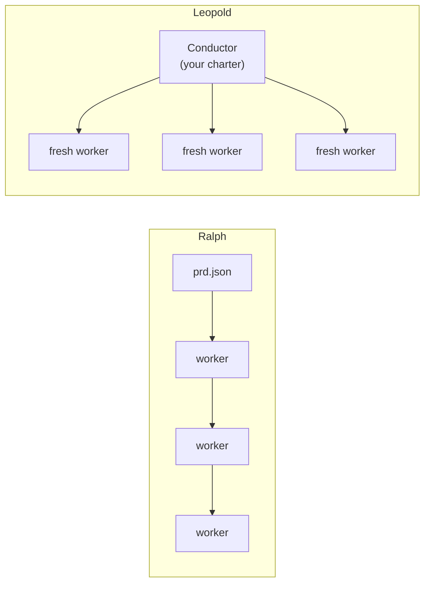

# Leopold vs Ralph

[Ralph](https://github.com/snarktank/ralph) is a well-known autonomous loop: you
write a `prd.json` of user stories, and a loop spawns a fresh agent each
iteration to implement the next story, runs checks, commits if they pass, and
repeats until done. It is a deliberately simple, brute-force loop.

Leopold is a different bet. The goal is not to grind a spec; it is to **debate a
feature, then conduct Claude Code to a high-quality, complete implementation**,
deciding the way you would and only pinging you when it truly must.

## The core difference

Ralph is **repeated operators with no maestro**. Leopold is a **conductor plus
operators**. Ralph removes the human by ignoring judgment; Leopold removes the
human by *encoding* it.

## Side by side

| Dimension | Ralph | Leopold |
| --- | --- | --- |
| How it starts | you write `prd.json` | you **debate** the feature; it captures mission + charter |
| Forks ("A or B?") | no concept; it guesses or fails | **decision protocol**: decides as you would, logs, escalates only irreversible+ambiguous |
| Judgment / taste | none | the **charter** is your taste, encoded |
| Quality bar | typecheck + tests pass | conducts the gstack toolchain (`/spec`, `/code-review`, `/verify`, `/qa`, `/investigate`) |
| Memory | fresh context + git + `progress.txt` | fresh worker context **+** a persistent conductor + System of Context |
| Git | commits automatically | **locked**; stages and reports, you commit |
| You in the loop | runs and exits | decides, **notifies**, calls you only when it must |

## What Ralph gets right

Ralph's **fresh-context-per-task** is a good idea, not a flaw: a context window
that fills up degrades quality. Leopold's SDK driver adopts exactly this, and
adds the piece Ralph lacks — a persistent conductor that holds the mission,
charter, and decisions across the whole run.

See the [SDK Driver](../architecture/driver.md) for how that composes.
