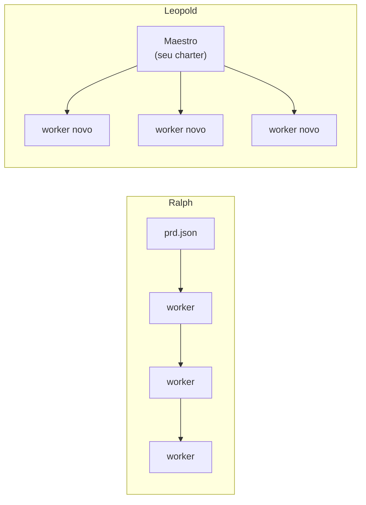

# Leopold vs Ralph

[Ralph](https://github.com/snarktank/ralph) é um loop autônomo bem conhecido: você
escreve um `prd.json` de user stories, e um loop cria um agente novo a cada
iteração para implementar a próxima story, roda checagens, commita se passarem e
repete até terminar. É um loop deliberadamente simples, de força bruta.

O Leopold é uma aposta diferente. O objetivo não é moer uma spec; é **debater uma
feature e então conduzir o Claude Code até uma implementação completa e de alta
qualidade**, decidindo do jeito que você decidiria e só te chamando quando
realmente precisa.

## A diferença central

O Ralph é **operadores repetidos sem maestro**. O Leopold é um **maestro mais
operadores**. O Ralph remove o humano ignorando o julgamento; o Leopold remove o
humano *codificando* o julgamento.

## Lado a lado

| Dimensão | Ralph | Leopold |
| --- | --- | --- |
| Como começa | você escreve o `prd.json` | você **debate** a feature; ele captura missão + charter |
| Bifurcações ("A ou B?") | sem conceito; chuta ou falha | **protocolo de decisão**: decide como você decidiria, loga, só escala o irreversível+ambíguo |
| Julgamento / gosto | nenhum | o **charter** é o seu gosto, codificado |
| Barra de qualidade | typecheck + testes passando | conduz o toolchain do gstack (`/spec`, `/code-review`, `/verify`, `/qa`, `/investigate`) |
| Memória | contexto novo + git + `progress.txt` | contexto novo por worker **+** um maestro persistente + System of Context |
| Git | commita automaticamente | **travado**; deixa em stage e reporta, você commita |
| Você no loop | roda e sai | decide, **notifica**, só te chama quando precisa |

## O que o Ralph acerta

O **contexto novo por tarefa** do Ralph é uma boa ideia, não um defeito: uma janela
de contexto que vai enchendo degrada a qualidade. O driver SDK do Leopold adota
exatamente isso, e adiciona a peça que falta no Ralph — um maestro persistente que
segura a missão, o charter e as decisões ao longo da run inteira.

Veja o [SDK Driver](../architecture/driver.md) para ver como isso se compõe.
