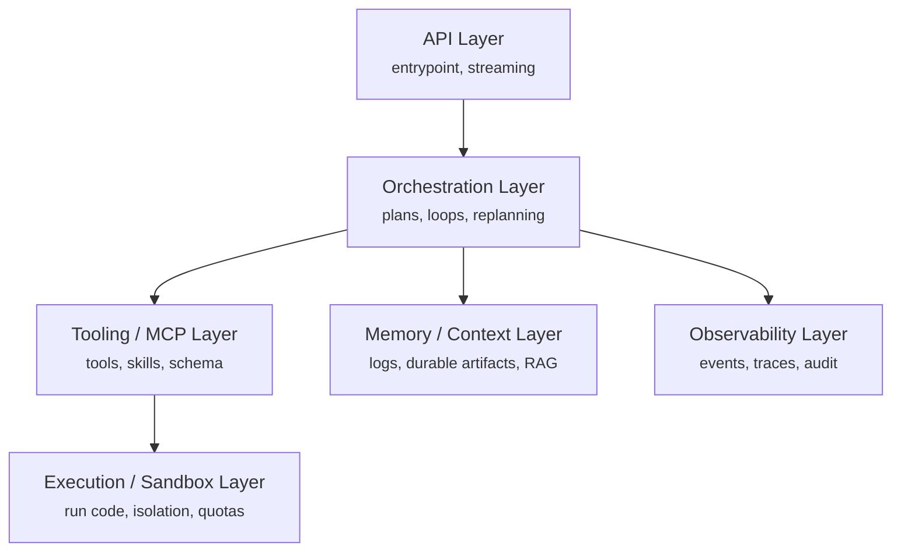
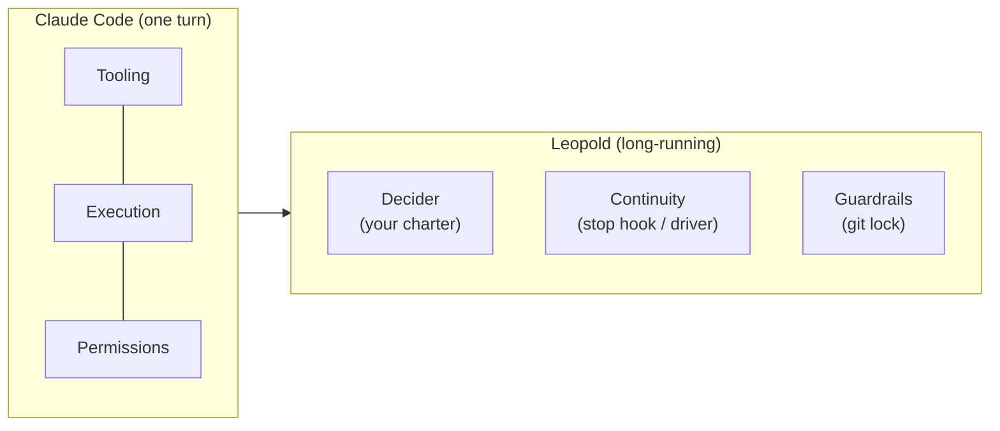

# What Is a Harness

In current usage, an **agent harness** is everything wrapped around the model
except the model itself: tool execution, memory and state, orchestration,
guardrails, and observability.

<code>Agent = Model + Harness</code>

A good harness is what turns a general LLM into a system that can run long,
complex workflows reliably. It is the difference between a model that quits after
one turn and one that finishes the job.

## The six layers

## Where Leopold sits

Claude Code is already a strong harness for a **single interactive turn**. It has
the tooling, execution, and a permission system. What it lacks for **unattended,
long-running work** is exactly what Leopold adds:

- a **decider** (your charter) so the agent has authority to choose instead of asking,
- **continuity** (a stop hook, or the SDK driver) so a finished turn rolls into the next item,
- **guardrails** (a tool-call gate) so autonomy never touches your git.

See the full mapping in the [Architecture Overview](../architecture.md).
