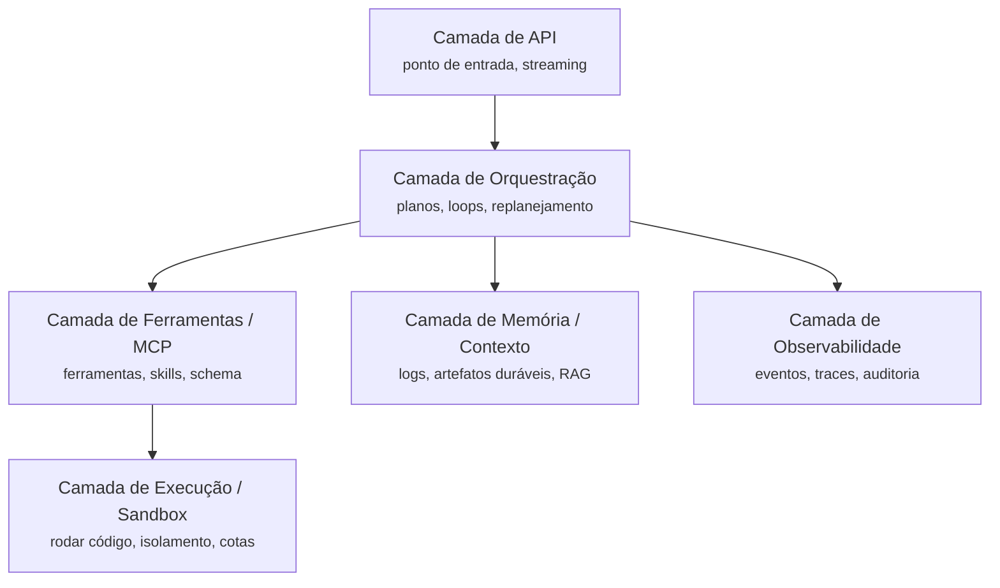
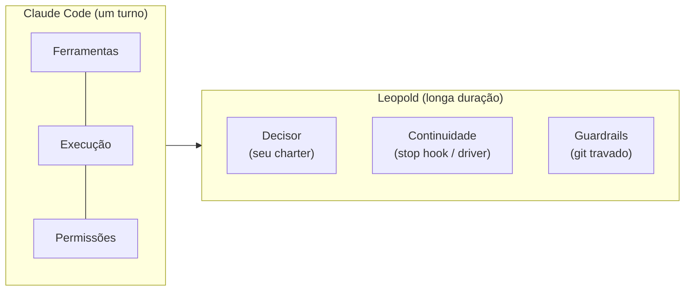

# O Que É um Harness

No uso atual, um **agent harness** é tudo que envolve o modelo,
exceto o modelo em si: execução de ferramentas, memória e estado, orquestração,
guardrails e observabilidade.

<code>Agent = Model + Harness</code>

Um bom harness é o que transforma um LLM genérico em um sistema capaz de rodar
workflows longos e complexos com confiabilidade. É a diferença entre um modelo que
desiste depois de um turno e um que termina o trabalho.

## As seis camadas

## Onde o Leopold entra

O Claude Code já é um harness forte para **um único turno interativo**. Ele tem
as ferramentas, a execução e um sistema de permissões. O que falta para **trabalho
longo e sem supervisão** é exatamente o que o Leopold adiciona:

- um **decisor** (seu charter), para que o agente tenha autoridade de escolher em vez de perguntar,
- **continuidade** (um stop hook, ou o driver do SDK), para que um turno concluído emende no próximo item,
- **guardrails** (um gate de chamadas de ferramenta), para que a autonomia nunca toque no seu git.

Veja o mapeamento completo na [Visão Geral da Arquitetura](../architecture.md).
