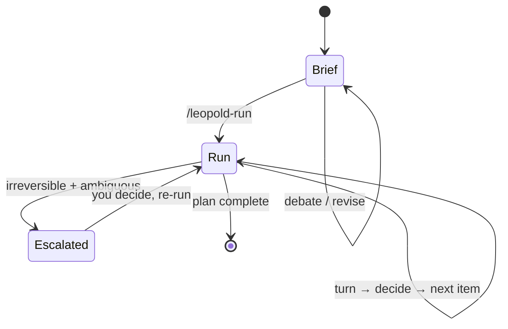
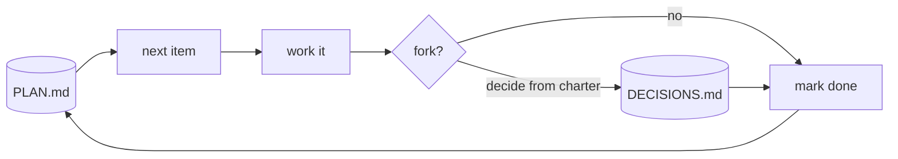

# The Two Phases

Everything Leopold does splits into two phases: a **brief** you co-author, and a
**run** it conducts.

## Phase 1 — Brief

A structured, adversarial conversation that ends with four durable artifacts in
`.leopold/`:

| Artifact | Answers | Role |
| --- | --- | --- |
| `MISSION.md` | *what* are we building, and what is "done" | the goal |
| `CHARTER.md` | *how would you decide* | the decider — "becomes you" |
| `GUARDRAILS.md` | *what stays locked* | the safety boundary |
| `PLAN.md` | *in what order* | the work queue |

The brief is the contract. The run never invents intent; it executes the brief.
Because the run is capped by the quality of the brief, this phase is where your
attention pays off most.

## Phase 2 — Run

Leopold reads the brief and conducts Claude Code through the plan. It decides
forks from the charter, logs every non-mechanical call, and only stops for the
rare fork that is both irreversible and ambiguous.

Two engines implement Phase 2:

- The [in-session engine](../architecture/in-session.md) — one Claude Code session, kept going by a stop hook.
- The [SDK driver](../architecture/driver.md) — a persistent conductor that spawns fresh workers per item.

Both obey the same [Decision Protocol](../decision-protocol.md) and
[Guardrails](../guardrails.md).
