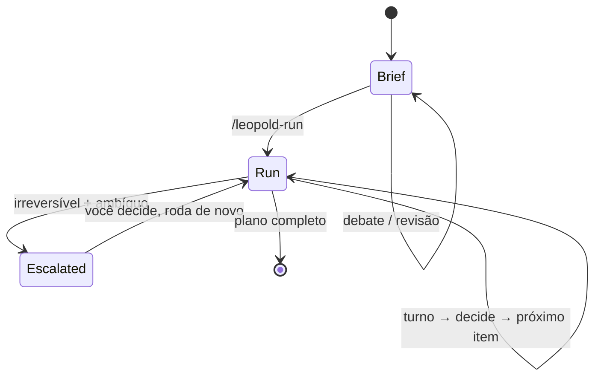
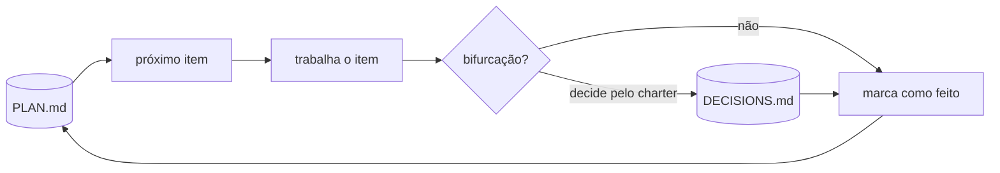

# As Duas Fases

Tudo que o Leopold faz se divide em duas fases: um **brief** que você coescreve, e uma
**run** que ele conduz.

## Fase 1 — Brief

Uma conversa estruturada e adversarial que termina com quatro artefatos duráveis em
`.leopold/`:

| Artefato | Responde | Papel |
| --- | --- | --- |
| `MISSION.md` | *o que* estamos construindo, e o que é "pronto" | o objetivo |
| `CHARTER.md` | *como você decidiria* | o decisor — "vira você" |
| `GUARDRAILS.md` | *o que fica travado* | a fronteira de segurança |
| `PLAN.md` | *em que ordem* | a fila de trabalho |

O brief é o contrato. A run nunca inventa intenção; ela executa o brief.
Como a run é limitada pela qualidade do brief, essa fase é onde a sua
atenção rende mais.

## Fase 2 — Run

O Leopold lê o brief e conduz o Claude Code através do plano. Ele decide
bifurcações a partir do charter, registra toda decisão não mecânica, e só para na
rara bifurcação que é ao mesmo tempo irreversível e ambígua.

Dois engines implementam a Fase 2:

- O [engine in-session](../architecture/in-session.md) — uma única sessão do Claude Code, mantida em movimento por um stop hook.
- O [driver do SDK](../architecture/driver.md) — um maestro persistente que cria workers novos a cada item.

Ambos obedecem ao mesmo [Protocolo de Decisão](../decision-protocol.md) e aos
[Guardrails](../guardrails.md).
