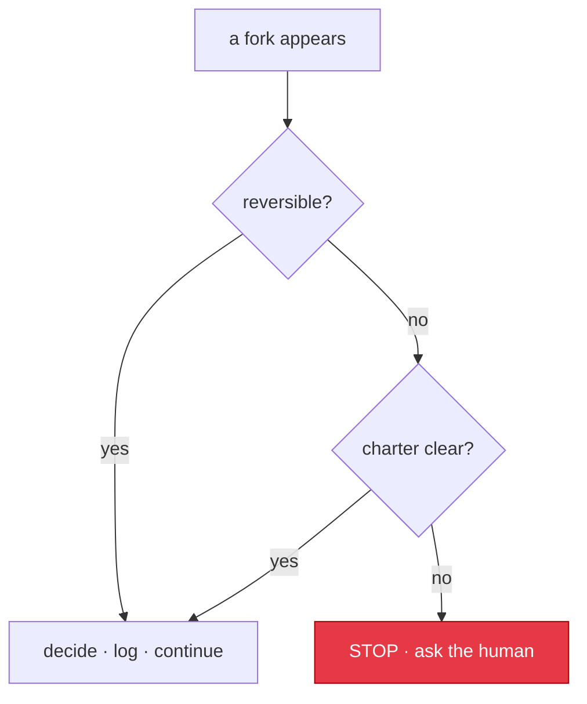

# Decision Protocol

This is the engine that lets Leopold decide instead of ask. It answers one
question on every fork: *do I decide this myself and keep going, or is this one
of the rare cases where I must stop for the human?*

The protocol is deliberately conservative about what it stops for and
aggressive about what it decides. The whole point is forward motion. But it
never decides something irreversible that the charter does not clearly cover.

---



## The core test

On any fork, classify it on two axes:

- **Reversibility** — if this turns out wrong, how expensive is it to undo?
  *Reversible:* a refactor, a naming choice, an approach A/B where both are
  fixable later. *Irreversible:* a force-push, a published release, a deleted
  resource, a schema migration against real data, anything that leaves the
  machine.
- **Charter clarity** — does `CHARTER.md` (plus `MISSION.md`) give a clear
  answer? *Clear:* the charter states a preference, a rule, or a tiebreaker that
  resolves it. *Ambiguous:* reasonable readings of the charter disagree, or the
  charter is silent and the call is a genuine taste/strategy decision.

|                       | Charter clear            | Charter ambiguous        |
|-----------------------|--------------------------|--------------------------|
| **Reversible**        | Decide, log, continue    | Decide, log, continue    |
| **Irreversible**      | Decide, log, continue    | **STOP** and ask         |

Only the bottom-right cell stops. Everything else moves. Irreversible actions
that the guardrails forbid (commit, push, etc.) never reach this table; they are
blocked by the hook regardless. So in practice "irreversible + ambiguous" is a
small set of genuine strategy or data-shape calls.

---

## The six principles (how to decide once you are deciding)

Adapted from gstack `autoplan`. When you decide a fork yourself, these resolve
it. They are ordered; earlier ones win ties.

1. **Choose completeness.** Ship the whole thing. Prefer the approach that
   covers more edge cases, error paths, and tests.
2. **Boil lakes, not oceans.** Fix everything in the blast radius (files this
   item touches plus their direct importers). Auto-expand scope only when the
   expansion is in blast radius and small (under a day, a handful of files, no
   new infrastructure). Flag oceans (rewrites, multi-week migrations); do not
   start them autonomously.
3. **Pragmatic.** If two options fix the same thing, take the cleaner one and
   move on. Spend five seconds choosing, not five minutes.
4. **DRY.** If something already exists, reuse it. Do not duplicate
   functionality.
5. **Explicit over clever.** A 10-line obvious solution beats a 200-line
   abstraction. Optimize for what a new contributor reads in 30 seconds.
6. **Bias toward action.** Progress beats deliberation. Note concerns in
   `DECISIONS.md`, but do not block on them.

The `CHARTER.md` overrides these principles whenever it speaks. The charter is
the human's actual judgment; the six principles are the default when the charter
is silent.

---

## What always stops, regardless of the table

These are never auto-decided, because they need context the agent cannot have:

- **Mission-level premise changes.** If the work suggests the *goal itself* is
  wrong (not the approach, the goal), stop. Deciding what problem to solve is
  the human's job.
- **Charter contradictions.** If two charter rules collide on a real decision,
  stop and let the human resolve the conflict; do not pick a winner silently.
- **Anything `GUARDRAILS.md` lists as gated.** By definition.

This mirrors `autoplan`'s "User Challenge" exception: when the evidence says the
human's stated direction should change, the human still decides. The agent makes
the case; it does not overrule.

---

## Decision classification (how loudly to log)

Every auto-decision is one of:

- **Mechanical** — one clearly right answer (run the formatter, reuse the
  existing helper, add the missing test). Log a one-liner.
- **Taste** — reasonable people could disagree, but the charter or principles
  point one way. Log with reasoning, and surface it in the run summary so the
  human can review it later.

If a decision feels like it should be a third category, "I am not sure I am
allowed to make this," it is probably an irreversible-and-ambiguous fork: stop.

---

## The decision log format

Every non-mechanical decision appends to `DECISIONS.md`:

```
## D<N> — <one-line title>          (turn <iteration>, <timestamp>)
Persona:     <the role Leopold assumed to decide this — only when it synthesized one>
Fork:        <the choice that came up>
Class:       reversible | irreversible
Charter:     <what the charter said, or "silent">
Decision:    <what you chose>
Why:         <the principle or charter rule that drove it>
Reversal:    <how to undo this if the human disagrees>
```

The `Reversal` line matters most: it is the human's escape hatch. If you cannot
write a credible reversal line, the decision is probably irreversible and you
should re-check the core test.

`Persona:` appears when the run reached work that used to wait for a person — a
`@human` node, an escalation, a plan repair, a third failure of the same kind —
and Leopold synthesized the role that work needed instead of halting. The entry
then names who decided, which stop path it came from, and what charter rules
bound them. When no role could be synthesized the line still appears, saying so:
an autonomous call with no record of who made it is not auditable. Every one of
those paths writes through the same single writer, so a persona decision, a
conductor decision and a canvas steer are all one shape in the file.

---

## "What I decided for you"

A trail nobody opens is not a trail, so the run does not wait for you to open it.
Every run ends with the calls it made on your behalf, riskiest first:

```
What I decided for you (3 calls, riskiest first):
  1. [escalation] Nadia Ferro — Data Engineer (D7): run the production migration in two reversible halves
     Reversal: run migrations/002_down.sql
  2. [human] Rui Salgado — Release Engineer (D4): approve the cutover behind a flag, staged only
     Reversal: flip cutover_enabled back to false in config/flags.yml
  3. [repeated-failure] Ana Reis — Build Engineer (D9): split the suite and run the slow half serially
     Reversal: revert the Makefile change
The full trail — charter basis and why — is in .leopold/DECISIONS.md.
```

It is in the completion report and in the notification (terminal, and the webhook
body if you set one), on both engines: `/leopold-run` and `/leopold-workflow` read
the same entries and rank them the same way.

**Risk is ordering, not a verdict.** The rank is the fork the call came up at — an
escalation reads before a `@human` node, which reads before a plan repair, which
reads before a repeated-failure rescue — nudged up when nobody could be
synthesized for it, when the subject is heavy (production, data, anything
outbound), or when the role stated no reversal of its own and took the default.
Nothing is ever hidden: past five calls the rest are counted, and `DECISIONS.md`
is one line away.

A run that decided nothing on your behalf prints nothing here — the report is what
it always was.

---

## Worked examples

- *"Should the cache be in-memory or Redis?"* Charter says "no new
  infrastructure for the MVP." Clear + reversible. **Decide:** in-memory. Log as
  taste.
- *"This endpoint has no tests. Add them?"* Principle 1 (completeness). Clear +
  reversible. **Decide:** yes. Log as mechanical.
- *"The plan says migrate the users table now."* Irreversible (data) and the
  charter does not specify a rollout. **Stop:** ask before touching real data.
- *"Commit this checkpoint?"* Gated by `GUARDRAILS.md`. **Blocked** by the hook;
  stage and report instead.
