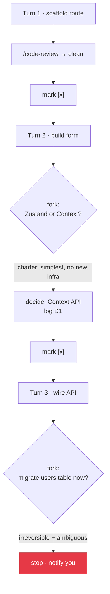

# Your First Run

A worked example: *"add a settings page"*. This shows what actually happens turn
by turn.

## The brief

After `/leopold-brief`, your `.leopold/PLAN.md` might read:

```markdown
- [ ] Scaffold the settings route and page shell
- [ ] Build the settings form with validation
- [ ] Wire the form to the API
- [ ] Add tests for the settings flow
```

And your `CHARTER.md` includes a rule like:

> Prefer the simplest thing that works for the MVP. No new infrastructure.

## The run, turn by turn



What you would see:

1. **Turn 1** finishes the scaffold, runs `/code-review`, marks the item done.
2. **Turn 2** hits a real fork (state library). The charter says "simplest, no new
   infra", so Leopold **decides Context API**, writes a block to `DECISIONS.md`,
   and continues, without asking you.
3. **Turn 3** reaches a database migration against real data: **irreversible and
   ambiguous**. Leopold **stops and notifies you**, because deciding that is not
   its call.

## What you get back

When you return and run `/leopold-status`:

```
active: false  turn: 3/50  stopped_reason: escalation
plan: 2 done, 2 open
decisions logged: 1
```

- `DECISIONS.md` shows exactly what "you" decided while you were away, including a
  `Reversal:` line for each call.
- Everything is **staged, nothing committed**. You review and commit.

!!! note "The decision log is the trust mechanism"
    Autonomy you cannot audit is autonomy you cannot trust. Every non-mechanical
    decision is logged with the charter rule that drove it and how to undo it.

Read more about how forks are resolved in the [Decision Protocol](../decision-protocol.md).
