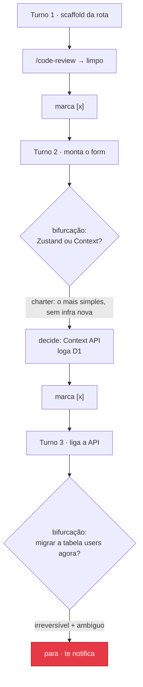

# Sua Primeira Run

Um exemplo na prática: *"adicionar uma página de configurações"*. Aqui você vê o que
acontece de verdade, turno a turno.

## O brief

Depois do `/leopold-brief`, o seu `.leopold/PLAN.md` pode ficar assim:

```markdown
- [ ] Scaffold the settings route and page shell
- [ ] Build the settings form with validation
- [ ] Wire the form to the API
- [ ] Add tests for the settings flow
```

E o seu `CHARTER.md` inclui uma regra como:

> Prefira a coisa mais simples que funciona pro MVP. Nada de infraestrutura nova.

## A run, turno a turno



O que você veria:

1. **O turno 1** termina o scaffold, roda `/code-review` e marca o item como feito.
2. **O turno 2** bate numa bifurcação de verdade (biblioteca de estado). O charter diz "o mais
   simples, sem infra nova", então o Leopold **decide pela Context API**, escreve um bloco no
   `DECISIONS.md` e continua, sem te perguntar.
3. **O turno 3** chega numa migração de banco contra dados reais: **irreversível e
   ambígua**. O Leopold **para e te notifica**, porque essa decisão não é
   dele.

## O que você recebe de volta

Quando você volta e roda `/leopold-status`:

```
active: false  turn: 3/50  stopped_reason: escalation
plan: 2 done, 2 open
decisions logged: 1
```

- O `DECISIONS.md` mostra exatamente o que "você" decidiu enquanto estava fora, incluindo uma
  linha `Reversal:` pra cada decisão.
- Está tudo **staged, nada commitado**. Você revisa e commita.

!!! note "O log de decisões é o mecanismo de confiança"
    Autonomia que você não consegue auditar é autonomia em que você não consegue confiar.
    Toda decisão não mecânica é logada com a regra do charter que a motivou e com o
    caminho pra desfazê-la.

Leia mais sobre como as bifurcações são resolvidas no [Protocolo de Decisão](../decision-protocol.md).
