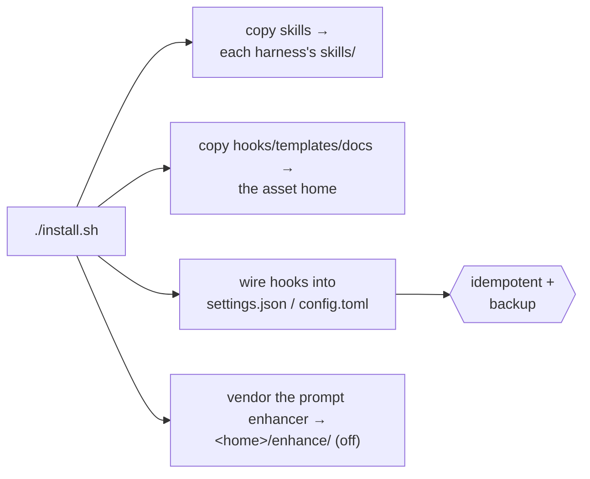

# Install

Leopold has two tiers. The **in-session engine** (skills + hooks) is all you need
to start and runs in plain Claude Code or plain Codex CLI. The **SDK driver** is
optional and adds unattended, background runs.

## Prerequisites

- At least one harness, logged in: [Claude Code](https://claude.com/claude-code)
  and/or [Codex CLI](https://github.com/openai/codex) (0.146.0 is the
  reference). Both is fine — the installer wires each one it finds.
- `jq` on your `PATH` (the hooks use it to parse state safely).
- `python3` (the [prompt enhancer](../reference/enhance.md) engine and the
  `leopold watch` dashboard).
- For the SDK driver only: Node.js 18+ .
- Optional but recommended: [gstack](https://github.com/garrytan/gstack), so
  Leopold can conduct the full skill toolchain.

## Install the in-session engine

The npm package is the fastest path — it bundles the whole harness and sets the
project up in one command:

```bash
npm i -g leopold-driver && leopold up
```

Or the one-line installer:

```bash
curl -fsSL https://raw.githubusercontent.com/Jonhvmp/leopold/main/install.sh | bash
```

Or clone it (more transparent):

```bash
git clone https://github.com/Jonhvmp/leopold.git && cd leopold && ./install.sh
```

### Choosing harnesses

The installer detects what is on the machine, and asks only when the choice is a real
one. If it finds **both** Claude Code and Codex — or **neither** — it prompts:

```
Both Claude Code and Codex CLI are here. Install Leopold into which?
  1) both        — same brief, same hooks, either seat (recommended)
  2) Claude Code — ~/.claude
  3) Codex CLI   — ~/.codex
Choice [1]:
```

If exactly one harness is present it just installs there — asking would be friction,
not a choice. The prompt reads from the terminal rather than stdin, so it still works
under `curl … | bash`; with no terminal at all (CI, a headless box) it takes both and
says so instead of hanging.

Skip the prompt entirely by naming the harness:

```bash
./install.sh                     # auto — detect, and ask if the choice is real
./install.sh --harness claude    # Claude Code only
./install.sh --harness codex     # Codex only
./install.sh --harness all       # both, installed or not
LEOPOLD_NONINTERACTIVE=1 ./install.sh   # never prompt, take the defaults
```

What the installer does:



Skills go into each harness's own skills directory (`~/.claude/skills/`,
`~/.codex/skills/` — the same `SKILL.md` format). Everything harness-neutral —
hooks, templates, docs, scripts, extensions — goes into one shared **asset home**:
`~/.claude/leopold` whenever Claude Code is in play, so existing installs need no
migration, otherwise `~/.codex/leopold`. `LEOPOLD_HOME` overrides both. See
[Asset Home](../reference/leopold-home.md).

Three hooks are wired into your harness config: the two engine hooks are **inert
unless a Leopold run is active**, and the [prompt enhancer](../reference/enhance.md)
is **off until you toggle it on** (`leopold menu` → enhance) — so none of them
interfere with normal sessions.

!!! tip "It is safe to re-run"
    `install.sh` is idempotent, on both formats. It backs up `settings.json` to
    `settings.json.leopold.bak` and never duplicates hook entries; on Codex it backs
    up `config.toml`, replaces its marker-delimited block and nothing else, and
    validates the result — a merge that would not parse is rolled back and printed
    for you to paste instead. Three installs leave a byte-identical file.

!!! warning "One extra step on Codex"
    Codex will not execute a hook declared in `config.toml` until you have trusted
    it once — until then it is silently inert. Open Codex once and approve the
    Leopold hooks, or install Leopold as a Codex plugin, which arms them through the
    plugin install. `leopold doctor` tells you which state you are in. Headless
    workers started by `leopold run --provider codex` arm their own git lock, so a
    driver-conducted run is locked from its first turn either way. Full detail:
    [Claude Code and Codex](../concepts/harnesses.md).

## Install the SDK driver (optional)

```bash
cd packages/driver
npm install
npm run build
```

The driver uses your existing harness login for both the worker and the conductor,
so there is **no separate API key** — the Agent SDK on your Claude Code auth, or
`codex exec` on your Codex login (`leopold run --provider codex`). See
[Driver Config](../reference/driver-config.md).

## Verify

```bash
leopold doctor     # every harness present: skills, hooks, wiring, extensions
leopold harness    # what each harness here can do, and which one a run would use
```

Then, in any session:

```
/leopold-status
```

If Leopold is installed, this reports "No Leopold run in this project." (which is
the correct answer before you start one).

## Install as a plugin (one command, auto-wires hooks)

The plugin is the most native install — it wires the skills and hooks
automatically, with no config merge. Leopold ships both manifests
(`.claude-plugin/` and `.codex-plugin/`):

```bash
claude plugin marketplace add Jonhvmp/leopold
claude plugin install leopold@leopold
```

On Codex the plugin has a second benefit: plugin-provided hooks are trusted through
the install, so there is no separate approval step.

Use the plugin **or** `install.sh`, not both, to avoid double-wired hooks.

## The extensions

`leopold menu` installs and manages the bundled extensions — serena, gstack, ovmem
and the prompt enhancer. Each one installs, reports status and runs its doctor
**per harness**, so a two-harness machine gets both wired and a Codex-only machine
gets nothing pointing at a Claude path. See
[Toolchain Manager](toolchain-manager.md).

## The SDK driver from npm

For the background-driver tier:

```bash
npm i -g leopold-driver
# then, in a project that has a .leopold/ brief:
leopold-driver
```

## Updating

The toolchain has **two version surfaces**: the assets (hooks, skills, scripts —
carrying `VERSION`) and the `leopold-driver` binary on PATH. They are installed by
different mechanisms, so they can drift, and a drift is invisible from either one
alone. One update moves both.

- **Engine (curl / `install.sh`):** `make update`, or `/leopold-update` from inside
  Claude Code. This pulls the source, re-runs the installer, **and** brings the npm
  driver to the same version — or says out loud which half it could not move. Opt into
  automatic updates with `touch ~/.leopold/auto-update` — the brief then checks and
  updates on its own (notify-only otherwise).
- **Plugin:** `claude plugin update leopold`.
- **npm driver on its own:** `npm i -g leopold-driver@latest`.

`leopold doctor` prints the pair on one line — `toolchain: driver X · assets X — both
surfaces agree` — and fails loudly when they diverge.

!!! warning "A newer driver can be shadowed by an older one"

    `npm i -g` installs into *its* prefix. If an older `leopold-driver` sits earlier in
    your PATH (a second npm prefix, say), it keeps winning: npm reports success and you
    keep running the old binary. `leopold-driver update` cannot escape this either —
    that command is executed by the stale binary.

    The update and `leopold doctor` both look at the whole PATH and list every install,
    the one that actually runs first. Remove the stale one (and the tree it points
    into), then re-check with `leopold-driver --version`.
