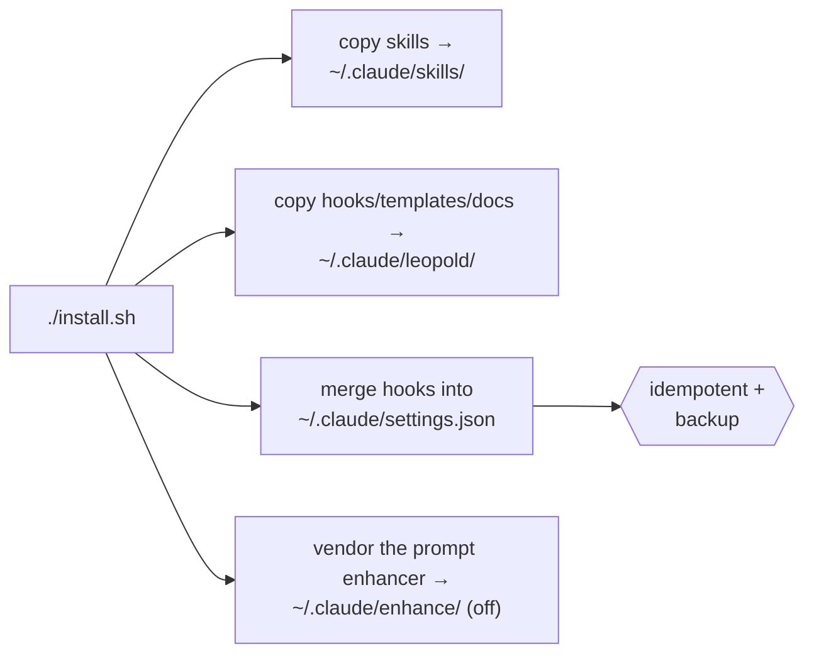

# Install

Leopold has two tiers. The **in-session engine** (skills + hooks) is all you need
to start and runs in plain Claude Code. The **SDK driver** is optional and adds
unattended, background runs.

## Prerequisites

- [Claude Code](https://claude.com/claude-code), logged in.
- `jq` on your `PATH` (the hooks use it to parse state safely).
- `python3` (the [prompt enhancer](../reference/enhance.md) engine and the
  `leopold watch` dashboard).
- For the SDK driver only: Node.js 18+ .
- Optional but recommended: [gstack](https://github.com/garrytan/gstack), so
  Leopold can conduct the full skill toolchain.

## Install the in-session engine

The npm package is the fastest path — it bundles the whole harness and sets the
project up in one command:

```bash
npm i -g leopold-driver && leopold up
```

Or the one-line installer:

```bash
curl -fsSL https://raw.githubusercontent.com/Jonhvmp/leopold/main/install.sh | bash
```

Or clone it (more transparent):

```bash
git clone https://github.com/Jonhvmp/leopold.git && cd leopold && ./install.sh
```

What the installer does:



Three hooks are wired into your settings: the two engine hooks are **inert unless
a Leopold run is active**, and the [prompt enhancer](../reference/enhance.md) is
**off until you toggle it on** (`leopold menu` → enhance) — so none of them
interfere with normal sessions.

!!! tip "It is safe to re-run"
    `install.sh` is idempotent. It backs up `settings.json` to
    `settings.json.leopold.bak` and never duplicates hook entries.

## Install the SDK driver (optional)

```bash
cd packages/driver
npm install
npm run build
```

The driver uses your existing Claude Code login for both the worker and the
conductor, so there is **no separate API key**. See
[Driver Config](../reference/driver-config.md).

## Verify

```bash
# in any project, after writing a brief:
/leopold-status
```

If Leopold is installed, this reports "No Leopold run in this project." (which is
the correct answer before you start one).

## Install as a Claude Code plugin (one command, auto-wires hooks)

Once published, the plugin is the most native install — it wires the skills and
hooks automatically, no `settings.json` merge:

```bash
claude plugin marketplace add Jonhvmp/leopold
claude plugin install leopold@leopold
```

Use the plugin **or** `install.sh`, not both, to avoid double-wired hooks.

## The SDK driver from npm

For the background-driver tier:

```bash
npm i -g leopold-driver
# then, in a project that has a .leopold/ brief:
leopold-driver
```

## Updating

- **Engine (curl / `install.sh`):** `make update`, or `/leopold-update` from inside
  Claude Code. Opt into automatic updates with `touch ~/.leopold/auto-update` — the
  brief then checks and updates on its own (notify-only otherwise).
- **Plugin:** `claude plugin update leopold`.
- **npm driver:** `npm i -g leopold-driver@latest`.
