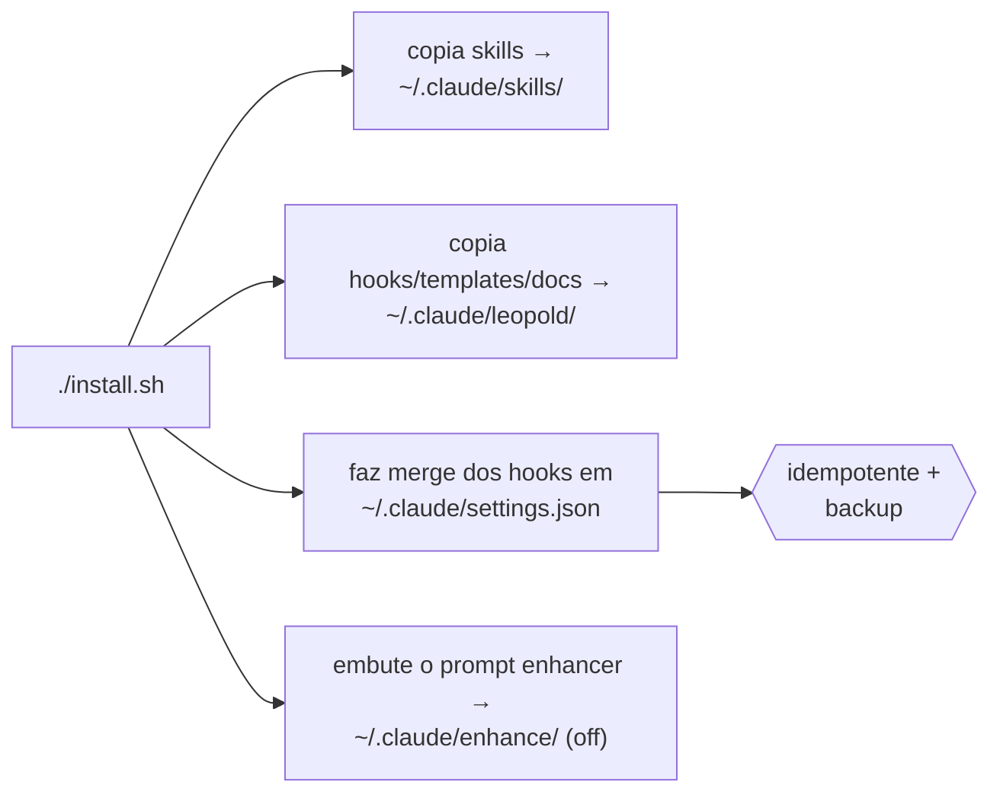

# Instalação

O Leopold tem dois níveis. O **engine in-session** (skills + hooks) é tudo que você
precisa pra começar e roda no Claude Code puro. O **driver SDK** é opcional e
adiciona runs em background, sem supervisão.

## Pré-requisitos

- [Claude Code](https://claude.com/claude-code), logado.
- `jq` no seu `PATH` (os hooks usam ele pra parsear o estado com segurança).
- `python3` (o engine do [prompt enhancer](../reference/enhance.md) e o
  dashboard do `leopold watch`).
- Só pro driver SDK: Node.js 18+ .
- Opcional, mas recomendado: [gstack](https://github.com/garrytan/gstack), pra
  o Leopold poder conduzir a toolchain completa de skills.

## Instalar o engine in-session

O pacote npm é o caminho mais rápido — ele empacota o harness inteiro e configura
o projeto num comando só:

```bash
npm i -g leopold-driver && leopold up
```

Ou o instalador de uma linha:

```bash
curl -fsSL https://raw.githubusercontent.com/Jonhvmp/leopold/main/install.sh | bash
```

Ou clone o repositório (mais transparente):

```bash
git clone https://github.com/Jonhvmp/leopold.git && cd leopold && ./install.sh
```

O que o instalador faz:



Três hooks são plugados nas suas settings: os dois hooks do engine ficam **inertes
a menos que uma run do Leopold esteja ativa**, e o [prompt enhancer](../reference/enhance.md)
fica **desligado até você ativar** (`leopold menu` → enhance) — então nenhum deles
interfere nas sessões normais.

!!! tip "Pode rodar de novo sem medo"
    O `install.sh` é idempotente. Ele faz backup do `settings.json` em
    `settings.json.leopold.bak` e nunca duplica entradas de hook.

## Instalar o driver SDK (opcional)

```bash
cd packages/driver
npm install
npm run build
```

O driver usa o seu login existente do Claude Code tanto pro worker quanto pro
maestro, então **não existe chave de API separada**. Veja
[Driver Config](../reference/driver-config.md).

## Verificar

```bash
# in any project, after writing a brief:
/leopold-status
```

Se o Leopold estiver instalado, isso reporta "No Leopold run in this project." (que é
a resposta correta antes de você iniciar uma).

## Instalar como plugin do Claude Code (um comando, hooks plugados automaticamente)

Depois de publicado, o plugin é a instalação mais nativa — ele pluga as skills e os
hooks automaticamente, sem merge no `settings.json`:

```bash
claude plugin marketplace add Jonhvmp/leopold
claude plugin install leopold@leopold
```

Use o plugin **ou** o `install.sh`, não os dois, pra evitar hooks plugados em dobro.

## O driver SDK via npm

Pro nível do driver em background:

```bash
npm i -g leopold-driver
# then, in a project that has a .leopold/ brief:
leopold-driver
```

## Atualizando

- **Engine (curl / `install.sh`):** `make update`, ou `/leopold-update` de dentro
  do Claude Code. Pra ativar atualizações automáticas, `touch ~/.leopold/auto-update` — o
  brief então checa e atualiza sozinho (caso contrário, só notifica).
- **Plugin:** `claude plugin update leopold`.
- **Driver npm:** `npm i -g leopold-driver@latest`.
