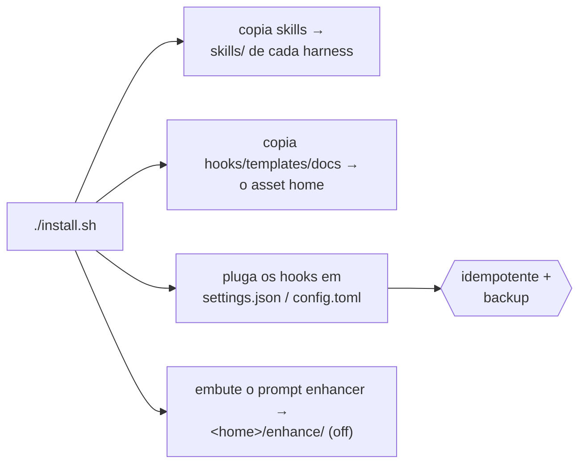

# Instalação

O Leopold tem dois níveis. O **engine in-session** (skills + hooks) é tudo que você
precisa pra começar e roda no Claude Code puro ou no Codex CLI puro. O **driver SDK**
é opcional e adiciona runs em background, sem supervisão.

## Pré-requisitos

- Pelo menos um harness, logado: [Claude Code](https://claude.com/claude-code)
  e/ou [Codex CLI](https://github.com/openai/codex) (a referência é a 0.146.0).
  Ter os dois é ótimo — o instalador pluga cada um que encontrar.
- `jq` no seu `PATH` (os hooks usam ele pra parsear o estado com segurança).
- `python3` (o engine do [prompt enhancer](../reference/enhance.md) e o
  dashboard do `leopold watch`).
- Só pro driver SDK: Node.js 18+ .
- Opcional, mas recomendado: [gstack](https://github.com/garrytan/gstack), pra
  o Leopold poder conduzir a toolchain completa de skills.

## Instalar o engine in-session

O pacote npm é o caminho mais rápido — ele empacota o harness inteiro e configura
o projeto num comando só:

```bash
npm i -g leopold-driver && leopold up
```

Ou o instalador de uma linha:

```bash
curl -fsSL https://raw.githubusercontent.com/Jonhvmp/leopold/main/install.sh | bash
```

Ou clone o repositório (mais transparente):

```bash
git clone https://github.com/Jonhvmp/leopold.git && cd leopold && ./install.sh
```

### Escolhendo os harnesses

O instalador detecta o que existe na máquina e **só pergunta quando a escolha é real**.
Se encontrar os **dois** — ou **nenhum** — ele pergunta:

```
Both Claude Code and Codex CLI are here. Install Leopold into which?
  1) both        — same brief, same hooks, either seat (recommended)
  2) Claude Code — ~/.claude
  3) Codex CLI   — ~/.codex
Choice [1]:
```

Se só existe um harness, ele instala lá e pronto — perguntar seria fricção, não
escolha. O prompt lê do terminal em vez do stdin, então continua funcionando em
`curl … | bash`; sem terminal nenhum (CI, máquina headless) ele pega os dois e avisa,
em vez de travar.

Para pular o prompt, nomeie o harness:

```bash
./install.sh                     # auto — detecta, e pergunta se a escolha é real
./install.sh --harness claude    # só Claude Code
./install.sh --harness codex     # só Codex
./install.sh --harness all       # os dois, instalados ou não
LEOPOLD_NONINTERACTIVE=1 ./install.sh   # nunca pergunta, assume os defaults
```

O que o instalador faz:



As skills vão para o diretório de skills de cada harness (`~/.claude/skills/`,
`~/.codex/skills/` — mesmo formato de `SKILL.md`). Tudo que é neutro de harness —
hooks, templates, docs, scripts, extensions — vai para um único **asset home**:
`~/.claude/leopold` sempre que o Claude Code está em jogo, então instalações
existentes não precisam de migração; senão, `~/.codex/leopold`. `LEOPOLD_HOME`
sobrescreve os dois. Veja [Asset Home](../reference/leopold-home.md).

Três hooks são plugados na config do seu harness: os dois hooks do engine ficam
**inertes a menos que uma run do Leopold esteja ativa**, e o
[prompt enhancer](../reference/enhance.md) fica **desligado até você ativar**
(`leopold menu` → enhance) — então nenhum deles interfere nas sessões normais.

!!! tip "Pode rodar de novo sem medo"
    O `install.sh` é idempotente, nos dois formatos. Ele faz backup do
    `settings.json` em `settings.json.leopold.bak` e nunca duplica entradas de hook;
    no Codex, faz backup do `config.toml`, troca o bloco delimitado por marcadores e
    mais nada, e valida o resultado — um merge que não parsearia volta atrás e é
    impresso pra você colar na mão. Três instalações deixam um arquivo idêntico byte
    a byte.

!!! warning "Um passo a mais no Codex"
    O Codex não executa um hook declarado no `config.toml` enquanto você não confiar
    nele uma vez — até lá ele fica inerte, em silêncio. Abra o Codex uma vez e aprove
    os hooks do Leopold, ou instale o Leopold como plugin do Codex, que já os arma
    pela própria instalação. O `leopold doctor` te diz em qual estado você está.
    Workers headless iniciados por `leopold run --provider codex` armam o próprio
    trava-git, então um run conduzido pelo driver está travado desde o primeiro turno
    de qualquer jeito. Detalhe completo:
    [Claude Code e Codex](../concepts/harnesses.md).

## Instalar o driver SDK (opcional)

```bash
cd packages/driver
npm install
npm run build
```

O driver usa o seu login existente do harness tanto pro worker quanto pro maestro,
então **não existe chave de API separada** — o Agent SDK no seu login do Claude Code,
ou o `codex exec` no seu login do Codex (`leopold run --provider codex`). Veja
[Driver Config](../reference/driver-config.md).

## Verificar

```bash
leopold doctor     # todo harness presente: skills, hooks, wiring, extensions
leopold harness    # o que cada harness aqui consegue fazer, e qual um run usaria
```

Depois, em qualquer sessão:

```
/leopold-status
```

Se o Leopold estiver instalado, isso reporta "No Leopold run in this project." (que é
a resposta correta antes de você iniciar uma).

## Instalar como plugin (um comando, hooks plugados automaticamente)

O plugin é a instalação mais nativa — ele pluga as skills e os hooks
automaticamente, sem merge de config. O Leopold traz os dois manifestos
(`.claude-plugin/` e `.codex-plugin/`):

```bash
claude plugin marketplace add Jonhvmp/leopold
claude plugin install leopold@leopold
```

No Codex o plugin tem um bônus: hooks vindos de plugin já são confiados pela própria
instalação, então não existe passo separado de aprovação.

Use o plugin **ou** o `install.sh`, não os dois, pra evitar hooks plugados em dobro.

## As extensions

O `leopold menu` instala e gerencia as extensions embutidas — serena, gstack, ovmem e
o prompt enhancer. Cada uma instala, reporta status e roda o doctor **por harness**,
então uma máquina com dois harnesses recebe os dois plugados e uma máquina só com
Codex não fica com nada apontando pra um caminho do Claude. Veja
[Gerenciador de toolchain](toolchain-manager.md).

## O driver SDK via npm

Pro nível do driver em background:

```bash
npm i -g leopold-driver
# then, in a project that has a .leopold/ brief:
leopold-driver
```

## Atualizando

O toolchain tem **duas superfícies de versão**: os assets (hooks, skills, scripts — que
carregam o `VERSION`) e o binário `leopold-driver` no PATH. Eles são instalados por
mecanismos diferentes, então podem divergir, e uma divergência é invisível olhando só
para um dos dois. Uma atualização move os dois.

- **Engine (curl / `install.sh`):** `make update`, ou `/leopold-update` de dentro
  do Claude Code. Isso puxa o source, re-roda o installer **e** leva o driver npm para a
  mesma versão — ou diz em voz alta qual metade não conseguiu mover. Pra ativar
  atualizações automáticas, `touch ~/.leopold/auto-update` — o brief então checa e
  atualiza sozinho (caso contrário, só notifica).
- **Plugin:** `claude plugin update leopold`.
- **Driver npm sozinho:** `npm i -g leopold-driver@latest`.

O `leopold doctor` imprime o par numa linha só — `toolchain: driver X · assets X — both
surfaces agree` — e falha alto quando eles divergem.

!!! warning "Um driver mais novo pode ser sombreado por um mais velho"

    O `npm i -g` instala no prefixo *dele*. Se um `leopold-driver` mais velho estiver
    antes no seu PATH (um segundo prefixo npm, por exemplo), ele continua ganhando: o npm
    reporta sucesso e você segue rodando o binário antigo. O `leopold-driver update`
    também não escapa disso — quem executa esse comando é o binário velho.

    A atualização e o `leopold doctor` olham o PATH inteiro e listam cada instalação, a
    que de fato roda primeiro. Remova a obsoleta (e a árvore para onde ela aponta) e
    confira de novo com `leopold-driver --version`.
