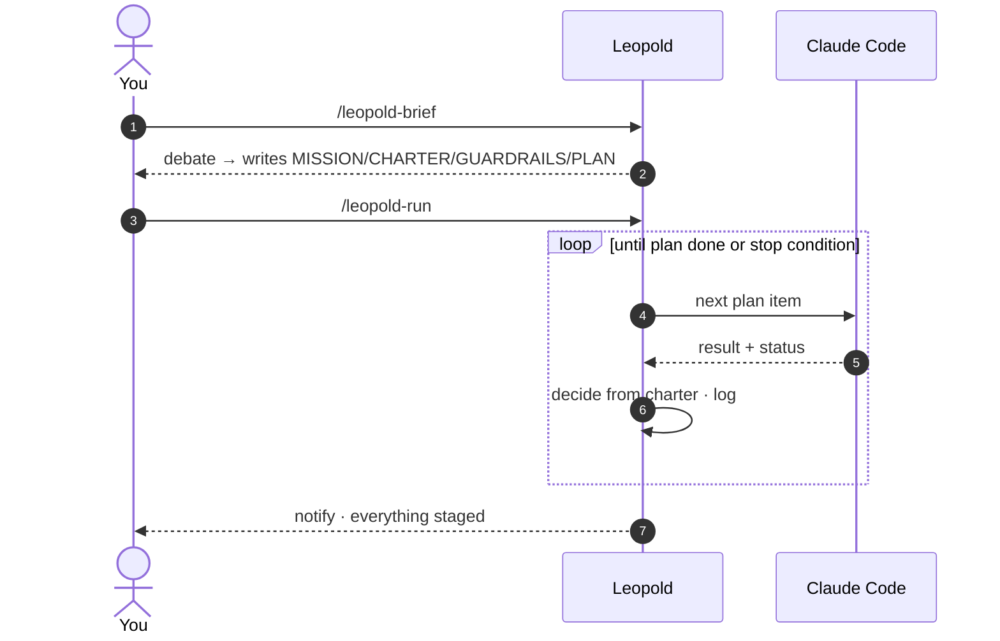

# Quickstart

Four commands. Brief a mission, hand over the seat, watch, and take it back.



## 1. Brief the mission

```text
/leopold-brief
```

A structured debate, not a form. Leopold pushes back and writes four artifacts to
`.leopold/` in your project. The quality of the run is capped by the quality of
this brief, so take your time here.

## 2. Hand over the seat

```text
/leopold-run
```

Leopold flips into autonomous mode, picks the first open plan item, and starts
working. From here it decides forks from your charter and keeps going on its own.

!!! tip "Large or parallelizable plan? Compile it into a workflow"
    `/leopold-workflow` runs the same brief as a
    [dynamic workflow](../concepts/dynamic-workflows.md): the plan lives in code,
    every item gets an independent adversarial review, and the run streams a live
    phase tree into `/workflows`. Use `/leopold-run` for short or interactive plans.

## 3. Watch (optional)

```text
/leopold-status
```

Shows progress through the plan, decisions logged, and the most recent events.

## 4. Take the seat back

```text
/leopold-stop
```

Stops cleanly at the next turn boundary. Nothing is left half-done.

!!! warning "Git stays locked the whole time"
    Leopold stages with `git add` and reports. It never commits or pushes unless
    you explicitly opt in. See [Guardrails](../guardrails.md).

!!! tip "Bonus: turn on the prompt enhancer"
    The installer also ships a [prompt enhancer](../reference/enhance.md) (off by
    default): weak everyday prompts — "fix login" — get a charter-aware structured
    interpretation from Haiku on your own account, injected next to the raw prompt.
    Enable it with `leopold menu` → enhance → `t) Toggle`, or `/leopold-enhance on`.

Next: walk through a full run in [Your First Run](first-run.md).
