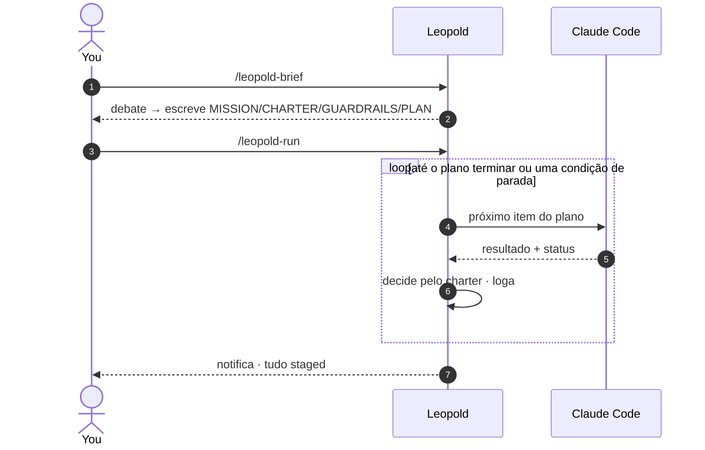

# Quickstart

Quatro comandos. Faça o brief de uma missão, entregue a cadeira, acompanhe e retome.



## 1. Faça o brief da missão

```text
/leopold-brief
```

Um debate estruturado, não um formulário. O Leopold questiona de volta e escreve
quatro artefatos em `.leopold/` no seu projeto. A qualidade da run é limitada pela
qualidade desse brief, então não tenha pressa aqui.

## 2. Entregue a cadeira

```text
/leopold-run
```

O Leopold entra em modo autônomo, pega o primeiro item aberto do plano e começa a
trabalhar. Daqui em diante ele decide as bifurcações pelo seu charter e segue sozinho.

!!! tip "Plano grande ou paralelizável? Compile num workflow"
    O `/leopold-workflow` roda o mesmo brief como um
    [workflow dinâmico](../concepts/dynamic-workflows.md): o plano vive em código,
    cada item ganha uma revisão adversarial independente, e a run transmite uma
    árvore de fases ao vivo pro `/workflows`. Use `/leopold-run` pra planos curtos ou interativos.

## 3. Acompanhe (opcional)

```text
/leopold-status
```

Mostra o progresso no plano, as decisões logadas e os eventos mais recentes.

## 4. Retome a cadeira

```text
/leopold-stop
```

Para de forma limpa na próxima fronteira de turno. Nada fica pela metade.

!!! warning "O git fica travado o tempo todo"
    O Leopold faz stage com `git add` e reporta. Ele nunca commita nem faz push, a
    menos que você opte por isso explicitamente. Veja [Guardrails](../guardrails.md).

!!! tip "Bônus: ligue o prompt enhancer"
    O instalador também traz um [prompt enhancer](../reference/enhance.md) (desligado
    por padrão): prompts fracos do dia a dia — "conserta o login" — ganham uma
    interpretação estruturada e ciente do charter, gerada pelo Haiku na sua própria
    conta e injetada ao lado do prompt cru.
    Ative com `leopold menu` → enhance → `t) Toggle`, ou `/leopold-enhance on`.

A seguir: acompanhe uma run completa em [Sua Primeira Run](first-run.md).
