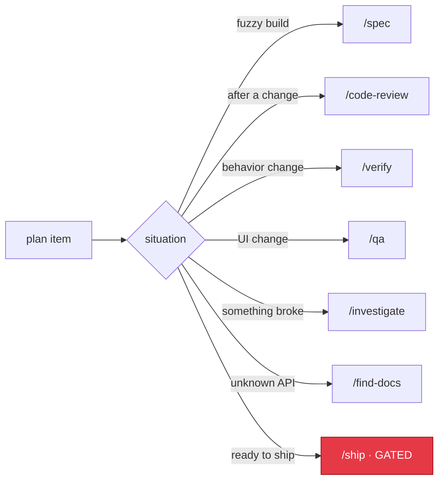

# gstack Playbook

The playbook is how Leopold orchestrates the gstack skill library like a senior
engineer: the right skill, at the right moment, without being told. The run
skill consults this map; it is data, not hardcoded control flow, so you can edit
it for your own workflow.

If gstack is not installed, Leopold falls back to plain Claude Code and skips
the skill column. Everything still runs; it just uses built-in tools instead of
the gstack workflows.

---



## Install gstack (optional)

Leopold does not bundle gstack; it is a separate [MIT project by Garry Tan](https://github.com/garrytan/gstack) with its own installer and self-update. Install it standalone so Leopold can conduct it:

```bash
make gstack-install      # installs into every harness on this machine
make gstack-doctor       # per-harness report: checkout, Bun, skills per skills root
```

`make gstack-install` drives gstack's own installer once per harness Leopold
resolves here (`--host claude`, `--host codex`), so a Codex-only machine gets the
skills under `~/.codex/skills` and nothing under `~/.claude`. It needs Bun v1.0+.

`install.sh` offers to set it up if it is missing (or run `./install.sh --with-gstack`). It shines for planning: `/office-hours`, `/spec`, `/autoplan`, `/plan-ceo-review`, `/plan-eng-review`, `/plan-design-review`.

## How Leopold uses it

During a turn, after picking a plan item, Leopold matches the item's *situation*
to a row below and reaches for that skill. Skills run under the gstack
spawned-session protocol (see `setup`), so they auto-decide instead of prompting.

The match is by intent, not keyword. "Add a settings page" is a *build* situation
even if it never says "build".

---

## The map

| Situation | gstack skill | When in the loop |
|---|---|---|
| About to build something non-trivial, scope still fuzzy | `/spec` | Before writing code, to turn intent into an executable spec |
| Implementing a planned item | (plain Claude Code) | The work itself |
| Just finished a code change | `/code-review` | Right after, to catch bugs and reuse/efficiency issues |
| Want quality cleanup without bug hunting | `/simplify` | After review, optional |
| Need to confirm a change actually works | `/verify` | After implementing a behavior change |
| UI / frontend change | `/qa` | After building user-facing behavior |
| Hit a bug or unexplained failure | `/investigate` | The moment something breaks |
| Stuck on the same failure 2+ turns | `/investigate` (deeper) | Before the repeated-failure stop condition fires |
| Plan/architecture decision is heavy | `/plan-eng-review` | At a fork the charter does not cover (and it is reversible) |
| Product/scope decision is heavy | `/plan-ceo-review` | Same, for product-shaped forks |
| Design/UX decision is heavy | `/plan-design-review` | Same, for design-shaped forks |
| Researching an unfamiliar library/API | `/find-docs` | Before guessing at an API |
| Multi-source research needed | `/deep-research` | When the item needs external investigation |
| Item is done and human wants it shipped | `/ship` | **Gated** — never autonomous; only after opt-in |
| Need to checkpoint progress | (stage only) | **Gated** — staging is fine, commit needs `ALLOW_GIT` |

---

## Decision-review skills as a "decide for me" tool

A useful trick: when Leopold hits a reversible fork the charter does not directly
cover, it can run the relevant `/plan-*-review` skill in spawned mode. Those
skills auto-decide using their own principles and report a recommendation.
Leopold takes the recommendation, logs it as a taste decision in `DECISIONS.md`,
and continues. This is how Leopold "asks itself" instead of asking you.

For genuinely irreversible-and-ambiguous forks, the review's recommendation is
**not** enough; the decision protocol still routes those to the human.

---

## Gating

Two playbook rows are gated and never run autonomously, no matter how well they
fit the situation:

- `/ship` — it commits, pushes, and opens PRs. Blocked by the guardrail hook.
- any commit/push step — staging is autonomous; committing needs `ALLOW_GIT`.

If the plan reaches a point where shipping is the next logical step, Leopold
stops with a "ready to ship" summary and hands the seat back. Shipping is your
call.
