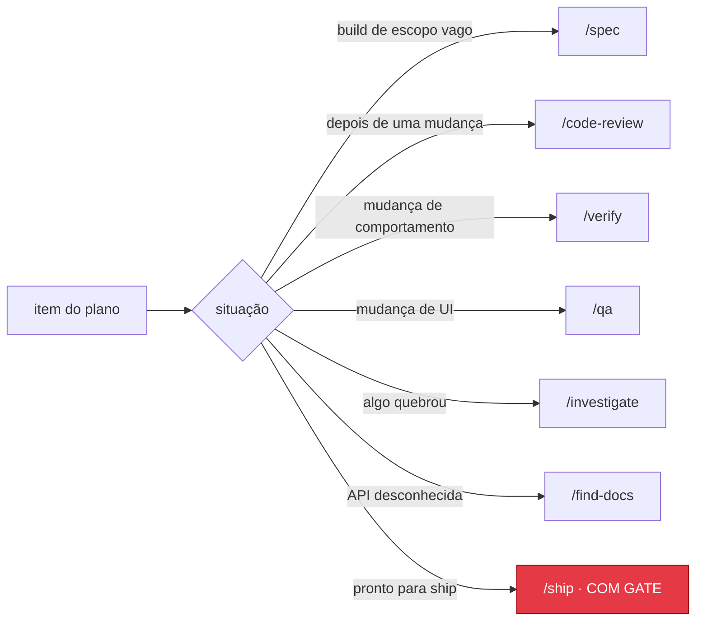

# Playbook do gstack

O playbook é como o Leopold orquestra a biblioteca de skills do gstack como um
engenheiro sênior: a skill certa, no momento certo, sem precisar que mandem. A
skill de run consulta esse mapa; ele é dado, não fluxo de controle hardcoded,
então você pode editá-lo para o seu próprio workflow.

Se o gstack não estiver instalado, o Leopold cai para o Claude Code puro e pula a
coluna de skill. Tudo continua rodando; só usa as ferramentas embutidas em vez
dos workflows do gstack.

---



## Instalar o gstack (opcional)

O Leopold não embute o gstack; é um [projeto MIT do Garry Tan](https://github.com/garrytan/gstack) à parte, com instalador e self-update próprios. Instale-o standalone para que o Leopold possa conduzi-lo:

```bash
make gstack-install
# or the official one-liner (needs Bun v1.0+):
git clone --single-branch --depth 1 https://github.com/garrytan/gstack.git ~/.claude/skills/gstack && cd ~/.claude/skills/gstack && ./setup
```

O `install.sh` se oferece para configurá-lo se estiver faltando (ou rode `./install.sh --with-gstack`). Ele brilha no planejamento: `/office-hours`, `/spec`, `/autoplan`, `/plan-ceo-review`, `/plan-eng-review`, `/plan-design-review`.

## Como o Leopold usa

Durante um turno, depois de escolher um item do plano, o Leopold casa a *situação*
do item com uma linha abaixo e puxa aquela skill. As skills rodam sob o protocolo
de sessão spawned do gstack (veja `setup`), então decidem sozinhas em vez de perguntar.

O match é por intenção, não por palavra-chave. "Adicionar uma página de configurações"
é uma situação de *build* mesmo que nunca diga "build".

---

## O mapa

| Situação | Skill do gstack | Quando no loop |
|---|---|---|
| Prestes a construir algo não trivial, escopo ainda vago | `/spec` | Antes de escrever código, para transformar intenção em spec executável |
| Implementando um item planejado | (Claude Code puro) | O trabalho em si |
| Acabou de terminar uma mudança de código | `/code-review` | Logo depois, para pegar bugs e problemas de reuso/eficiência |
| Quer limpeza de qualidade sem caça a bugs | `/simplify` | Depois do review, opcional |
| Precisa confirmar que uma mudança realmente funciona | `/verify` | Depois de implementar uma mudança de comportamento |
| Mudança de UI / frontend | `/qa` | Depois de construir comportamento visível ao usuário |
| Bateu num bug ou numa falha inexplicada | `/investigate` | No momento em que algo quebra |
| Empacado na mesma falha por 2+ turnos | `/investigate` (mais fundo) | Antes de a condição de parada por falha repetida disparar |
| Decisão de plano/arquitetura é pesada | `/plan-eng-review` | Numa bifurcação que o charter não cobre (e que é reversível) |
| Decisão de produto/escopo é pesada | `/plan-ceo-review` | Igual, para bifurcações de produto |
| Decisão de design/UX é pesada | `/plan-design-review` | Igual, para bifurcações de design |
| Pesquisando uma biblioteca/API desconhecida | `/find-docs` | Antes de chutar uma API |
| Precisa de pesquisa multi-fonte | `/deep-research` | Quando o item exige investigação externa |
| Item pronto e o humano quer o ship | `/ship` | **Com gate** — nunca autônomo; só depois do opt-in |
| Precisa de um checkpoint do progresso | (só stage) | **Com gate** — stage é liberado, commit precisa de `ALLOW_GIT` |

---

## Skills de review de decisão como ferramenta de "decida por mim"

Um truque útil: quando o Leopold bate numa bifurcação reversível que o charter não
cobre diretamente, ele pode rodar a skill `/plan-*-review` relevante em modo
spawned. Essas skills decidem sozinhas usando seus próprios princípios e reportam
uma recomendação. O Leopold pega a recomendação, loga como decisão de gosto no
`DECISIONS.md` e segue. É assim que o Leopold "pergunta a si mesmo" em vez de
perguntar a você.

Para bifurcações genuinamente irreversíveis e ambíguas, a recomendação do review
**não** basta; o protocolo de decisão continua encaminhando essas ao humano.

---

## Gating

Duas linhas do playbook têm gate e nunca rodam de forma autônoma, por melhor que
caibam na situação:

- `/ship` — faz commit, push e abre PRs. Bloqueado pelo hook de guardrail.
- qualquer passo de commit/push — stage é autônomo; commit precisa de `ALLOW_GIT`.

Se o plano chega a um ponto em que o ship é o próximo passo lógico, o Leopold para
com um resumo de "pronto para ship" e devolve a cadeira. Ship é decisão sua.
