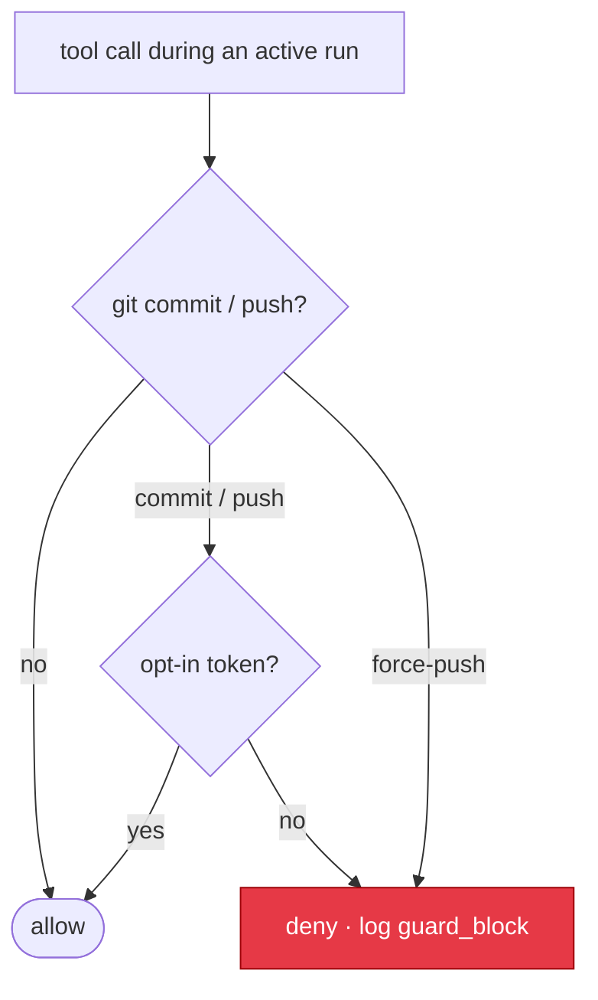

# Guardrails

Autonomy is safe when the one action you never want to happen by accident — code
leaving the machine or landing in history without you — cannot happen on its own.
That is the whole job of Leopold's lock: **a run may do anything except `git commit`
and `git push`.** It stages the work; you own the commit and the push.

Guardrails are enforced two ways:
- **By hook** (cannot be rationalized past): the `PreToolUse` gate
  (`guard-irreversible.sh`) denies `git commit` / `git push` at the tool-call layer.
- **By protocol** (the agent's own discipline): the decision protocol and the
  stop conditions keep the run finishing work instead of stalling.

The hook is the real lock. The protocol is the steering.

The git match is hardened against evasion — global options (`git -c x=y commit`),
absolute paths (`/usr/bin/git`), `env git`, and whitespace/tab tricks all resolve
to the real subcommand — and is covered by a red-team suite (`make test-guard`).

---



## Action classes

### Autonomous (decide and do)

Everything that is not a gated git op. The run has full authority over the work:

- Read, search, analyze, create, edit, and delete files.
- Run builds, linters, type checkers, formatters, and test suites.
- Run any gstack skill that does not itself commit or push.
- Run shell commands, including destructive ones (`rm -rf`, `reset --hard`) — these
  are the run's call. Isolate with `--worktree` if you want a filesystem boundary.
- Stage changes (`git add`).
- Spawn subagents as the work needs them.

### Gated (require an explicit per-run opt-in token)

Only two, blocked by the hook unless the matching token (which only the human
creates) is present:

- `git commit` — unlock with `.leopold/ALLOW_GIT`
- `git push` — unlock with `.leopold/ALLOW_PUSH`

Force-push (`--force` / `--force-with-lease` / `-f`) is denied even with
`ALLOW_PUSH`. The user's standing rule — *never commit or push without explicit
confirmation* — is encoded here and enforced even in fully autonomous mode. Nothing
else is gated: PR creation, publishing, and deploys are the run's own call.

---

## Cost — the expensive axis

Cost in a long autonomous run blows up because the main session grows every turn:
on a big-context model it never auto-compacts, so each turn re-bills the whole
accumulated transcript. The defenses that matter:

- **Progress is the governor, not USD.** `total_cost_usd` does not reflect real
  accounting on subscription billing, so a cost counter is deliberately **not** the
  default governor of an autonomous run. The run is gated on durable progress —
  checked-off plan items — via the [livelock gate](concepts/continuity.md), plus the
  hard ceilings below. API-billed users who want a hard cost cap can opt in with the
  driver's `--budget <usd>`: the run stops the moment accumulated spend (from the
  CLI's `total_cost_usd`) crosses it, with work staged for review. It is an opt-in
  ceiling, never the default, and nothing else depends on it.
- **Bounded, resumable runs.** A run ends on `max_iterations` (default 50 — the
  **run's** ceiling, carried across context windows) and on `max_windows` (default
  10), so it can't spin forever; the brief persists, so a fresh `/leopold-run`
  resumes from `PLAN.md` with clean context. Since 0.18.0 a filled context window is
  a **window roll, not a stop**: the run checkpoints and continues in a fresh window
  — see [Continuity](concepts/continuity.md).
- **Lean orchestrator.** The protocol delegates bulk-output work (authoring content,
  generating files) to a subagent that **writes to a file**, so the output never
  accumulates in the orchestrator's context.

Belt and braces: set an **Anthropic spending cap** on your account before long
autonomous runs on large projects.

### Watching a run (live dashboard)

`/leopold-watch` (or `make watch`, or `leopold watch` from the npm CLI) starts a **local**
dashboard at `http://127.0.0.1:4179` that updates live over SSE. Its headline is the **real
estimated spend**, parsed from the Claude Code session transcript: dollars, the token
breakdown (input / output / cache-write / cache-read), cache-hit %, per-model, and main vs
subagent. Below it: the live event feed (turns, guard blocks, stops), the decisions log, and
a **Stop** button that uses the kill switch. The cost number is an estimate from a built-in
price map, **configurable** via the `LEOPOLD_PRICES` env var (a JSON file) or a
`.leopold/prices.json` in the project — override any model or family, e.g. `{"opus": {"in":
15, "out": 75, "cache_write": 18.75, "cache_read": 1.5}}` (cache rates default to 1.25× /
0.1× of input). It is zero-dependency (Python stdlib), read-only except that one button, and
binds to loopback — nothing leaves the machine.

---

## Stop conditions

The run ends, and the Stop hook allows the session to halt, when any of these is
true:

1. **Plan complete** — no unchecked items remain in `PLAN.md`.
2. **Kill switch** — `.leopold/STOP` exists (`/leopold-stop` or `touch`).
3. **Repeated failure** — the same kind of failure N consecutive turns (default 3),
   *after* the one persona-led change of approach the run gets when it first hits the
   ceiling. The ceiling itself never moves.
4. **Iteration budget** — the iteration counter reached `max_iterations` (default 50).
   The counter carries across context windows: it is the run's ceiling, never reset
   by a window roll.
5. **USD budget** — accumulated spend crossed `--budget`, if you opted in (driver
   only; never the default governor).
6. **Livelock across windows** — two consecutive context windows closed zero plan
   items (`no_progress_across_windows`). Rolling is free; producing is mandatory.
7. **Window ceiling** — the run consumed `max_windows` context windows (default 10).
8. **Escalation** — a fork a synthesized role could not settle either (an unusable
   answer, a harness error). A fork it *can* settle is decided and logged, not escalated.

**A full context window is deliberately not on this list any more.** Since 0.18.0 it
is a window roll: the run writes `.leopold/CHECKPOINT.md` and the next window
continues the plan (relaunched by `leopold watch` under `continuity: auto`). See
[Continuity](concepts/continuity.md).

Every stop writes a final summary to the run output and a `stop` event to
`events.jsonl`, naming which condition fired. The complete list — including
`context_budget`, `no_progress` and `routed_complete`, and whether a synthesized role can
affect each one — is
[What still stops the run](concepts/personas.md#what-still-stops-the-run).

**`awaiting_human` is not on that list under the default posture.** A `@human` node is
decided by a role Leopold synthesizes for it, on both engines; set
[`autonomy: ask`](reference/plan-grammar.md#autonomy) in `GUARDRAILS.md` (or
`LEOPOLD_AUTONOMY=ask`, or the driver's `--ask`) to have it stop and wait for you
instead. A persona decides; it never ships — git stays locked either way, and no persona
may raise a budget, clear the kill switch or edit `GUARDRAILS.md`.

---

## Bounds that used to be prose

A rule that lives only in a prompt is a wish. Every rule below is now a hook that runs on
the harness itself, wired by `extensions/lib/harness.sh` on every harness where the probe
proved the event fires, **inert unless a run is active**, and reported per harness by
`leopold doctor` — never silence. The full description of each script is in
[Hooks](reference/hooks.md); the payload each rides on is captured in
[Hook Events](reference/hook-events.md); which harness gets which is decided by
`hooks/hook-matrix.tsv`, not by this page.

| Bound | Hook (events) | Claude Code | Codex CLI |
| --- | --- | --- | --- |
| Compaction checkpoint | `compact-checkpoint.sh` (`PreCompact`, `PostCompact`) | available | available |
| Subagent ledger | `subagent-account.sh` (`SubagentStart`, `SubagentStop`) | available | available |
| Subagent ceiling | `subagent-cap.sh` (`PreToolUse`) | available | available |
| Verification receipts | `verify-receipt.sh` (`PostToolUse`, `PostToolUseFailure`) | available | substitute |
| Done means verified | `done-gate.sh` (`PreToolUse`, `TaskCompleted`) | available | substitute |
| Permission policy | `permission-policy.sh` (`PermissionRequest`) | available | substitute |
| API-error stop | `stop-failure.sh` (`StopFailure`) | available | unavailable |
| Second-writer detector | `file-watch.sh` (`FileChanged`) | available | unavailable |
| Config tamper guard | `config-guard.sh` (`ConfigChange`) | available | unavailable |
| Review-lens roles | `$CODEX_HOME/agents/*.toml` (`SubagentStart`) | substitute | available |

Where a harness is not `available`, `leopold doctor` prints the matrix row's own note, so
the cost is stated rather than implied. Verbatim, those are:

- **Permission policy on Codex** — *fires only under `--approve-for-me`;
  `decision.behavior` deny honored, allow NOT honored, and `approval_policy=on-request`
  never asks — Codex autonomy stays with the driver's sandbox flags and the hook is wired
  for the deny half (it repeats the git lock).*
- **Verification receipts on Codex** — *PostToolUse fires for pass and fail alike and
  `tool_response` is stdout only — a Codex receipt proves the verification RAN after the
  last edit, never that it passed.*
- **Done gate on Codex** — *Codex has no task events; the PLAN.md PreToolUse half carries
  the whole bound there.*
- **API-error stop on Codex** — *an API error ends a Codex run as a plain stop —
  `turn.failed` in the --json stream, no Stop and no failure hook; resume with
  `/leopold-run`.*
- **Second-writer detector on Codex** — *no FileChanged on Codex: a second writer on the
  plan's files is not detected there.*
- **Config tamper guard on Codex** — *no ConfigChange on Codex: a mid-run edit of
  config.toml or of the hook wiring is not detected there.*
- **Review-lens roles on Claude Code** — *Claude Code has no role files: the driver's
  lenses are its own SDK sessions and `agent_type` names them in the same payload.*

None of these loosen anything. A hook only adds a denial, or answers a prompt that would
otherwise wait; the git lock decides first and is never overridden.

---

## Two new lines in `GUARDRAILS.md` — both optional, both absent by default

Nothing below changes how an existing brief runs. A `GUARDRAILS.md` written before these
hooks existed parses byte-for-byte as it did, and each line is inert until you write it.

### `## Verification commands` — what counts as evidence

The section is in the shipped template with its examples **commented out**, which is the
whole point: with no entries, nothing is recorded and nothing is claimed.

```markdown
## Verification commands
- make test
- npm test
```

With entries, `verify-receipt.sh` records a receipt whenever a Bash command **begins** with
one of them. The match is lexical and deliberately narrow: `cd sub && make test` and
`echo $(make test)` match `make test`; a comment (`make build # make test comes later`), an
argument (`echo "- ran make test" >> notes.md`) and a heredoc body that names it do not.
The hook never re-interprets what the model meant.

Each receipt carries an `outcome`, and only `passed` or `ran` moves `last_verify_at`. On
Claude Code a failing command usually arrives as `PostToolUseFailure` (`failed`), and a
`PostToolUse` that was re-interpreted from a non-zero exit, interrupted or backgrounded is
recorded as `nonzero` / `incomplete` rather than as a pass. On Codex no payload carries a
status at all, so a receipt there is `ran`.

`done-gate.sh` is what reads those receipts: an edit that turns a `- [ ]` into a `- [x]` in
`.leopold/PLAN.md`, or a `TaskCompleted` on Claude Code, is denied when no verification
command has produced a passing receipt since the item's last edit — with the commands from
this section named in the denial. With the section empty, the gate has nothing to check and
allows, exactly as before.

### `max_subagents` — the spawn ceiling

The state file has carried `subagents_spawned` and `max_subagents` since 0.9 and nothing
ever enforced them. Now `subagent-account.sh` counts every child at `SubagentStart` /
`SubagentStop` (keyed by `agent_id`, under the state lock) and `subagent-cap.sh` denies the
spawn at `PreToolUse` once the count reaches the ceiling — before the child exists, because
`SubagentStart` has no deny reply.

The ceiling is read from `max_subagents` in `.leopold/state.json`, else from a
`max_subagents:` line in `.leopold/GUARDRAILS.md`, else there is **no cap** and the hook is
silent — a project that never set one behaves as it did before the hook existed.
`max_subagents: 0` is a real ceiling ("no subagents this run"), not an absent one. The
denial tells the run to do the work in its own turn; raising the ceiling is the human's
call, in `GUARDRAILS.md`.

### The new state fields and events

Every one of these is written under `.leopold/.state.lock`, and every event line carries
`session`:

| In `state.json` | Written by |
| --- | --- |
| `compact_checkpoints` | `compact-checkpoint.sh` |
| `subagents_spawned`, `subagents` | `subagent-account.sh` |
| `verify_receipts`, `last_verify_at`, `last_edit_at`, `own_edits` | `verify-receipt.sh` |

| New event in `events.jsonl` | What it means |
| --- | --- |
| `compact_checkpoint`, `compact_resumed` | a compaction was survived |
| `checkpoint_oversize`, `checkpoint_unmergeable` | the checkpoint was refused, loudly, and nothing was truncated |
| `subagent_started`, `subagent_stopped` | the ledger |
| `subagent_cap_denied` | the ceiling refused a spawn |
| `verify_recorded` | a verification command produced a receipt |
| `done_denied` | an item was closed without evidence |
| `external_write` | something outside this session changed the plan (a warning, never a block) |
| `config_change_blocked` | a settings reload was refused mid-run |
| `stop_failure` | the turn ended in an API error, with its class |

`leopold watch` renders each one with a severity and a one-line meaning — an unregistered
event still renders, never as a blank row.

---

## The kill switch

Two ways to stop a run at the next turn boundary:

- `/leopold-stop` — the clean way; flips `state.json` to inactive and writes a
  summary.
- `touch .leopold/STOP` — the blunt way; the Stop hook sees the file and halts.

Neither interrupts work mid-turn; both take effect when the current turn
finishes, so nothing is left half-done.

---

## Opting in to git (when you actually want commits)

If you want a run to commit or push on its own, you opt in explicitly and per run:

```bash
touch .leopold/ALLOW_GIT      # allow commit
touch .leopold/ALLOW_PUSH     # allow push (force-push stays denied)
```

The default posture, and the recommended one, is: Leopold stages and reports, you
commit and push.

---

## Defaults

| Setting               | Default | Where to change            |
|-----------------------|---------|----------------------------|
| Commit                | locked  | `touch .leopold/ALLOW_GIT` |
| Push                  | locked  | `touch .leopold/ALLOW_PUSH` |
| Force-push            | never   | not configurable           |
| Autonomy              | `full`  | `GUARDRAILS.md` (`autonomy: ask`) |
| Max consecutive fails | 3       | `GUARDRAILS.md`            |
| Max iterations        | 50 (per run, across windows) | `GUARDRAILS.md` |
| Continuity            | `auto`  | `GUARDRAILS.md` (`continuity: manual`) |
| Max windows           | 10      | `GUARDRAILS.md` (`max_windows:`) |
| USD budget            | none (opt-in) | `--budget` on the driver |
| Subagent ceiling      | none until set (`state.json` default 8 on a fresh run) | `GUARDRAILS.md` (`max_subagents:`) |
| Verification commands | none (opt-in) | `GUARDRAILS.md` (`## Verification commands`) |

## Run hygiene and parallel runs

### What is cleared when a run stops

On every stop, Leopold clears the kill switch (`STOP`) and the git opt-in tokens
(`ALLOW_GIT` / `ALLOW_PUSH`). This is a safety property: the next run starts with
git **re-locked** and is not halted by a stale `STOP`. The durable record (the
brief, `DECISIONS.md`, `events.jsonl`) is never deleted.

### on_finish: keep or archive

Set in `GUARDRAILS.md`:

- **`keep`** (default) — the brief, decisions, and events stay in `.leopold/`.
- **`archive`** — on a clean finish (plan complete), `DECISIONS.md` and
  `events.jsonl` move to `.leopold/runs/<timestamp>/`, so the next run starts
  with a clean log while the full history is preserved.

Auto-delete is never a default; if you want a fresh start, remove `.leopold/`
yourself.

### One run per checkout

A project supports **one active Leopold run at a time**. Parallel runs in the
same checkout share `.leopold/` (one `state.json`, one `PLAN.md`) and the same
working tree, so they would clobber each other's state and code. `/leopold-run`
refuses to start a second run while another is active (a run idle for 10+ minutes
is treated as stale and can be taken over).

### One owner per run

The run is conducted by **one session**, recorded as `owner` in `state.json` at
activation. The Stop hook continues and counts only that session; every other session
that stops in this checkout is told who owns the run and allowed to stop, and its stops
are logged as `foreign_stop` — never charged to the run. `/leopold-run` refuses to start
beside a live owner and takes over a stale one (no sign of life for ten minutes;
`--takeover` forces it); `/leopold-stop` refuses to end another live session's run
without `--force`. `/leopold-status` and `leopold doctor` name the owner and whether it
is alive. The git lock stays project-wide — the checkout shares one index — and its
denial names the owning run.

### Running in parallel — use worktrees

True parallelism comes from isolation, not threads: two agents editing the same
files conflict no matter how concurrent the orchestrator is. To run Leopold in
parallel, give each run its own git worktree:

```bash
git worktree add ../proj-leopold-2 && cd ../proj-leopold-2
# now /leopold-brief + /leopold-run here, fully isolated from the first run
```

Each worktree has its own checkout and its own `.leopold/`, so N runs proceed
concurrently without collision.
