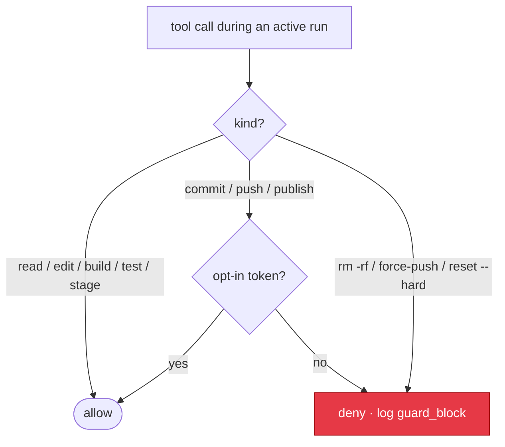

# Guardrails

Autonomy is only safe when the dangerous actions cannot happen by accident. This
document defines what Leopold may do on its own, what it may never do without an
explicit human opt-in, and how a run ends.

Guardrails are enforced two ways:
- **By hook** (cannot be rationalized past): the `PreToolUse` gate
  (`guard-irreversible.sh`) blocks forbidden commands at the tool-call layer.
- **By protocol** (the agent's own discipline): the decision protocol and the
  stop conditions.

The hook is the real lock. The protocol is the steering.

---



## Action classes

### Autonomous (decide and do)

Reversible work inside the repo working tree:

- Read, search, analyze any file.
- Create, edit, delete *untracked* working-tree files the run itself produced.
- Run builds, linters, type checkers, formatters, and test suites.
- Run any gstack skill that does not itself commit or push.
- Stage changes (`git add`) — staging is reversible and does not leave the
  machine.

### Gated (require an explicit per-session opt-in token)

Irreversible or outbound actions. Blocked by the hook unless `.leopold/ALLOW_GIT`
(or the relevant token) is present, which only the human creates:

- `git commit`
- `git push` (and force-push)
- `git reset --hard`, `git clean -fdx`, branch deletion
- `gh pr create`, `gh pr merge`, release creation
- Package publish (`npm publish`, `cargo publish`, `pip upload`, etc.)
- Deploy commands

This is the default-locked set. The user's standing rule — *never commit or push
without explicit confirmation* — is encoded here and enforced by the hook even
in fully autonomous mode.

### Forbidden (never, even with opt-in, autonomously)

- `rm -rf` on anything outside the run's own scratch.
- Editing files outside the target project root.
- Disabling or editing the guardrail hook, `GUARDRAILS.md`, or the permission
  settings.
- Writing secrets, tokens, or credentials to disk or to any outbound request.
- Sending project content to an external service not named in the brief.

---

## Stop conditions

The run ends, and the Stop hook allows the session to halt, when any of these is
true:

1. **Plan complete** — no unchecked items remain in `PLAN.md`.
2. **Kill switch** — `.leopold/STOP` exists (`/leopold-stop` or `touch`).
3. **Repeated failure** — the same test or build has failed N consecutive turns
   (default 3). Escalate, do not keep hammering.
4. **Loop detection** *(roadmap)* — detecting the same file or fix variant retried
   without progress is planned. Today the backstop against thrashing is the
   consecutive-failure budget (above) plus the iteration budget (below).
5. **Budget exhausted** — the iteration counter or a token/time budget set in
   `GUARDRAILS.md` is reached.
6. **Irreversible + ambiguous fork** — the decision protocol routed a fork to
   the human.

Every stop writes a final summary to the run output and a `stop` event to
`events.jsonl`, naming which condition fired.

---

## The kill switch

Two ways to stop a run at the next turn boundary:

- `/leopold-stop` — the clean way; flips `state.json` to inactive and writes a
  summary.
- `touch .leopold/STOP` — the blunt way; the Stop hook sees the file and halts.

Neither interrupts work mid-turn; both take effect when the current turn
finishes, so nothing is left half-done.

---

## Opting in to git (when you actually want commits)

If you want a run to commit checkpoints on its own, you opt in explicitly and
per session:

```bash
touch .leopold/ALLOW_GIT      # allow commit only
```

Push, force-push, PR creation, and publish remain blocked even with
`ALLOW_GIT`; those require their own tokens (`ALLOW_PUSH`, etc.) and are off by
default. The default posture, and the recommended one, is: Leopold stages and
reports, you commit and push.

---

## Defaults

| Setting              | Default | Where to change          |
|----------------------|---------|--------------------------|
| Commit               | locked  | `touch .leopold/ALLOW_GIT` |
| Push / PR / publish  | locked  | per-token, off by default  |
| Max consecutive fails| 3       | `GUARDRAILS.md`          |
| Max iterations       | 50      | `GUARDRAILS.md`          |
| Edits outside root   | never   | not configurable         |

## Run hygiene and parallel runs

### What is cleared when a run stops

On every stop, Leopold clears the kill switch (`STOP`) and the git opt-in tokens
(`ALLOW_GIT` / `ALLOW_PUSH` / `ALLOW_PUBLISH`). This is a safety property: the
next run starts with git **re-locked** and is not halted by a stale `STOP`. The
durable record (the brief, `DECISIONS.md`, `events.jsonl`) is never deleted.

### on_finish: keep or archive

Set in `GUARDRAILS.md`:

- **`keep`** (default) — the brief, decisions, and events stay in `.leopold/`.
- **`archive`** — on a clean finish (plan complete), `DECISIONS.md` and
  `events.jsonl` move to `.leopold/runs/<timestamp>/`, so the next run starts
  with a clean log while the full history is preserved.

Auto-delete is never a default; if you want a fresh start, remove `.leopold/`
yourself.

### One run per checkout

A project supports **one active Leopold run at a time**. Parallel runs in the
same checkout share `.leopold/` (one `state.json`, one `PLAN.md`) and the same
working tree, so they would clobber each other's state and code. `/leopold-run`
refuses to start a second run while another is active (a run idle for 10+ minutes
is treated as stale and can be taken over).

### Running in parallel — use worktrees

True parallelism comes from isolation, not threads: two agents editing the same
files conflict no matter how concurrent the orchestrator is. To run Leopold in
parallel, give each run its own git worktree:

```bash
git worktree add ../proj-leopold-2 && cd ../proj-leopold-2
# now /leopold-brief + /leopold-run here, fully isolated from the first run
```

Each worktree has its own checkout and its own `.leopold/`, so N runs proceed
concurrently without collision. The SDK driver's coordinated multi-worker fan-out
(one worktree or sandbox per worker) is the roadmap path for automated parallel
execution.
