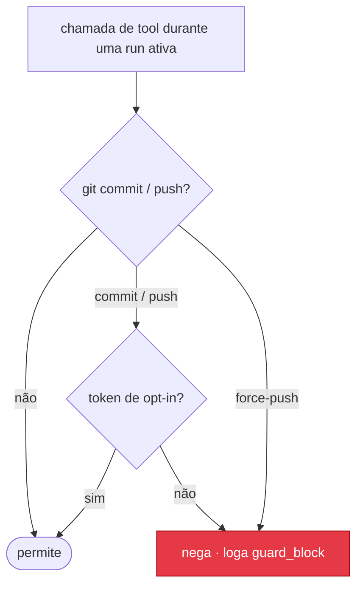

# Guardrails

Autonomia é segura quando a única ação que você nunca quer que aconteça por
acidente — código saindo da máquina ou entrando no histórico sem você — não pode
acontecer sozinha. Esse é todo o trabalho do lock do Leopold: **uma run pode fazer
qualquer coisa, exceto `git commit` e `git push`.** Ela deixa o trabalho em stage;
o commit e o push são seus.

Os guardrails são aplicados de duas formas:
- **Por hook** (impossível de contornar com racionalização): o gate `PreToolUse`
  (`guard-irreversible.sh`) nega `git commit` / `git push` na camada de chamada de tool.
- **Por protocolo** (a disciplina do próprio agente): o protocolo de decisão e as
  condições de parada mantêm a run concluindo trabalho em vez de empacar.

O hook é o lock de verdade. O protocolo é a direção.

O match de git é blindado contra evasão — opções globais (`git -c x=y commit`),
paths absolutos (`/usr/bin/git`), `env git` e truques de espaço/tab, tudo resolve
para o subcomando real — e é coberto por uma suíte de red team (`make test-guard`).

---



## Classes de ação

### Autônomas (decide e faz)

Tudo que não é uma operação de git com gate. A run tem autoridade total sobre o trabalho:

- Ler, buscar, analisar, criar, editar e deletar arquivos.
- Rodar builds, linters, type checkers, formatadores e suítes de teste.
- Rodar qualquer skill do gstack que não faça commit ou push por conta própria.
- Rodar comandos de shell, inclusive destrutivos (`rm -rf`, `reset --hard`) — a
  decisão é da run. Isole com `--worktree` se quiser uma fronteira de filesystem.
- Colocar mudanças em stage (`git add`).
- Criar subagents conforme o trabalho pedir.

### Com gate (exigem um token de opt-in explícito por run)

Só duas, bloqueadas pelo hook a menos que o token correspondente (que só o humano
cria) esteja presente:

- `git commit` — desbloqueia com `.leopold/ALLOW_GIT`
- `git push` — desbloqueia com `.leopold/ALLOW_PUSH`

Force-push (`--force` / `--force-with-lease` / `-f`) é negado mesmo com
`ALLOW_PUSH`. A regra permanente do usuário — *nunca fazer commit ou push sem
confirmação explícita* — está codificada aqui e é aplicada até em modo totalmente
autônomo. Nada mais tem gate: criar PR, publicar e fazer deploy são decisões da
própria run.

---

## Custo — o eixo caro

O custo em uma run autônoma longa explode porque a sessão principal cresce a cada
turno: em um modelo de contexto grande ela nunca auto-compacta, então cada turno
recobra o transcript inteiro acumulado. As defesas que importam:

- **O governador é o progresso, não USD.** `total_cost_usd` não reflete a
  contabilidade real na cobrança por assinatura, então um contador de custo
  deliberadamente **não** é o governador padrão de uma run autônoma. A run é
  governada por progresso durável — itens do plano fechados — via o
  [gate de livelock](concepts/continuity.md), mais os tetos rígidos abaixo. Usuários
  cobrados por API que querem um teto rígido podem optar pelo `--budget <usd>` do
  driver: a run para no momento em que o gasto acumulado (do `total_cost_usd` da
  CLI) cruza o valor, com o trabalho em stage para revisão. É um teto opt-in, nunca
  o padrão, e nada mais depende dele.
- **Runs limitadas e retomáveis.** Uma run termina em `max_iterations` (padrão 50 —
  o teto **da run**, carregado através das janelas de contexto) e em `max_windows`
  (padrão 10), então não gira para sempre; o brief persiste, então um `/leopold-run`
  novo retoma do `PLAN.md` com contexto limpo. Desde a 0.18.0 uma janela de contexto
  cheia é um **roll de janela, não uma parada**: a run faz checkpoint e continua em
  uma janela nova — veja [Continuidade](concepts/continuity.md).
- **Orquestrador enxuto.** O protocolo delega trabalho de saída volumosa (redigir
  conteúdo, gerar arquivos) a um subagent que **escreve em arquivo**, então a saída
  nunca se acumula no contexto do orquestrador.

Cinto e suspensório: configure um **spending cap da Anthropic** na sua conta antes
de runs autônomas longas em projetos grandes.

### Acompanhando uma run (dashboard ao vivo)

`/leopold-watch` (ou `make watch`, ou `leopold watch` da CLI npm) sobe um dashboard **local**
em `http://127.0.0.1:4179` que atualiza ao vivo via SSE. O destaque é o **gasto estimado
real**, extraído do transcript da sessão do Claude Code: dólares, o breakdown de tokens
(input / output / cache-write / cache-read), % de cache hit, por modelo e principal vs
subagent. Abaixo: o feed de eventos ao vivo (turnos, bloqueios do guard, paradas), o log de
decisões e um botão **Stop** que usa o kill switch. O número de custo é uma estimativa a
partir de um mapa de preços embutido, **configurável** via a env var `LEOPOLD_PRICES` (um
arquivo JSON) ou um `.leopold/prices.json` no projeto — sobrescreva qualquer modelo ou
família, ex.: `{"opus": {"in": 15, "out": 75, "cache_write": 18.75, "cache_read": 1.5}}`
(as taxas de cache têm padrão 1.25× / 0.1× do input). É zero-dependência (stdlib do
Python), somente leitura exceto por aquele botão, e faz bind no loopback — nada sai da
máquina.

---

## Condições de parada

A run termina, e o Stop hook permite que a sessão pare, quando qualquer uma destas
é verdadeira:

1. **Plano completo** — nenhum item desmarcado resta no `PLAN.md`.
2. **Kill switch** — `.leopold/STOP` existe (`/leopold-stop` ou `touch`).
3. **Falha repetida** — o mesmo tipo de falha por N turnos consecutivos (padrão 3),
   *depois* da única mudança de abordagem conduzida por uma persona que a run ganha ao
   bater no teto pela primeira vez. O teto em si nunca se move.
4. **Budget de iterações** — o contador de iterações atingiu `max_iterations` (padrão 50).
   O contador atravessa as janelas de contexto: é o teto da run, nunca zerado por um
   roll de janela.
5. **Budget em USD** — o gasto acumulado cruzou `--budget`, se você optou por ele
   (só no driver; nunca o governador padrão).
6. **Livelock entre janelas** — duas janelas de contexto consecutivas fecharam zero
   itens do plano (`no_progress_across_windows`). Rolar é de graça; produzir é
   obrigatório.
7. **Teto de janelas** — a run consumiu `max_windows` janelas de contexto (padrão 10).
8. **Escalação** — uma bifurcação que nem um papel sintetizado conseguiu resolver (uma
   resposta inutilizável, um erro do harness). Uma bifurcação que ele *consegue* resolver
   é decidida e registrada, não escalada.

**Uma janela de contexto cheia deliberadamente não está mais nesta lista.** Desde a
0.18.0 ela é um roll de janela: a run escreve o `.leopold/CHECKPOINT.md` e a próxima
janela continua o plano (relançada pelo `leopold watch` com `continuity: auto`). Veja
[Continuidade](concepts/continuity.md).

Toda parada escreve um resumo final na saída da run e um evento `stop` em
`events.jsonl`, dizendo qual condição disparou. A lista completa — incluindo
`context_budget`, `no_progress` e `routed_complete`, e se um papel sintetizado pode afetar
cada uma — está em
[O que ainda para a run](concepts/personas.md#o-que-ainda-para-a-run).

**`awaiting_human` não está nessa lista sob a postura padrão.** Um nó `@human` é decidido
por um papel que o Leopold sintetiza para ele, nos dois engines; configure
[`autonomy: ask`](reference/plan-grammar.pt-BR.md#autonomy) no `GUARDRAILS.md` (ou
`LEOPOLD_AUTONOMY=ask`, ou a flag `--ask` do driver) para que ele pare e espere por você.
Uma persona decide; ela nunca publica — o git continua travado nas duas posturas, e
nenhuma persona pode aumentar um budget, limpar o kill switch ou editar o `GUARDRAILS.md`.

---

## Bounds que antes eram prosa

Uma regra que só vive num prompt é um desejo. Toda regra abaixo agora é um hook que roda
no próprio harness, conectado pelo `extensions/lib/harness.sh` em cada harness onde a sonda
provou que o evento dispara, **inerte a menos que um run esteja ativo**, e reportado por
harness pelo `leopold doctor` — nunca silêncio. A descrição completa de cada script está em
[Hooks](reference/hooks.md); o payload em que cada um monta está capturado em
[Hook Events](reference/hook-events.md); quem vai para qual harness é decidido pelo
`hooks/hook-matrix.tsv`, não por esta página.

| Bound | Hook (eventos) | Claude Code | Codex CLI |
| --- | --- | --- | --- |
| Checkpoint de compactação | `compact-checkpoint.sh` (`PreCompact`, `PostCompact`) | available | available |
| Livro-razão de subagents | `subagent-account.sh` (`SubagentStart`, `SubagentStop`) | available | available |
| Teto de subagents | `subagent-cap.sh` (`PreToolUse`) | available | available |
| Recibos de verificação | `verify-receipt.sh` (`PostToolUse`, `PostToolUseFailure`) | available | substitute |
| Pronto significa verificado | `done-gate.sh` (`PreToolUse`, `TaskCompleted`) | available | substitute |
| Política de permissão | `permission-policy.sh` (`PermissionRequest`) | available | substitute |
| Parada por erro de API | `stop-failure.sh` (`StopFailure`) | available | unavailable |
| Detector de segundo escritor | `file-watch.sh` (`FileChanged`) | available | unavailable |
| Guarda de adulteração de config | `config-guard.sh` (`ConfigChange`) | available | unavailable |
| Roles das lentes de review | `$CODEX_HOME/agents/*.toml` (`SubagentStart`) | substitute | available |

Onde um harness não é `available`, o `leopold doctor` imprime a nota da própria linha da
matriz, de modo que o custo é declarado em vez de subentendido. Literalmente, elas são:

- **Política de permissão no Codex** — *dispara só sob `--approve-for-me`; o deny de
  `decision.behavior` é honrado, o allow NÃO é, e `approval_policy=on-request` nunca
  pergunta — a autonomia no Codex fica nas flags de sandbox do driver e o hook é conectado
  para a metade do deny (ele repete a trava do git).*
- **Recibos de verificação no Codex** — *o PostToolUse dispara igual para sucesso e falha e
  o `tool_response` é só stdout — um recibo no Codex prova que a verificação RODOU depois
  da última edição, nunca que ela passou.*
- **Gate de pronto no Codex** — *o Codex não tem eventos de task; a metade do PLAN.md no
  PreToolUse carrega o bound inteiro lá.*
- **Parada por erro de API no Codex** — *um erro de API encerra um run do Codex como uma
  parada comum — `turn.failed` no stream --json, sem Stop e sem hook de falha; retome com
  `/leopold-run`.*
- **Detector de segundo escritor no Codex** — *não existe FileChanged no Codex: um segundo
  escritor nos arquivos do plano não é detectado lá.*
- **Guarda de adulteração de config no Codex** — *não existe ConfigChange no Codex: uma
  edição do config.toml ou do wiring dos hooks no meio do run não é detectada lá.*
- **Roles das lentes de review no Claude Code** — *o Claude Code não tem arquivos de role:
  as lentes do driver são as sessões SDK dele mesmo e o `agent_type` as nomeia no mesmo
  payload.*

Nada disso afrouxa coisa alguma. Um hook só acrescenta uma negativa, ou responde um prompt
que de outro modo ficaria esperando; a trava do git decide primeiro e nunca é sobreposta.

---

## Duas linhas novas no `GUARDRAILS.md` — as duas opcionais, as duas ausentes por padrão

Nada abaixo muda como um brief existente roda. Um `GUARDRAILS.md` escrito antes destes
hooks parseia byte a byte como antes, e cada linha fica inerte até você escrevê-la.

### `## Verification commands` — o que conta como evidência

A seção está no template entregue com os exemplos **comentados**, e é exatamente esse o
ponto: sem entradas, nada é registrado e nada é alegado.

```markdown
## Verification commands
- make test
- npm test
```

Com entradas, o `verify-receipt.sh` registra um recibo sempre que um comando Bash
**começa** com uma delas. O casamento é lexical e propositalmente estreito:
`cd sub && make test` e `echo $(make test)` casam com `make test`; um comentário
(`make build # make test comes later`), um argumento
(`echo "- ran make test" >> notes.md`) e um corpo de heredoc que o cita, não. O hook nunca
reinterpreta o que o modelo quis dizer.

Cada recibo carrega um `outcome`, e só `passed` ou `ran` move o `last_verify_at`. No Claude
Code um comando que falha normalmente chega como `PostToolUseFailure` (`failed`), e um
`PostToolUse` reinterpretado a partir de um exit não-zero, interrompido ou em background é
registrado como `nonzero` / `incomplete` em vez de sucesso. No Codex nenhum payload carrega
status nenhum, então um recibo lá é `ran`.

O `done-gate.sh` é quem lê esses recibos: uma edição que transforma um `- [ ]` em `- [x]`
no `.leopold/PLAN.md`, ou um `TaskCompleted` no Claude Code, é recusada quando nenhum
comando de verificação produziu um recibo de sucesso desde a última edição do item — com os
comandos desta seção nomeados na recusa. Com a seção vazia, o gate não tem o que checar e
permite, exatamente como antes.

### `max_subagents` — o teto de spawn

O arquivo de estado carrega `subagents_spawned` e `max_subagents` desde a 0.9 e nada nunca
os aplicou. Agora o `subagent-account.sh` conta cada filho no `SubagentStart` /
`SubagentStop` (indexado por `agent_id`, sob o lock de estado) e o `subagent-cap.sh` recusa
o spawn no `PreToolUse` assim que a contagem atinge o teto — antes de o filho existir,
porque o `SubagentStart` não tem resposta de deny.

O teto é lido do `max_subagents` no `.leopold/state.json`, senão de uma linha
`max_subagents:` no `.leopold/GUARDRAILS.md`, senão **não há teto** e o hook fica em
silêncio — um projeto que nunca definiu um se comporta como antes do hook existir.
`max_subagents: 0` é um teto de verdade ("nenhum subagent nesta run"), não um teto ausente.
A recusa diz ao run para fazer o trabalho no turno dele mesmo; levantar o teto é decisão do
humano, no `GUARDRAILS.md`.

### Os novos campos de estado e eventos

Cada um destes é escrito sob o `.leopold/.state.lock`, e toda linha de evento carrega
`session`:

| No `state.json` | Escrito por |
| --- | --- |
| `compact_checkpoints` | `compact-checkpoint.sh` |
| `subagents_spawned`, `subagents` | `subagent-account.sh` |
| `verify_receipts`, `last_verify_at`, `last_edit_at`, `own_edits` | `verify-receipt.sh` |

| Novo evento no `events.jsonl` | O que significa |
| --- | --- |
| `compact_checkpoint`, `compact_resumed` | uma compactação foi sobrevivida |
| `checkpoint_oversize`, `checkpoint_unmergeable` | o checkpoint foi recusado, alto e claro, e nada foi truncado |
| `subagent_started`, `subagent_stopped` | o livro-razão |
| `subagent_cap_denied` | o teto recusou um spawn |
| `verify_recorded` | um comando de verificação produziu um recibo |
| `done_denied` | um item foi fechado sem evidência |
| `external_write` | algo fora desta sessão mudou o plano (um aviso, nunca um bloqueio) |
| `config_change_blocked` | um reload de configuração foi recusado no meio do run |
| `stop_failure` | o turno terminou em erro de API, com a classe dele |

O `leopold watch` renderiza cada um com uma severidade e um significado de uma linha — um
evento não registrado ainda assim renderiza, nunca como uma linha em branco.

---

## O kill switch

Duas formas de parar uma run na próxima fronteira de turno:

- `/leopold-stop` — o jeito limpo; vira o `state.json` para inativo e escreve um
  resumo.
- `touch .leopold/STOP` — o jeito bruto; o Stop hook vê o arquivo e para.

Nenhuma das duas interrompe o trabalho no meio do turno; ambas fazem efeito quando
o turno atual termina, então nada fica pela metade.

---

## Optando por liberar o git (quando você realmente quer commits)

Se você quer que uma run faça commit ou push sozinha, o opt-in é explícito e por run:

```bash
touch .leopold/ALLOW_GIT      # allow commit
touch .leopold/ALLOW_PUSH     # allow push (force-push stays denied)
```

A postura padrão, e a recomendada, é: o Leopold deixa em stage e reporta, você faz
commit e push.

---

## Padrões

| Configuração                | Padrão     | Onde mudar                 |
|-----------------------------|------------|----------------------------|
| Commit                      | travado    | `touch .leopold/ALLOW_GIT` |
| Push                        | travado    | `touch .leopold/ALLOW_PUSH` |
| Force-push                  | nunca      | não configurável           |
| Autonomy                    | `full`     | `GUARDRAILS.md` (`autonomy: ask`) |
| Máx. de falhas consecutivas | 3          | `GUARDRAILS.md`            |
| Máx. de iterações           | 50 (por run, através das janelas) | `GUARDRAILS.md` |
| Continuidade                | `auto`     | `GUARDRAILS.md` (`continuity: manual`) |
| Máx. de janelas             | 10         | `GUARDRAILS.md` (`max_windows:`) |
| Budget em USD               | nenhum (opt-in) | `--budget` no driver  |
| Teto de subagents           | nenhum até ser definido (o `state.json` de um run novo escreve 8) | `GUARDRAILS.md` (`max_subagents:`) |
| Comandos de verificação     | nenhum (opt-in) | `GUARDRAILS.md` (`## Verification commands`) |

## Higiene de run e runs paralelas

### O que é limpo quando uma run para

Em toda parada, o Leopold limpa o kill switch (`STOP`) e os tokens de opt-in de git
(`ALLOW_GIT` / `ALLOW_PUSH`). Isso é uma propriedade de segurança: a próxima run
começa com o git **travado de novo** e não é interrompida por um `STOP` velho. O
registro durável (o brief, `DECISIONS.md`, `events.jsonl`) nunca é deletado.

### on_finish: keep ou archive

Definido em `GUARDRAILS.md`:

- **`keep`** (padrão) — o brief, as decisões e os eventos ficam em `.leopold/`.
- **`archive`** — em um término limpo (plano completo), `DECISIONS.md` e
  `events.jsonl` vão para `.leopold/runs/<timestamp>/`, então a próxima run começa
  com log limpo enquanto o histórico completo fica preservado.

Auto-delete nunca é padrão; se você quer começar do zero, remova `.leopold/` você
mesmo.

### Uma run por checkout

Um projeto suporta **uma run ativa do Leopold por vez**. Runs paralelas no mesmo
checkout compartilham `.leopold/` (um `state.json`, um `PLAN.md`) e a mesma working
tree, então uma sobrescreveria o estado e o código da outra. `/leopold-run` se
recusa a iniciar uma segunda run enquanto outra está ativa (uma run ociosa por 10+
minutos é tratada como abandonada e pode ser assumida).

### Um dono por run

O run é conduzido por **uma sessão**, registrada como `owner` no `state.json` na
ativação. O hook de Stop continua e conta só essa sessão; toda outra sessão que pare
neste checkout é avisada de quem é o dono e pode parar, e suas paradas são registradas
como `foreign_stop` — nunca cobradas do run. `/leopold-run` se recusa a iniciar ao lado
de um dono vivo e assume um abandonado (sem sinal de vida por dez minutos; `--takeover`
força); `/leopold-stop` se recusa a encerrar o run de outra sessão viva sem `--force`.
`/leopold-status` e `leopold doctor` nomeiam o dono e dizem se está vivo. A trava do
git continua valendo para o projeto inteiro — o checkout compartilha um único index — e
a negação nomeia o run dono.

### Rodando em paralelo — use worktrees

Paralelismo de verdade vem de isolamento, não de threads: dois agentes editando os
mesmos arquivos conflitam por mais concorrente que o orquestrador seja. Para rodar
o Leopold em paralelo, dê a cada run seu próprio worktree do git:

```bash
git worktree add ../proj-leopold-2 && cd ../proj-leopold-2
# now /leopold-brief + /leopold-run here, fully isolated from the first run
```

Cada worktree tem seu próprio checkout e seu próprio `.leopold/`, então N runs
avançam concorrentemente sem colisão.
