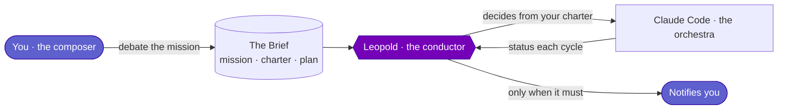
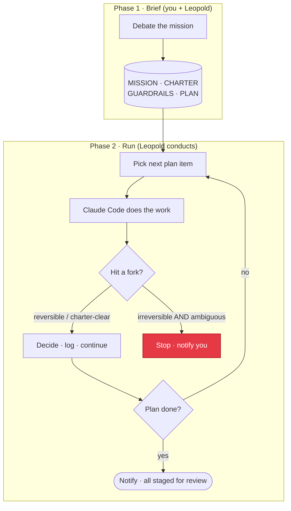

---
hide:
  - navigation
  - toc
---

# Leopold

**Brief it like a teammate. It conducts Claude Code in your seat.**

Leopold is an autonomous orchestration harness for [Claude Code](https://claude.com/claude-code). You debate the work with it the way you already debate with Claude Code: goals, constraints, taste, what *done* means. That conversation becomes a durable brief. Then Leopold takes the seat and conducts Claude Code continuously, deciding the way you would, instead of stopping to ask you at every fork.

!!! quote "Why *Leopold*?"
    In Bugs Bunny's *Long-Haired Hare* (1949), Bugs takes the podium disguised as the great conductor **Leopold** and runs the whole orchestra with a wave of the baton. That is the job: you are the composer, Leopold is the conductor, Claude Code is the orchestra.

-   :material-rocket-launch:{ .lg .middle } __Get started in minutes__

    ---

    Install the skills and hooks, then brief your first mission and hand over the seat.

    [:octicons-arrow-right-24: Quickstart](getting-started/quickstart.md)

-   :material-brain:{ .lg .middle } __It decides like you__

    ---

    A charter encodes *your* judgment so the run answers its own questions instead of pinging you.

    [:octicons-arrow-right-24: Decision Protocol](decision-protocol.md)

-   :material-shield-lock:{ .lg .middle } __Git stays locked__

    ---

    Commit, push, and destructive commands are blocked by a hook, even in fully autonomous mode.

    [:octicons-arrow-right-24: Guardrails](guardrails.md)

-   :material-sitemap:{ .lg .middle } __Built as a real harness__

    ---

    Two tiers: an in-session engine that runs in plain Claude Code, and an SDK driver for unattended runs.

    [:octicons-arrow-right-24: Architecture](architecture.md)

-   :material-source-branch:{ .lg .middle } __The plan runs as code__

    ---

    The brief compiles into a dynamic workflow: dependency waves, an adversarial verify panel per item, a live phase tree.

    [:octicons-arrow-right-24: Dynamic Workflows](concepts/dynamic-workflows.md)

## The problem it solves

A normal Claude Code session is a conversation. It pauses at every decision: *"approach A or B?"*, *"should I commit?"*, *"do the next item or stop?"*. That is the right default when a human is watching, and the wrong default when you want a session to run for an hour while you do something else.

The pauses come from three places, and each needs a different fix:

| Cause | What it is | Leopold's lever |
| --- | --- | --- |
| Safety defaults | commit/push/destructive ask first | **kept locked** (a hook) |
| No designated decider | "A or B" is a *product* call | **the charter** decides as you would |
| No continuity | a finished batch just stops | **continuity** picks up the next item |

## How it works, in one picture

Ready? Start with the [Quickstart](getting-started/quickstart.md), or read [What Is a Harness](concepts/harness.md) to understand the bigger picture.
