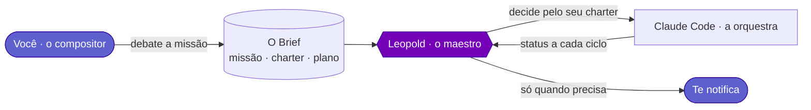
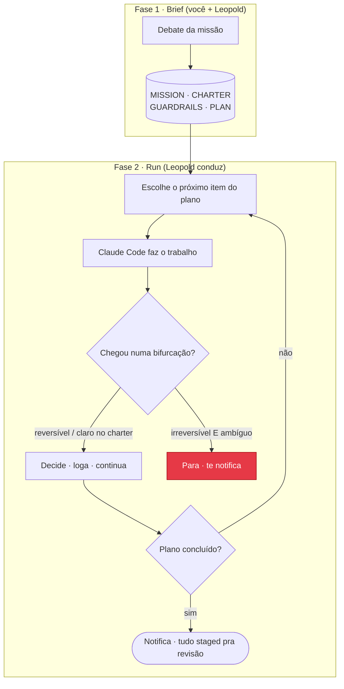

---
hide:
  - navigation
  - toc
---

# Leopold

**Faça o brief como faria com um colega de time. Ele conduz o Claude Code na sua cadeira.**

Leopold é um harness de orquestração autônoma para o [Claude Code](https://claude.com/claude-code). Você debate o trabalho com ele do mesmo jeito que já debate com o Claude Code: objetivos, restrições, gosto, o que *pronto* significa. Essa conversa vira um brief durável. Depois o Leopold assume a cadeira e conduz o Claude Code continuamente, decidindo do jeito que você decidiria, em vez de parar pra te perguntar a cada bifurcação.

!!! quote "Por que *Leopold*?"
    Em *Long-Haired Hare* (1949), do Pernalonga, o coelho sobe ao pódio disfarçado do grande maestro **Leopold** e comanda a orquestra inteira com um aceno da batuta. O trabalho é exatamente esse: você é o compositor, o Leopold é o maestro, o Claude Code é a orquestra.

-   :material-rocket-launch:{ .lg .middle } __Comece em minutos__

    ---

    Instale as skills e os hooks, depois faça o brief da primeira missão e entregue a cadeira.

    [:octicons-arrow-right-24: Quickstart](getting-started/quickstart.md)

-   :material-brain:{ .lg .middle } __Ele decide como você__

    ---

    Um charter codifica o *seu* julgamento, então a run responde as próprias perguntas em vez de ficar te chamando.

    [:octicons-arrow-right-24: Protocolo de Decisão](decision-protocol.md)

-   :material-shield-lock:{ .lg .middle } __O git fica travado__

    ---

    Commit, push e comandos destrutivos são bloqueados por um hook, mesmo no modo totalmente autônomo.

    [:octicons-arrow-right-24: Guardrails](guardrails.md)

-   :material-sitemap:{ .lg .middle } __Construído como um harness de verdade__

    ---

    Dois níveis: um engine in-session que roda no Claude Code puro, e um driver SDK pra runs sem supervisão.

    [:octicons-arrow-right-24: Arquitetura](architecture.md)

-   :material-source-branch:{ .lg .middle } __O plano roda como código__

    ---

    O brief compila num workflow dinâmico: ondas de dependência, um painel adversarial de verificação por item, uma árvore de fases ao vivo.

    [:octicons-arrow-right-24: Workflows Dinâmicos](concepts/dynamic-workflows.md)

-   :material-auto-fix:{ .lg .middle } __Seus prompts, turbinados__

    ---

    Prompts fracos do dia a dia ganham uma interpretação estruturada e ciente do charter — na sua própria conta, e o prompt cru sempre vence.

    [:octicons-arrow-right-24: Prompt Enhancer](reference/enhance.md)

-   :material-account-search:{ .lg .middle } __Clientes sintéticos__

    ---

    Personas fundamentadas em evidência percorrem os fluxos do seu produto e reportam bugs, confusão e fricção — limites aplicados em código.

    [:octicons-arrow-right-24: Teste com Personas](concepts/persona-testing.md)

## O problema que ele resolve

Uma sessão normal do Claude Code é uma conversa. Ela pausa a cada decisão: *"abordagem A ou B?"*, *"devo commitar?"*, *"faço o próximo item ou paro?"*. Esse é o default certo quando tem um humano olhando, e o default errado quando você quer que uma sessão rode por uma hora enquanto você faz outra coisa.

As pausas vêm de três lugares, e cada um pede uma correção diferente:

| Causa | O que é | A alavanca do Leopold |
| --- | --- | --- |
| Defaults de segurança | commit/push/destrutivos perguntam antes | **seguem travados** (um hook) |
| Nenhum decisor designado | "A ou B" é uma decisão de *produto* | **o charter** decide como você decidiria |
| Falta de continuidade | um lote concluído simplesmente para | **a continuidade** pega o próximo item |

## Como funciona, numa imagem

Pronto pra começar? Vá pelo [Quickstart](getting-started/quickstart.md), ou leia [O Que É um Harness](concepts/harness.md) pra entender o quadro maior.
