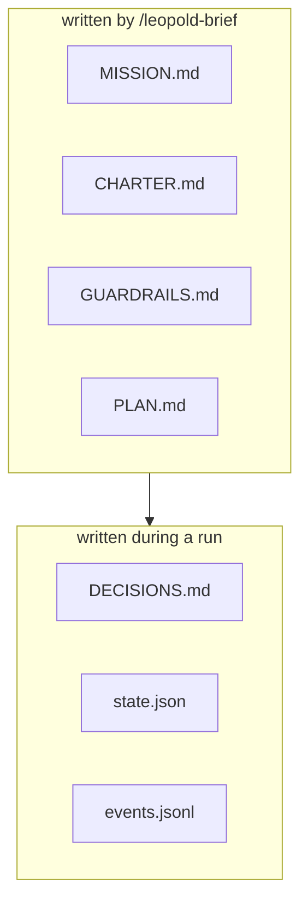

# Brief Artifacts

Everything a run needs lives under `.leopold/` in the target project. The first
four are written by `/leopold-brief`; the rest are runtime state.



## `MISSION.md`

What we are building and why: problem, goal, explicit non-goals, definition of
done, constraints. This is *what*.

## `CHARTER.md`

The decider. Priorities, technology and style preferences, hard `Always` /
`Never` rules, tie-breakers, and worked examples of decisions you would make.
This is *how you would choose* — the part that "becomes you".

## `GUARDRAILS.md`

The autonomy boundary: action classes, the git posture (locked by default), stop
conditions (`max_iterations`, `max_failures`, budgets), and the kill switch. It can
also set the SDK driver's orchestration toggles so the posture lives with the brief
(a CLI flag or env var overrides it):

```markdown
## Quality & orchestration (SDK driver)
- review: on            # diverse-lens review panel before an item closes
- hypotheses: on        # root-cause panel hands a stuck retry a concrete lead
- smart_routing: off    # research each item's blast radius before routing effort
- learn_on_finish: off  # mine a clean finish into proposed charter amendments
```

## `PLAN.md`

An ordered, checkbox backlog. The run takes the next `- [ ]` item each turn and
marks it `- [x]` when done.

```markdown
- [ ] First item
- [ ] Second item
```

## `DECISIONS.md`

Append-only audit trail. Each non-mechanical decision is one block:

```text
## D1 — Cache layer for the MVP        (turn 3, 2026-06-17T15:00:00Z)
Fork:        in-memory vs Redis
Class:       reversible
Charter:     "no new infrastructure for the MVP"
Decision:    in-memory map with a TTL
Why:         charter rule + principle 5 (explicit over clever)
Reversal:    swap the cache module for a Redis client; interface unchanged
```

## `CHARTER-amendments.md` (proposal, not brief)

Written by `/leopold-learn` or the driver's `learn_on_finish`: rules mined from your
recorded decisions, session corrections, and git history, each verified by a
kill-biased skeptic. It is a **proposal** — `CHARTER.md` is never edited by a run.
Review it, fold what sounds like you into the charter, delete the rest. Safe to
delete entirely.

## `workflow-args.json` (compiled brief)

Written by `leopold-driver workflow`: the brief compiled into the exact `args` the
canonical workflow script consumes — mission, charter, `maxReviewRounds`, and
`PLAN.md` as dependency waves with per-item classification (`effort` / `critical` /
`sensitive`). Pairs with `.claude/workflows/leopold-run.js`. Deterministic: recompile
any time with `leopold-driver workflow`. See
[Dynamic Workflows](../concepts/dynamic-workflows.md).

## Runtime state

| File | Holds |
| --- | --- |
| `state.json` | `active`, `iteration`, `max_iterations`, `consecutive_failures`, `max_failures`, timestamps |
| `events.jsonl` | structured event stream (incl. `review`, `hypothesis`, `learn`, `cost` events) |
| `STOP` | kill switch (presence halts the loop) |
| `ALLOW_GIT` / `ALLOW_PUSH` | per-run git opt-in tokens, absent by default |
