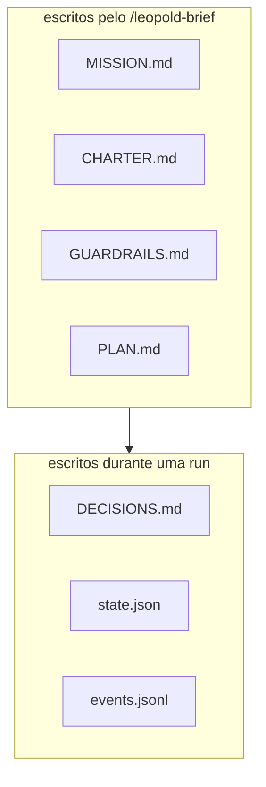

# Artefatos do Brief

Tudo que uma run precisa vive em `.leopold/` no projeto alvo. Os quatro primeiros
são escritos pelo `/leopold-brief`; o resto é estado de runtime.



## `MISSION.md`

O que estamos construindo e por quê: problema, objetivo, não-objetivos explícitos,
definição de pronto, restrições. Isto é o *quê*.

## `CHARTER.md`

O decisor. Prioridades, preferências de tecnologia e estilo, regras rígidas de `Always` /
`Never`, critérios de desempate e exemplos concretos de decisões que você tomaria.
Isto é *como você escolheria* — a parte que "vira você".

## `GUARDRAILS.md`

A fronteira da autonomia: classes de ação, a postura de git (trancado por padrão),
condições de parada (`max_iterations`, `max_failures`, budgets) e o kill switch. Ele
também pode definir os toggles de orquestração do driver SDK, para que a postura viva
junto com o brief (uma flag de CLI ou env var a sobrescreve):

```markdown
## Quality & orchestration (SDK driver)
- review: on            # diverse-lens review panel before an item closes
- hypotheses: on        # root-cause panel hands a stuck retry a concrete lead
- smart_routing: off    # research each item's blast radius before routing effort
- learn_on_finish: off  # mine a clean finish into proposed charter amendments
```

## `PLAN.md`

Um backlog ordenado de checkboxes. A run pega o próximo item `- [ ]` a cada turno e
o marca como `- [x]` quando concluído.

```markdown
- [ ] First item
- [ ] Second item
```

## `DECISIONS.md`

Trilha de auditoria append-only. Cada decisão não mecânica é um bloco:

```text
## D1 — Cache layer for the MVP        (turn 3, 2026-06-17T15:00:00Z)
Fork:        in-memory vs Redis
Class:       reversible
Charter:     "no new infrastructure for the MVP"
Decision:    in-memory map with a TTL
Why:         charter rule + principle 5 (explicit over clever)
Reversal:    swap the cache module for a Redis client; interface unchanged
```

## `CHARTER-amendments.md` (proposta, não brief)

Escrito pelo `/leopold-learn` ou pelo `learn_on_finish` do driver: regras mineradas das
suas decisões registradas, correções de sessão e histórico do git, cada uma verificada
por um cético com viés de rejeição. É uma **proposta** — o `CHARTER.md` nunca é editado
por uma run. Revise, incorpore ao charter o que soa como você, apague o resto. Pode
apagar o arquivo inteiro sem problema.

## `workflow-args.json` (brief compilado)

Escrito pelo `leopold-driver workflow`: o brief compilado nos exatos `args` que o
script canônico de workflow consome — missão, charter, `maxReviewRounds` e o `PLAN.md`
como waves de dependência com classificação por item (`effort` / `critical` /
`sensitive`). Anda junto com `.claude/workflows/leopold-run.js`. Determinístico: recompile
a qualquer momento com `leopold-driver workflow`. Veja
[Dynamic Workflows](../concepts/dynamic-workflows.md).

## Estado de runtime

| Arquivo | Contém |
| --- | --- |
| `state.json` | `active`, `iteration`, `max_iterations`, `consecutive_failures`, `max_failures`, timestamps |
| `events.jsonl` | fluxo estruturado de eventos (incl. eventos de `review`, `hypothesis`, `learn`, `cost`) |
| `STOP` | kill switch (a presença interrompe o loop) |
| `ALLOW_GIT` / `ALLOW_PUSH` | tokens de opt-in de git por run, ausentes por padrão |
