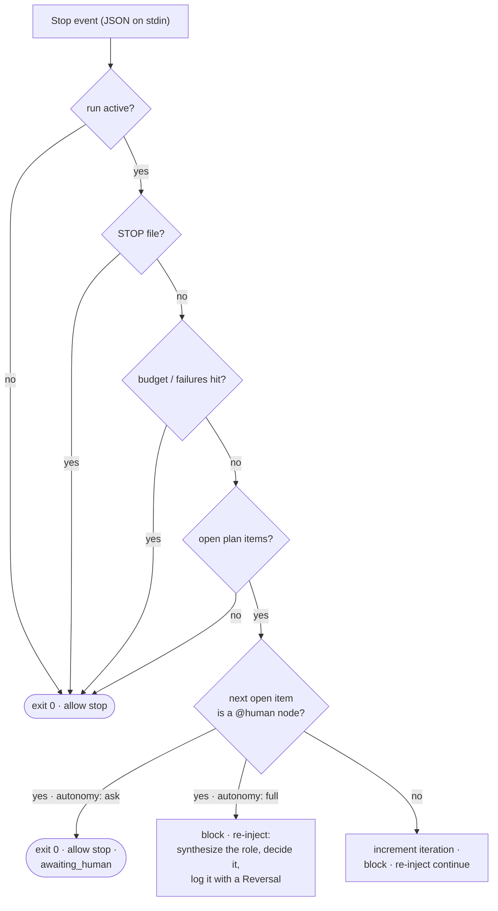

# Hooks

Three hooks are wired by `install.sh` into each harness it finds — `settings.json`
on Claude Code, `config.toml` on Codex CLI. The two engine hooks live in
`<asset home>/hooks/` and are **no-ops unless a run is active**; the prompt
enhancer lives in `<asset home>/enhance/` and is a **no-op until you toggle it
on** — so all three are safe to leave installed in every session. The asset home is
`~/.claude/leopold` whenever Claude Code is present and `~/.codex/leopold` on a
Codex-only machine ([Asset Home](leopold-home.md)); the paths below use the Claude
Code layout.

The two engine hooks are **the same unmodified scripts on both harnesses** — Codex
reimplemented Claude Code's hook contract nearly field for field, so no portability
layer exists to go wrong. See [Claude Code and Codex](../concepts/harnesses.md).

## `stop-continuity.sh` — the Stop hook

Runs when the agent finishes a turn. Contract: read JSON on stdin; print
`{"decision":"block","reason":"..."}` to keep going, or exit 0 to allow the stop.



Fail-open: any unexpected error allows the stop. Continuity is best-effort;
halting is always safe.

### How an allowed stop reaches you

A Stop hook has two output channels, and they are not interchangeable. On the
**block** path (`{"decision":"block","reason":…}` on stdout) the reason goes to the
model. On the **allow** path — `exit 0`, which is every stop above — stderr is
discarded: the harness surfaces a hook's stderr on exit 2, not exit 0.

So every allowed stop that a person has to act on carries its notice as
`systemMessage` on stdout, which the harness renders as a `Stop says: …` notice.
That covers the window roll, the `max_windows` ceiling, the livelock verdict, the
`awaiting_human` pause, and the `state_invalid` fail-safe. The same text still goes
to stderr, for anyone running the hook by hand.

This matters more than it sounds: the roll notice used to be written only to
stderr on the allow path, so a run that rolled its window looked, from the outside,
like `/leopold-run` had quit on its own after one plan item. Nothing was broken —
but nobody was told.

Both harnesses carry the field on the same wire: Claude Code documents
`systemMessage` for all hooks, and Codex deserializes `reason` / `stopReason` /
`suppressOutput` / `systemMessage` on its `StopCommandOutputWire`.

### The context window roll

Since 0.18.0 the context budget is **a maintenance event, not a death** — the
behavior change is explicit, not implied. The hook measures the transcript against
`max_context_mb` (default 5 MB) every turn:

- **At ~80% of the budget** the turn is blocked with a checkpoint instruction: write
  or merge `.leopold/CHECKPOINT.md` — the one contract in
  `packages/driver/src/checkpoint.ts` (fixed title, seven fixed sections,
  merge-don't-nest, 32768-byte cap that fails loud) — then continue the plan. The
  instruction re-injects every turn in the band; merging is idempotent. A
  `checkpoint_instruction` event is logged.
- **At 100% with no checkpoint yet, the window gets one turn to write one.** The 80%
  band is only ever reached by a window that climbed through it; a run activated
  inside a session *already* past the budget lands straight on the roll and would
  never once be told to checkpoint — exactly the window whose working state is most
  expensive to lose. So the turn is blocked with the checkpoint instruction instead
  of rolling, and a `checkpoint_grace` event is logged. The bound lives in code, not
  in the prompt: `checkpoint_grace_window` records the window that spent it, so a
  window defers at most once and the next turn rolls regardless. That turn does not
  spend the run's one failure rescue — it exists to preserve state, not to re-attempt
  the item.
- **At 100%** the stop happens with the reason it always had —
  `stopped_reason: context_budget`, consumers read it — but the state says roll:
  `windows` is incremented, the plan's checkbox vector is snapshotted, and
  `checkpoint_written` records whether the checkpoint exists (a missing one is named
  loudly in the stop message, never silently). The message always names the resume
  path; a `window_roll` event is logged.
- **Before rolling, two gates run.** The **livelock gate**: each roll records how
  many plan items the ending window closed (checkbox-vector diff vs the
  window-start snapshot); two consecutive windows closing zero items stop the run
  with `no_progress_across_windows` — no resume pointer, nothing relaunches. And
  **`max_windows`** (state > `GUARDRAILS.md` > 10) caps the total windows one run
  may consume; reaching it stops the run with `max_windows`.
- **Budgets survive the roll.** `iteration`/`max_iterations` is the run's ceiling
  across all windows, and spent one-shots (the failure rescue, the deadlock repair)
  stay spent through every reseed. Nothing a roll does refreshes a budget or clears
  `.leopold/STOP`.

Under `continuity: auto` (the default in `GUARDRAILS.md`), `leopold watch` detects
the roll and relaunches the run headless on the harness that owns it (`claude -p` /
`codex exec`), after independently re-checking the kill switch, `max_windows` and
the livelock gate. Under `continuity: manual` nothing relaunches — you resume with
`/leopold-run`. The re-injected continue instruction also carries the window line
(`Window N/max`) and tells the agent to treat the workspace, tool results and
durable state as authoritative over earlier narration. Full story:
[Continuity](../concepts/continuity.md).

A project with no checkpoint and default guardrails behaves exactly as 0.17.x
except that the stop message now names the resume path.

### Node kinds

`PLAN.md` items may declare a node kind (`@node work|gate|human|tool|verify|feedback`, or
the `@gate` / `@human` / `@tool` / `@verify` / `@feedback` shorthands). The in-session engine acts on one
of them — **`@human`** — and what it does with one depends on the judgment posture
([`autonomy`](#autonomy)), never on which harness you are running:

- **`autonomy: full` (the default).** No person is coming, so the hook **blocks the stop**
  and re-injects an instruction to synthesize the role that decision needs — a name, a
  role title, the expertise the item actually demands, what it optimizes for, and the hard
  rules lifted verbatim from `CHARTER.md` — take that role, do the item, and append the
  call to `.leopold/DECISIONS.md` with a **Reversal** line. It logs a `persona` event
  (`fork: "human"`, `engine: "hook"`) and names the item on stderr. The trust boundary is
  unchanged: a role *decides*, it never ships — and the re-injected instruction is precise
  about what actually enforces that. `guard-irreversible.sh` denies `git commit` and
  `git push` (force-push unconditionally) and nothing else; `git tag`, `npm publish`,
  `gh pr create`, `gh release create`, raising a budget in `state.json` and editing
  `GUARDRAILS.md` are **not blocked by any hook** — they are rules the role is told to keep
  itself, and it is told plainly that no hook will stop it. See
  [what the guard does and does not enforce](#what-the-guard-enforces).
- **`autonomy: ask`.** The hook allows the stop with `stopped_reason: awaiting_human`,
  names the item in the stop notice (and on stderr) and logs an `awaiting_human` event. Answer it, mark the item
  `[x]`, and `/leopold-run` resumes.

Either way it matches the driver, which resolves the same node the same way from the same
posture — so a plan means the same thing on both engines.

Every other kind continues exactly as before, and an item that declares no kind is a
`work` node — so a plan written before the grammar existed takes an identical path
through the hook. `packages/driver/test/hook-kinds.test.ts` parses the same plans with
the hook and with the driver's parser and fails the build if they ever disagree.

#### `autonomy: full | ask` { #autonomy }

The posture is read from `LEOPOLD_AUTONOMY` first, then `autonomy:` in
`.leopold/GUARDRAILS.md`, and defaults to `full`. `ask`, `halt` and `human` all spell the
strict posture; a value neither engine recognizes is treated as absent rather than as
`ask`, because an unreadable line must never silently halt a run. This mirrors
`resolveAutonomy()` in `packages/driver/src/config.ts` — the driver's one extra source is
its `--autonomy` / `--ask` flag, which an in-session run has no equivalent of.

## `guard-irreversible.sh` — the PreToolUse hook

Runs before every tool call. Contract: read JSON on stdin; print a
`hookSpecificOutput` with `permissionDecision: "deny"` to block, or exit 0 to
allow. It only adds denials; it never loosens the harness's own permissions.

Codex delivers this event with the same keys — `tool_name` (its shell tool is
reported as `Bash`), `tool_input.command`, `cwd`, `transcript_path` — and honors the
same deny reply.

### What the guard enforces

The scope is deliberately two commands wide, and it matters that you know exactly which
two — under `autonomy: full` a `@human` node is executed by a synthesized role, and that is
where irreversible calls live. Every row below has a case in `scripts/test-guard.sh`.

| Attempt | Guard | Why |
| --- | --- | --- |
| `git commit` (incl. `git -c …`, `git -C …`, `/usr/bin/git`, tabs) | **denied** — unless `.leopold/ALLOW_GIT` exists | the run stages, the human commits |
| `git push` | **denied** — unless `.leopold/ALLOW_PUSH` exists | pushing is the user's call |
| `git push --force` / `-f` | **denied**, always, token or not | nothing a run does justifies it |
| `git tag`, `npm publish`, `cargo publish`, `gh pr create`, `gh release create` | **allowed** | outside the lock's scope |
| `rm -rf`, `git reset --hard`, `git clean -fd`, any other shell command | **allowed** | the worker is free to work |
| editing any file, `.leopold/GUARDRAILS.md` and `state.json` included | **allowed** — the guard only inspects `Bash` | edits are never guarded |

So the run's other rules — do not tag, do not publish, do not open an external PR, never
raise a budget or edit `GUARDRAILS.md` — are **policy, not enforcement**. Leopold tells
every synthesized role exactly that, in those words: a role that believes a hook will catch
`npm publish` has no reason to hold back, and nothing would stop it. If you need those
enforced rather than instructed, deny them in the harness's own permission settings —
`guard-irreversible.sh` never loosens those, it only adds the two git denials.

See the policy table in [Guardrails](../guardrails.md).

## `persona-guard.sh` — the run-scoped persona PreToolUse hook

The third hook in `hooks/` is **not** part of the always-on wiring above: the
persona conductor wires it (matcher `mcp__.*|WebFetch`, its own
`leopold-persona-guard` managed tag through the same shared writer) only while a
persona run is active, and unwires it at run end. While wired, it checks every
`url` in an MCP tool call or `WebFetch` against the active flow's domain
allowlist and denies anything outside —
before the MCP server receives the call, on both harnesses, verified live. The
hook is additionally inert without an active `.leopold/persona/ACTIVE.json`, so
a stale wire can never bound a normal session. Captured payloads, versions, and
the full policy: [Persona Guard Hooks](persona-guard-hooks.md); red-team suite:
`scripts/test-persona-guard.sh`.

## `enhance.py` — the UserPromptSubmit prompt enhancer

Runs on every prompt you submit (the event takes no matcher, so all gating is
internal). Contract: read the hook JSON on stdin; plain text on stdout is injected
as context next to the raw prompt (plain text, not JSON, so it concatenates safely
with other `UserPromptSubmit` hooks); **always exit 0** — the prompt itself is
never modified or blocked. Codex validates hook stdout as strict JSON, so on that
harness the same text is wrapped in `hookSpecificOutput.additionalContext` instead —
the plain-text form logs `hook: UserPromptSubmit Failed` there and never reaches the
model. The engine detects which harness sent the payload and answers in its dialect.


Fail-open: no `claude` on PATH, timeout, API error, malformed output — nothing is
emitted and the prompt goes through untouched. Full detail (gate table, state,
ledger, the learn loop): [Prompt Enhancer](enhance.md).

## Wiring, per harness

### Claude Code — `~/.claude/settings.json`

```json
{
  "hooks": {
    "Stop": [
      { "hooks": [ { "type": "command", "command": "~/.claude/leopold/hooks/stop-continuity.sh" } ] }
    ],
    "PreToolUse": [
      { "matcher": "Bash|Edit|Write|MultiEdit|NotebookEdit",
        "hooks": [ { "type": "command", "command": "~/.claude/leopold/hooks/guard-irreversible.sh" } ] }
    ],
    "UserPromptSubmit": [
      { "hooks": [ { "type": "command", "command": "python3 ~/.claude/enhance/enhance.py --event user-prompt", "timeout": 30 } ] }
    ]
  }
}
```

### Codex CLI — `~/.codex/config.toml`

The same hooks, in TOML, inside a marker-delimited managed block that a re-install
replaces and nothing else. The two engine hooks:

```toml
# >>> leopold (managed) >>>
[[hooks.PreToolUse]]
matcher = "Bash"

[[hooks.PreToolUse.hooks]]
type = "command"
command = "/home/you/.claude/leopold/hooks/guard-irreversible.sh"
timeout = 5

[[hooks.Stop]]

[[hooks.Stop.hooks]]
type = "command"
command = "/home/you/.claude/leopold/hooks/stop-continuity.sh"
timeout = 15
# <<< leopold (managed) <<<
```

The prompt enhancer and every extension get their own tagged block
(`# >>> leopold:enhance (managed) >>>` and friends), so each one is installed,
updated and removed without touching the others.

The config is backed up before the merge and the result is validated: a write that
would not parse is rolled back and the block printed for you to paste. Both formats
are produced by one shared writer, `extensions/lib/harness.sh`, so the two harnesses
cannot drift.

!!! warning "Codex hooks are inert until trusted"
    Codex will not execute a hook declared in `config.toml` until you have approved
    it once (`hooks.state."<id>".trusted_hash`) — no error, it simply does not run.
    Approve it in one interactive session, or install Leopold as a Codex plugin,
    which trusts plugin-provided hooks through the install. Headless workers started
    by `leopold run --provider codex` pass `--dangerously-bypass-hook-trust` so they
    arm their own git lock. `leopold doctor` reports which state each harness is in.

## Event log

The two engine hooks append structured events to `.leopold/events.jsonl`
(`turn_start`, `stop`, `guard_block`, and the continuity events
`checkpoint_instruction`, `checkpoint_grace`, `window_roll`,
`no_progress_across_windows`, `max_windows`; the watcher adds `window_relaunch` /
`window_relaunch_refused`),
which `/leopold-status` reads. The enhancer
logs to its own global ledger instead — `~/.claude/enhance/enhancements.jsonl`,
one line per injection or failed attempt — which `/leopold-enhance learn` mines.
