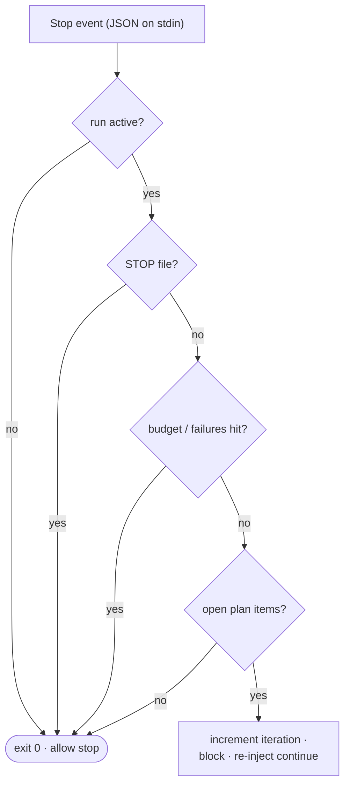

# Hooks

Two hooks implement the engine. Both are installed to `~/.claude/leopold/hooks/`
and wired into `settings.json` by `install.sh`. Both are **no-ops unless a run is
active**, so they are safe to leave installed in every session.

## `stop-continuity.sh` — the Stop hook

Runs when the agent finishes a turn. Contract: read JSON on stdin; print
`{"decision":"block","reason":"..."}` to keep going, or exit 0 to allow the stop.



Fail-open: any unexpected error allows the stop. Continuity is best-effort;
halting is always safe.

## `guard-irreversible.sh` — the PreToolUse hook

Runs before every tool call. Contract: read JSON on stdin; print a
`hookSpecificOutput` with `permissionDecision: "deny"` to block, or exit 0 to
allow. It only adds denials; it never loosens Claude Code's own permissions.

See the policy table in [Guardrails](../guardrails.md).

## Settings wiring

```json
{
  "hooks": {
    "Stop": [
      { "hooks": [ { "type": "command", "command": "~/.claude/leopold/hooks/stop-continuity.sh" } ] }
    ],
    "PreToolUse": [
      { "matcher": "Bash|Edit|Write|MultiEdit|NotebookEdit",
        "hooks": [ { "type": "command", "command": "~/.claude/leopold/hooks/guard-irreversible.sh" } ] }
    ]
  }
}
```

## Event log

Both hooks append structured events to `.leopold/events.jsonl`
(`turn_start`, `stop`, `guard_block`), which `/leopold-status` reads.
