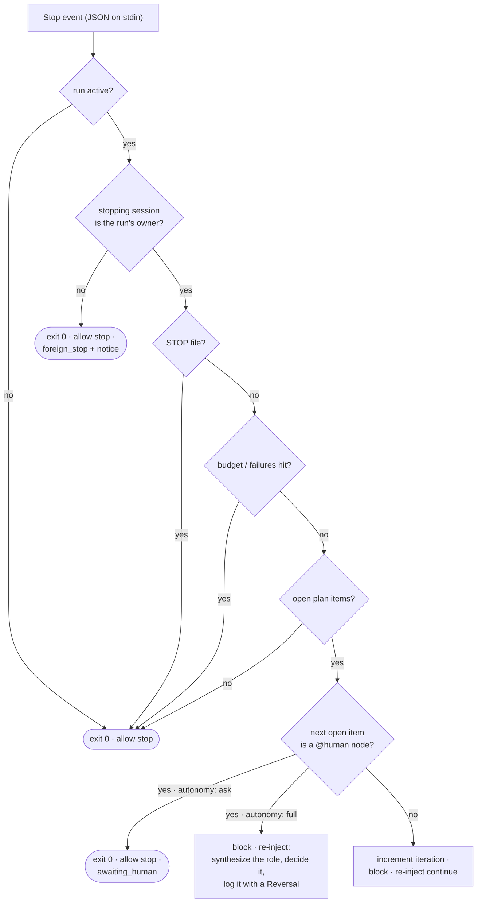

# Hooks

Eleven engine hooks are wired by `install.sh` into each harness it finds —
`settings.json` on Claude Code, `config.toml` on Codex CLI (eight of the eleven scripts
land there, as ten declarations: an API error, a tool failure, a task, a file change and a
config change are not events Codex has). They
live in `<asset home>/hooks/` and are **no-ops unless a run is active** — several ride
more than one event through one script (the compaction checkpoint, the subagent ledger,
the receipts, the evidence gate), `PreToolUse` carries three different hooks (the git lock,
the subagent cap and the evidence gate), and the second-writer watch takes four
`FileChanged` entries for two files because that event's matcher is a literal file name.
The prompt enhancer lives in `<asset home>/enhance/` and is a **no-op until you toggle it
on** — so every one of them is safe to leave installed in every session. The asset home is
`~/.claude/leopold` whenever Claude Code is present and `~/.codex/leopold` on a
Codex-only machine ([Asset Home](leopold-home.md)); the paths below use the Claude
Code layout.

The engine hooks are **the same unmodified scripts on both harnesses** — Codex
reimplemented Claude Code's hook contract nearly field for field, so no portability
layer exists to go wrong. What differs is never the script, only what a harness does
with the reply: Codex honors the permission policy's *deny* and ignores its *allow*,
which `hooks/hook-matrix.tsv` records as `substitute` and `leopold doctor` prints on
that row. See [Claude Code and Codex](../concepts/harnesses.md).

## `stop-continuity.sh` — the Stop hook

Runs when the agent finishes a turn. Contract: read JSON on stdin; print
`{"decision":"block","reason":"..."}` to keep going, or exit 0 to allow the stop.



Fail-open: any unexpected error allows the stop. Continuity is best-effort;
halting is always safe.

### How an allowed stop reaches you

A Stop hook has two output channels, and they are not interchangeable. On the
**block** path (`{"decision":"block","reason":…}` on stdout) the reason goes to the
model. On the **allow** path — `exit 0`, which is every stop above — stderr is
discarded: the harness surfaces a hook's stderr on exit 2, not exit 0.

So every allowed stop that a person has to act on carries its notice as
`systemMessage` on stdout, which the harness renders as a `Stop says: …` notice.
That covers the window roll, the `max_windows` ceiling, the livelock verdict, the
`awaiting_human` pause, and the `state_invalid` fail-safe. The same text still goes
to stderr, for anyone running the hook by hand.

This matters more than it sounds: the roll notice used to be written only to
stderr on the allow path, so a run that rolled its window looked, from the outside,
like `/leopold-run` had quit on its own after one plan item. Nothing was broken —
but nobody was told.

Both harnesses carry the field on the same wire: Claude Code documents
`systemMessage` for all hooks, and Codex deserializes `reason` / `stopReason` /
`suppressOutput` / `systemMessage` on its `StopCommandOutputWire`.

### Session ownership — one session conducts a run

A run is conducted by **one session**. `state.json` records it as `owner`
(`session_id`, `harness`, `engine`, `claimed_at`, `pid`, `transcript_path`), written
once by whichever engine activated the run: `/leopold-run` Step 1 (engine `skill`; the
session id is what the harness exports into every shell it runs — `CLAUDE_CODE_SESSION_ID`
on Claude Code, `CODEX_THREAD_ID` on Codex) or the driver's `initState` (engine `driver`,
no session id). Every Stop payload names the stopping session as `session_id` — the same
string — so the hook makes one comparison before it counts anything:

| Owner in `state.json` | Stopping session | The hook |
| --- | --- | --- |
| matches the payload's `session_id` | the owner | continues and counts, exactly as before |
| another session | not the owner | **allows the stop**, writes nothing to `state.json`, logs one `foreign_stop` event naming both sessions, and tells the person through `systemMessage` who owns the run and how to take the seat (`/leopold-run`) |
| engine `driver` | a session the driver spawned (`LEOPOLD_SDK_WORKER=1` in its environment) | allows the stop silently — the conductor decides what happens next |
| engine `driver` | any other session | allows the stop with a notice naming the driver run and its pid |
| present, but the payload has no `session_id` | unscopable | continues as before and logs `owner_unknown` once (`no_session_in_payload`) |
| absent (a state older than the record) | anyone | continues as before and logs `owner_unknown` once (`no_owner_in_state`) — re-activate with `/leopold-run` to bind the run |

A state written by an older `/leopold-run` carries the session in the top-level
`session_id`; the hook reads that as the owner, so those runs are scoped too. A state an
older driver wrote has an `orchestrator_pid` and no session: that is a driver run.

Why it exists: on 2026-09-02 a second Claude Code window, opened in a checkout for an
unrelated question, was blocked by this hook, charged nine of the run's seventeen
iterations, and ended a producing run with `no_progress` — the executor had never
stopped once. The same rule ends a latent defect in default driver runs, where the hook
fired inside every worker (they run in the project's cwd with the user's hooks loaded)
and told each one to pick the next plan item after its status block
([SDK Worker Hooks](sdk-worker-hooks.md)).

Two more consequences of one owner: the context budget is measured on the owner's
transcript only (a foreign stop no longer overwrites `transcript_path`), and every
event the hook logs carries `session` (the first eight characters of the id).

**One writer at a time.** Every counted stop takes a `mkdir` lock
(`.leopold/.state.lock`) around its read-modify-write of `state.json`; a lock older
than a minute is a dead hook's and is reaped. Before it, two stops in the same second —
or one stop with the hook wired twice — lost an update on every counter. If the lock
cannot be taken within about five seconds the stop is still counted and a `lock_timeout`
event says so: continuity beats counter accuracy.

**The hook owns the counters.** `iteration`, `no_progress`, `progress_sig`, `windows`,
`window_*`, `context_mb`, `transcript_path`, `last_turn` and `owner` are written by the
hook (and by activation) only; the run skill says so in its hard rules.

**Who else reads the owner.** `scripts/leopold-owner.sh` is the one reader shared by
`/leopold-run` (which refuses to start beside a live owner and takes over a stale one;
`--takeover` forces it), `/leopold-stop` (which refuses to end another live session's
run without `--force`), `/leopold-status`, `leopold doctor` and `leopold watch`. Liveness
is any one signal within ten minutes: the owner's harness pid still runs, `last_turn` is
fresh, or the owner's transcript file was modified — so an executor that works one long
turn without stopping never reads as stale.

Verified live on Claude Code 2.1.258 and Codex CLI 0.150.1: the Stop payload's
`session_id` equals the shell's `CLAUDE_CODE_SESSION_ID` / `CODEX_THREAD_ID`; it survives
`claude -p --resume`; Agent-tool subagents fire `SubagentStop` (with the parent's id),
never `Stop`; and a Codex hook process inherits no `CODEX_*` environment at all, so on
Codex the payload is the only identity a hook has.

### The context window roll

Since 0.18.0 the context budget is **a maintenance event, not a death** — the
behavior change is explicit, not implied. The hook measures the transcript against
`max_context_mb` (default 5 MB) every turn:

- **At ~80% of the budget** the turn is blocked with a checkpoint instruction: write
  or merge `.leopold/CHECKPOINT.md` — the one contract in
  `packages/driver/src/checkpoint.ts` (fixed title, seven fixed sections,
  merge-don't-nest, 32768-byte cap that fails loud) — then continue the plan. The
  instruction re-injects every turn in the band; merging is idempotent. A
  `checkpoint_instruction` event is logged.
- **At 100% with no checkpoint yet, the window gets one turn to write one.** The 80%
  band is only ever reached by a window that climbed through it; a run activated
  inside a session *already* past the budget lands straight on the roll and would
  never once be told to checkpoint — exactly the window whose working state is most
  expensive to lose. So the turn is blocked with the checkpoint instruction instead
  of rolling, and a `checkpoint_grace` event is logged. The bound lives in code, not
  in the prompt: `checkpoint_grace_window` records the window that spent it, so a
  window defers at most once and the next turn rolls regardless. That turn does not
  spend the run's one failure rescue — it exists to preserve state, not to re-attempt
  the item.
- **At 100%** the stop happens with the reason it always had —
  `stopped_reason: context_budget`, consumers read it — but the state says roll:
  `windows` is incremented, the plan's checkbox vector is snapshotted, and
  `checkpoint_written` records whether the checkpoint exists (a missing one is named
  loudly in the stop message, never silently). The message always names the resume
  path; a `window_roll` event is logged.
- **Before rolling, two gates run.** The **livelock gate**: each roll records how
  many plan items the ending window closed (checkbox-vector diff vs the
  window-start snapshot); two consecutive windows closing zero items stop the run
  with `no_progress_across_windows` — no resume pointer, nothing relaunches. And
  **`max_windows`** (state > `GUARDRAILS.md` > 10) caps the total windows one run
  may consume; reaching it stops the run with `max_windows`.
- **Budgets survive the roll.** `iteration`/`max_iterations` is the run's ceiling
  across all windows, and spent one-shots (the failure rescue, the deadlock repair)
  stay spent through every reseed. Nothing a roll does refreshes a budget or clears
  `.leopold/STOP`.

Under `continuity: auto` (the default in `GUARDRAILS.md`), `leopold watch` detects
the roll and relaunches the run headless on the harness that owns it (`claude -p` /
`codex exec`), after independently re-checking the kill switch, `max_windows` and
the livelock gate. Under `continuity: manual` nothing relaunches — you resume with
`/leopold-run`. The re-injected continue instruction also carries the window line
(`Window N/max`) and tells the agent to treat the workspace, tool results and
durable state as authoritative over earlier narration. Full story:
[Continuity](../concepts/continuity.md).

A project with no checkpoint and default guardrails behaves exactly as 0.17.x
except that the stop message now names the resume path.

### Node kinds

`PLAN.md` items may declare a node kind (`@node work|gate|human|tool|verify|feedback`, or
the `@gate` / `@human` / `@tool` / `@verify` / `@feedback` shorthands). The in-session engine acts on one
of them — **`@human`** — and what it does with one depends on the judgment posture
([`autonomy`](#autonomy)), never on which harness you are running:

- **`autonomy: full` (the default).** No person is coming, so the hook **blocks the stop**
  and re-injects an instruction to synthesize the role that decision needs — a name, a
  role title, the expertise the item actually demands, what it optimizes for, and the hard
  rules lifted verbatim from `CHARTER.md` — take that role, do the item, and append the
  call to `.leopold/DECISIONS.md` with a **Reversal** line. It logs a `persona` event
  (`fork: "human"`, `engine: "hook"`) and names the item on stderr. The trust boundary is
  unchanged: a role *decides*, it never ships — and the re-injected instruction is precise
  about what actually enforces that. `guard-irreversible.sh` denies `git commit` and
  `git push` (force-push unconditionally) and nothing else; `git tag`, `npm publish`,
  `gh pr create`, `gh release create`, raising a budget in `state.json` and editing
  `GUARDRAILS.md` are **not blocked by any hook** — they are rules the role is told to keep
  itself, and it is told plainly that no hook will stop it. See
  [what the guard does and does not enforce](#what-the-guard-enforces).
- **`autonomy: ask`.** The hook allows the stop with `stopped_reason: awaiting_human`,
  names the item in the stop notice (and on stderr) and logs an `awaiting_human` event. Answer it, mark the item
  `[x]`, and `/leopold-run` resumes.

Either way it matches the driver, which resolves the same node the same way from the same
posture — so a plan means the same thing on both engines.

Every other kind continues exactly as before, and an item that declares no kind is a
`work` node — so a plan written before the grammar existed takes an identical path
through the hook. `packages/driver/test/hook-kinds.test.ts` parses the same plans with
the hook and with the driver's parser and fails the build if they ever disagree.

#### `autonomy: full | ask` { #autonomy }

The posture is read from `LEOPOLD_AUTONOMY` first, then `autonomy:` in
`.leopold/GUARDRAILS.md`, and defaults to `full`. `ask`, `halt` and `human` all spell the
strict posture; a value neither engine recognizes is treated as absent rather than as
`ask`, because an unreadable line must never silently halt a run. This mirrors
`resolveAutonomy()` in `packages/driver/src/config.ts` — the driver's one extra source is
its `--autonomy` / `--ask` flag, which an in-session run has no equivalent of.

## `guard-irreversible.sh` — the PreToolUse hook

Runs before every tool call. Contract: read JSON on stdin; print a
`hookSpecificOutput` with `permissionDecision: "deny"` to block, or exit 0 to
allow. It only adds denials; it never loosens the harness's own permissions.

Codex delivers this event with the same keys — `tool_name` (its shell tool is
reported as `Bash`), `tool_input.command`, `cwd`, `transcript_path` — and honors the
same deny reply.

### What the guard enforces

The scope is deliberately two commands wide, and it matters that you know exactly which
two — under `autonomy: full` a `@human` node is executed by a synthesized role, and that is
where irreversible calls live. Every row below has a case in `scripts/test-guard.sh`.

| Attempt | Guard | Why |
| --- | --- | --- |
| `git commit` (incl. `git -c …`, `git -C …`, `/usr/bin/git`, tabs) | **denied** — unless `.leopold/ALLOW_GIT` exists | the run stages, the human commits |
| `git push` | **denied** — unless `.leopold/ALLOW_PUSH` exists | pushing is the user's call |
| `git push --force` / `-f` | **denied**, always, token or not | nothing a run does justifies it |
| `git tag`, `npm publish`, `cargo publish`, `gh pr create`, `gh release create` | **allowed** | outside the lock's scope |
| `rm -rf`, `git reset --hard`, `git clean -fd`, any other shell command | **allowed** | the worker is free to work |
| editing any file, `.leopold/GUARDRAILS.md` and `state.json` included | **allowed** — the guard only inspects `Bash` | edits are never guarded |

So the run's other rules — do not tag, do not publish, do not open an external PR, never
raise a budget or edit `GUARDRAILS.md` — are **policy, not enforcement**. Leopold tells
every synthesized role exactly that, in those words: a role that believes a hook will catch
`npm publish` has no reason to hold back, and nothing would stop it. If you need those
enforced rather than instructed, deny them in the harness's own permission settings —
`guard-irreversible.sh` never loosens those, it only adds the two git denials.

See the policy table in [Guardrails](../guardrails.md).

## `permission-policy.sh` — the PermissionRequest hook

Runs when the harness would otherwise stop and ask a human for permission. Contract:
read JSON on stdin; print a `hookSpecificOutput` with `decision.behavior` `allow` or
`deny` (a deny carries `message`), or exit 0 with no output to let the harness prompt
exactly as it does today. The reply shape is the one captured live on both harnesses in
[Hook Events](hook-events.md).

**Why it exists.** An autonomous run that stalls on a prompt nobody is watching is a run
that stopped. Under an active run this hook answers the prompt — and the maintainer's
tie-breaker at this seam is autonomy: safety stays where it already was (the `PreToolUse`
guards below, the harness sandbox, the harness's own permission settings), none of which
this hook can loosen. It only ever *adds* an answer where the harness would have waited.

**The one exception is git, and it is not re-implemented here.** A payload that reaches
this hook is handed to `guard-irreversible.sh` as a synthesized `PreToolUse` payload, and
its deny is repeated **verbatim** — the same reason string, `.leopold/ALLOW_GIT` /
`ALLOW_PUSH` honored identically, force-push denied token or not — because it is the same
script deciding. `scripts/test-guard.sh` runs the guard's whole red-team list through the
policy and asserts that every denied command comes back denied *with the guard's own
reason*, and every allowed one allowed.

| Situation | The hook |
| --- | --- |
| no `.leopold/state.json`, or the run is not active | **silence** — the harness prompts as today |
| a session that is not the one conducting the run (ownership read exactly as the Stop hook reads it) | **silence** — a run must never conscript a second window, and that includes granting it autonomy |
| the payload carries no `session_id` while an owner is recorded | **silence** — no proof of ownership, no answer |
| the payload itself does not parse | **deny** — every field below is read out of it, so an allow here would be granted over a request nobody read, with no command left for the git lock to judge |
| `state.json` does not parse | **deny**, naming the file — this is a guard, and a guard that cannot read the run's scope fails closed |
| the git lock is missing or does not decide | **deny** — the allow is granted *on the strength of* the git lock |
| a `Bash` `git commit` / `git push` / force-push the guard denies | **deny**, in the guard's words |
| anything else, under the run's own session | **allow** |

Every decision appends `permission_decided` (tool, command, decision, reason, session) to
`.leopold/events.jsonl`. A git deny leaves two lines — the guard's own `guard_block` and
this hook's `permission_decided` that repeats it. Both are true.

**Per harness** (`hooks/hook-matrix.tsv`, row `permission-policy`): on Claude Code
2.1.259 the event fires under `--permission-prompts none` and **both** replies are
honored; the default `host` prompt never reaches the hook, which costs nothing because a
human is sitting there. On Codex CLI 0.152.1 it fires only under `--approve-for-me` and
only the **deny** half is honored — so on Codex this hook is the git lock's voice at the
prompt and nothing more, and Codex autonomy stays with the driver's sandbox flags. That
is a `substitute` row, not an `available` one, and `leopold doctor` says so on the line.

### The semantic second axis — it may only ever DENY { #permission-semantic-axis }

When the optional [decisions](decisions.md) capability is installed **and** the project has a
`.leopold/decisions/permission.json` catalog, the hook asks one more question before it grants:
*how destructive and hard to reverse is this command?* — a four-level Score.

It is consulted **only on a path that has already decided allow**. It is never reached on a path
heading for a deny, so it cannot grant, soften or reword one. `guard-irreversible.sh` decides git
before this line and its verdict was already repeated verbatim.

It denies only when **both** bounds are cleared: the answer is above its confidence bar *and* the
score is at or above 2.5 on the 0–3 rubric — the top level, "irreversible, or reaches outside this
machine". A merely cautious answer cannot block work. The refusal **quotes the score**, because
"a model said no" is not a reason a person can argue with and "scored it 3 of 3 on *how
destructive and hard to reverse is this command?*" is. Each denial logs `decision_denied` with
the command and the score.

**Every failure keeps today's behaviour, and most cost no network call at all:**

| situation | what happens |
| --- | --- |
| the extension is not installed | allow, silently, exactly as before |
| the project has no permission catalog | allow, silently, exactly as before |
| the provider is unreachable, slow, or answers below the bar | allow, logged as `decision_timeout` |
| a chat-completions provider is configured | the shell seam answers `unsupported`; allow, logged |

The call is bounded by a **hard outer kill**, not just by the seam's own `--timeout-ms`: that
bounds `curl`, not the seam, and a seam stalled on anything else would hold the prompt open —
which is the precise failure this hook exists to end. `timeout(1)` is not portable (macOS ships
without it), so the wait is a bounded poll in the shell. Default budget 2000 ms, overridable with
`LEOPOLD_DECISIONS_TIMEOUT_MS`.

## `compact-checkpoint.sh` — the PreCompact / PostCompact hook

Runs when the harness compacts the context window: once before it rewrites the
transcript, once after. Contract: read JSON on stdin, write nothing but an optional
`systemMessage`. It never blocks a compaction and never answers a tool call — it is a
continuity hook, and it fails **open** on everything it cannot read.

**Why it exists.** The Stop hook already asks the agent to write
`.leopold/CHECKPOINT.md` when the context budget fills. That is an instruction, and a
compaction does not wait for one: the harness decides it, it fires without warning, and
the turn being compacted is exactly the turn with no room left to compose anything. So
on `PreCompact` this hook composes the checkpoint **itself**.

**Composed from durable state, never from the payload.** Claude Code hands `PostCompact`
the whole `compact_summary`; Codex hands it `trigger`, `turn_id` and `model` and nothing
else (both captured in [Hook Events](hook-events.md)). Reading the summary would make
the checkpoint better on one harness and impossible on the other, so nothing here reads
it — and the two harnesses write the **byte-identical** document from the same inputs:

| Section | Composed from |
| --- | --- |
| In-Flight Item | the first open item in `.leopold/PLAN.md` |
| Files and Code | the paths `git status --porcelain` reports (40 max, then one stable line) |
| Errors and Fixes | the run's failure / rescue events in `.leopold/events.jsonl`, selected lexically by event name |
| Decisions This Run | the `.leopold/DECISIONS.md` entries stamped at or after `started_at` |
| Learned Constraints | the prior checkpoint's ledger, carried forward by the merge — this window invents none |
| Current Work | `compaction (<trigger>) at iteration N, window W` |
| Next Step | the open plan item *after* the in-flight one |

**One contract, one format.** The document is the one defined in
`packages/driver/src/checkpoint.ts`: the title `# Leopold Checkpoint`, then exactly seven
`##` sections in a fixed order. An existing checkpoint is **merged, never nested** —
In-Flight Item, Current Work and Next Step are replaced by this window's view; Files and
Code, Errors and Fixes, Decisions This Run and Learned Constraints keep their prior lines,
gain the new ones, and collapse exact duplicates. `packages/driver/test/checkpoint.test.ts`
runs this hook and parses what it wrote with the real `parseCheckpoint()`, then asserts
the bytes equal `serializeCheckpoint()`'s — the bash writer is not a lookalike.

**Content never becomes structure.** Every variable field goes through the hook's
`cp_line()`: whitespace collapsed, and *every* leading `#` run stripped, so a plan item
that reads `## ## Files and Code` or `# # Leopold Checkpoint` lands as body text instead
of a second section or a second title. The hook then re-reads the document it just
composed through the same contract reader it used on the prior file, and a composition
that would not parse is **never** moved into place: `checkpoint_unmergeable` says
`document: composed` and nothing is written. `serializeCheckpoint()` refuses the same
bodies loudly on the TypeScript side — the two writers accept and refuse the same
documents, which is what one contract means.

**The cap fails loud; nothing is ever truncated.** The effective cap is
`min(32768, max(8192, 2% of max_context_mb))`, overridden outright by
`max_checkpoint_kb:` in `GUARDRAILS.md` — the same formula the Stop hook and the driver
compute. A merged document one byte over it writes **nothing**: the previous file is left
byte-identical, `checkpoint_oversize` records the size and the cap, and `systemMessage`
says so. A half-checkpoint that still looks authoritative would seed the next window with
a lie.

| Situation | The hook |
| --- | --- |
| no `.leopold/state.json`, run not active, or `state.json` does not parse | **silence** — a continuity hook fails open |
| a session that is not the one conducting the run (ownership read exactly as the Stop hook reads it) | **silence** — nothing is written for a run this session does not conduct |
| `PreCompact`, owned and active | compose, merge, cap, write; log `compact_checkpoint` and bump `compact_checkpoints` under `.leopold/.state.lock` |
| the merged document is over the cap | **write nothing**, log `checkpoint_oversize` with the byte count, say so |
| `CHECKPOINT.md` exists but does not parse under the contract | **write nothing**, log `checkpoint_unmergeable` (`document: prior`) with the reason, print the contract |
| the document the hook itself composed would not parse back | **write nothing**, log `checkpoint_unmergeable` (`document: composed`) — the writer validates its own output |
| `PostCompact`, owned and active | re-ground the window: the one re-grounding sentence, the brief's four files, and the checkpoint framed as past-window **data**; log `compact_resumed` |

The re-grounding text goes out as `systemMessage` on both harnesses. The probe honored
**no** reply on either harness's compaction events, so `additionalContext` is not used
here: it was never proved read, and Leopold does not code against an unproved field.

**Per harness** (`hooks/hook-matrix.tsv`, row `compact-checkpoint`): all four rows are
`available`. Claude Code 2.1.259 fires both events with `trigger` (`auto` / `manual`),
adding `custom_instructions` before and `compact_summary` after; Codex CLI 0.152.1 fires
both with `trigger`, `turn_id` and `model`. Because the checkpoint is composed from state,
the missing `compact_summary` costs Codex nothing — which is exactly why it must stay
that way.

## `stop-failure.sh` — the StopFailure hook

Runs when a turn dies on an API error. Contract: read JSON on stdin, write nothing but an
optional `systemMessage`. It blocks nothing — it cannot, the turn is already over — and
fails **open** on everything it cannot read.

**Why it exists.** `Stop` **does not fire on a failed turn.** The probe drove real 429,
500, 529 and 401 responses through a stdlib stub and recorded zero `Stop` hooks
([Hook Events](hook-events.md), `StopFailure`). So the hook that counts turns, notices stop
conditions and writes `stopped_reason` never runs, and before this hook such a run stayed
`active: true` in `.leopold/state.json` forever: `leopold watch` showed a live run,
`/leopold-status` showed a live run, and nothing anywhere said the API had refused.
`StopFailure` is the only witness, so it is where the run is marked stopped.

**What it writes — three fields, and nothing else:**

```json
{ "active": false,
  "stopped_reason": "api_error",
  "api_error": { "type": "rate_limit", "at": "2026-09-04T05:12:44Z",
                 "retryable": true, "hint": "…" } }
```

Never `iteration`, `no_progress`, `windows`, `context_mb`, `transcript_path`, `last_turn`
or `owner` — those belong to `stop-continuity.sh` and to activation. A failed turn is not
a turn: charging one would spend a budget on the API's mistake, and `no_progress` would
blame the run for work it was never allowed to do. `scripts/test-hooks.sh` diffs the whole
state file around the hook and fails on any fourth field.

**And it clears the run's tokens** — `.leopold/STOP`, `ALLOW_GIT`, `ALLOW_PUSH`,
`ALLOW_PUBLISH` — because an `api_error` is a *terminal* stop, and every terminal stop in
Leopold clears them: `allow_stop()` in `stop-continuity.sh`, `clearRunTokens()` in the
driver, `/leopold-stop`. Those tokens are scoped to one run by documentation alone and
**nothing clears them at activation**, so leaving them behind is how your per-run
`touch .leopold/ALLOW_GIT` outlives the run it was granted for: the next `/leopold-run` in
that project would start with `git commit` already unlocked, from turn 1, with no human in
the loop. A surviving `STOP` is the mirror image — the resume this hook's own hint
recommends would halt on turn 1 with `kill_switch`. It is a filesystem step, not a state
field, so the three-field invariant above is untouched by it.

**It never ends a run it does not conduct — including a driver's.** Passing the ownership
gate means *this payload may act for the run*; it does not mean *this payload conducts it*.
On a driver-conducted run the session that passes is the driver's spawned **worker**, and a
worker's failed turn is caught and retried by the conductor (`loop.ts` counts one
`consecutive_failures` and keeps dispatching to `max_failures`). Writing `active: false`
from there would take the project-wide git lock **off** mid-run — `guard-irreversible.sh`
gates on exactly that field — while the driver is still conducting and, under `--parallel`,
while sibling workers are live in the same window. So the driver branch writes nothing,
clears nothing, and logs `api_error_observed` instead, the way `stop-continuity.sh` already
exits for that same session class: the conductor decides what happens next. The witness
still matters — the driver's own log records only `item_incomplete`, so without that line a
run that dies of three 429s reads as three bad worker attempts.

**`retryable` is decided lexically from `error`**, which is the field the payload actually
carries (not `error_type`), in the vocabulary the probe captured: `rate_limit` for 429,
`server_error` for 500 **and** 529, `authentication_failed` for 401 and for a missing
login.

| `error` | `retryable` | the hint says |
| --- | --- | --- |
| `rate_limit` | **true** | wait for the limit to clear, then resume with `/leopold-run` |
| `overloaded` | **true** | it clears on its own; retry in a moment |
| `server_error` | **true** | usually transient; retry, and check any gateway in front of the API |
| `authentication_failed` (any `auth`) | **false** | log in again (`claude /login`, `codex login`) — and *only* then take the seat back; a relaunch is never offered, because the credentials are what failed |
| billing / credit / payment | **false** | settle the account or raise the limit first |
| `invalid_request` | **false** | a bug in what was sent, not a transient failure |
| anything else | **false** | Leopold does not recognize it, so it is treated as permanent and nothing resumes on its own |

An unknown class defaults to **not** retryable on purpose: a wrong `true` buys an
automatic relaunch loop against a failure that will never clear, and a wrong `false` costs
one command. The model-facing `last_assistant_message` is never read and never copied into
state — the classification is lexical, over the harness's own error word.

The hint reaches you through `systemMessage` **and** stderr. `StopFailure` was captured in
observe mode only, so no reply field is proved honored there; `systemMessage` is what both
harnesses deserialize everywhere else, and stderr costs nothing.

**Why its timeout is 15, not 5.** The hook is small, but it takes the same `.state.lock`
as the Stop hook, and that lock is budgeted at fifty attempts a tenth of a second apart —
about six seconds of wall clock — before it gives up and writes unlocked. Wired at a five-second timeout the two numbers meet: with a compaction or
a stop holding the lock, the harness kills the hook *inside* the wait — no state write, no
`lock_timeout` event, no `systemMessage`, and a run left `active: true` forever, which is
the one failure this hook exists to end. `hooks/_lib.sh` names the budget
(`LEO_LOCK_TRIES` × `LEO_LOCK_SLEEP`, plus `LEO_LOCK_HEADROOM`) and
`scripts/test-harness-lib.sh` derives from it the minimum timeout every lock-taking spec
must declare, so the arithmetic cannot drift back.

| Situation | The hook |
| --- | --- |
| no `.leopold/state.json`, run not active, or a payload/state that does not parse | **silence** — a continuity hook fails open |
| a session that is not the one conducting the run | **silence** — a stranger's API error never ends a run it does not conduct, and clears none of its tokens |
| any event but `StopFailure` | **silence** |
| a driver run, from the driver's own worker | log `api_error_observed` (`error_type`, `retryable`, `conducted_by`) and say so — **no state write, no token cleared**: the conductor decides |
| owned and active | log `stop_failure` (`error_type`, `retryable`, `session`), mark the run stopped under `.leopold/.state.lock`, clear the run's tokens, and put the hint in front of a person |

**Per harness** (`hooks/hook-matrix.tsv`, row `api-error-stop`): `available` on Claude Code
2.1.259. **`unavailable` on Codex CLI 0.152.1** — an API error ends a Codex run as a plain
stop (`turn.failed` in the `--json` stream, no `Stop` and no failure hook: the probe's stub
ended every turn that way and only `SessionStart`, `UserPromptSubmit` and `SessionEnd`
fired). Nothing is wired there, `extensions/lib/harness.sh` refuses the spec by name, and
`leopold doctor` prints the row rather than letting the gap be discovered. Resume a Codex
run after an API error with `/leopold-run`.

## `subagent-account.sh` — the SubagentStart / SubagentStop ledger

One script on two events (it branches on `hook_event_name`, which both harnesses send),
counting what a run's children cost.

It exists because the meter was lying. `leopold watch` has drawn a **subagents** meter
since 0.9 — value `subagents_spawned`, ceiling `max_subagents` — and *nothing in Leopold
ever wrote that field*: `/leopold-run` seeds it at 0 and never touches it again, and the
driver has no reference to it at all. Every run ever conducted read `0/8`. A zero that
reads as success is worse than an absent number, and the prompt that asked the run to
"keep subagents lean" had nothing counting them.

| Event | What it writes |
| --- | --- |
| `SubagentStart` | `subagents_spawned` +1 under `.leopold/.state.lock`, `subagents[<agent_id>] = {agent_type, started_at}`, and a `subagent_started` line (`agent_id`, `count`, `agent_type`, `session`) |
| `SubagentStop` | `subagents[<agent_id>].stopped_at` and `.transcript_bytes` — the **size of the child's own** `agent_transcript_path`, never the parent's — and a `subagent_stopped` line |

Those two fields are the whole write. Never `iteration`, `no_progress`, `windows`,
`context_mb`, `transcript_path`, `last_turn` or `owner`: a subagent is not a turn, and
charging one would spend a budget on work the run never did. `last_assistant_message` is
in the payload and is deliberately **not** read — it is model-facing text, and a hook that
re-interprets what the model said is exactly what this project's charter forbids. The
child's cost comes from a fact of the filesystem instead.

A stop for an `agent_id` that never started here (the run was activated mid-flight) writes
the entry it can and leaves the count alone; a `stop_hook_active: true` re-firing — what a
second hook's exit 2 produces — overwrites the same fields with the same kind of value.
The ledger never blocks: exit 2 *is* honored on `SubagentStop` on both harnesses, and a
ledger that could refuse a child's stop would spin it forever.

**Why its timeout is 10, not 5.** The increment is a read-modify-write, and four children
can start in the same second. It goes through the same `.state.lock` the Stop hook uses,
whose budget is about six seconds of wall clock; a hook wired at five is killed inside the
wait and counts nothing. `scripts/test-harness-lib.sh` derives that floor from
`hooks/_lib.sh` rather than trusting this paragraph.

**Per harness** (`hooks/hook-matrix.tsv`, row `subagent-accounting`): all four rows
`available`. `agent_id` and `agent_type` on start; `agent_id`,
`agent_transcript_path`, `last_assistant_message` and `stop_hook_active` on stop — the
same keys on Claude Code 2.1.259 and Codex CLI 0.152.1, so `subagents[agent_id]` keys
identically on both and no second shape exists. Codex adds `turn_id` and `model`; neither
is needed.

## `subagent-cap.sh` — the PreToolUse spawn ceiling

The bound that refuses. Wired on `PreToolUse` with matcher
`Agent|Task|collaborationspawn_agent` — Claude Code's spawn tools and the name Codex's
spawn arrives under — and it re-checks `tool_name` itself, so a harness that applied no
matcher at all would still get one answer, and only for a spawn.

Not `SubagentStart`: by the time that fires the child exists, and the probe captured no
honored deny reply there. `PreToolUse`'s `permissionDecision: deny` **was** captured as
honored on both harnesses — the tool never ran and the reason reached the model.

The ceiling comes from `max_subagents` in `.leopold/state.json`, else the
`max_subagents:` line in `.leopold/GUARDRAILS.md`, else **there is no cap** and the hook
prints nothing — a project that never set a ceiling runs byte-for-byte as it did before
this hook existed. `max_subagents: 0` is a real ceiling ("no subagents this run"), the
same way `max_forks: 0` already is; only an absent or non-numeric value means no cap.

| Situation | The hook |
| --- | --- |
| the tool is not a spawn tool | **silence**, before anything else is read — the git lock decides `Bash` |
| no `.leopold/state.json`, run not active, or a session that is not the one conducting the run | **silence** |
| `.leopold/state.json` does not parse | **deny** — the one fail-closed case: a ceiling that lapses because a file is malformed is not a ceiling |
| no `max_subagents` anywhere | **silence** — today's behavior |
| `subagents_spawned` < the ceiling | **silence** |
| `subagents_spawned` ≥ the ceiling | **deny**, naming `count/cap` and where the number came from, and log `subagent_cap_denied` (`tool`, `count`, `cap`, `source`, `session`) |

It only ever denies. A `PreToolUse` hook that answered *allow* would override the git lock
and the persona allowlist, which decide first and whose denials nothing here may loosen.
The denial does not invite the run to raise its own ceiling either — a budget is the
human's to set, in `.leopold/GUARDRAILS.md`, which no run may edit.

A missing `hooks/_lib.sh` is the one place this hook parts company with
`permission-policy.sh`. The policy denies there because it exists to *grant* autonomy and
must not grant it on a gate that never opened. The cap grants nothing: refusing every
spawn in the project because an installed file went missing would stop the run's actual
work, while the git lock (which needs no library) and the permission policy (which denies
loudly for the same cause) already carry the safety half. So it says so on stderr and gets
out of the way.

**Per harness** (`hooks/hook-matrix.tsv`, row `subagent-cap`): `available` on both. The
matcher is one string on both harnesses and each ignores the alternatives it has no tool
for, exactly as the git lock's does.

## `verify-receipt.sh` — the PostToolUse / PostToolUseFailure receipts

The evidence half of *done means verified*. One script on two events (it branches on
`hook_event_name`), and it only ever **records** — the gate that refuses reads what it
writes.

It exists because the rule had no enforcement. "An item is done when a verification
command ran with exit 0 after its last edit" has been in `.leopold/GUARDRAILS.md` and in
the run skill's prose since the beginning, and nothing anywhere compared a test run to an
edit. A rule that lives only in a prompt is a wish.

**The fact the whole hook turns on: there is no exit code in a `PostToolUse` payload on
either harness.** The probe went looking for one and captured none. What it captured
instead is why this hook is wired twice:

| Harness | What the capture shows | What a receipt therefore proves |
| --- | --- | --- |
| Claude Code 2.1.259 | `tool_response` is an object (`stdout`, `stderr`, `interrupted`, …), and **most** non-zero Bash exits do not arrive here at all — they fire `PostToolUseFailure`, whose `error` is the string `Exit code 1` | exit 0 **only** when the response object carries none of the three denials below; the clearly non-zero half rides the failure event |
| Codex CLI 0.152.1 | `PostToolUse` fires for pass and fail alike, `tool_response` is a **string of stdout only** (`""` for both `true` and `false`), and there is no `PostToolUseFailure` at all | the verification **ran** after the last edit — never that it passed |

**The firing of `PostToolUse` is not itself a pass.** Three fields of the Claude Code
response object each deny a clean exit 0, and the probe captured all three:

| Field | What it means | Why it is not a pass |
| --- | --- | --- |
| `returnCodeInterpretation` | the harness re-interpreted a **non-zero** status as "not an error" and named its meaning | the probe's own capture is `grep -c zzz /dev/null` — which exits 1 — arriving at `PostToolUse` with `{"stdout":"0",…,"returnCodeInterpretation":"No matches found"}`, in the same run whose `false` fired `PostToolUseFailure`. The binary settles the rule: the default classifier is `isError = code !== 0`, but `grep`, `rg`, `egrep`, `fgrep`, `find`, `diff`, `test`, `[`, `git grep` and `git diff` use `isError = code >= 2` with the message set **iff** `code === 1`. So the field is present exactly when the exit was 1, never when it was 0 — and a brief verifying with `grep -q "0 failures" build/report.txt` would otherwise record its failure as a pass |
| `interrupted` | the command was cut off mid-run | partial stdout is not a result: a maintainer who Ctrl-Cs a red `make test` has not verified anything |
| `backgroundTaskId` | the command was **launched**, not finished — `run_in_background`, or a timeout that moved it to the background | the object comes back at launch time with an empty `stdout` and `interrupted: false`, otherwise indistinguishable from a clean pass (verified in a live 2.1.260 transcript) |

So the status comes from where the capture shows it, and where the capture shows nothing
the receipt says so: `exit_code: null`, never a 0 rounded up from stdout or inferred from
the event firing. Re-running the command from the hook to learn its exit code is not an
option the charter allows (a hook never runs the suite), and reading an outcome the payload
does not carry would be a fabricated receipt.

**`exit_code` and `outcome` answer two different questions**, which is why a receipt
carries both. `exit_code` is the number the harness reported, or `null` when it reported
none — never inferred. `outcome` is what the payload *proves*, and it alone decides whether
`last_verify_at` moves:

| `outcome` | When | `exit_code` | Moves `last_verify_at` |
| --- | --- | --- | --- |
| `passed` | a response object with none of the three denials | `0` | **yes** |
| `failed` | `PostToolUseFailure` | the number in `error`, else `1` | no |
| `nonzero` | `returnCodeInterpretation` set | `null` — the payload names the meaning, not the number | no |
| `incomplete` | `interrupted`, or `backgroundTaskId` set | `null` | no |
| `ran` | Codex: no status anywhere in any payload | `null` | **yes** |

| Event | Tool | What it writes |
| --- | --- | --- |
| `PostToolUse` | `Edit`, `Write`, `MultiEdit`, `NotebookEdit`, `apply_patch` — on a file **outside `.leopold/`** | `last_edit_at` |
| `PostToolUse` | `Bash` matching a verification entry | `verify_receipts += {command, exit_code, outcome, at, session}` and — on `passed` or `ran` — `last_verify_at`, all under `.leopold/.state.lock`, plus a `verify_recorded` line |
| `PostToolUseFailure` | `Bash` matching a verification entry | the same receipt with the exit code read out of `error` — and **`last_verify_at` does not move** |
| `PostToolUseFailure` | an edit tool | nothing: a failed edit changed nothing |

Those three fields are the whole write. Never `iteration`, `no_progress`, `windows`,
`context_mb`, `transcript_path`, `last_turn` or `owner` — a test run is not a turn.

**The run's own bookkeeping is not work.** `.leopold/` is where the run writes *itself*
down — the plan it ticks, the decisions it logs, the journal, the state file — and no
verification command has ever covered any of it, so an edit there stamps nothing.
`last_edit_at` is the last edit *outside* `.leopold/`. Counting the run's paperwork denied
the turn loop the run skill prescribes on its **correct** path (verify → log the decision
→ tick the box: the log is an edit newer than the receipt), and made the `TaskCompleted`
half unsatisfiable outright, since the tick is itself an edit. A Codex patch that touches
the plan *and* a source file did change the work and stamps; an edit whose path the hook
cannot read stamps too, the strict direction.

**What counts as a verification command** is the `## Verification commands` section of
`.leopold/GUARDRAILS.md`, read lexically: the list items under that heading, until the
next heading. Backticks and bold markers are stripped as markdown, and the trailing
`# comment` is stripped as *shell syntax* — by the same normalizer that reads the command
— so `` - `make test`   # the gate `` is the entry `make test`.

```markdown
## Verification commands
> What counts as evidence that an item is done: one of these ran with exit 0 after the
> item's last edit.
- make hooks-test
- make test
```

**No section, no receipts.** A brief that does not declare one gets no receipts and no
events — nothing says what evidence means here, so nothing is claimed, and a project that
predates this hook behaves exactly as it did. (`last_edit_at` is stamped either way: it is
a fact about the work, not a claim about evidence.)

Matching is lexical and never semantic, and **an entry only counts where it begins a
command**. Both sides go through the **same** normalizer — heredoc *bodies* dropped, shell
comments dropped, tabs and whitespace collapsed, and a command-start marker emitted at the
start of every line and in place of every shell separator (`;`, `&`, `|`, parentheses) —
and an entry matches when its normalized form, which begins with one of those markers,
appears in the command's. `make hooks-test`, `cd sub && make hooks-test`,
`make hooks-test 2>&1` and `echo $(make hooks-test)` all match `- make hooks-test`,
because in each of them the entry begins a command. `ls -la` does not, and neither does
anything that merely *names* the entry:

```bash
echo "- ran make hooks-test after the edit" >> notes.md
git commit -m "make hooks-test green"
cat >> .leopold/DECISIONS.md <<EOF
Verified by:
make hooks-test
EOF
```

Those are arguments and heredoc data, not commands that ran. It matters because appending
to `DECISIONS.md` by heredoc and ticking `PLAN.md` by `echo` is the run's *own* prescribed
loop: with a plain substring search the run could mint its own exit-0 receipts simply by
narrating them, in the one mechanism whose whole purpose is to stop unearned *done*. So
the boundary is required rather than assumed, and the rule is deliberately strict where it
cannot tell — `time make test`, `sudo make test` and `if make test; then` record nothing,
because a missing receipt can only ever make the gate ask for a *later* verification,
never accept an earlier lie. An entry is a literal string and never a glob, so
`- pytest tests/*` matches `pytest tests/*` and never `pytest tests/unit`. The hook never
asks what the model *meant* by a command.

A command **mentioned in a comment** is not a command that ran: `make build # make
hooks-test comes later` and `echo skip; # make hooks-test` match nothing. Comments are
stripped per **line**, the way a shell reads them (a `#` at the start of a line or after
whitespace, to the end of that line), so a multi-line Bash call whose first line is
`# run the suite` still matches on its second, and a `#` inside a token
(`make test URL=http://x#frag`) is not a comment at all. Stripping `#` from the entry but
not from the command was a live false-evidence path in the one mechanism whose whole
purpose is to stop unearned *done*.

**Per harness** (`hooks/hook-matrix.tsv`, rows `verify-receipt`): `PostToolUse`
`available` on Claude Code and **`substitute`** on Codex, `PostToolUseFailure`
`available` on Claude Code and **`unavailable`** on Codex — the second event the matrix
refuses there, after `StopFailure`. On Codex `last_verify_at` therefore means *a
verification command ran*, not *passed*; the receipt keeps the difference visible with
`exit_code: null` and `outcome: ran` — the only null outcome that is evidence, which is
why the stamp turns on the word and not on the number — and `leopold doctor` quotes the
row's note on the Codex line rather
than implying parity. Refusing to move the field there would not make Codex stricter — it
would make the bound unavailable on Codex, which is the opposite of both harnesses or
neither.

The receipt list keeps its most recent 200 entries; `last_verify_at` is a scalar and never
rolls off. Its timeout is 10, not 5, for the same reason the subagent ledger's is: the
append is a read-modify-write under the state lock, and `scripts/test-harness-lib.sh`
derives that floor from `hooks/_lib.sh`.

## `done-gate.sh` — the PreToolUse / TaskCompleted evidence gate

The half of *done means verified* that **refuses**. `verify-receipt.sh` records the two
halves of the sentence — `last_edit_at` and `last_verify_at` — and this reads them back
at the two moments a run claims an item is finished.

One script on two events, because it is one rule. It branches on `hook_event_name` and
answers in that event's own reply shape, both captured live:

| Event | Matcher | The claim it reads | How it refuses |
| --- | --- | --- | --- |
| `PreToolUse` | `Edit\|Write\|MultiEdit\|apply_patch` | an edit of `.leopold/PLAN.md` that turns a `- [ ]` into a `- [x]` | `permissionDecision: deny` — the tool never runs and the reason reaches the model |
| `TaskCompleted` | none | the task itself | exit 2 with the reason on stderr — the task stays pending |

**What it compares.** `last_verify_at` must be *newer* than `last_edit_at` — the last
edit *outside* `.leopold/`, so ticking this plan, logging a decision and writing the
journal never invalidate the receipt they follow. Both stamps are ISO-8601 UTC seconds, so
the comparison is their string order:

| State | Answer |
| --- | --- |
| neither field | allow — nothing has been recorded, so nothing is claimed (a run that predates the receipts hook behaves as it always did) |
| `last_verify_at` only | allow — verified, nothing edited since |
| `last_edit_at` only | **refuse** — edited, never verified |
| both, verify > edit | allow |
| both, verify ≤ edit | **refuse** |

Equal counts as stale on purpose. The stamps are one-second grained, and a guard that
cannot tell which came first inside the same second answers the way that can only ever ask
for a *later* verification, never accept an earlier lie. Re-running the command clears it.

**The flip is read lexically, never semantically.** The hook counts the ticked boxes on
each side of the edit and refuses when the new side has more; it never asks what the model
*meant*. That is what makes all four edit shapes answerable, none of which says "item three
was ticked" anywhere:

| Tool | Old side | New side |
| --- | --- | --- |
| `Edit` | `old_string` | `new_string` |
| `MultiEdit` | every `old_string` in the batch | every `new_string` — one claim, summed |
| `Write` | `.leopold/PLAN.md` as it stands on disk (a `Write` carries no `old_string`) | `content` |
| `apply_patch` (Codex) | the `-` lines of the patch's `.leopold/PLAN.md` hunks | the `+` lines of the same hunks |

A patch that touches the plan **and** a source file is judged by the plan's hunks alone: an
`[x]` in someone's fixture is not a claim of done. An edit that rewords an item, unticks
one, or touches another file goes through untouched — only the tick is gated.

**The reason names the evidence that would clear it**, read out of the same
`## Verification commands` section of `.leopold/GUARDRAILS.md` that mints the receipts,
with each entry's trailing `# comment` stripped exactly as the recorder strips it:

```text
Leopold: this edit ticks a box in .leopold/PLAN.md, and done means verified — last edit
2026-09-04T10:00:00Z, last passing verification none. Nothing has verified this work since
it was last edited, so the claim was refused. run the verification first: make hooks-test;
make test. When one of them passes, tick the box and it goes through. Nothing else is
blocked — only the tick.
```

**No section, no gate.** A brief that never declared what evidence means here cannot have a
claim refused for lacking it, and a state with neither stamp allows exactly as before.
Every refusal writes one `done_denied` line to the event log carrying `via` —
`plan_edit` or `task_completed` — the stamps it compared, and the session.

It **writes no state at all**: the fields it reads belong to `verify-receipt.sh`, so it
never takes the state lock and is wired at 5s. It never runs a verification command either
— the charter's rule is to record cheaply at `PostToolUse` and check the record at the
gate, never to run a suite from a hook.

Being a guard, it **fails closed**: a `state.json` that does not parse denies the claim and
names the file, because nothing can then say anything was verified. (The recorder next door
fails *open* on the same file. Opposite jobs, opposite directions, both deliberate.) That
refusal is scoped to a **claim of done and nothing else** — the claim check and the
no-section pass-through run *before* the state is consulted, so a malformed state file
never refuses an edit of `src/foo.ts`, never refuses a reworded plan item, and never blocks
its own repair (the state file is fixed with the very tools this gate sees). A foreign
session's tick, an inactive run and a project that is not Leopold's are all silent no-ops,
as everywhere else.

**Per harness** (`hooks/hook-matrix.tsv`, rows `done-gate`): the `PreToolUse` gate is
`available` on **both** — Claude Code's `Edit` / `Write` / `MultiEdit`, Codex's
`apply_patch`. `TaskCompleted` is `available` on Claude Code and **`substitute`** on Codex,
which has no task events at all; the matrix gate refuses that spec there by name, the
PLAN.md half carries the whole bound, and `leopold doctor` prints the Codex row as
`done-gate · Codex: … (PreToolUse) — TaskCompleted: unavailable on Codex codex-cli 0.152.1
— …` rather than letting one wired event read as parity.

The run skill still tells the agent to verify before ticking a box. The prompt is the belt;
this is the braces.

## `file-watch.sh` — the FileChanged second-writer detector

**Claude Code only.** The run writes its own record — `.leopold/PLAN.md` is the plan it
ticks, `.leopold/DECISIONS.md` the reasoning it leaves behind — and nothing used to notice
when *something else* wrote them mid-run: a second window, a `sed` in another terminal, an
editor with the file open. The run kept conducting from a plan that had changed under it.
This hook makes that visible. It **warns and never blocks** — a human editing the plan on
purpose is a thing that happens, and the ownership gate already keeps a run to one
executor.

**What it reads.** A `FileChanged` payload is `file_path` + `event` and *nothing else*
([the captures](hook-events.md#filechanged-claude-code)): the session's own `Edit` and
another process's append produce byte-identical shapes. So "was this us?" is a
**correlation, not a payload fact**. `hooks/verify-receipt.sh` stamps
`own_edits[<basename>]` on every edit tool call that touched a file inside `.leopold/` —
the exact complement of its `last_edit_at`, which stays the last edit *outside* `.leopold/`
so the evidence gate is untouched — and a change delivered within **two seconds** of that
stamp is read as the run's own. Measured, not guessed: in the live probe an `Edit`'s
`PostToolUse` landed 0.6 s before its `FileChanged`, every time. The cost is stated rather
than hidden: an external write to a file this run edited less than two seconds ago is not
reported.

The stamp is **validated before it is compared**, and the window is bounded at both ends.
The comparison is lexicographic over ISO strings, so any other value — `"unknown"`,
`"9999-01-01T00:00:00Z"` — would sort at or after the cutoff and silence the detector
*permanently*, which would hand the disarm to exactly the second writer this hook exists to
catch: whoever can append to `.leopold/PLAN.md` can also write one field of
`.leopold/state.json`. So only `YYYY-MM-DDTHH:MM:SSZ` is read as a stamp, a stamp *after
now* is not a record of an edit that already happened, and anything else falls through to
the warning — the direction a detector fails in.

**The wiring is four entries for two files, and that is not tidiable.** `FileChanged`'s
matcher is a *literal file name*. Probed live on Claude Code 2.1.260, one headless session
per wiring:

| Wiring | Fired |
| --- | --- |
| one entry, matcher `PLAN.md\|DECISIONS.md` (alternation) | 0 |
| basename-shaped entries only (`PLAN.md`, `DECISIONS.md`) | 0 |
| path-shaped entries only (`.leopold/PLAN.md`, `.leopold/DECISIONS.md`) | 0 |
| both shapes, per file (four entries) | 8 |

The path-shaped entry **registers** the watch and never fires; the basename-shaped entry
**receives**. Neither works alone and an alternation matches nothing, so a clever regex
here would be a detector that silently detects nothing. Two more facts from the same probe:
every change is delivered **twice** (~11 ms apart) and a `cd` in the session **detaches the
watches** entirely. The two deliveries are two *processes*, so the fold that makes one write
one warning — read the last `external_write` for this file, append only if it is older than
a second — is taken under the run's `.leopold/.state.lock`. Unlocked, the second delivery's
read lands before the first delivery's append and both warn: measured against this hook,
two simultaneous deliveries produced two events in 5/5 trials. That lock is also why the
four entries are wired at a 10 s timeout and the config guard at 5 — a hook that takes the
lock has to be able to finish waiting for it, and `scripts/test-harness-lib.sh` derives
that floor from the budget in `hooks/_lib.sh`.

**`.leopold/state.json` is deliberately not watched.** The run's own hooks are that file's
dominant writers — the Stop hook, the receipts, the subagent ledger and the compaction
checkpoint rewrite it several times a turn, from processes with no tool call and therefore
no stamp to correlate against — so a watch on it would report the run's own bookkeeping as
tampering every turn, and the one signal it exists to carry would be buried in its own
noise. The second-writer bound on `state.json` is already enforced in code, and has been
since the 2026-09-02 incident: ownership is compared on every stop (`foreign_stop`,
`owner_takeover`, `owner_unknown`) and by `scripts/leopold-owner.sh` before a run is
activated.

**What lands.** `external_write` in `.leopold/events.jsonl` with the file, the resolved
path and the session, plus a `systemMessage` telling the run to re-read the file before
acting on it. Nothing is blocked, no state is written (the state lock is taken only to make
the de-duplication atomic, and released), and the file's contents are never read — reporting *that* it changed is the hook's whole job.

**Per harness** (`hooks/hook-matrix.tsv`, rows `file-watch`): `available` on Claude Code,
**`unavailable` on Codex**, which fires no `FileChanged` at all — a second writer on this
run's files is simply not detected there, the matrix gate refuses the specs, and `leopold
doctor` prints `file-watch · Codex: unavailable on Codex codex-cli 0.152.1 — …`.

## `config-guard.sh` — the ConfigChange tamper guard

**Claude Code only.** Every bound Leopold enforces during a run is a hook declared in the
harness's settings — the git lock first among them — so a settings file rewritten mid-run
can disarm the run's guards from inside the run. This is the half of the pair that
**refuses**.

**What it blocks, and what that buys.** Exit 2 blocks the **reload, not the write** —
[measured, not inferred](config-reload-block.md). The event probe could not judge this
one: a `ConfigChange` hook never reaches the session's stream, so there is no
`hook_response` and no exit code to read, and its row says `unobservable`
([`ConfigChange`](hook-events.md#configchange-claude-code)). It was measured separately, by
side effect — three paired runs on Claude Code 2.1.260 in which the session rewrote its own
`.claude/settings.json` to one declaring an extra `PreToolUse` hook and then made one more
tool call: with the guard observing, the new hook fired; with the guard exiting 2, it never
did, and the file on disk kept the edit either way. So the block buys exactly one thing —
the running session does not adopt the new configuration and keeps the wiring it started
with — and the hook logs `config_change_blocked` (source, `file_path`, session) as loudly
as it refuses, because that event is the durable record that the file and the live session
have diverged.

**What passes.** `policy_settings` (the administrator's managed policy: not a run's to
overrule) and `skills` (prompt material, which cannot disarm a guard). Everything else is
refused, **including a `source` this guard has never heard of and a payload with no
`source` at all** — the fail-closed direction, because an unmeasured layer is one whose
blast radius nobody knows. The cost of being wrong is one skipped reload in one session,
said out loud twice; the cost of the other direction is a run whose git lock was replaced
while it was running.

Both hooks are inert without an active run, and silent for a session that does not conduct
this one.

**Per harness** (`hooks/hook-matrix.tsv`, rows `config-guard`): `available` on Claude Code,
**`unavailable` on Codex** — no `ConfigChange` event exists there, so a mid-run edit of
`config.toml` or of the hook wiring is not detected, and `leopold doctor` says so in the
matrix's own words.

## `persona-guard.sh` — the run-scoped persona PreToolUse hook

The one hook in `hooks/` that is **not** part of the always-on wiring above: the
persona conductor wires it (matcher `mcp__.*|WebFetch`, its own
`leopold-persona-guard` managed tag through the same shared writer) only while a
persona run is active, and unwires it at run end. While wired, it checks every
`url` in an MCP tool call or `WebFetch` against the active flow's domain
allowlist and denies anything outside —
before the MCP server receives the call, on both harnesses, verified live. The
hook is additionally inert without an active `.leopold/persona/ACTIVE.json`, so
a stale wire can never bound a normal session. Captured payloads, versions, and
the full policy: [Persona Guard Hooks](persona-guard-hooks.md); red-team suite:
`scripts/test-persona-guard.sh`.

## `enhance.py` — the UserPromptSubmit prompt enhancer

Runs on every prompt you submit (the event takes no matcher, so all gating is
internal). Contract: read the hook JSON on stdin; plain text on stdout is injected
as context next to the raw prompt (plain text, not JSON, so it concatenates safely
with other `UserPromptSubmit` hooks); **always exit 0** — the prompt itself is
never modified or blocked. Codex validates hook stdout as strict JSON, so on that
harness the same text is wrapped in `hookSpecificOutput.additionalContext` instead —
the plain-text form logs `hook: UserPromptSubmit Failed` there and never reaches the
model. The engine detects which harness sent the payload and answers in its dialect.


Fail-open: no `claude` on PATH, timeout, API error, malformed output — nothing is
emitted and the prompt goes through untouched. Full detail (gate table, state,
ledger, the learn loop): [Prompt Enhancer](enhance.md).

## Wiring, per harness

### Claude Code — `~/.claude/settings.json`

```json
{
  "hooks": {
    "Stop": [
      { "hooks": [ { "type": "command", "command": "~/.claude/leopold/hooks/stop-continuity.sh", "timeout": 15 } ] }
    ],
    "PreToolUse": [
      { "matcher": "Bash|Edit|Write|MultiEdit|NotebookEdit",
        "hooks": [ { "type": "command", "command": "~/.claude/leopold/hooks/guard-irreversible.sh", "timeout": 5 } ] },
      { "matcher": "Agent|Task|collaborationspawn_agent",
        "hooks": [ { "type": "command", "command": "~/.claude/leopold/hooks/subagent-cap.sh", "timeout": 5 } ] },
      { "matcher": "Edit|Write|MultiEdit|apply_patch",
        "hooks": [ { "type": "command", "command": "~/.claude/leopold/hooks/done-gate.sh", "timeout": 5 } ] }
    ],
    "PermissionRequest": [
      { "hooks": [ { "type": "command", "command": "~/.claude/leopold/hooks/permission-policy.sh", "timeout": 5 } ] }
    ],
    "PreCompact": [
      { "hooks": [ { "type": "command", "command": "~/.claude/leopold/hooks/compact-checkpoint.sh", "timeout": 10 } ] }
    ],
    "PostCompact": [
      { "hooks": [ { "type": "command", "command": "~/.claude/leopold/hooks/compact-checkpoint.sh", "timeout": 10 } ] }
    ],
    "StopFailure": [
      { "hooks": [ { "type": "command", "command": "~/.claude/leopold/hooks/stop-failure.sh", "timeout": 15 } ] }
    ],
    "SubagentStart": [
      { "hooks": [ { "type": "command", "command": "~/.claude/leopold/hooks/subagent-account.sh", "timeout": 10 } ] }
    ],
    "SubagentStop": [
      { "hooks": [ { "type": "command", "command": "~/.claude/leopold/hooks/subagent-account.sh", "timeout": 10 } ] }
    ],
    "PostToolUse": [
      { "matcher": "Bash|Edit|Write|MultiEdit|NotebookEdit|apply_patch",
        "hooks": [ { "type": "command", "command": "~/.claude/leopold/hooks/verify-receipt.sh", "timeout": 10 } ] }
    ],
    "PostToolUseFailure": [
      { "matcher": "Bash|Edit|Write|MultiEdit|NotebookEdit|apply_patch",
        "hooks": [ { "type": "command", "command": "~/.claude/leopold/hooks/verify-receipt.sh", "timeout": 10 } ] }
    ],
    "TaskCompleted": [
      { "hooks": [ { "type": "command", "command": "~/.claude/leopold/hooks/done-gate.sh", "timeout": 5 } ] }
    ],
    "FileChanged": [
      { "matcher": ".leopold/PLAN.md",
        "hooks": [ { "type": "command", "command": "~/.claude/leopold/hooks/file-watch.sh", "timeout": 10 } ] },
      { "matcher": "PLAN.md",
        "hooks": [ { "type": "command", "command": "~/.claude/leopold/hooks/file-watch.sh", "timeout": 10 } ] },
      { "matcher": ".leopold/DECISIONS.md",
        "hooks": [ { "type": "command", "command": "~/.claude/leopold/hooks/file-watch.sh", "timeout": 10 } ] },
      { "matcher": "DECISIONS.md",
        "hooks": [ { "type": "command", "command": "~/.claude/leopold/hooks/file-watch.sh", "timeout": 10 } ] }
    ],
    "ConfigChange": [
      { "hooks": [ { "type": "command", "command": "~/.claude/leopold/hooks/config-guard.sh", "timeout": 5 } ] }
    ],
    "UserPromptSubmit": [
      { "hooks": [ { "type": "command", "command": "python3 ~/.claude/enhance/enhance.py --event user-prompt", "timeout": 30 } ] }
    ]
  }
}
```

### Codex CLI — `~/.codex/config.toml`

The same hooks, in TOML, inside a marker-delimited managed block that a re-install
replaces and nothing else — minus the ones the matrix refuses on Codex, which is why
`StopFailure` is not here (an API error ends a Codex run as a plain stop), nor is
`PostToolUseFailure` (no tool-failure event) or `TaskCompleted` (no task events at all).
The engine
hooks Codex can fire:

```toml
# >>> leopold (managed) >>>
[[hooks.Stop]]

[[hooks.Stop.hooks]]
type = "command"
command = "/home/you/.claude/leopold/hooks/stop-continuity.sh"
timeout = 15

[[hooks.PreToolUse]]
matcher = "Bash|Edit|Write|MultiEdit|NotebookEdit"

[[hooks.PreToolUse.hooks]]
type = "command"
command = "/home/you/.claude/leopold/hooks/guard-irreversible.sh"
timeout = 5

[[hooks.PermissionRequest]]

[[hooks.PermissionRequest.hooks]]
type = "command"
command = "/home/you/.claude/leopold/hooks/permission-policy.sh"
timeout = 5
[[hooks.PreCompact]]

[[hooks.PreCompact.hooks]]
type = "command"
command = "/home/you/.claude/leopold/hooks/compact-checkpoint.sh"
timeout = 10

[[hooks.PostCompact]]

[[hooks.PostCompact.hooks]]
type = "command"
command = "/home/you/.claude/leopold/hooks/compact-checkpoint.sh"
timeout = 10

[[hooks.SubagentStart]]

[[hooks.SubagentStart.hooks]]
type = "command"
command = "/home/you/.claude/leopold/hooks/subagent-account.sh"
timeout = 10

[[hooks.SubagentStop]]

[[hooks.SubagentStop.hooks]]
type = "command"
command = "/home/you/.claude/leopold/hooks/subagent-account.sh"
timeout = 10

[[hooks.PreToolUse]]
matcher = "Agent|Task|collaborationspawn_agent"

[[hooks.PreToolUse.hooks]]
type = "command"
command = "/home/you/.claude/leopold/hooks/subagent-cap.sh"
timeout = 5

[[hooks.PostToolUse]]
matcher = "Bash|Edit|Write|MultiEdit|NotebookEdit|apply_patch"

[[hooks.PostToolUse.hooks]]
type = "command"
command = "/home/you/.claude/leopold/hooks/verify-receipt.sh"
timeout = 10

[[hooks.PreToolUse]]
matcher = "Edit|Write|MultiEdit|apply_patch"

[[hooks.PreToolUse.hooks]]
type = "command"
command = "/home/you/.claude/leopold/hooks/done-gate.sh"
timeout = 5
# <<< leopold (managed) <<<
```

The prompt enhancer and every extension get their own tagged block
(`# >>> leopold:enhance (managed) >>>` and friends), so each one is installed,
updated and removed without touching the others.

The config is backed up before the merge and the result is validated: a write that
would not parse is rolled back and the block printed for you to paste. Both formats
are produced by one shared writer, `extensions/lib/harness.sh`, so the two harnesses
cannot drift.

!!! warning "Codex hooks are inert until trusted"
    Codex will not execute a hook declared in `config.toml` until you have approved
    it once (`hooks.state."<id>".trusted_hash`) — no error, it simply does not run.
    Approve it in one interactive session, or install Leopold as a Codex plugin,
    which trusts plugin-provided hooks through the install. Headless workers started
    by `leopold run --provider codex` pass `--dangerously-bypass-hook-trust` so they
    arm their own git lock. `leopold doctor` reports which state each harness is in.

### What may be declared, and what the installer tells you

Both blocks above come from one list — `leo_core_hook_specs` in that same writer — and
the writer checks each event against `hooks/hook-matrix.tsv` before declaring it. An
event the target harness cannot fire is refused by name instead of landing as a dead
`[[hooks.<event>]]` table that waits forever:

```text
StopFailure: unavailable on Codex codex-cli 0.152.1 — not wired
```

Only that answer drops a hook, and only the matrix's own **status word** produces it:
`unavailable`, or a `substitute` whose evidence says the event is not on that harness at
all (Codex has no `TaskCompleted`, so the PLAN.md `PreToolUse` gate carries that bound
there). A row that says `available` is wired whatever section it cites as evidence — the
status column is the contract, the anchor is evidence for a human. A matrix that is
missing, unreadable, or that the reader cannot parse means *the question could not be
asked*, so everything is wired and the installer says so loudly — a `chmod` must never be
able to quietly uninstall the git lock. And what the installer prints at the end is what actually **landed**, counted by
the writer: if nothing was declared it says the git lock is not armed, rather than
reporting the list it was handed.

## Every event the harnesses fire

The hooks above ride `Stop`, `PreToolUse`, `PermissionRequest`, `PreCompact`, `PostCompact`,
`StopFailure`, `SubagentStart`, `SubagentStop`, `PostToolUse` and `PostToolUseFailure`. Which of the other documented
lifecycle events actually fire from a headless session on the installed binaries — with
what payload, and honoring which reply — is captured, not assumed:
[Hook Events](hook-events.md) is generated by `scripts/probe-hook-events.sh` from live
runs of both harnesses and records a verbatim payload, or the trigger tried, for every
event in each harness's matrix.

## The capability matrix in `leopold doctor`

`leopold doctor` joins `hooks/hook-matrix.tsv` with the live wiring and prints **one row
per capability per harness that is actually on this machine** — never silence:

| row | what it means |
| --- | --- |
| `verified` | the hook is declared in that harness's config **and** every evidence anchor the matrix cites resolves to a heading of the installed `docs/reference/hook-events.md` |
| `wired` | declared, but the proof is not here — the bound **is** in force. Two problems, two lines, two remedies: the evidence page is not installed at all (`… is not installed (looked in: …); re-run ./install.sh to bring it`), or it is installed and the section the matrix cites has moved (`… has no #<anchor> section; re-run: make probe-hook-events`) |
| `not wired — run ./install.sh` | the matrix says the event fires here and nothing declares it (`persona-guard` is the one exception: it is armed per run) |
| `unavailable on <harness> <probed version> — <note>` | the matrix refuses it here, quoting the row's own note so the cost is stated in words |

The evidence page travels with the hooks: `install.sh` copies `docs/` into the asset
home, and the driver's build vendors it into the npm package
(`packages/driver/scripts/copy-runtime.mjs`), so `verified` is reachable on both install
paths. `scripts/test-doctor-matrix.sh` builds the npm asset home from that script's own
list and fails if the page stops shipping.

A capability the matrix marks `substitute` on a harness *is* wired there — the event fires
with a weaker guarantee — and its row carries the tsv's note on the same line
(`… — substitute on PermissionRequest: …`), so a harness that honors half the reply never
reads as full parity.

One capability's substrate is not a hook at all: `review-lens-roles` is a set of **Codex
agent roles** — one file per driver review lens under `$CODEX_HOME/agents/` (see
[Quality & orchestration](../quality-and-orchestration.md#on-codex-the-lenses-are-native-agent-roles)).
Its Codex row counts those files (`verified (SubagentStart) — 4 role files in …`,
`incomplete — 3/4 … (missing: …)`, or `not installed — run ./install.sh`) and repeats what
the probe proved: `codex exec` cannot run *as* a role, so a headless lens is held read-only
by `--sandbox`. Its Claude Code row states the substitute — there are no role files there,
each lens is the driver's own SDK session — rather than sending a healthy install to look
for a hook that is not supposed to exist.

Above them, one **drift** row per harness whenever the installed binary is not the one the
matrix was probed against — `Claude Code <installed> installed, matrix probed on <probed>
— re-run scripts/probe-hook-events.sh` — because every status below it is a claim about
that version. `scripts/test-doctor-matrix.sh` (under `make doctor-test`) asserts all four
statuses and the drift row hermetically, with stub `claude` / `codex` binaries on `PATH`.

## Event log

The engine hooks append structured events to `.leopold/events.jsonl`
(`turn_start`, `stop`, `guard_block`, `permission_decided`, `stop_failure`, the ownership
events `foreign_stop`, `owner_unknown`, `owner_takeover` and `lock_timeout`, the compaction
events `compact_checkpoint`, `compact_resumed`, `checkpoint_oversize` and
`checkpoint_unmergeable`, the subagent events `subagent_started`, `subagent_stopped` and
`subagent_cap_denied`, the verification receipt `verify_recorded`, the evidence gate's `done_denied`, the
second-writer warning `external_write` and the config guard's `config_change_blocked`,
and the continuity events
`checkpoint_instruction`, `checkpoint_grace`, `window_roll`,
`no_progress_across_windows`, `max_windows`; the watcher adds `window_relaunch`,
`window_relaunch_refused`, `window_relaunch_failed`, `api_error_relaunch` and
`api_error_relaunch_refused`; `persona-guard.sh` adds `persona_guard_block`; and the SDK
driver adds its own — `item_start`, `item_done`, `subagent_spawn`, `hypothesis`,
`failure_rescue`, `failure_rescue_declined`, `merge_conflict`),
which `/leopold-status` reads. The enhancer
logs to its own global ledger instead — `~/.claude/enhance/enhancements.jsonl`,
one line per injection or failed attempt — which `/leopold-enhance learn` mines.

Every event name has an entry in the `EVENTS` registry of `scripts/leopold-watch.py` —
a severity class and a one-line meaning — from which the dashboard's `SEV` map and the
feed's description line are generated. An unregistered event (the driver's own, an
extension's) still renders: the fallback shows its name and its scalar fields, never a
blank row. `scripts/test-watch-events.py` (under `make watch-test`) derives the set of
names every script in `hooks/` emits and fails on any one the registry lacks.
