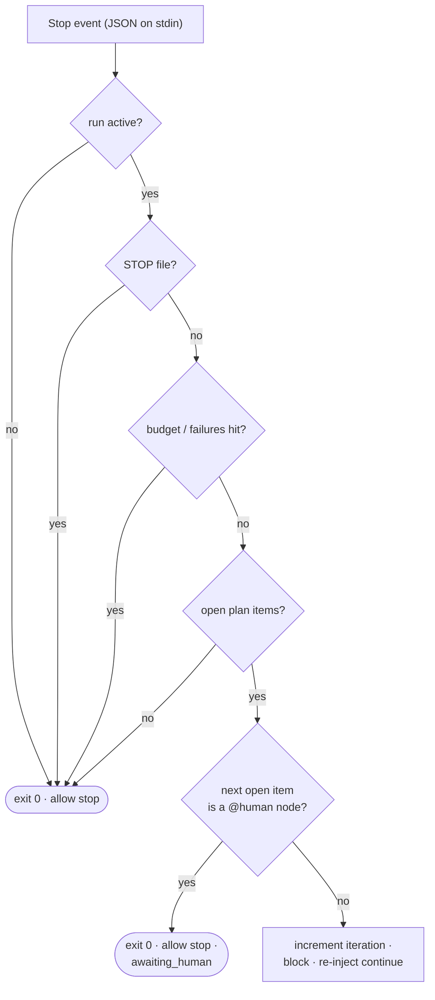
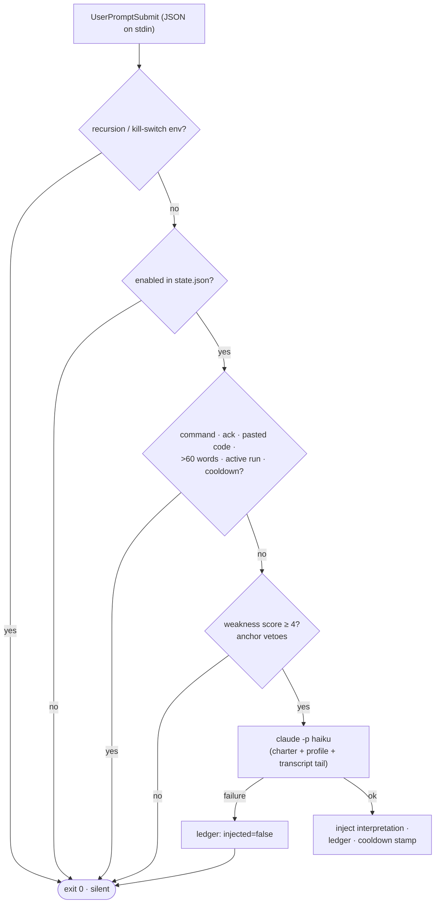

# Hooks

Three hooks are wired by `install.sh` into each harness it finds — `settings.json`
on Claude Code, `config.toml` on Codex CLI. The two engine hooks live in
`<asset home>/hooks/` and are **no-ops unless a run is active**; the prompt
enhancer lives in `<asset home>/enhance/` and is a **no-op until you toggle it
on** — so all three are safe to leave installed in every session. The asset home is
`~/.claude/leopold` whenever Claude Code is present and `~/.codex/leopold` on a
Codex-only machine ([Asset Home](leopold-home.md)); the paths below use the Claude
Code layout.

The two engine hooks are **the same unmodified scripts on both harnesses** — Codex
reimplemented Claude Code's hook contract nearly field for field, so no portability
layer exists to go wrong. See [Claude Code and Codex](../concepts/harnesses.md).

## `stop-continuity.sh` — the Stop hook

Runs when the agent finishes a turn. Contract: read JSON on stdin; print
`{"decision":"block","reason":"..."}` to keep going, or exit 0 to allow the stop.



Fail-open: any unexpected error allows the stop. Continuity is best-effort;
halting is always safe.

### Node kinds

`PLAN.md` items may declare a node kind (`@node work|gate|human|tool|verify|feedback`, or
the `@gate` / `@human` / `@tool` / `@verify` / `@feedback` shorthands). The in-session engine acts on one
of them: when the next open item is a **`@human`** node, the hook allows the stop with
`stopped_reason: awaiting_human`, names the item on stderr and logs an `awaiting_human`
event — the same thing the driver does when a run reaches a human node, so a plan means
the same on both engines. Answer it, mark the item `[x]`, and `/leopold-run` resumes.

Every other kind continues exactly as before, and an item that declares no kind is a
`work` node — so a plan written before the grammar existed takes an identical path
through the hook. `packages/driver/test/hook-kinds.test.ts` parses the same plans with
the hook and with the driver's parser and fails the build if they ever disagree.

## `guard-irreversible.sh` — the PreToolUse hook

Runs before every tool call. Contract: read JSON on stdin; print a
`hookSpecificOutput` with `permissionDecision: "deny"` to block, or exit 0 to
allow. It only adds denials; it never loosens the harness's own permissions.

Codex delivers this event with the same keys — `tool_name` (its shell tool is
reported as `Bash`), `tool_input.command`, `cwd`, `transcript_path` — and honors the
same deny reply.

See the policy table in [Guardrails](../guardrails.md).

## `enhance.py` — the UserPromptSubmit prompt enhancer

Runs on every prompt you submit (the event takes no matcher, so all gating is
internal). Contract: read the hook JSON on stdin; plain text on stdout is injected
as context next to the raw prompt (plain text, not JSON, so it concatenates safely
with other `UserPromptSubmit` hooks); **always exit 0** — the prompt itself is
never modified or blocked. Codex validates hook stdout as strict JSON, so on that
harness the same text is wrapped in `hookSpecificOutput.additionalContext` instead —
the plain-text form logs `hook: UserPromptSubmit Failed` there and never reaches the
model. The engine detects which harness sent the payload and answers in its dialect.



Fail-open: no `claude` on PATH, timeout, API error, malformed output — nothing is
emitted and the prompt goes through untouched. Full detail (gate table, state,
ledger, the learn loop): [Prompt Enhancer](enhance.md).

## Wiring, per harness

### Claude Code — `~/.claude/settings.json`

```json
{
  "hooks": {
    "Stop": [
      { "hooks": [ { "type": "command", "command": "~/.claude/leopold/hooks/stop-continuity.sh" } ] }
    ],
    "PreToolUse": [
      { "matcher": "Bash|Edit|Write|MultiEdit|NotebookEdit",
        "hooks": [ { "type": "command", "command": "~/.claude/leopold/hooks/guard-irreversible.sh" } ] }
    ],
    "UserPromptSubmit": [
      { "hooks": [ { "type": "command", "command": "python3 ~/.claude/enhance/enhance.py --event user-prompt", "timeout": 30 } ] }
    ]
  }
}
```

### Codex CLI — `~/.codex/config.toml`

The same hooks, in TOML, inside a marker-delimited managed block that a re-install
replaces and nothing else. The two engine hooks:

```toml
# >>> leopold (managed) >>>
[[hooks.PreToolUse]]
matcher = "Bash"

[[hooks.PreToolUse.hooks]]
type = "command"
command = "/home/you/.claude/leopold/hooks/guard-irreversible.sh"
timeout = 5

[[hooks.Stop]]

[[hooks.Stop.hooks]]
type = "command"
command = "/home/you/.claude/leopold/hooks/stop-continuity.sh"
timeout = 15
# <<< leopold (managed) <<<
```

The prompt enhancer and every extension get their own tagged block
(`# >>> leopold:enhance (managed) >>>` and friends), so each one is installed,
updated and removed without touching the others.

The config is backed up before the merge and the result is validated: a write that
would not parse is rolled back and the block printed for you to paste. Both formats
are produced by one shared writer, `extensions/lib/harness.sh`, so the two harnesses
cannot drift.

!!! warning "Codex hooks are inert until trusted"
    Codex will not execute a hook declared in `config.toml` until you have approved
    it once (`hooks.state."<id>".trusted_hash`) — no error, it simply does not run.
    Approve it in one interactive session, or install Leopold as a Codex plugin,
    which trusts plugin-provided hooks through the install. Headless workers started
    by `leopold run --provider codex` pass `--dangerously-bypass-hook-trust` so they
    arm their own git lock. `leopold doctor` reports which state each harness is in.

## Event log

The two engine hooks append structured events to `.leopold/events.jsonl`
(`turn_start`, `stop`, `guard_block`), which `/leopold-status` reads. The enhancer
logs to its own global ledger instead — `~/.claude/enhance/enhancements.jsonl`,
one line per injection or failed attempt — which `/leopold-enhance learn` mines.
