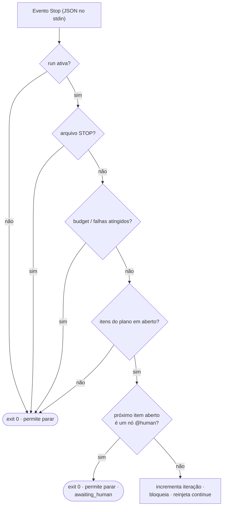

# Hooks

Três hooks são conectados pelo `install.sh` em cada harness que ele encontra —
`settings.json` no Claude Code, `config.toml` no Codex CLI. Os dois hooks do engine
vivem em `<asset home>/hooks/` e são **no-ops a menos que uma run esteja ativa**; o
prompt enhancer vive em `<asset home>/enhance/` e é um **no-op até você ligá-lo** —
então os três podem ficar instalados em toda sessão sem risco. O asset home é
`~/.claude/leopold` sempre que o Claude Code está presente e `~/.codex/leopold` numa
máquina só com Codex ([Asset Home](leopold-home.md)); os caminhos abaixo usam o
layout do Claude Code.

Os dois hooks do engine são **os mesmos scripts, sem modificação, nos dois
harnesses** — o Codex reimplementou o contrato de hooks do Claude Code quase campo a
campo, então não existe camada de portabilidade pra dar errado. Veja
[Claude Code e Codex](../concepts/harnesses.md).

## `stop-continuity.sh` — o hook de Stop

Roda quando o agente termina um turno. Contrato: lê JSON no stdin; imprime
`{"decision":"block","reason":"..."}` para continuar, ou sai com 0 para permitir a parada.



Fail-open: qualquer erro inesperado permite a parada. A continuidade é melhor esforço;
parar é sempre seguro.

### Tipos de nó

Itens do `PLAN.md` podem declarar um tipo de nó (`@node work|gate|human|tool|verify|feedback`,
ou os atalhos `@gate` / `@human` / `@tool` / `@verify` / `@feedback`). O motor in-session age sobre um
deles: quando o próximo item aberto é um nó **`@human`**, o hook permite a parada com
`stopped_reason: awaiting_human`, nomeia o item no stderr e registra um evento
`awaiting_human` — exatamente o que o driver faz ao chegar num nó humano, então um plano
significa a mesma coisa nos dois motores. Responda, marque o item como `[x]` e
`/leopold-run` retoma.

Qualquer outro tipo continua como antes, e um item que não declara tipo é um nó `work` —
ou seja, um plano escrito antes da gramática existir percorre o hook por um caminho
idêntico. O `packages/driver/test/hook-kinds.test.ts` parseia os mesmos planos com o hook
e com o parser do driver e quebra o build se os dois discordarem.

## `guard-irreversible.sh` — o hook de PreToolUse

Roda antes de toda chamada de ferramenta. Contrato: lê JSON no stdin; imprime um
`hookSpecificOutput` com `permissionDecision: "deny"` para bloquear, ou sai com 0 para
permitir. Ele só adiciona negações; nunca afrouxa as permissões do próprio harness.

O Codex entrega esse evento com as mesmas chaves — `tool_name` (a ferramenta de shell
dele é reportada como `Bash`), `tool_input.command`, `cwd`, `transcript_path` — e
respeita a mesma resposta de negação.

Veja a tabela de política em [Guardrails](../guardrails.md).

## `enhance.py` — o prompt enhancer de UserPromptSubmit

Roda a cada prompt que você envia (o evento não aceita matcher, então todo o gating é
interno). Contrato: lê o JSON do hook no stdin; texto puro no stdout é injetado como
contexto ao lado do prompt bruto (texto puro, não JSON, para concatenar com segurança
com outros hooks de `UserPromptSubmit`); **sempre sai com 0** — o prompt em si nunca é
modificado nem bloqueado. O Codex valida o stdout do hook como JSON estrito, então
nesse harness o mesmo texto vai embrulhado em `hookSpecificOutput.additionalContext` —
a forma em texto puro loga `hook: UserPromptSubmit Failed` lá e nunca chega no modelo.
O engine detecta qual harness mandou o payload e responde no dialeto dele.


Fail-open: sem `claude` no PATH, timeout, erro de API, saída malformada — nada é
emitido e o prompt segue intocado. Detalhe completo (tabela do gate, estado,
ledger, o loop de learn): [Prompt Enhancer](enhance.md).

## Wiring, por harness

### Claude Code — `~/.claude/settings.json`

```json
{
  "hooks": {
    "Stop": [
      { "hooks": [ { "type": "command", "command": "~/.claude/leopold/hooks/stop-continuity.sh" } ] }
    ],
    "PreToolUse": [
      { "matcher": "Bash|Edit|Write|MultiEdit|NotebookEdit",
        "hooks": [ { "type": "command", "command": "~/.claude/leopold/hooks/guard-irreversible.sh" } ] }
    ],
    "UserPromptSubmit": [
      { "hooks": [ { "type": "command", "command": "python3 ~/.claude/enhance/enhance.py --event user-prompt", "timeout": 30 } ] }
    ]
  }
}
```

### Codex CLI — `~/.codex/config.toml`

Os mesmos hooks, em TOML, dentro de um bloco gerenciado delimitado por marcadores que
uma reinstalação troca e mais nada. Os dois hooks do engine:

```toml
# >>> leopold (managed) >>>
[[hooks.PreToolUse]]
matcher = "Bash"

[[hooks.PreToolUse.hooks]]
type = "command"
command = "/home/voce/.claude/leopold/hooks/guard-irreversible.sh"
timeout = 5

[[hooks.Stop]]

[[hooks.Stop.hooks]]
type = "command"
command = "/home/voce/.claude/leopold/hooks/stop-continuity.sh"
timeout = 15
# <<< leopold (managed) <<<
```

O prompt enhancer e cada extension ganham o próprio bloco com tag
(`# >>> leopold:enhance (managed) >>>` e companhia), então cada um é instalado,
atualizado e removido sem encostar nos outros.

A config é copiada antes do merge e o resultado é validado: uma escrita que não
parsearia volta atrás e o bloco é impresso pra você colar. Os dois formatos saem de um
único escritor compartilhado, o `extensions/lib/harness.sh`, então os dois harnesses
não têm como divergir.

!!! warning "Hooks do Codex ficam inertes até serem confiados"
    O Codex não executa um hook declarado no `config.toml` enquanto você não aprovar
    uma vez (`hooks.state."<id>".trusted_hash`) — sem erro, ele simplesmente não roda.
    Aprove numa sessão interativa, ou instale o Leopold como plugin do Codex, que
    confia nos hooks vindos do plugin pela própria instalação. Workers headless
    iniciados por `leopold run --provider codex` passam
    `--dangerously-bypass-hook-trust` e armam o próprio trava-git. O `leopold doctor`
    reporta em que estado cada harness está.

## Log de eventos

Os dois hooks do engine anexam eventos estruturados em `.leopold/events.jsonl`
(`turn_start`, `stop`, `guard_block`), que o `/leopold-status` lê. O enhancer, por sua
vez, registra no próprio ledger global — `~/.claude/enhance/enhancements.jsonl`, uma
linha por injeção ou tentativa falha — que o `/leopold-enhance learn` minera.
