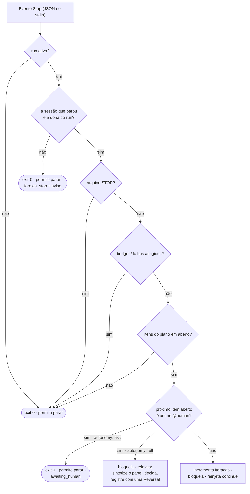
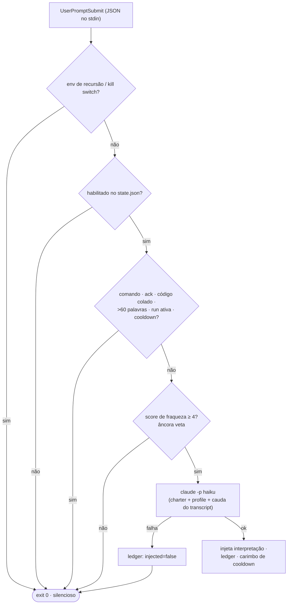

# Hooks

Onze hooks do engine são conectados pelo `install.sh` em cada harness que ele encontra —
`settings.json` no Claude Code, `config.toml` no Codex CLI (oito dos onze scripts chegam
lá, como dez declarações: erro de API, falha de ferramenta, task, mudança de arquivo e
mudança de config não são eventos que o Codex tenha). Eles vivem em `<asset home>/hooks/` e são **no-ops a menos que uma run esteja
ativa** — vários montam em mais de um evento com um script só (o checkpoint de
compactação, o livro-razão de subagents, os recibos, o portão de evidência), o
`PreToolUse` carrega três hooks diferentes (o git lock, o teto de subagents e o portão de
evidência), e a vigília de segundo escritor toma quatro entradas de `FileChanged` para
dois arquivos porque o matcher desse evento é um nome de arquivo literal. O prompt
enhancer vive em `<asset home>/enhance/` e é um **no-op até você ligá-lo** — então todos
podem ficar instalados em toda sessão sem risco. O asset home é
`~/.claude/leopold` sempre que o Claude Code está presente e `~/.codex/leopold` numa
máquina só com Codex ([Asset Home](leopold-home.md)); os caminhos abaixo usam o
layout do Claude Code.

Os hooks do engine são **os mesmos scripts, sem modificação, nos dois
harnesses** — o Codex reimplementou o contrato de hooks do Claude Code quase campo a
campo, então não existe camada de portabilidade pra dar errado. O que muda nunca é o
script, e sim o que cada harness faz com a resposta: o Codex honra o *deny* da política
de permissão e ignora o *allow*, o que o `hooks/hook-matrix.tsv` registra como
`substitute` e o `leopold doctor` imprime na linha. Veja
[Claude Code e Codex](../concepts/harnesses.md).

## `stop-continuity.sh` — o hook de Stop

Roda quando o agente termina um turno. Contrato: lê JSON no stdin; imprime
`{"decision":"block","reason":"..."}` para continuar, ou sai com 0 para permitir a parada.



Fail-open: qualquer erro inesperado permite a parada. A continuidade é melhor esforço;
parar é sempre seguro.

### Como uma parada permitida chega até você

Um hook de Stop tem dois canais de saída, e eles não são intercambiáveis. No caminho
de **bloqueio** (`{"decision":"block","reason":…}` no stdout) o motivo vai para o
modelo. No caminho de **permissão** — `exit 0`, que é toda parada acima — o stderr é
descartado: o harness expõe o stderr de um hook no exit 2, não no exit 0.

Por isso toda parada permitida sobre a qual uma pessoa precisa agir carrega seu aviso
como `systemMessage` no stdout, que o harness renderiza como um aviso `Stop says: …`.
Isso cobre o roll da janela, o teto `max_windows`, o veredito de livelock, a pausa
`awaiting_human` e o fail-safe `state_invalid`. O mesmo texto continua indo para o
stderr, para quem roda o hook na mão.

Isso importa mais do que parece: o aviso de roll era escrito só no
stderr no caminho de permissão, então uma run que rolava a janela parecia, de fora,
que o `/leopold-run` tinha desistido sozinho depois de um item do plano. Nada estava
quebrado — mas ninguém era avisado.

Os dois harnesses carregam o campo no mesmo fio: o Claude Code documenta
`systemMessage` para todos os hooks, e o Codex desserializa `reason` / `stopReason` /
`suppressOutput` / `systemMessage` no seu `StopCommandOutputWire`.

### Propriedade da sessão — uma sessão conduz um run

Um run é conduzido por **uma sessão**. O `state.json` a registra como `owner`
(`session_id`, `harness`, `engine`, `claimed_at`, `pid`, `transcript_path`), escrito uma
vez pelo engine que ativou o run: o Step 1 do `/leopold-run` (engine `skill`; o id da
sessão é o que o harness exporta para todo shell que executa — `CLAUDE_CODE_SESSION_ID`
no Claude Code, `CODEX_THREAD_ID` no Codex) ou o `initState` do driver (engine `driver`,
sem id de sessão). Todo payload de Stop nomeia a sessão que parou como `session_id` — a
mesma string — então o hook faz uma comparação antes de contar qualquer coisa:

| Owner no `state.json` | Sessão que parou | O hook |
| --- | --- | --- |
| igual ao `session_id` do payload | a dona | continua e conta, exatamente como antes |
| outra sessão | não é a dona | **permite a parada**, não escreve nada no `state.json`, registra um evento `foreign_stop` nomeando as duas sessões e avisa a pessoa via `systemMessage` quem é a dona e como assumir o assento (`/leopold-run`) |
| engine `driver` | uma sessão que o driver criou (`LEOPOLD_SDK_WORKER=1` no ambiente) | permite a parada em silêncio — o conductor decide o que vem depois |
| engine `driver` | qualquer outra sessão | permite a parada com um aviso nomeando o run do driver e seu pid |
| presente, mas o payload não tem `session_id` | impossível escopar | continua como antes e registra `owner_unknown` uma vez (`no_session_in_payload`) |
| ausente (um state anterior ao registro) | qualquer uma | continua como antes e registra `owner_unknown` uma vez (`no_owner_in_state`) — reative com `/leopold-run` para vincular o run |

Um state escrito por um `/leopold-run` antigo carrega a sessão no `session_id` de
primeiro nível; o hook o lê como owner, então esses runs também ficam escopados. Um
state que um driver antigo escreveu tem `orchestrator_pid` e nenhuma sessão: é um run do
driver.

Por que existe: em 2026-09-02 uma segunda janela do Claude Code, aberta num checkout
para uma pergunta sem relação, foi bloqueada por este hook, cobrada em nove das dezessete
iterações do run e encerrou um run produtivo com `no_progress` — o executor nunca tinha
parado uma vez sequer. A mesma regra encerra um defeito latente nos runs padrão do
driver, onde o hook disparava dentro de cada worker (eles rodam no cwd do projeto com os
hooks do usuário carregados) e mandava cada um pegar o próximo item do plano depois do
seu status block ([SDK Worker Hooks](sdk-worker-hooks.md)).

Duas consequências a mais de um único owner: o budget de contexto é medido apenas na
transcrição da dona (uma parada estrangeira não sobrescreve mais `transcript_path`), e
todo evento que o hook registra carrega `session` (os oito primeiros caracteres do id).

**Um escritor por vez.** Toda parada contada toma um lock `mkdir`
(`.leopold/.state.lock`) em volta do seu read-modify-write do `state.json`; um lock com
mais de um minuto é de um hook que morreu e é recolhido. Antes dele, duas paradas no
mesmo segundo — ou uma parada com o hook fiado duas vezes — perdiam uma atualização em
cada contador. Se o lock não puder ser tomado em cerca de cinco segundos a parada ainda
é contada e um evento `lock_timeout` diz isso: continuidade vence precisão de contador.

**O hook é o dono dos contadores.** `iteration`, `no_progress`, `progress_sig`,
`windows`, `window_*`, `context_mb`, `transcript_path`, `last_turn` e `owner` são
escritos só pelo hook (e pela ativação); a skill de run diz isso nas regras duras.

**Quem mais lê o owner.** `scripts/leopold-owner.sh` é o único leitor, compartilhado por
`/leopold-run` (que se recusa a iniciar ao lado de uma dona viva e assume uma abandonada;
`--takeover` força), `/leopold-stop` (que se recusa a encerrar o run de outra sessão viva
sem `--force`), `/leopold-status`, `leopold doctor` e `leopold watch`. Vitalidade é
qualquer sinal dentro de dez minutos: o pid do harness da dona ainda roda, `last_turn`
está fresco, ou o arquivo de transcrição da dona foi modificado — então um executor que
trabalha um turno longo sem parar nunca é lido como abandonado.

Verificado ao vivo no Claude Code 2.1.258 e no Codex CLI 0.150.1: o `session_id` do
payload de Stop é igual ao `CLAUDE_CODE_SESSION_ID` / `CODEX_THREAD_ID` do shell;
sobrevive a `claude -p --resume`; subagentes do Agent tool disparam `SubagentStop` (com
o id do pai), nunca `Stop`; e um processo de hook do Codex não herda nenhuma variável
`CODEX_*`, então no Codex o payload é a única identidade que um hook tem.

### O roll da janela de contexto

Desde a 0.18.0 o budget de contexto é **um evento de manutenção, não uma morte** — a
mudança de comportamento é explícita, não implícita. O hook mede o transcript contra
`max_context_mb` (padrão 5 MB) a cada turno:

- **Em ~80% do budget** o turno é bloqueado com uma instrução de checkpoint: escrever
  ou fazer merge do `.leopold/CHECKPOINT.md` — o contrato único em
  `packages/driver/src/checkpoint.ts` (título fixo, sete seções fixas,
  merge-sem-aninhar, teto de 32768 bytes que falha alto) — e então continuar o plano.
  A instrução é reinjetada a cada turno na faixa; o merge é idempotente. Um evento
  `checkpoint_instruction` é logado.
- **Em 100% e ainda sem checkpoint, a janela ganha um turno para escrever um.** A
  faixa de 80% só é alcançada por uma janela que subiu por ela; uma run ativada dentro
  de uma sessão *já* acima do budget cai direto no roll e nunca seria avisada uma vez
  sequer para fazer checkpoint — justamente a janela cujo estado de trabalho é o mais
  caro de perder. Então o turno é bloqueado com a instrução de checkpoint em vez de
  rolar, e um evento `checkpoint_grace` é logado. O limite mora no código, não no
  prompt: `checkpoint_grace_window` registra a janela que o gastou, então uma janela
  adia no máximo uma vez e o turno seguinte rola de todo jeito. Esse turno não gasta o
  resgate de falha da run — ele existe para preservar estado, não para tentar o item
  de novo.
- **Em 100%** a parada acontece com o motivo de sempre —
  `stopped_reason: context_budget`, consumidores o leem — mas o estado diz roll:
  `windows` é incrementado, o vetor de checkboxes do plano é fotografado, e
  `checkpoint_written` registra se o checkpoint existe (um ausente é nomeado em voz
  alta na mensagem de stop, nunca em silêncio). A mensagem sempre nomeia o caminho de
  retomada; um evento `window_roll` é logado.
- **Antes de rolar, dois gates rodam.** O **gate de livelock**: cada roll registra
  quantos itens do plano a janela que termina fechou (diff do vetor de checkboxes
  contra a fotografia do início da janela); duas janelas consecutivas fechando zero
  itens param a run com `no_progress_across_windows` — sem ponteiro de retomada, nada
  relança. E o **`max_windows`** (state > `GUARDRAILS.md` > 10) limita o total de
  janelas que uma run pode consumir; alcançá-lo para a run com `max_windows`.
- **Budgets sobrevivem ao roll.** `iteration`/`max_iterations` é o teto da run somando
  todas as janelas, e one-shots gastos (o resgate de falha, o reparo de deadlock)
  continuam gastos por toda ressemeadura. Nada que um roll faz renova um budget ou
  limpa o `.leopold/STOP`.

Com `continuity: auto` (o padrão no `GUARDRAILS.md`), o `leopold watch` detecta o roll
e relança a run headless no harness dono da sessão (`claude -p` / `codex exec`),
depois de rechecar por conta própria o kill switch, o `max_windows` e o gate de
livelock. Com `continuity: manual` nada relança — você retoma com `/leopold-run`. A
instrução de continue reinjetada também carrega a linha da janela (`Window N/max`) e
manda o agente tratar o workspace, os resultados de ferramentas e o estado durável
como autoridade acima da narração anterior. A história completa:
[Continuidade](../concepts/continuity.md).

Um projeto sem checkpoint e com guardrails padrão se comporta exatamente como na
0.17.x, exceto que a mensagem de stop agora nomeia o caminho de retomada.

### Tipos de nó

Itens do `PLAN.md` podem declarar um tipo de nó (`@node work|gate|human|tool|verify|feedback`,
ou os atalhos `@gate` / `@human` / `@tool` / `@verify` / `@feedback`). O motor in-session age sobre um
deles — **`@human`** — e o que ele faz com um depende da postura de julgamento
([`autonomy`](#autonomy)), nunca do harness em que você está:

- **`autonomy: full` (o padrão).** Ninguém vai vir, então o hook **bloqueia a parada** e
  reinjeta uma instrução para sintetizar o papel que aquela decisão exige — um nome, um
  título de papel, a expertise que o item realmente demanda, o que esse papel otimiza e as
  regras duras copiadas literalmente do `CHARTER.md` — assumir esse papel, fazer o item e
  registrar a decisão em `.leopold/DECISIONS.md` com uma linha **Reversal**. Ele registra
  um evento `persona` (`fork: "human"`, `engine: "hook"`) e nomeia o item no stderr. A
  fronteira de confiança não muda: um papel *decide*, ele nunca publica — e a instrução
  reinjetada é precisa sobre o que de fato garante isso. O `guard-irreversible.sh` nega
  `git commit` e `git push` (force-push sempre) e mais nada; `git tag`, `npm publish`,
  `gh pr create`, `gh release create`, aumentar um budget no `state.json` e editar o
  `GUARDRAILS.md` **não são bloqueados por hook nenhum** — são regras que o papel recebe
  para cumprir sozinho, e ele é avisado com todas as letras de que nenhum hook vai impedi-lo.
  Veja [o que o guard garante e o que não garante](#o-que-o-guard-garante).
- **`autonomy: ask`.** O hook permite a parada com `stopped_reason: awaiting_human`,
  nomeia o item no stderr e registra um evento `awaiting_human`. Responda, marque o item
  como `[x]` e `/leopold-run` retoma.

Nos dois casos ele bate com o driver, que resolve o mesmo nó do mesmo jeito a partir da
mesma postura — então um plano significa a mesma coisa nos dois motores.

Qualquer outro tipo continua como antes, e um item que não declara tipo é um nó `work` —
ou seja, um plano escrito antes da gramática existir percorre o hook por um caminho
idêntico. O `packages/driver/test/hook-kinds.test.ts` parseia os mesmos planos com o hook
e com o parser do driver e quebra o build se os dois discordarem.

#### `autonomy: full | ask` { #autonomy }

A postura é lida primeiro de `LEOPOLD_AUTONOMY`, depois de `autonomy:` no
`.leopold/GUARDRAILS.md`, e o padrão é `full`. `ask`, `halt` e `human` escrevem a postura
estrita; um valor que nenhum motor reconhece é tratado como ausente em vez de como `ask`,
porque uma linha ilegível nunca pode parar uma run em silêncio. Isso espelha o
`resolveAutonomy()` em `packages/driver/src/config.ts` — a única fonte extra do driver é a
flag `--autonomy` / `--ask`, que uma run in-session não tem equivalente.

## `guard-irreversible.sh` — o hook de PreToolUse

Roda antes de toda chamada de ferramenta. Contrato: lê JSON no stdin; imprime um
`hookSpecificOutput` com `permissionDecision: "deny"` para bloquear, ou sai com 0 para
permitir. Ele só adiciona negações; nunca afrouxa as permissões do próprio harness.

O Codex entrega esse evento com as mesmas chaves — `tool_name` (a ferramenta de shell
dele é reportada como `Bash`), `tool_input.command`, `cwd`, `transcript_path` — e
respeita a mesma resposta de negação.

### O que o guard garante

O escopo tem exatamente dois comandos de largura, e importa saber quais dois — sob
`autonomy: full` um nó `@human` é executado por um papel sintetizado, e é justamente ali
que moram as chamadas irreversíveis. Cada linha abaixo tem um caso em
`scripts/test-guard.sh`.

| Tentativa | Guard | Por quê |
| --- | --- | --- |
| `git commit` (incl. `git -c …`, `git -C …`, `/usr/bin/git`, tabs) | **negado** — a não ser que exista `.leopold/ALLOW_GIT` | a run prepara, o humano commita |
| `git push` | **negado** — a não ser que exista `.leopold/ALLOW_PUSH` | dar push é decisão do usuário |
| `git push --force` / `-f` | **negado**, sempre, com token ou sem | nada que uma run faça justifica |
| `git tag`, `npm publish`, `cargo publish`, `gh pr create`, `gh release create` | **permitido** | fora do escopo do lock |
| `rm -rf`, `git reset --hard`, `git clean -fd`, qualquer outro comando | **permitido** | o worker é livre para trabalhar |
| editar qualquer arquivo, incluindo `.leopold/GUARDRAILS.md` e `state.json` | **permitido** — o guard só inspeciona `Bash` | edições nunca são guardadas |

Ou seja: as outras regras da run — não dar tag, não publicar, não abrir PR externo, nunca
aumentar um budget nem editar o `GUARDRAILS.md` — são **política, não garantia**. O Leopold
diz exatamente isso a todo papel sintetizado, com essas palavras: um papel que acredita que
um hook vai barrar o `npm publish` não tem motivo para se segurar, e nada o impediria. Se
você precisa disso garantido em vez de instruído, negue nas permissões do próprio harness —
o `guard-irreversible.sh` nunca as afrouxa, ele só acrescenta as duas negações de git.

Veja a tabela de política em [Guardrails](../guardrails.md).

## `permission-policy.sh` — o hook de PermissionRequest

Roda quando o harness pararia para pedir permissão a um humano. Contrato: lê JSON no
stdin; imprime um `hookSpecificOutput` com `decision.behavior` `allow` ou `deny` (um deny
carrega `message`), ou sai com 0 sem saída nenhuma para o harness perguntar exatamente
como pergunta hoje. O formato da resposta é o capturado ao vivo nos dois harnesses em
[Hook Events](hook-events.md).

**Por que existe.** Uma run autônoma que trava num prompt que ninguém está olhando é uma
run que parou. Com uma run ativa, este hook responde o prompt — e o critério de desempate
do mantenedor aqui é autonomia: a segurança continua onde sempre esteve (os guards de
`PreToolUse` abaixo, o sandbox do harness, as permissões do próprio harness), e nada disso
este hook consegue afrouxar. Ele só *acrescenta* uma resposta onde o harness teria
esperado.

**A única exceção é git, e ela não é reimplementada aqui.** Um payload que chega a este
hook é entregue ao `guard-irreversible.sh` como um payload `PreToolUse` sintetizado, e o
deny dele é repetido **literalmente** — a mesma razão, `.leopold/ALLOW_GIT` /
`ALLOW_PUSH` honrados de forma idêntica, force-push negado com token ou sem — porque é o
mesmo script decidindo. O `scripts/test-guard.sh` passa a lista red-team inteira do guard
pela política e verifica que todo comando negado volta negado *com a razão do próprio
guard*, e todo comando permitido volta permitido.

| Situação | O hook |
| --- | --- |
| sem `.leopold/state.json`, ou run inativa | **silêncio** — o harness pergunta como hoje |
| uma sessão que não é a que conduz a run (propriedade lida exatamente como o hook de Stop lê) | **silêncio** — uma run nunca deve conscrever uma segunda janela, e isso inclui dar autonomia a ela |
| o payload não traz `session_id` e há um owner registrado | **silêncio** — sem prova de propriedade, sem resposta |
| o próprio payload não parseia | **deny** — todo campo abaixo é lido dele, então um allow aqui seria concedido sobre um pedido que ninguém leu, sem comando algum para o git lock julgar |
| `state.json` não parseia | **deny**, nomeando o arquivo — isto é um guard, e um guard que não consegue ler o escopo da run falha fechado |
| o git lock está ausente ou não decide | **deny** — o allow é concedido *na força* do git lock |
| um `git commit` / `git push` / force-push em `Bash` que o guard nega | **deny**, nas palavras do guard |
| qualquer outra coisa, sob a sessão da própria run | **allow** |

Toda decisão anexa `permission_decided` (tool, command, decision, reason, session) em
`.leopold/events.jsonl`. Um deny de git deixa duas linhas — o `guard_block` do próprio
guard e o `permission_decided` deste hook, que o repete. As duas são verdade.

**Por harness** (`hooks/hook-matrix.tsv`, linha `permission-policy`): no Claude Code
2.1.259 o evento dispara sob `--permission-prompts none` e **as duas** respostas são
honradas; o prompt `host` padrão nunca chega ao hook, o que não custa nada porque há um
humano ali. No Codex CLI 0.152.1 ele dispara só sob `--approve-for-me` e apenas a metade
**deny** é honrada — então no Codex este hook é a voz do git lock no prompt e nada além
disso, e a autonomia no Codex continua nas flags de sandbox do driver. Isso é uma linha
`substitute`, não `available`, e o `leopold doctor` diz isso na linha.

## `compact-checkpoint.sh` — o hook de PreCompact / PostCompact

Roda quando o harness compacta a janela de contexto: uma vez antes de reescrever o
transcript, uma vez depois. Contrato: lê JSON no stdin e escreve nada além de um
`systemMessage` opcional. Nunca bloqueia uma compactação e nunca responde uma chamada de
ferramenta — é um hook de continuidade, e falha **aberto** em tudo que não consegue ler.

**Por que existe.** O hook de Stop já pede para o agente escrever
`.leopold/CHECKPOINT.md` quando o orçamento de contexto enche. Isso é uma instrução, e
uma compactação não espera por instrução: quem decide é o harness, ela dispara sem aviso,
e o turno que está sendo compactado é exatamente o turno sem espaço nenhum para compor o
que quer que seja. Então, no `PreCompact`, este hook compõe o checkpoint **sozinho**.

**Composto de estado durável, nunca do payload.** O Claude Code entrega ao `PostCompact`
o `compact_summary` inteiro; o Codex entrega `trigger`, `turn_id` e `model` e mais nada
(os dois capturados em [Hook Events](hook-events.md)). Ler o resumo deixaria o checkpoint
melhor num harness e impossível no outro, então nada aqui o lê — e os dois harnesses
escrevem o documento **idêntico byte a byte** a partir das mesmas entradas:

| Seção | Composta de |
| --- | --- |
| In-Flight Item | o primeiro item aberto em `.leopold/PLAN.md` |
| Files and Code | os caminhos que `git status --porcelain` reporta (40 no máximo, depois uma linha estável) |
| Errors and Fixes | os eventos de falha / resgate da run em `.leopold/events.jsonl`, selecionados lexicalmente pelo nome |
| Decisions This Run | as entradas de `.leopold/DECISIONS.md` carimbadas em ou depois de `started_at` |
| Learned Constraints | o ledger do checkpoint anterior, levado adiante pelo merge — esta janela não inventa nenhum |
| Current Work | `compaction (<trigger>) at iteration N, window W` |
| Next Step | o item aberto do plano *depois* do in-flight |

**Um contrato, um formato.** O documento é o definido em
`packages/driver/src/checkpoint.ts`: o título `# Leopold Checkpoint` e então exatamente
sete seções `##` numa ordem fixa. Um checkpoint existente é **mesclado, nunca aninhado** —
In-Flight Item, Current Work e Next Step são substituídos pela visão desta janela; Files
and Code, Errors and Fixes, Decisions This Run e Learned Constraints mantêm as linhas
anteriores, ganham as novas e colapsam duplicatas exatas. O
`packages/driver/test/checkpoint.test.ts` roda este hook e parseia o que ele escreveu com
o `parseCheckpoint()` de verdade, e então verifica que os bytes são iguais aos do
`serializeCheckpoint()` — o escritor em bash não é um sósia.

**Conteúdo nunca vira estrutura.** Todo campo variável passa pelo `cp_line()` do hook:
espaço em branco colapsado e *toda* sequência de `#` inicial removida, de modo que um
item do plano que diz `## ## Files and Code` ou `# # Leopold Checkpoint` cai como texto do
corpo, e não como uma segunda seção ou um segundo título. Em seguida o hook relê o
documento que acabou de compor com o mesmo leitor de contrato que usou no arquivo
anterior, e uma composição que não parsearia **nunca** é movida para o lugar: o
`checkpoint_unmergeable` diz `document: composed` e nada é escrito. O
`serializeCheckpoint()` recusa os mesmos corpos, em alto e bom som, do lado TypeScript —
os dois escritores aceitam e recusam os mesmos documentos, que é o que significa um só
contrato.

**O teto falha alto; nada é truncado.** O teto efetivo é
`min(32768, max(8192, 2% de max_context_mb))`, sobrescrito de vez por
`max_checkpoint_kb:` no `GUARDRAILS.md` — a mesma fórmula que o hook de Stop e o driver
calculam. Um documento mesclado um byte acima dele escreve **nada**: o arquivo anterior
fica idêntico byte a byte, o `checkpoint_oversize` registra o tamanho e o teto, e o
`systemMessage` diz isso. Meio checkpoint com cara de autoridade semearia a próxima
janela com uma mentira.

| Situação | O hook |
| --- | --- |
| sem `.leopold/state.json`, run inativa, ou `state.json` que não parseia | **silêncio** — um hook de continuidade falha aberto |
| uma sessão que não é a que conduz a run (propriedade lida exatamente como o hook de Stop lê) | **silêncio** — nada é escrito por uma run que esta sessão não conduz |
| `PreCompact`, com run ativa e própria | compõe, mescla, aplica o teto, escreve; loga `compact_checkpoint` e incrementa `compact_checkpoints` sob `.leopold/.state.lock` |
| o documento mesclado passa do teto | **não escreve nada**, loga `checkpoint_oversize` com a contagem de bytes, e diz isso |
| `CHECKPOINT.md` existe mas não parseia sob o contrato | **não escreve nada**, loga `checkpoint_unmergeable` (`document: prior`) com a razão, imprime o contrato |
| o documento que o próprio hook compôs não parsearia de volta | **não escreve nada**, loga `checkpoint_unmergeable` (`document: composed`) — o escritor valida a própria saída |
| `PostCompact`, com run ativa e própria | re-aterra a janela: a única frase de re-grounding, os quatro arquivos do brief, e o checkpoint enquadrado como **dado** de uma janela passada; loga `compact_resumed` |

O texto de re-grounding sai como `systemMessage` nos dois harnesses. A sonda não teve
**nenhuma** resposta honrada nos eventos de compactação de nenhum dos dois, então
`additionalContext` não é usado aqui: nunca foi provado que é lido, e o Leopold não
programa contra campo não provado.

**Por harness** (`hooks/hook-matrix.tsv`, linha `compact-checkpoint`): as quatro linhas
são `available`. O Claude Code 2.1.259 dispara os dois eventos com `trigger` (`auto` /
`manual`), somando `custom_instructions` antes e `compact_summary` depois; o Codex CLI
0.152.1 dispara os dois com `trigger`, `turn_id` e `model`. Como o checkpoint é composto
a partir do estado, o `compact_summary` ausente não custa nada ao Codex — que é
exatamente por que deve continuar assim.

## `stop-failure.sh` — o hook de StopFailure

Roda quando um turno morre num erro de API. Contrato: lê JSON no stdin e escreve nada
além de um `systemMessage` opcional. Não bloqueia nada — nem poderia, o turno já
acabou — e falha **aberto** em tudo que não consegue ler.

**Por que existe.** O `Stop` **não dispara num turno que falhou.** A sonda mandou
respostas 429, 500, 529 e 401 de verdade por um stub de stdlib e registrou zero hooks de
`Stop` ([Hook Events](hook-events.md), `StopFailure`). Ou seja: o hook que conta turnos,
percebe condição de parada e escreve `stopped_reason` nunca roda — e, antes deste hook, um
run desses ficava `active: true` no `.leopold/state.json` para sempre: o `leopold watch`
mostrava um run vivo, o `/leopold-status` mostrava um run vivo, e nada em lugar nenhum
dizia que a API tinha recusado. O `StopFailure` é a única testemunha, então é ali que o
run é marcado como parado.

**O que ele escreve — três campos, e mais nada:**

```json
{ "active": false,
  "stopped_reason": "api_error",
  "api_error": { "type": "rate_limit", "at": "2026-09-04T05:12:44Z",
                 "retryable": true, "hint": "…" } }
```

Nunca `iteration`, `no_progress`, `windows`, `context_mb`, `transcript_path`, `last_turn`
ou `owner` — esses são do `stop-continuity.sh` e da ativação. Um turno que falhou não é um
turno: cobrar um gastaria orçamento no erro da API, e `no_progress` culparia o run por um
trabalho que ele nunca teve permissão de fazer. O `scripts/test-hooks.sh` faz o diff do
arquivo de estado inteiro em volta do hook e falha em qualquer quarto campo.

**E ele limpa os tokens do run** — `.leopold/STOP`, `ALLOW_GIT`, `ALLOW_PUSH`,
`ALLOW_PUBLISH` — porque um `api_error` é uma parada *terminal*, e toda parada terminal do
Leopold limpa esses arquivos: `allow_stop()` no `stop-continuity.sh`, `clearRunTokens()` no
driver, `/leopold-stop`. Esses tokens são escopados a um único run só pela documentação, e
**nada os limpa na ativação** — deixá-los para trás é como o seu `touch .leopold/ALLOW_GIT`
de um run sobrevive ao run para o qual foi concedido: o `/leopold-run` seguinte naquele
projeto começaria com `git commit` já destravado, desde o turno 1, sem nenhum humano no
circuito. Um `STOP` sobrevivente é a imagem espelhada — a retomada que a própria dica deste
hook recomenda pararia no turno 1 com `kill_switch`. É um passo de sistema de arquivos, não
um campo de estado: a invariante dos três campos acima continua intacta.

**Ele nunca encerra um run que não conduz — nem o de um driver.** Passar pelo portão de
posse significa *este payload pode agir pelo run*; não significa *este payload conduz o
run*. Num run conduzido pelo driver, a sessão que passa é o **worker** que o driver criou, e
um turno que falha nesse worker é capturado e repetido pelo condutor (o `loop.ts` conta um
`consecutive_failures` e segue despachando até `max_failures`). Escrever `active: false`
dali tiraria a trava de git do projeto inteiro **no meio do run** — o
`guard-irreversible.sh` decide exatamente por esse campo — enquanto o driver ainda conduz e,
sob `--parallel`, enquanto workers irmãos estão vivos na mesma janela. Então o ramo do
driver não escreve nada, não limpa nada e loga `api_error_observed` no lugar, do mesmo jeito
que o `stop-continuity.sh` já sai para essa mesma classe de sessão: quem decide o que vem a
seguir é o condutor. A testemunha continua importando — o log do próprio driver registra só
`item_incomplete`, então sem essa linha um run que morre de três 429 se lê como três
tentativas ruins do worker.

**O `retryable` é decidido lexicamente a partir de `error`**, que é o campo que o payload
realmente carrega (não `error_type`), no vocabulário que a sonda capturou: `rate_limit`
para 429, `server_error` para 500 **e** 529, `authentication_failed` para 401 e para login
ausente.

| `error` | `retryable` | a dica diz |
| --- | --- | --- |
| `rate_limit` | **true** | espere o limite passar e retome com `/leopold-run` |
| `overloaded` | **true** | passa sozinho; tente de novo daqui a pouco |
| `server_error` | **true** | costuma ser transitório; tente de novo e confira qualquer gateway na frente da API |
| `authentication_failed` (qualquer `auth`) | **false** | faça login de novo (`claude /login`, `codex login`) — e *só então* retome a cadeira; relançar nunca é oferecido, porque quem falhou foi a credencial |
| billing / crédito / pagamento | **false** | acerte a conta ou suba o limite primeiro |
| `invalid_request` | **false** | é bug no que foi enviado, não falha transitória |
| qualquer outra coisa | **false** | o Leopold não reconhece a classe, então trata como permanente e nada retoma sozinho |

Classe desconhecida cai em **não** retryable de propósito: um `true` errado compra um loop
de relançamento automático contra uma falha que nunca vai passar, e um `false` errado custa
um comando. O `last_assistant_message`, que é texto voltado ao modelo, nunca é lido nem
copiado para o estado — a classificação é lexical, sobre a palavra de erro do próprio
harness.

A dica chega até você por `systemMessage` **e** por stderr. O `StopFailure` foi capturado
só em modo observe, então nenhum campo de resposta está provado ali; `systemMessage` é o
que os dois harnesses desserializam em todo o resto, e stderr não custa nada.

**Por que o timeout dele é 15, e não 5.** O hook é pequeno, mas pega o mesmo
`.state.lock` que o hook de Stop, e esse lock tem orçamento de cinquenta tentativas a cada
décimo de segundo — cerca de seis segundos de relógio — antes de desistir e escrever sem
lock. Ligado com timeout de cinco segundos, os dois
números se encontram: com uma compactação ou um stop segurando o lock, o harness mata o
hook *dentro* da espera — nenhuma escrita de estado, nenhum evento `lock_timeout`, nenhum
`systemMessage`, e um run deixado `active: true` para sempre, que é justamente a falha que
este hook existe para encerrar. O `hooks/_lib.sh` nomeia o orçamento (`LEO_LOCK_TRIES` ×
`LEO_LOCK_SLEEP`, mais `LEO_LOCK_HEADROOM`) e o `scripts/test-harness-lib.sh` deriva dele
o timeout mínimo que todo spec que pega o lock precisa declarar, então a conta não volta a
divergir.

| Situação | O hook |
| --- | --- |
| sem `.leopold/state.json`, run inativo, ou payload/estado que não parseia | **silêncio** — hook de continuidade falha aberto |
| uma sessão que não é a que conduz o run | **silêncio** — o erro de API de um estranho nunca encerra um run que ele não conduz, nem limpa token nenhum dele |
| qualquer evento que não seja `StopFailure` | **silêncio** |
| um run do driver, vindo do worker do próprio driver | loga `api_error_observed` (`error_type`, `retryable`, `conducted_by`) e avisa — **sem escrita de estado, sem token limpo**: quem decide é o condutor |
| dono e ativo | loga `stop_failure` (`error_type`, `retryable`, `session`), marca o run como parado sob o `.leopold/.state.lock`, limpa os tokens do run e põe a dica na frente de uma pessoa |

**Por harness** (`hooks/hook-matrix.tsv`, linha `api-error-stop`): `available` no Claude
Code 2.1.259. **`unavailable` no Codex CLI 0.152.1** — no Codex um erro de API encerra o
run como uma parada comum (`turn.failed` no stream `--json`, sem `Stop` e sem hook de
falha: o stub da sonda terminou todo turno assim e só `SessionStart`, `UserPromptSubmit` e
`SessionEnd` dispararam). Nada é plugado lá, o `extensions/lib/harness.sh` recusa o spec
pelo nome, e o `leopold doctor` imprime a linha em vez de deixar a lacuna ser descoberta.
Depois de um erro de API no Codex, retome com `/leopold-run`.

## `subagent-account.sh` — o livro-razão de SubagentStart / SubagentStop

Um script em dois eventos (ele ramifica no `hook_event_name`, que os dois harnesses
enviam), contando o que os filhos de uma run custam.

Ele existe porque o medidor mentia. O `leopold watch` desenha um medidor de **subagents**
desde a 0.9 — valor `subagents_spawned`, teto `max_subagents` — e *nada no Leopold nunca
escreveu esse campo*: o `/leopold-run` o semeia em 0 e nunca mais toca nele, e o driver
não o referencia em lugar nenhum. Toda run já conduzida lia `0/8`. Um zero que se lê como
sucesso é pior que um número ausente, e o prompt que pedia à run pra "manter os subagents
enxutos" não tinha nada contando.

| Evento | O que ele escreve |
| --- | --- |
| `SubagentStart` | `subagents_spawned` +1 sob o `.leopold/.state.lock`, `subagents[<agent_id>] = {agent_type, started_at}`, e uma linha `subagent_started` (`agent_id`, `count`, `agent_type`, `session`) |
| `SubagentStop` | `subagents[<agent_id>].stopped_at` e `.transcript_bytes` — o **tamanho do `agent_transcript_path` do próprio filho**, nunca o do pai — e uma linha `subagent_stopped` |

Esses dois campos são a escrita inteira. Nunca `iteration`, `no_progress`, `windows`,
`context_mb`, `transcript_path`, `last_turn` ou `owner`: um subagent não é um turno, e
cobrar um gastaria orçamento por trabalho que a run nunca fez. O `last_assistant_message`
está no payload e é deliberadamente **não** lido — é texto voltado ao modelo, e um hook
que reinterpreta o que o modelo disse é exatamente o que o charter deste projeto proíbe.
O custo do filho vem de um fato do sistema de arquivos.

Um stop de um `agent_id` que nunca começou aqui (a run foi ativada no meio) escreve a
entrada que consegue e não mexe na contagem; um re-disparo com `stop_hook_active: true` —
o que o exit 2 de um segundo hook produz — sobrescreve os mesmos campos com o mesmo tipo
de valor. O livro-razão nunca bloqueia: exit 2 *é* honrado no `SubagentStop` nos dois
harnesses, e um livro-razão capaz de recusar a parada de um filho o giraria pra sempre.

**Por que o timeout é 10, não 5.** O incremento é um read-modify-write, e quatro filhos
podem começar no mesmo segundo. Ele passa pelo mesmo `.state.lock` do hook de Stop, cujo
orçamento é de uns seis segundos de relógio; um hook conectado com 5 é morto dentro da
espera e não conta nada. O `scripts/test-harness-lib.sh` deriva esse piso do
`hooks/_lib.sh` em vez de confiar neste parágrafo.

**Por harness** (`hooks/hook-matrix.tsv`, linha `subagent-accounting`): as quatro linhas
`available`. `agent_id` e `agent_type` no start; `agent_id`, `agent_transcript_path`,
`last_assistant_message` e `stop_hook_active` no stop — as mesmas chaves no Claude Code
2.1.259 e no Codex CLI 0.152.1, então `subagents[agent_id]` indexa igual nos dois e não
existe uma segunda forma. O Codex ainda manda `turn_id` e `model`; nenhum dos dois é
necessário.

## `subagent-cap.sh` — o teto de spawn em PreToolUse

O bound que recusa. Conectado em `PreToolUse` com matcher
`Agent|Task|collaborationspawn_agent` — as ferramentas de spawn do Claude Code e o nome
sob o qual o spawn do Codex chega — e ele re-checa o `tool_name` sozinho, então um harness
que não aplicasse matcher nenhum ainda receberia uma resposta, e só para um spawn.

Não `SubagentStart`: quando aquele dispara o filho já existe, e o probe não capturou
nenhuma resposta de deny honrada lá. O `permissionDecision: deny` do `PreToolUse` **foi**
capturado como honrado nos dois harnesses — a ferramenta não rodou e a razão chegou ao
modelo.

O teto vem do `max_subagents` no `.leopold/state.json`, senão da linha `max_subagents:` no
`.leopold/GUARDRAILS.md`, senão **não há teto** e o hook não imprime nada — um projeto que
nunca definiu um teto roda byte a byte como rodava antes deste hook existir.
`max_subagents: 0` é um teto de verdade ("nenhum subagent nesta run"), do mesmo jeito que
`max_forks: 0` já é; só um valor ausente ou não numérico significa sem teto.

| Situação | O hook |
| --- | --- |
| a ferramenta não é de spawn | **silêncio**, antes de qualquer outra leitura — o `Bash` é decidido pelo git lock |
| sem `.leopold/state.json`, run inativa, ou uma sessão que não conduz esta run | **silêncio** |
| o `.leopold/state.json` não parseia | **deny** — o único caso fail-closed: um teto que caduca porque um arquivo está malformado não é um teto |
| nenhum `max_subagents` em lugar nenhum | **silêncio** — o comportamento de hoje |
| `subagents_spawned` < o teto | **silêncio** |
| `subagents_spawned` ≥ o teto | **deny**, nomeando `count/cap` e de onde veio o número, e loga `subagent_cap_denied` (`tool`, `count`, `cap`, `source`, `session`) |

Ele só nega. Um hook de `PreToolUse` que respondesse *allow* passaria por cima do git lock
e da allowlist de persona, que decidem primeiro e cujas negativas nada aqui pode afrouxar.
A negativa também não convida a run a levantar o próprio teto — orçamento é do humano, no
`.leopold/GUARDRAILS.md`, que nenhuma run pode editar.

Um `hooks/_lib.sh` ausente é o único ponto em que este hook se separa do
`permission-policy.sh`. A política nega ali porque existe pra *conceder* autonomia e não
pode concedê-la sobre um portão que nunca abriu. O cap não concede nada: recusar todo
spawn do projeto porque um arquivo instalado sumiu pararia o trabalho de verdade da run,
enquanto o git lock (que não precisa da biblioteca) e a política de permissão (que nega
alto pela mesma causa) já carregam a metade de segurança. Então ele diz isso no stderr e
sai da frente.

**Por harness** (`hooks/hook-matrix.tsv`, linha `subagent-cap`): `available` nos dois. O
matcher é uma string só nos dois harnesses e cada um ignora as alternativas para as quais
não tem ferramenta, exatamente como o do git lock.

## `verify-receipt.sh` — os recibos de PostToolUse / PostToolUseFailure

A metade de evidência do *pronto significa verificado*. Um script em dois eventos (ele
ramifica em `hook_event_name`), e ele apenas **registra** — o gate que recusa lê o que
ele escreve.

Ele existe porque a regra não tinha enforcement. "Um item está pronto quando um comando de
verificação rodou com exit 0 depois da última edição dele" está em
`.leopold/GUARDRAILS.md` e na prosa da skill do run desde o começo, e nada em lugar nenhum
comparava uma rodada de teste com uma edição. Uma regra que vive só num prompt é um desejo.

**O fato do qual o hook inteiro depende: não existe exit code num payload de `PostToolUse`
em nenhum dos dois harnesses.** A probe foi procurar e não capturou nenhum. O que ela
capturou no lugar é o motivo de este hook ser conectado duas vezes:

| Harness | O que a captura mostra | O que um recibo prova |
| --- | --- | --- |
| Claude Code 2.1.259 | `tool_response` é um objeto (`stdout`, `stderr`, `interrupted`, …), e a **maioria** dos exits não-zero de Bash nem chega aqui — eles disparam `PostToolUseFailure`, cujo `error` é a string `Exit code 1` | exit 0 **apenas** quando o objeto de resposta não carrega nenhuma das três negações abaixo; a metade claramente não-zero monta no evento de falha |
| Codex CLI 0.152.1 | `PostToolUse` dispara para sucesso e falha igualmente, `tool_response` é uma **string só com stdout** (`""` tanto para `true` quanto para `false`), e não existe `PostToolUseFailure` | que a verificação **rodou** depois da última edição — nunca que passou |

**O disparo de `PostToolUse` não é, por si só, um sucesso.** Três campos do objeto de
resposta do Claude Code negam cada um um exit 0 limpo, e a probe capturou os três:

| Campo | O que significa | Por que não é um sucesso |
| --- | --- | --- |
| `returnCodeInterpretation` | o harness reinterpretou um status **não-zero** como "não é erro" e nomeou o significado dele | a captura da própria probe é `grep -c zzz /dev/null` — que sai com 1 — chegando ao `PostToolUse` com `{"stdout":"0",…,"returnCodeInterpretation":"No matches found"}`, na mesma rodada cujo `false` disparou `PostToolUseFailure`. O binário resolve a regra: o classificador padrão é `isError = code !== 0`, mas `grep`, `rg`, `egrep`, `fgrep`, `find`, `diff`, `test`, `[`, `git grep` e `git diff` usam `isError = code >= 2` com a mensagem preenchida **sse** `code === 1`. Então o campo está presente exatamente quando o exit foi 1, nunca quando foi 0 — e um brief que verifica com `grep -q "0 failures" build/report.txt` registraria a falha dele como sucesso |
| `interrupted` | o comando foi cortado no meio | stdout parcial não é resultado: quem dá Ctrl-C num `make test` vermelho não verificou nada |
| `backgroundTaskId` | o comando foi **lançado**, não terminado — `run_in_background`, ou um timeout que o mandou para segundo plano | o objeto volta no momento do lançamento com `stdout` vazio e `interrupted: false`, de resto indistinguível de um sucesso limpo (verificado num transcript vivo do 2.1.260) |

Então o status vem de onde a captura mostra, e onde a captura não mostra nada o recibo diz
isso: `exit_code: null`, nunca um 0 arredondado a partir do stdout nem inferido do disparo
do evento. Re-rodar o comando dentro do hook para descobrir o exit code não é uma opção que
o charter permita (um hook nunca roda a suíte), e ler um resultado que o payload não
carrega seria um recibo forjado.

**`exit_code` e `outcome` respondem a duas perguntas diferentes**, por isso um recibo
carrega os dois. `exit_code` é o número que o harness reportou, ou `null` quando ele não
reportou nenhum — nunca inferido. `outcome` é o que o payload *prova*, e só ele decide se
`last_verify_at` se move:

| `outcome` | Quando | `exit_code` | Move `last_verify_at` |
| --- | --- | --- | --- |
| `passed` | um objeto de resposta sem nenhuma das três negações | `0` | **sim** |
| `failed` | `PostToolUseFailure` | o número no `error`, senão `1` | não |
| `nonzero` | `returnCodeInterpretation` presente | `null` — o payload nomeia o significado, não o número | não |
| `incomplete` | `interrupted`, ou `backgroundTaskId` presente | `null` | não |
| `ran` | Codex: nenhum status em payload nenhum | `null` | **sim** |

| Evento | Ferramenta | O que escreve |
| --- | --- | --- |
| `PostToolUse` | `Edit`, `Write`, `MultiEdit`, `NotebookEdit`, `apply_patch` — num arquivo **fora de `.leopold/`** | `last_edit_at` |
| `PostToolUse` | `Bash` que casa com uma entrada de verificação | `verify_receipts += {command, exit_code, outcome, at, session}` e — em `passed` ou `ran` — `last_verify_at`, tudo sob `.leopold/.state.lock`, mais uma linha `verify_recorded` |
| `PostToolUseFailure` | `Bash` que casa com uma entrada de verificação | o mesmo recibo com o exit code lido do `error` — e **`last_verify_at` não se move** |
| `PostToolUseFailure` | uma ferramenta de edição | nada: uma edição que falhou não mudou nada |

Esses três campos são a escrita inteira. Nunca `iteration`, `no_progress`, `windows`,
`context_mb`, `transcript_path`, `last_turn` ou `owner` — uma rodada de teste não é um turno.

**A papelada do próprio run não é trabalho.** `.leopold/` é onde o run escreve a *si
mesmo* — o plano que ele marca, as decisões que registra, o journal, o arquivo de estado —
e nenhum comando de verificação jamais cobriu nada disso, então uma edição ali não carimba
nada. `last_edit_at` é a última edição *fora* de `.leopold/`. Contar a papelada do run
recusava o loop de turno que a skill de run prescreve no seu caminho **correto**
(verificar → registrar a decisão → marcar a caixinha: o registro é uma edição mais nova que
o recibo), e tornava a metade do `TaskCompleted` insatisfazível de vez, já que a marcação é
ela mesma uma edição. Um patch do Codex que toca o plano *e* um arquivo de código mudou o
trabalho e carimba; uma edição cujo caminho o hook não consegue ler também carimba, a
direção estrita.

**O que conta como comando de verificação** é a seção `## Verification commands` do
`.leopold/GUARDRAILS.md`, lida lexicalmente: os itens de lista sob aquele título, até o
próximo título. Crases e marcadores de negrito são removidos como markdown, e o
`# comentário` no fim é removido como *sintaxe de shell* — pelo mesmo normalizador que lê o
comando — então `` - `make test`   # o gate `` é a entrada `make test`.

```markdown
## Verification commands
> What counts as evidence that an item is done: one of these ran with exit 0 after the
> item's last edit.
- make hooks-test
- make test
```

**Sem seção, sem recibos.** Um brief que não declara uma não recebe recibo nem evento —
nada diz o que evidência significa ali, então nada é afirmado, e um projeto anterior a
este hook se comporta exatamente como antes. (`last_edit_at` é carimbado dos dois jeitos:
é um fato sobre o trabalho, não uma afirmação sobre evidência.)

O casamento é lexical e nunca semântico, e **uma entrada só conta onde ela começa um
comando**. Os dois lados passam pelo **mesmo** normalizador — *corpos* de heredoc
removidos, comentários de shell removidos, tabs e espaços colapsados, e um marcador de
início de comando emitido no começo de cada linha e no lugar de cada separador de shell
(`;`, `&`, `|`, parênteses) — e uma entrada casa quando sua forma normalizada, que começa
com um desses marcadores, aparece na do comando. `make hooks-test`,
`cd sub && make hooks-test`, `make hooks-test 2>&1` e `echo $(make hooks-test)` casam com
`- make hooks-test`, porque em cada um deles a entrada começa um comando. `ls -la` não
casa, e nada que apenas *cite* a entrada casa:

```bash
echo "- ran make hooks-test after the edit" >> notes.md
git commit -m "make hooks-test green"
cat >> .leopold/DECISIONS.md <<EOF
Verified by:
make hooks-test
EOF
```

Aqueles são argumentos e dados de heredoc, não comandos que rodaram. Isso importa porque
acrescentar ao `DECISIONS.md` por heredoc e marcar o `PLAN.md` por `echo` é o *próprio*
laço que a run executa: com uma busca por substring simples a run poderia cunhar seus
próprios recibos com exit 0 apenas narrando-os, no único mecanismo cujo propósito inteiro é
impedir um *pronto* não merecido. Por isso a fronteira é exigida em vez de suposta, e a
regra é deliberadamente estrita onde não consegue decidir — `time make test`,
`sudo make test` e `if make test; then` não registram nada, porque um recibo que falta só
pode fazer o gate pedir uma verificação *mais nova*, nunca aceitar uma mentira mais velha.
Uma entrada é uma string literal e nunca um glob, então `- pytest tests/*` casa com
`pytest tests/*` e nunca com `pytest tests/unit`. O hook nunca pergunta o que o modelo
*quis dizer* com um comando.

Um comando **mencionado num comentário** não é um comando que rodou: `make build # make
hooks-test comes later` e `echo skip; # make hooks-test` não casam com nada. Comentários
são removidos por **linha**, do jeito que um shell os lê (um `#` no início de uma linha ou
depois de espaço, até o fim daquela linha), então uma chamada Bash multilinha cuja primeira
linha é `# run the suite` ainda casa na segunda, e um `#` dentro de um token
(`make test URL=http://x#frag`) não é comentário nenhum. Remover `#` da entrada mas não do
comando era um caminho vivo de evidência falsa no único mecanismo cujo propósito inteiro é
impedir um *pronto* não merecido.

**Por harness** (`hooks/hook-matrix.tsv`, linhas `verify-receipt`): `PostToolUse`
`available` no Claude Code e **`substitute`** no Codex, `PostToolUseFailure` `available`
no Claude Code e **`unavailable`** no Codex — o segundo evento que a matriz recusa lá,
depois do `StopFailure`. No Codex, portanto, `last_verify_at` significa *um comando de
verificação rodou*, não *passou*; o recibo mantém a diferença visível com
`exit_code: null` e `outcome: ran` — o único outcome nulo que é evidência, e é por isso que
o carimbo depende da palavra e não do número —, e o `leopold doctor` cita a nota da linha
no Codex em vez de sugerir
paridade. Recusar mover o campo lá não deixaria o Codex mais rígido — deixaria o bound
indisponível no Codex, o oposto de os dois harnesses ou nenhum.

A lista de recibos guarda as 200 entradas mais recentes; `last_verify_at` é um escalar e
nunca sai. O timeout é 10, não 5, pelo mesmo motivo do livro-razão de subagents: o append é
um read-modify-write sob o lock de estado, e o `scripts/test-harness-lib.sh` deriva esse
piso do `hooks/_lib.sh`.

## `done-gate.sh` — o gate de evidência em PreToolUse / TaskCompleted

A metade do *pronto significa verificado* que **recusa**. O `verify-receipt.sh` registra as
duas metades da frase — `last_edit_at` e `last_verify_at` — e este aqui as lê de volta nos
dois momentos em que um run declara um item terminado.

Um script em dois eventos, porque é uma regra só. Ele ramifica em `hook_event_name` e
responde no formato de resposta de cada evento, os dois capturados ao vivo:

| Evento | Matcher | A declaração que ele lê | Como recusa |
| --- | --- | --- | --- |
| `PreToolUse` | `Edit\|Write\|MultiEdit\|apply_patch` | uma edição de `.leopold/PLAN.md` que transforma um `- [ ]` em `- [x]` | `permissionDecision: deny` — a ferramenta não roda e o motivo chega ao modelo |
| `TaskCompleted` | nenhum | a própria task | exit 2 com o motivo no stderr — a task continua pendente |

**O que ele compara.** `last_verify_at` tem que ser *mais novo* que `last_edit_at` — a
última edição *fora* de `.leopold/`, então marcar este plano, registrar uma decisão e
escrever o journal nunca invalidam o recibo que eles seguem. Os dois carimbos são ISO-8601
UTC em segundos, então a comparação é a ordem das strings:

| Estado | Resposta |
| --- | --- |
| nenhum dos campos | permite — nada foi registrado, então nada está sendo declarado (um run anterior ao hook de recibos se comporta como sempre) |
| só `last_verify_at` | permite — verificado, nada editado depois |
| só `last_edit_at` | **recusa** — editado, nunca verificado |
| ambos, verify > edit | permite |
| ambos, verify ≤ edit | **recusa** |

Igual conta como velho de propósito. Os carimbos têm granularidade de um segundo, e um
guard que não consegue dizer o que veio primeiro dentro do mesmo segundo responde do jeito
que só pode pedir uma verificação *mais tarde*, nunca aceitar uma mentira anterior. Rodar o
comando de novo resolve.

**A virada da caixinha é lida lexicalmente, nunca semanticamente.** O hook conta as
caixinhas marcadas de cada lado da edição e recusa quando o lado novo tem mais; ele nunca
pergunta o que o modelo *quis dizer*. É isso que torna respondíveis os quatro formatos de
edição, nenhum dos quais diz "o item três foi marcado" em lugar nenhum:

| Ferramenta | Lado antigo | Lado novo |
| --- | --- | --- |
| `Edit` | `old_string` | `new_string` |
| `MultiEdit` | cada `old_string` do lote | cada `new_string` — uma declaração só, somada |
| `Write` | o `.leopold/PLAN.md` como está em disco (um `Write` não carrega `old_string`) | `content` |
| `apply_patch` (Codex) | as linhas `-` dos hunks de `.leopold/PLAN.md` do patch | as linhas `+` dos mesmos hunks |

Um patch que mexe no plano **e** num arquivo de código é julgado só pelos hunks do plano:
um `[x]` na fixture de alguém não é uma declaração de pronto. Uma edição que reescreve um
item, desmarca um, ou toca outro arquivo passa intocada — só a marcação é gateada.

**O motivo nomeia a evidência que o liberaria**, lida da mesma seção
`## Verification commands` do `.leopold/GUARDRAILS.md` que emite os recibos, com o
`# comentário` final de cada entrada removido exatamente como o registrador o remove:

```text
Leopold: this edit ticks a box in .leopold/PLAN.md, and done means verified — last edit
2026-09-04T10:00:00Z, last passing verification none. Nothing has verified this work since
it was last edited, so the claim was refused. run the verification first: make hooks-test;
make test. When one of them passes, tick the box and it goes through. Nothing else is
blocked — only the tick.
```

**Sem a seção, sem gate.** Um brief que nunca declarou o que evidência significa ali não
pode ter uma declaração recusada por falta dela, e um state sem nenhum dos dois carimbos
permite exatamente como antes. Toda recusa escreve uma linha `done_denied` no log de
eventos carregando `via` — `plan_edit` ou `task_completed` —, os carimbos que comparou e a
sessão.

Ele **não escreve estado nenhum**: os campos que lê pertencem ao `verify-receipt.sh`, então
nunca pega o lock de estado e é conectado com 5s. Também nunca roda um comando de
verificação — a regra da charter é registrar barato no `PostToolUse` e checar o registro no
gate, nunca rodar uma suíte a partir de um hook.

Sendo um guard, ele **falha fechado**: um `state.json` que não parseia recusa a declaração e
nomeia o arquivo, porque nada consegue então afirmar que algo foi verificado. (O
registrador ao lado falha *aberto* no mesmo arquivo. Trabalhos opostos, direções opostas,
os dois deliberados.) Essa recusa é escopada a uma **declaração de pronto e nada mais** —
a checagem da declaração e a passagem livre sem seção rodam *antes* de o estado ser
consultado, então um state.json malformado nunca recusa uma edição de `src/foo.ts`, nunca
recusa um item de plano reescrito, e nunca bloqueia o próprio conserto (o arquivo de estado
é consertado com as mesmas ferramentas que este gate vê). A marcação de uma sessão
estranha, um run inativo e um projeto que não é do Leopold são no-ops silenciosos, como em
todo o resto.

**Por harness** (`hooks/hook-matrix.tsv`, linhas `done-gate`): o gate de `PreToolUse` é
`available` nos **dois** — `Edit` / `Write` / `MultiEdit` do Claude Code, `apply_patch` do
Codex. `TaskCompleted` é `available` no Claude Code e **`substitute`** no Codex, que não tem
evento de task nenhum; o gate da matriz recusa essa spec lá pelo nome, a metade do PLAN.md
carrega o bound inteiro, e o `leopold doctor` imprime a linha do Codex como
`done-gate · Codex: … (PreToolUse) — TaskCompleted: unavailable on Codex codex-cli 0.152.1
— …` em vez de deixar um evento conectado parecer paridade.

A skill do run continua mandando o agente verificar antes de marcar a caixinha. O prompt é
o cinto; isto é o suspensório.

## `file-watch.sh` — o detector de segundo escritor no FileChanged

**Só no Claude Code.** O run escreve o próprio registro — `.leopold/PLAN.md` é o plano que
ele marca, `.leopold/DECISIONS.md` o raciocínio que ele deixa — e nada percebia quando
*outra coisa* escrevia nesses arquivos no meio do run: uma segunda janela, um `sed` em
outro terminal, um editor com o arquivo aberto. O run seguia conduzindo a partir de um
plano que tinha mudado embaixo dele. Este hook torna isso visível. Ele **avisa e nunca
bloqueia** — uma pessoa editando o plano de propósito acontece, e o portão de posse já
mantém um run com um executor só.

**O que ele lê.** Um payload de `FileChanged` é `file_path` + `event` e *mais nada*
([as capturas](hook-events.md#filechanged-claude-code)): o `Edit` da própria sessão e o
append de outro processo produzem payloads de forma idêntica. Então "fomos nós?" é uma
**correlação, não um fato do payload**. O `hooks/verify-receipt.sh` carimba
`own_edits[<basename>]` em toda chamada de ferramenta de edição que tocou um arquivo dentro
de `.leopold/` — o complemento exato do `last_edit_at` dele, que segue sendo a última
edição *fora* de `.leopold/`, então o portão de evidência não muda — e uma mudança
entregue dentro de **dois segundos** desse carimbo é lida como escrita do próprio run.
Medido, não chutado: na sondagem ao vivo o `PostToolUse` de um `Edit` chegou 0,6 s antes do
`FileChanged` dele, todas as vezes. O custo é dito e não escondido: uma escrita externa num
arquivo que este run editou há menos de dois segundos não é reportada.

O carimbo é **validado antes de ser comparado**, e a janela é limitada dos dois lados. A
comparação é lexicográfica sobre strings ISO, então qualquer outro valor — `"unknown"`,
`"9999-01-01T00:00:00Z"` — ordenaria em cima ou depois do corte e silenciaria o detector
*para sempre*, o que entregaria o desarme justamente ao segundo escritor que este hook
existe para pegar: quem consegue dar append em `.leopold/PLAN.md` também consegue escrever
um campo de `.leopold/state.json`. Então só `YYYY-MM-DDTHH:MM:SSZ` é lido como carimbo, um
carimbo *depois de agora* não é registro de uma edição que já aconteceu, e qualquer outra
coisa cai no aviso — a direção em que um detector falha.

**A fiação são quatro entradas para dois arquivos, e isso não dá pra "arrumar".** O matcher
do `FileChanged` é um *nome de arquivo literal*. Sondado ao vivo no Claude Code 2.1.260,
uma sessão headless por fiação:

| Fiação | Disparou |
| --- | --- |
| uma entrada, matcher `PLAN.md\|DECISIONS.md` (alternação) | 0 |
| só entradas com basename (`PLAN.md`, `DECISIONS.md`) | 0 |
| só entradas com caminho (`.leopold/PLAN.md`, `.leopold/DECISIONS.md`) | 0 |
| as duas formas, por arquivo (quatro entradas) | 8 |

A entrada com caminho **registra** a vigília e nunca dispara; a com basename **recebe**.
Nenhuma funciona sozinha e uma alternação não casa com nada, então uma regex esperta aqui
seria um detector que silenciosamente não detecta nada. Mais dois fatos da mesma sondagem:
toda mudança é entregue **duas vezes** (~11 ms de intervalo) e um `cd` na sessão
**desconecta as vigílias** por completo. As duas entregas são dois *processos*, então a
dobra que faz uma escrita virar um aviso — ler o último `external_write` desse arquivo e só
dar append se ele for mais velho que um segundo — é feita sob o `.leopold/.state.lock` do
run. Sem o lock, a leitura da segunda entrega chega antes do append da primeira e as duas
avisam: medido contra este hook, duas entregas simultâneas produziram dois eventos em 5/5
tentativas. Esse lock também é o motivo de as quatro entradas serem fiadas com timeout de
10 s e a guarda de config com 5 — um hook que pega o lock precisa conseguir terminar de
esperar por ele, e o `scripts/test-harness-lib.sh` deriva esse piso do orçamento em
`hooks/_lib.sh`.

**O `.leopold/state.json` deliberadamente não é vigiado.** Os próprios hooks do run são os
escritores dominantes desse arquivo — o hook de Stop, os recibos, o livro-razão de
subagents e o checkpoint de compactação o reescrevem várias vezes por turno, a partir de
processos sem chamada de ferramenta e portanto sem carimbo para correlacionar — então uma
vigília ali reportaria a papelada do próprio run como adulteração todo turno, e o único
sinal que ela existe para carregar ficaria enterrado no próprio ruído. O limite de segundo
escritor no `state.json` já é imposto em código desde o incidente de 2026-09-02: a posse é
comparada em todo stop (`foreign_stop`, `owner_takeover`, `owner_unknown`) e pelo
`scripts/leopold-owner.sh` antes de um run ser ativado.

**O que fica registrado.** `external_write` no `.leopold/events.jsonl` com o arquivo, o
caminho resolvido e a sessão, mais um `systemMessage` mandando o run reler o arquivo antes
de agir sobre ele. Nada é bloqueado, nenhum estado é escrito (o lock de estado é pego só
para tornar a deduplicação atômica, e devolvido), e o conteúdo do arquivo nunca é lido — reportar *que* ele mudou é todo o trabalho do hook.

**Por harness** (`hooks/hook-matrix.tsv`, linhas `file-watch`): `available` no Claude Code,
**`unavailable` no Codex**, que não dispara `FileChanged` nenhum — um segundo escritor nos
arquivos deste run simplesmente não é detectado lá, o portão da matriz recusa as specs, e o
`leopold doctor` imprime `file-watch · Codex: unavailable on Codex codex-cli 0.152.1 — …`.

## `config-guard.sh` — a guarda de adulteração no ConfigChange

**Só no Claude Code.** Todo limite que o Leopold impõe durante um run é um hook declarado
nas settings do harness — o git lock em primeiro lugar — então um arquivo de settings
reescrito no meio do run pode desarmar as guardas do run de dentro do run. Esta é a metade
do par que **recusa**.

**O que ela bloqueia, e o que isso compra.** O exit 2 bloqueia o **reload, não a escrita**
— [medido, não inferido](config-reload-block.pt-BR.md). O probe de eventos não conseguia
julgar este aqui: um hook de `ConfigChange` nunca chega ao stream da sessão, então não há
`hook_response` nem exit code para ler, e a linha dele diz `unobservable`
([`ConfigChange`](hook-events.md#configchange-claude-code)). Foi medido à parte, por efeito
colateral — três pares de runs no Claude Code 2.1.260 em que a sessão reescrevia o próprio
`.claude/settings.json` para um que declarava um hook `PreToolUse` extra e então fazia mais
uma chamada de ferramenta: com a guarda apenas observando, o hook novo disparou; com a
guarda saindo com exit 2, ele nunca disparou, e o arquivo em disco manteve a edição nos
dois casos. Então o bloqueio compra exatamente uma coisa — a sessão em execução não adota a
nova configuração e mantém a fiação com que começou — e o hook registra
`config_change_blocked` (source, `file_path`, sessão) tão alto quanto recusa, porque esse
evento é o registro durável de que o arquivo e a sessão viva divergiram.

**O que passa.** `policy_settings` (a política gerenciada do administrador: não cabe a um
run derrubá-la) e `skills` (material de prompt, que não desarma guarda nenhuma). Todo o
resto é recusado, **incluindo um `source` que esta guarda nunca viu e um payload sem
`source` nenhum** — a direção fail-closed, porque uma camada não medida é uma camada cujo
raio de alcance ninguém conhece. O custo de errar é um reload pulado numa sessão, dito em
voz alta duas vezes; o custo da outra direção é um run cujo git lock foi trocado enquanto
ele rodava.

Os dois hooks são inertes sem um run ativo, e silenciosos para uma sessão que não conduz
este run.

**Por harness** (`hooks/hook-matrix.tsv`, linhas `config-guard`): `available` no Claude
Code, **`unavailable` no Codex** — não existe evento `ConfigChange` lá, então uma edição de
`config.toml` ou da fiação de hooks no meio do run não é detectada, e o `leopold doctor`
diz isso com as palavras da própria matriz.

## `persona-guard.sh` — o hook PreToolUse de persona, escopado ao run

O único hook em `hooks/` que **não** faz parte da fiação sempre-ativa acima: o
maestro de persona o pluga (matcher `mcp__.*|WebFetch`, tag gerenciada própria
`leopold-persona-guard` pelo mesmo writer compartilhado) apenas enquanto um run
de persona está ativo, e o despluga no fim do run. Enquanto plugado, ele confere
cada `url` de uma chamada de ferramenta MCP ou `WebFetch` contra a allowlist de
domínios do flow ativo e nega qualquer coisa fora — antes de o servidor MCP receber a
chamada, nos dois harnesses, verificado ao vivo. O hook também é inerte sem um
`.leopold/persona/ACTIVE.json` ativo, então uma fiação órfã nunca limita uma
sessão normal. Payloads capturados, versões e a política completa:
[Hooks do Persona Guard](persona-guard-hooks.md); suíte red-team:
`scripts/test-persona-guard.sh`.

## `enhance.py` — o prompt enhancer de UserPromptSubmit

Roda a cada prompt que você envia (o evento não aceita matcher, então todo o gating é
interno). Contrato: lê o JSON do hook no stdin; texto puro no stdout é injetado como
contexto ao lado do prompt bruto (texto puro, não JSON, para concatenar com segurança
com outros hooks de `UserPromptSubmit`); **sempre sai com 0** — o prompt em si nunca é
modificado nem bloqueado. O Codex valida o stdout do hook como JSON estrito, então
nesse harness o mesmo texto vai embrulhado em `hookSpecificOutput.additionalContext` —
a forma em texto puro loga `hook: UserPromptSubmit Failed` lá e nunca chega no modelo.
O engine detecta qual harness mandou o payload e responde no dialeto dele.



Fail-open: sem `claude` no PATH, timeout, erro de API, saída malformada — nada é
emitido e o prompt segue intocado. Detalhe completo (tabela do gate, estado,
ledger, o loop de learn): [Prompt Enhancer](enhance.md).

## Wiring, por harness

### Claude Code — `~/.claude/settings.json`

```json
{
  "hooks": {
    "Stop": [
      { "hooks": [ { "type": "command", "command": "~/.claude/leopold/hooks/stop-continuity.sh", "timeout": 15 } ] }
    ],
    "PreToolUse": [
      { "matcher": "Bash|Edit|Write|MultiEdit|NotebookEdit",
        "hooks": [ { "type": "command", "command": "~/.claude/leopold/hooks/guard-irreversible.sh", "timeout": 5 } ] },
      { "matcher": "Agent|Task|collaborationspawn_agent",
        "hooks": [ { "type": "command", "command": "~/.claude/leopold/hooks/subagent-cap.sh", "timeout": 5 } ] },
      { "matcher": "Edit|Write|MultiEdit|apply_patch",
        "hooks": [ { "type": "command", "command": "~/.claude/leopold/hooks/done-gate.sh", "timeout": 5 } ] }
    ],
    "PermissionRequest": [
      { "hooks": [ { "type": "command", "command": "~/.claude/leopold/hooks/permission-policy.sh", "timeout": 5 } ] }
    ],
    "PreCompact": [
      { "hooks": [ { "type": "command", "command": "~/.claude/leopold/hooks/compact-checkpoint.sh", "timeout": 10 } ] }
    ],
    "PostCompact": [
      { "hooks": [ { "type": "command", "command": "~/.claude/leopold/hooks/compact-checkpoint.sh", "timeout": 10 } ] }
    ],
    "StopFailure": [
      { "hooks": [ { "type": "command", "command": "~/.claude/leopold/hooks/stop-failure.sh", "timeout": 15 } ] }
    ],
    "SubagentStart": [
      { "hooks": [ { "type": "command", "command": "~/.claude/leopold/hooks/subagent-account.sh", "timeout": 10 } ] }
    ],
    "SubagentStop": [
      { "hooks": [ { "type": "command", "command": "~/.claude/leopold/hooks/subagent-account.sh", "timeout": 10 } ] }
    ],
    "PostToolUse": [
      { "matcher": "Bash|Edit|Write|MultiEdit|NotebookEdit|apply_patch",
        "hooks": [ { "type": "command", "command": "~/.claude/leopold/hooks/verify-receipt.sh", "timeout": 10 } ] }
    ],
    "PostToolUseFailure": [
      { "matcher": "Bash|Edit|Write|MultiEdit|NotebookEdit|apply_patch",
        "hooks": [ { "type": "command", "command": "~/.claude/leopold/hooks/verify-receipt.sh", "timeout": 10 } ] }
    ],
    "TaskCompleted": [
      { "hooks": [ { "type": "command", "command": "~/.claude/leopold/hooks/done-gate.sh", "timeout": 5 } ] }
    ],
    "FileChanged": [
      { "matcher": ".leopold/PLAN.md",
        "hooks": [ { "type": "command", "command": "~/.claude/leopold/hooks/file-watch.sh", "timeout": 10 } ] },
      { "matcher": "PLAN.md",
        "hooks": [ { "type": "command", "command": "~/.claude/leopold/hooks/file-watch.sh", "timeout": 10 } ] },
      { "matcher": ".leopold/DECISIONS.md",
        "hooks": [ { "type": "command", "command": "~/.claude/leopold/hooks/file-watch.sh", "timeout": 10 } ] },
      { "matcher": "DECISIONS.md",
        "hooks": [ { "type": "command", "command": "~/.claude/leopold/hooks/file-watch.sh", "timeout": 10 } ] }
    ],
    "ConfigChange": [
      { "hooks": [ { "type": "command", "command": "~/.claude/leopold/hooks/config-guard.sh", "timeout": 5 } ] }
    ],
    "UserPromptSubmit": [
      { "hooks": [ { "type": "command", "command": "python3 ~/.claude/enhance/enhance.py --event user-prompt", "timeout": 30 } ] }
    ]
  }
}
```

### Codex CLI — `~/.codex/config.toml`

Os mesmos hooks, em TOML, dentro de um bloco gerenciado delimitado por marcadores que
uma reinstalação troca e mais nada — menos os que a matriz recusa no Codex, que é por que
o `StopFailure` não está aqui (um erro de API encerra o run do Codex como parada comum),
nem o `PostToolUseFailure` (não existe evento de falha de ferramenta) ou o `TaskCompleted`
(não existe evento de task).
Os hooks do engine que o Codex consegue disparar:

```toml
# >>> leopold (managed) >>>
[[hooks.Stop]]

[[hooks.Stop.hooks]]
type = "command"
command = "/home/voce/.claude/leopold/hooks/stop-continuity.sh"
timeout = 15

[[hooks.PreToolUse]]
matcher = "Bash|Edit|Write|MultiEdit|NotebookEdit"

[[hooks.PreToolUse.hooks]]
type = "command"
command = "/home/voce/.claude/leopold/hooks/guard-irreversible.sh"
timeout = 5

[[hooks.PermissionRequest]]

[[hooks.PermissionRequest.hooks]]
type = "command"
command = "/home/voce/.claude/leopold/hooks/permission-policy.sh"
timeout = 5
[[hooks.PreCompact]]

[[hooks.PreCompact.hooks]]
type = "command"
command = "/home/voce/.claude/leopold/hooks/compact-checkpoint.sh"
timeout = 10

[[hooks.PostCompact]]

[[hooks.PostCompact.hooks]]
type = "command"
command = "/home/voce/.claude/leopold/hooks/compact-checkpoint.sh"
timeout = 10

[[hooks.SubagentStart]]

[[hooks.SubagentStart.hooks]]
type = "command"
command = "/home/voce/.claude/leopold/hooks/subagent-account.sh"
timeout = 10

[[hooks.SubagentStop]]

[[hooks.SubagentStop.hooks]]
type = "command"
command = "/home/voce/.claude/leopold/hooks/subagent-account.sh"
timeout = 10

[[hooks.PreToolUse]]
matcher = "Agent|Task|collaborationspawn_agent"

[[hooks.PreToolUse.hooks]]
type = "command"
command = "/home/voce/.claude/leopold/hooks/subagent-cap.sh"
timeout = 5

[[hooks.PostToolUse]]
matcher = "Bash|Edit|Write|MultiEdit|NotebookEdit|apply_patch"

[[hooks.PostToolUse.hooks]]
type = "command"
command = "/home/voce/.claude/leopold/hooks/verify-receipt.sh"
timeout = 10

[[hooks.PreToolUse]]
matcher = "Edit|Write|MultiEdit|apply_patch"

[[hooks.PreToolUse.hooks]]
type = "command"
command = "/home/voce/.claude/leopold/hooks/done-gate.sh"
timeout = 5
# <<< leopold (managed) <<<
```

O prompt enhancer e cada extension ganham o próprio bloco com tag
(`# >>> leopold:enhance (managed) >>>` e companhia), então cada um é instalado,
atualizado e removido sem encostar nos outros.

A config é copiada antes do merge e o resultado é validado: uma escrita que não
parsearia volta atrás e o bloco é impresso pra você colar. Os dois formatos saem de um
único escritor compartilhado, o `extensions/lib/harness.sh`, então os dois harnesses
não têm como divergir.

!!! warning "Hooks do Codex ficam inertes até serem confiados"
    O Codex não executa um hook declarado no `config.toml` enquanto você não aprovar
    uma vez (`hooks.state."<id>".trusted_hash`) — sem erro, ele simplesmente não roda.
    Aprove numa sessão interativa, ou instale o Leopold como plugin do Codex, que
    confia nos hooks vindos do plugin pela própria instalação. Workers headless
    iniciados por `leopold run --provider codex` passam
    `--dangerously-bypass-hook-trust` e armam o próprio trava-git. O `leopold doctor`
    reporta em que estado cada harness está.

### O que pode ser declarado, e o que o instalador te conta

Os dois blocos acima saem de uma única lista — `leo_core_hook_specs`, no mesmo escritor —
e o escritor confere cada evento contra o `hooks/hook-matrix.tsv` antes de declará-lo. Um
evento que o harness alvo não dispara é recusado pelo nome em vez de virar uma tabela
`[[hooks.<evento>]]` morta esperando para sempre:

```text
StopFailure: unavailable on Codex codex-cli 0.152.1 — not wired
```

Só essa resposta derruba um hook, e só a **palavra de status** da matriz a produz:
`unavailable`, ou um `substitute` cuja evidência diz que o evento não existe naquele
harness (o Codex não tem `TaskCompleted`, então o portão de `PreToolUse` sobre o PLAN.md
carrega esse limite lá). Uma linha que diz `available` é montada seja qual for a seção que
ela cite como evidência — a coluna de status é o contrato, a âncora é evidência para um
humano. Uma matriz ausente, ilegível, ou que o leitor não conseguiu parsear significa que
*a pergunta não pôde ser feita*, então tudo é montado e o instalador diz isso em alto e bom
som — um `chmod` nunca pode desinstalar o trava-git na surdina. E o que o instalador imprime no fim é o que de fato **entrou**, contado pelo
escritor: se nada foi declarado, ele diz que o trava-git não está armado, em vez de
reportar a lista que recebeu.

## Todo evento que os harnesses disparam

Os hooks acima montam em `Stop`, `PreToolUse`, `PermissionRequest`, `PreCompact`,
`PostCompact`, `StopFailure`, `SubagentStart`, `SubagentStop`, `PostToolUse` e
`PostToolUseFailure`. Quais dos outros eventos
documentados
do ciclo de vida realmente disparam a partir de uma sessão headless nos binários
instalados — com qual payload, e honrando qual resposta — é capturado, não presumido:
[Eventos de hook](hook-events.md) é gerado por `scripts/probe-hook-events.sh` a partir de
runs ao vivo dos dois harnesses e registra um payload verbatim, ou o gatilho tentado, para
cada evento da matriz de cada harness.

## A matriz de capacidades no `leopold doctor`

O `leopold doctor` cruza `hooks/hook-matrix.tsv` com o wiring vivo e imprime **uma linha
por capacidade por harness que existe nesta máquina** — nunca silêncio:

| linha | o que significa |
| --- | --- |
| `verified` | o hook está declarado na config daquele harness **e** toda âncora de evidência que a matriz cita resolve para um heading do `docs/reference/hook-events.md` instalado |
| `wired` | declarado, mas a prova não está aqui — o bound **está** em vigor. Dois problemas, duas linhas, dois remédios: a página de evidência não foi instalada (`… is not installed (looked in: …); re-run ./install.sh to bring it`), ou ela está instalada e a seção que a matriz cita mudou (`… has no #<âncora> section; re-run: make probe-hook-events`) |
| `not wired — run ./install.sh` | a matriz diz que o evento dispara aqui e nada o declara (`persona-guard` é a exceção: ele é armado por run) |
| `unavailable on <harness> <versão sondada> — <nota>` | a matriz o recusa aqui, citando a nota da própria linha para que o custo fique dito em palavras |

A página de evidência viaja junto com os hooks: o `install.sh` copia `docs/` para o asset
home, e o build do driver a empacota no pacote npm
(`packages/driver/scripts/copy-runtime.mjs`), então `verified` é alcançável nos dois
caminhos de instalação. O `scripts/test-doctor-matrix.sh` monta o asset home do npm a
partir da lista daquele script e falha se a página deixar de ser embarcada.

Uma capacidade que a matriz marca como `substitute` num harness *é* conectada lá — o
evento dispara com uma garantia mais fraca — e a linha carrega a nota da tsv no mesmo
lugar (`… — substitute on PermissionRequest: …`), para que um harness que honra metade da
resposta nunca pareça paridade completa.

Uma capacidade tem um substrato que não é hook nenhum: `review-lens-roles` é um conjunto de
**agent roles do Codex** — um arquivo por lente de review do driver em
`$CODEX_HOME/agents/` (veja
[Qualidade e orquestração](../quality-and-orchestration.pt-BR.md#no-codex-as-lentes-sao-agent-roles-nativas)).
A linha do Codex conta esses arquivos (`verified (SubagentStart) — 4 role files in …`,
`incomplete — 3/4 … (missing: …)` ou `not installed — run ./install.sh`) e repete o que o
probe provou: `codex exec` não roda *como* uma role, então uma lente headless é mantida
read-only pelo `--sandbox`. A linha do Claude Code afirma o substituto — lá não existe
arquivo de role, cada lente é a própria sessão SDK do driver — em vez de mandar uma
instalação saudável procurar um hook que não deveria existir.

Acima delas, uma linha de **drift** por harness sempre que o binário instalado não é
aquele contra o qual a matriz foi sondada — `Claude Code <instalado> installed, matrix
probed on <sondado> — re-run scripts/probe-hook-events.sh` — porque todo status abaixo é
uma afirmação sobre aquela versão. O `scripts/test-doctor-matrix.sh` (dentro de `make
doctor-test`) verifica os quatro status e a linha de drift de forma hermética, com
binários `claude` / `codex` stub no `PATH`.

## Log de eventos

Os hooks do engine anexam eventos estruturados em `.leopold/events.jsonl`
(`turn_start`, `stop`, `guard_block`, `permission_decided`, `stop_failure`, os eventos de
propriedade `foreign_stop`, `owner_unknown`, `owner_takeover` e `lock_timeout`, os eventos
de compactação `compact_checkpoint`, `compact_resumed`, `checkpoint_oversize` e
`checkpoint_unmergeable`, os eventos de subagent `subagent_started`, `subagent_stopped` e
`subagent_cap_denied`, o recibo de verificação `verify_recorded`, o `done_denied` do gate
de evidência, o aviso de segundo escritor `external_write` e o `config_change_blocked` da
guarda de config, e os eventos de continuidade
`checkpoint_instruction`, `checkpoint_grace`, `window_roll`,
`no_progress_across_windows`, `max_windows`; o watcher adiciona `window_relaunch`,
`window_relaunch_refused`, `window_relaunch_failed`, `api_error_relaunch` e
`api_error_relaunch_refused`; o `persona-guard.sh` adiciona `persona_guard_block`; e o
driver SDK adiciona os dele — `item_start`, `item_done`, `subagent_spawn`, `hypothesis`,
`failure_rescue`, `failure_rescue_declined`, `merge_conflict`),
que o `/leopold-status` lê. O enhancer, por sua
vez, registra no próprio ledger global — `~/.claude/enhance/enhancements.jsonl`, uma
linha por injeção ou tentativa falha — que o `/leopold-enhance learn` minera.

Todo nome de evento tem uma entrada no registro `EVENTS` de `scripts/leopold-watch.py` —
uma classe de severidade e um significado de uma linha — de onde o mapa `SEV` do
dashboard e a linha de descrição do feed são gerados. Um evento não registrado (os do
driver, os de uma extensão) ainda renderiza: o fallback mostra o nome e os campos
escalares, nunca uma linha em branco. O `scripts/test-watch-events.py` (dentro de `make
watch-test`) deriva o conjunto de nomes que todo script em `hooks/` emite e falha em
qualquer um que falte no registro.
