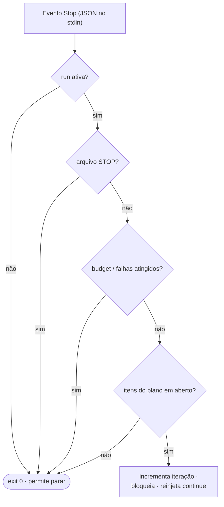

# Hooks

Três hooks são conectados ao `settings.json` pelo `install.sh`. Os dois hooks do engine
vivem em `~/.claude/leopold/hooks/` e são **no-ops a menos que uma run esteja ativa**; o
prompt enhancer vive em `~/.claude/enhance/` e é um **no-op até você ligá-lo** — então
os três podem ficar instalados em toda sessão sem risco.

## `stop-continuity.sh` — o hook de Stop

Roda quando o agente termina um turno. Contrato: lê JSON no stdin; imprime
`{"decision":"block","reason":"..."}` para continuar, ou sai com 0 para permitir a parada.



Fail-open: qualquer erro inesperado permite a parada. A continuidade é melhor esforço;
parar é sempre seguro.

## `guard-irreversible.sh` — o hook de PreToolUse

Roda antes de toda chamada de ferramenta. Contrato: lê JSON no stdin; imprime um
`hookSpecificOutput` com `permissionDecision: "deny"` para bloquear, ou sai com 0 para
permitir. Ele só adiciona negações; nunca afrouxa as permissões do próprio Claude Code.

Veja a tabela de política em [Guardrails](../guardrails.md).

## `enhance.py` — o prompt enhancer de UserPromptSubmit

Roda a cada prompt que você envia (o evento não aceita matcher, então todo o gating é
interno). Contrato: lê o JSON do hook no stdin; texto puro no stdout é injetado como
contexto ao lado do prompt bruto (texto puro, não JSON, para concatenar com segurança
com outros hooks de `UserPromptSubmit`); **sempre sai com 0** — o prompt em si nunca é
modificado nem bloqueado.


Fail-open: sem `claude` no PATH, timeout, erro de API, saída malformada — nada é
emitido e o prompt segue intocado. Detalhe completo (tabela do gate, estado,
ledger, o loop de learn): [Prompt Enhancer](enhance.md).

## Wiring no settings

```json
{
  "hooks": {
    "Stop": [
      { "hooks": [ { "type": "command", "command": "~/.claude/leopold/hooks/stop-continuity.sh" } ] }
    ],
    "PreToolUse": [
      { "matcher": "Bash|Edit|Write|MultiEdit|NotebookEdit",
        "hooks": [ { "type": "command", "command": "~/.claude/leopold/hooks/guard-irreversible.sh" } ] }
    ],
    "UserPromptSubmit": [
      { "hooks": [ { "type": "command", "command": "python3 ~/.claude/enhance/enhance.py --event user-prompt", "timeout": 30 } ] }
    ]
  }
}
```

## Log de eventos

Os dois hooks do engine anexam eventos estruturados em `.leopold/events.jsonl`
(`turn_start`, `stop`, `guard_block`), que o `/leopold-status` lê. O enhancer, por sua
vez, registra no próprio ledger global — `~/.claude/enhance/enhancements.jsonl`, uma
linha por injeção ou tentativa falha — que o `/leopold-enhance learn` minera.
