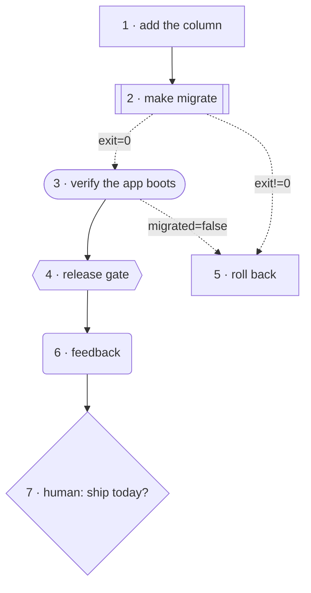

# Plan Grammar

`PLAN.md` is the graph. Not a rendering of one, not a file some tool derives a graph
from — the markdown you type *is* what the scheduler executes and what
[`leopold graph`](driver-config.md#graph-pre-flight-leopold-graph) and the Canvas draw.

Every construct on this page is **opt-in**. A plan that uses none of them parses and
runs exactly as it did before the grammar existed — that is a gate in the test suite,
not a hope. So read this page as "what you *may* write", never as "what you now have
to write".

Two rules govern everything below:

- **The repository is the truth of what was built. The state channel is the truth of
  what was decided.** Work product never goes on the channel; routing signals never go
  in the repo.
- **Routing is deterministic.** A model may *emit a signal*; only the graph decides
  where that leads. No model call picks an edge.

---

## The item line

```markdown
- [ ] Add a `--json` flag to the CLI — done when: `mycli --json` emits valid JSON
- [x] Something already finished
```

One markdown checkbox is one node. Its **1-based position among all checkboxes** (open
and done) is its index, and that index is what `(after: N)` and `@on … -> N` speak in.

!!! warning "Indices are addresses"
    Inserting an item in the middle renumbers everything after it and silently
    repoints every reference. Add at the end, or re-read your `@on`/`(after:)` targets
    after any insertion — `leopold graph` will catch the ones that end up dangling, not
    the ones that end up pointing at the wrong existing item.

Markers attach to an item either **inline** on its own line, or on **their own line
indented under it**. Both forms are equivalent:

```markdown
- [ ] @gate security Review the auth diff
- [ ] Review the auth diff
      @gate security
```

---

## `(after: N)` — static dependencies

```markdown
- [ ] Build the API
- [ ] Build the UI
- [ ] (after: 1, 2) Wire the UI to the API
```

A leading `(after: N)` (or `(deps: N)`) marker declares that this item must wait for
those items. Items with no marker are independent and may run concurrently under
`leopold-driver run --parallel N`, each in its own worktree. Only declare real
dependencies, and make items that touch the same files depend on each other so they
cannot collide.

The marker must be at the **start** of the item's text, before or after a node-kind
marker — both orders work.

---

## `@scenario` — the acceptance cases

```markdown
- [ ] Add a `--json` flag — done when: `mycli --json` emits valid JSON
      @scenario no flag → the human-readable table prints, exactly as before
      @scenario `--json` set → stdout is valid JSON with the table's exact fields
      @scenario `--json` with no rows → prints `[]` and exits 0
```

One case per line, `given X → when Y → then Z`, phrased so a caller could observe it.
The run hands these to the worker as the definition of done, and to a **conformance**
reviewer that checks the diff satisfies *every* one before the item closes; an unmet
scenario comes back as the concrete fix. An item with no `@scenario` lines just uses
its prose done-check, unchanged.

---

## Node kinds

`@node <kind>`, or the shorthands `@work` `@gate` `@verify` `@tool` `@human`
`@feedback`. The default is `work`, which is what every plan written before this
grammar existed compiles to. When an item declares a kind more than once, the last one
written wins.

| Kind | What the engine does |
| --- | --- |
| `@work` | The default. A fresh worker session that edits the repo. |
| `@gate` | A **review-only** session over the uncommitted diff. Every editing tool is denied — on the session *and* in the driver's guard. Its verdict is the node's outcome: `done` → ok, `blocked` → `fail`, which an `@on fail -> N` route can catch. |
| `@verify` | The same review-only node aimed at proof instead of judgement: re-run the build/lint/tests and say whether the work actually holds. |
| `@tool` | The item's text **is a shell command** (or the first backticked span in it). The driver runs it — no model turn — and its exit status lands on the channel as `exit`, so `@on exit=0 -> 5` works with no `@emit` line. The git lock still applies: `@tool git push` is refused, not run. A command is killed after 30 minutes and recorded as `exit=124`. |
| `@human` | The plan asked a **person** to decide this item. Under the default posture (`autonomy: full`) **no person is coming and the run decides it**: Leopold synthesizes the role the decision needs from the item, the mission and `CHARTER.md`, does the work under it, and records the call in `DECISIONS.md` with a **Reversal** line. It decides; it never ships — the git lock is untouched. Set [`autonomy: ask`](#autonomy) and it halts with `awaiting_human` instead. Both engines behave identically. |
| `@feedback` | The run reads **its own evidence** (`events.jsonl` + the run metrics) read-only and may *propose* plan amendments. It never writes the plan — see [Feedback nodes](#feedback-nodes-and-amendments). |

### Autonomy — who decides a `@human` node { #autonomy }

`@human` is the one kind whose meaning depends on a run-level posture rather than on the
item alone.

| `autonomy` | What a `@human` node does |
| --- | --- |
| `full` (default) | Neither engine halts. The run synthesizes the role the decision needs, takes it, completes the item, and appends the call to `DECISIONS.md` naming the persona, the fork, the charter basis and a **Reversal** line. |
| `ask` | Both engines halt at the node with `awaiting_human`, name the item and stage everything. Answer it, mark the item `[x]`, and re-run to resume. |

Set it in `.leopold/GUARDRAILS.md` (`autonomy: ask`), or per run with `LEOPOLD_AUTONOMY=ask`
or the driver's `--ask` / `--autonomy ask`. `ask`, `halt` and `human` all spell the strict
posture.

A persona decides; it never ships. `git commit` and `git push` are denied by
`hooks/guard-irreversible.sh` under either posture, and a force-push always — that is the
lock's entire scope, as [the guard reference](hooks.md#what-the-guard-enforces) spells out.

Everything else is policy, not enforcement. `git tag`, `npm publish`, `cargo publish`,
`gh pr create` and `gh release create` run unimpeded; so does raising a budget, clearing the
kill switch or rewriting `GUARDRAILS.md`. A synthesized role is bound to none of those by
machinery — it is bound by the charter it was given and by the instruction it carries, and
Leopold states the boundary honestly for a concrete reason: a role told something will be
caught for it has no reason to hold back, and nothing would stop it.

### Labels

An optional label may follow the kind: `name:` (explicit, any case), or a bare
lowercase word when item text follows it.

```markdown
- [ ] @gate security Review the auth diff     ← kind gate, label "security"
- [ ] @human Ask the team                     ← no label ("Ask" is capitalised: it is text)
- [ ] @tool build: make test                  ← label "build", command `make test`
- [ ] @tool make test                         ← NO label; the text is the command, word for word
```

A `@tool` node never takes a bare label. Its text is the command, so eating the first
word would run something other than what the plan says (and would hide `git` from the
guard). Label a tool node the explicit way.

---

## `@emit` and `@needs` — the state channel

```markdown
- [ ] Run the database migration
      @emit migrated=true
      @emit migrated=false
- [ ] (after: 1) Announce the release
      @needs migrated
```

`@emit key=value` declares a signal this node **may** put on the channel
(`.leopold/bus.json`); a bare `@emit key` means `key=true`. A node may only write keys
it declared — anything else is refused and logged. `@needs key` declares a signal this
node **requires** before it may run; keys may be separated by commas or spaces.

A worker reports the signals it actually decided on the `SIGNALS:` line of its
end-of-turn status block:

````text
```leopold-status
STATUS: done
ITEM: Run the database migration
SUMMARY: the migration failed on the unique index and was rolled back
SIGNALS: migrated=false
```
````

The channel is deliberately tiny, and the ceilings are enforced in code, not prose:

| Rule | Bound |
| --- | --- |
| key | matches `^[A-Za-z][A-Za-z0-9_.-]{0,63}$` |
| value | a scalar, serialized to one line, ≤ 256 characters |
| signals | ≤ 128 keys on the channel at once |
| file | ≤ 64 KiB |

A value big enough to hold a diff, a patch or a log is a value the channel refuses.
That ceiling is exactly what stops it becoming a second repository nobody reviews.

---

## `@on <condition> -> <target>` — conditional edges

```markdown
- [ ] Run the database migration
      @emit migrated=true
      @emit migrated=false
      @on migrated=true  -> 3
      @on migrated=false -> 4
```

`->`, `=>` and `→` all work. The target is the 1-based index of another item. Two kinds
of condition:

- **Signal** — the condition contains `=` or `!=` (`migrated=false`, `exit!=0`). It
  compares a key on the channel. An **absent key never matches**, in either direction:
  unknown is not "different from", and routing on something nobody emitted is the bug
  this rule prevents.
- **Status** — a bare word (`fail`, `blocked`, `ok`). It tests the node's own recorded
  outcome. When the node recorded no outcome, a truthy signal of the same name matches,
  so `@emit ok` + `@on ok -> 5` reads the way it looks.

Three behaviours worth internalising:

1. **A route is an edge control may take, never a dependency the scheduler waits on.**
   `@on` never widens `deps`.
2. **When a node steers, its other static successors are bypassed.** That is what makes
   the two-branch idiom in the worked example run exactly one branch.
3. **Routing latches.** Once a node has settled, the edges it took are frozen. A later
   node overwriting the same key cannot retroactively un-take a route.

---

## Validation — a malformed graph fails before the first agent runs

`leopold graph` prints the graph and validates it, exiting non-zero when it is unsound;
the same check runs as pre-flight before any agent starts. Five defect classes, each
naming the offender:

| Code | Example message |
| --- | --- |
| `cycle` | ``Cycle: item 4 ("Retry") -> item 2 ("Build") -> item 4 ("Retry"). The run could never finish, so nothing was dispatched.`` |
| `dangling-edge` | ``item 4 ("Step 4") routes to item 99, which does not exist (`@on fail`).`` |
| `unmet-need` | an item `@needs` a key no reachable item ever emits |
| `unroutable-signal` | an `@on key=value` route whose key no item `@emit`s — the edge could never fire |
| `unreachable` | no dependency path and no takeable route ever reaches the item |

```console
$ leopold graph            # the ASCII tree + diagnostics on stderr
$ leopold graph --mermaid  # the same graph as a fenced mermaid diagram
$ leopold graph --json     # the machine form
$ leopold graph --quiet || exit 1   # pre-flight in a script
```

A plan that declares no `@on`, `@emit` or `@needs` **can never produce a diagnostic**:
`(after:)` edges only point backwards at existing items, so they cannot cycle, dangle
or strand anything. Validation is a gate for the new grammar, never a new way for an
old plan to fail.

---

## Feedback nodes and amendments

A `@feedback` node may propose plan amendments in a fenced `leopold-amend` block. It
never applies one: the node is read-only, and the driver enforces the bounds in code.

| Bound | Rule |
| --- | --- |
| add-budget | at most **3** items added per run (the counter lives in `state.json`, so a resumed run inherits what it spent) |
| add-only | `add` is the only verb that ever applies |
| no-delete | an item is never removed |
| no-touch-done | an item already `[x]` is never rewritten |
| no-guardrails | `GUARDRAILS.md` is never amended |
| work-only | an added item is a plain work item — never a `@tool`, `@human`, gate or feedback node |

Accepted items are appended at the **end** of `PLAN.md`, so no existing index moves.
Every accepted amendment writes a `DECISIONS.md` block whose `Reversal:` line names the
exact line to delete; every refusal is logged to `events.jsonl` with the bound that
refused it.

---

## Worked example

A migration that either lands or has to be rolled back. This is the exact plan the
driver's test suite parses, validates and routes — not a second copy that can drift.

```markdown
# Plan

- [ ] Add the `users.locale` column and its migration — done when: `make migrate` applies cleanly on a fresh database
      @scenario a fresh database → `make migrate` → the column exists with default `en`
      @scenario a database already migrated → `make migrate` → exits 0 and changes nothing
- [ ] (after: 1) @tool make migrate
      @on exit=0  -> 3
      @on exit!=0 -> 5
- [ ] (after: 2) @verify Prove the app boots and reads locales against the migrated schema
      @emit migrated=true
      @emit migrated=false
      @on migrated=false -> 5
- [ ] (after: 3) @gate release Review the staged diff for anything that should not ship
- [ ] (after: 2) Roll the migration back and record why it failed — done when: the schema is back at the previous revision
- [ ] (after: 4) @feedback Read this run's evidence and propose at most 3 follow-ups
- [ ] (after: 6) @human Decide whether this ships today
      @needs migrated
```

What the run does with it:



1. Item 1 is an ordinary work item; the two `@scenario` lines are what its reviewer
   checks the diff against.
2. Item 2 is a command. No model turn is spent — the driver runs `make migrate` and
   puts its exit status on the channel as `exit`.
3. If the command fails, the `exit!=0` edge steers to item 5 (the rollback) and item 3
   is bypassed. If it succeeds, item 3 runs and item 5 is bypassed. **Exactly one
   branch runs**, because a node that steers bypasses its other static successors.
4. Item 3 is a read-only proof node. It emits `migrated=true` or `migrated=false`, and
   the false case steers to the rollback the same way.
5. Item 4 is a review-only gate that cannot edit anything it judges.
6. Item 6 reads the run itself and may propose up to three appended follow-ups.
7. Item 7 stops the run and hands the seat back to a person — and only once `migrated`
   is actually on the channel.

`leopold graph` reports no diagnostics for this plan: nothing cycles, every route
target exists, `migrated` is emitted upstream of the item that needs it, and every item
is reachable.

---

## Cheat sheet

| Construct | Means |
| --- | --- |
| `- [ ] text` | one node; its 1-based position is its index |
| `(after: 1, 3)` | wait for items 1 and 3 |
| `@scenario …` | one acceptance case, verified by the conformance reviewer |
| `@node <kind>` / `@work` `@gate` `@verify` `@tool` `@human` `@feedback` | the node kind (default `work`) |
| `@gate security …` / `@tool build: make test` | kind + label |
| `@emit key=value` / `@emit key` | a signal this node may write (`key` alone = `key=true`) |
| `@needs key` | a signal this node requires before it runs |
| `@on fail -> 5` | route on the node's own outcome |
| `@on migrated=false -> 5` | route on a channel signal |
| `@on exit!=0 -> 5` | route on a `@tool` node's exit status |

## See also

- [`leopold graph`](driver-config.md#graph-pre-flight-leopold-graph) — print and
  validate before you trust a plan.
- [Brief Artifacts](artifacts.md) — where `PLAN.md` sits among the other artifacts.
- [The Canvas](../canvas.md) — the same graph, drawn live.
