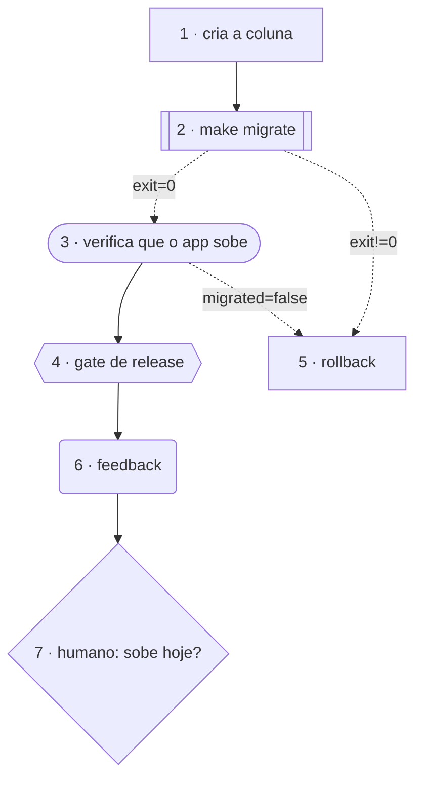

# Gramática do plano

O `PLAN.md` é o grafo. Não é uma representação de um grafo, nem um arquivo do qual
alguma ferramenta deriva um: o markdown que você escreve *é* o que o escalonador
executa e o que o [`leopold graph`](driver-config.md)
e o Canvas desenham.

Toda construção desta página é **opcional**. Um plano que não usa nenhuma delas é
interpretado e executado exatamente como era antes da gramática existir — isso é um
gate da suíte de testes, não uma esperança. Então leia esta página como "o que você
*pode* escrever", nunca como "o que você agora tem que escrever".

Duas regras governam tudo abaixo:

- **O repositório é a verdade do que foi construído. O canal de estado é a verdade do
  que foi decidido.** Produto de trabalho nunca entra no canal; sinal de roteamento
  nunca entra no repositório.
- **O roteamento é determinístico.** Um modelo pode *emitir um sinal*; só o grafo
  decide para onde isso leva. Nenhuma chamada de modelo escolhe uma aresta.

---

## A linha do item

```markdown
- [ ] Add a `--json` flag to the CLI — done when: `mycli --json` emits valid JSON
- [x] Something already finished
```

Cada checkbox markdown é um nó. A sua **posição 1-based entre todos os checkboxes**
(abertos e concluídos) é o índice dele, e é esse índice que o `(after: N)` e o
`@on … -> N` falam.

!!! warning "Índices são endereços"
    Inserir um item no meio renumera tudo depois dele e reaponta silenciosamente cada
    referência. Adicione no fim, ou releia os alvos de `@on`/`(after:)` depois de
    qualquer inserção — o `leopold graph` pega os que ficam pendurados, não os que
    passam a apontar para o item existente errado.

Os marcadores se ligam ao item ou **na própria linha dele**, ou em **uma linha
indentada logo abaixo**. As duas formas são equivalentes:

```markdown
- [ ] @gate security Review the auth diff
- [ ] Review the auth diff
      @gate security
```

---

## `(after: N)` — dependências estáticas

```markdown
- [ ] Build the API
- [ ] Build the UI
- [ ] (after: 1, 2) Wire the UI to the API
```

Um marcador `(after: N)` (ou `(deps: N)`) no início declara que este item precisa
esperar por aqueles itens. Itens sem marcador são independentes e podem rodar em
paralelo com `leopold-driver run --parallel N`, cada um na sua worktree. Declare só
dependências reais, e faça itens que mexem nos mesmos arquivos dependerem uns dos
outros para que não colidam.

O marcador tem que estar no **início** do texto do item, antes ou depois de um marcador
de tipo de nó — as duas ordens funcionam.

---

## `@scenario` — os casos de aceitação

```markdown
- [ ] Add a `--json` flag — done when: `mycli --json` emits valid JSON
      @scenario no flag → the human-readable table prints, exactly as before
      @scenario `--json` set → stdout is valid JSON with the table's exact fields
      @scenario `--json` with no rows → prints `[]` and exits 0
```

Um caso por linha, `dado X → quando Y → então Z`, escrito de um jeito que quem chama
consiga observar. A run entrega isso ao worker como definição de pronto e a um revisor
de **conformidade**, que confere se o diff satisfaz *cada um* antes de fechar o item;
um cenário não atendido volta como o conserto concreto. Um item sem nenhuma linha
`@scenario` continua usando o done-check em prosa, sem mudança nenhuma.

---

## Tipos de nó

`@node <kind>`, ou os atalhos `@work` `@gate` `@verify` `@tool` `@human` `@feedback`.
O padrão é `work`, que é para onde compila todo plano escrito antes desta gramática
existir. Quando um item declara o tipo mais de uma vez, vence o último escrito.

| Tipo | O que o engine faz |
| --- | --- |
| `@work` | O padrão. Uma sessão de worker nova que edita o repositório. |
| `@gate` | Uma sessão **somente leitura** sobre o diff não commitado. Toda ferramenta de edição é negada — na sessão *e* no guard do driver. O veredito dele é o desfecho do nó: `done` → ok, `blocked` → `fail`, que uma rota `@on fail -> N` pode capturar. |
| `@verify` | O mesmo nó somente leitura, mirado em prova em vez de julgamento: reexecuta build/lint/testes e diz se o trabalho realmente se sustenta. |
| `@tool` | O texto do item **é um comando de shell** (ou o primeiro trecho entre crases). O driver executa — sem turno de modelo — e o status de saída cai no canal como `exit`, então `@on exit=0 -> 5` funciona sem nenhuma linha `@emit`. O bloqueio do git continua valendo: `@tool git push` é recusado, não executado. Um comando é morto depois de 30 minutos e registrado como `exit=124`. |
| `@human` | O plano pediu que uma **pessoa** decidisse este item. Sob a postura padrão (`autonomy: full`), **ninguém vai vir e a run decide**: o Leopold sintetiza o papel que a decisão exige a partir do item, da mission e do `CHARTER.md`, faz o trabalho sob esse papel e registra a decisão no `DECISIONS.md` com uma linha **Reversal**. Ele decide; nunca publica — o lock de git fica intacto. Configure [`autonomy: ask`](#autonomy) e ele para com `awaiting_human`. Os dois motores se comportam igual. |
| `@feedback` | A run lê **a própria evidência** (`events.jsonl` + as métricas da run), somente leitura, e pode *propor* emendas ao plano. Nunca escreve o plano — veja "Nós de feedback e emendas" abaixo. |

### Autonomy — quem decide um nó `@human` { #autonomy }

`@human` é o único tipo cujo significado depende de uma postura da run, e não só do item.

| `autonomy` | O que um nó `@human` faz |
| --- | --- |
| `full` (padrão) | Nenhum motor para. A run sintetiza o papel que a decisão exige, assume esse papel, conclui o item e registra a decisão no `DECISIONS.md` nomeando a persona, o fork, a base no charter e uma linha **Reversal**. |
| `ask` | Os dois motores param no nó com `awaiting_human`, nomeiam o item e deixam tudo staged. Responda, marque o item como `[x]` e rode de novo para retomar. |

Configure no `.leopold/GUARDRAILS.md` (`autonomy: ask`), ou por run com
`LEOPOLD_AUTONOMY=ask` ou as flags `--ask` / `--autonomy ask` do driver. `ask`, `halt` e
`human` escrevem a mesma postura estrita.

Uma persona decide; ela nunca publica. `git commit` e `git push` continuam negados pelo
`hooks/guard-irreversible.sh` nas duas posturas, e um force-push sempre — esse é o escopo
inteiro da trava, como a [referência do guard](hooks.pt-BR.md#o-que-o-guard-garante)
detalha.

Todo o resto é política, não imposição. `git tag`, `npm publish`, `cargo publish`,
`gh pr create` e `gh release create` rodam sem obstáculo; aumentar um budget, limpar o kill
switch ou reescrever o `GUARDRAILS.md` também. Um papel sintetizado não é contido por
maquinário em nenhum desses casos — ele é contido pelo charter que recebeu e pela instrução
que carrega. O Leopold enuncia essa fronteira com honestidade por um motivo concreto: um
papel que acredita que algo será impedido por ele não tem razão para se conter, e nada o
impediria.

### Rótulos

Um rótulo opcional pode vir depois do tipo: `nome:` (explícito, em qualquer caixa), ou
uma palavra minúscula solta quando ainda há texto do item depois dela.

```markdown
- [ ] @gate security Review the auth diff     ← tipo gate, rótulo "security"
- [ ] @human Ask the team                     ← sem rótulo ("Ask" tem maiúscula: é texto)
- [ ] @tool build: make test                  ← rótulo "build", comando `make test`
- [ ] @tool make test                         ← SEM rótulo; o texto é o comando, palavra por palavra
```

Um nó `@tool` nunca aceita rótulo solto. O texto dele é o comando, então engolir a
primeira palavra rodaria algo diferente do que o plano diz (e esconderia o `git` do
guard). Um nó de tool se rotula da forma explícita.

---

## `@emit` e `@needs` — o canal de estado

```markdown
- [ ] Run the database migration
      @emit migrated=true
      @emit migrated=false
- [ ] (after: 1) Announce the release
      @needs migrated
```

`@emit key=value` declara um sinal que este nó **pode** colocar no canal
(`.leopold/bus.json`); um `@emit key` sozinho significa `key=true`. Um nó só pode
escrever chaves que declarou — qualquer outra é recusada e registrada. `@needs key`
declara um sinal que este nó **exige** antes de rodar; as chaves podem ser separadas
por vírgula ou espaço.

O worker reporta os sinais que de fato decidiu na linha `SIGNALS:` do bloco de status
de fim de turno:

````text
```leopold-status
STATUS: done
ITEM: Run the database migration
SUMMARY: the migration failed on the unique index and was rolled back
SIGNALS: migrated=false
```
````

O canal é deliberadamente minúsculo, e os limites são impostos em código, não em prosa:

| Regra | Limite |
| --- | --- |
| chave | casa com `^[A-Za-z][A-Za-z0-9_.-]{0,63}$` |
| valor | um escalar, serializado em uma linha, ≤ 256 caracteres |
| sinais | ≤ 128 chaves no canal ao mesmo tempo |
| arquivo | ≤ 64 KiB |

Um valor grande o bastante para guardar um diff, um patch ou um log é um valor que o
canal recusa. É esse teto que impede o canal de virar um segundo repositório que
ninguém revisa.

---

## `@on <condição> -> <alvo>` — arestas condicionais

```markdown
- [ ] Run the database migration
      @emit migrated=true
      @emit migrated=false
      @on migrated=true  -> 3
      @on migrated=false -> 4
```

`->`, `=>` e `→` funcionam igual. O alvo é o índice 1-based de outro item. Existem dois
tipos de condição:

- **Sinal** — a condição contém `=` ou `!=` (`migrated=false`, `exit!=0`). Compara uma
  chave do canal. Uma **chave ausente nunca casa**, em nenhuma direção: desconhecido
  não é "diferente de", e rotear sobre algo que ninguém emitiu é exatamente o bug que
  essa regra evita.
- **Status** — uma palavra solta (`fail`, `blocked`, `ok`). Testa o desfecho do próprio
  nó. Quando o nó não registrou desfecho, um sinal verdadeiro de mesmo nome casa, então
  `@emit ok` + `@on ok -> 5` se lê do jeito que parece.

Três comportamentos que vale internalizar:

1. **Uma rota é uma aresta que o controle pode tomar, nunca uma dependência que o
   escalonador espera.** `@on` nunca amplia `deps`.
2. **Quando um nó desvia, os outros sucessores estáticos dele são pulados.** É isso que
   faz o idioma de dois ramos do exemplo abaixo executar exatamente um ramo.
3. **O roteamento trava (latch).** Depois que um nó assenta, as arestas que ele tomou
   ficam congeladas. Um nó posterior sobrescrevendo a mesma chave não consegue
   "destomar" uma rota retroativamente.

---

## Validação — um grafo malformado falha antes do primeiro agente rodar

O `leopold graph` imprime o grafo e valida, saindo com código diferente de zero quando
ele não é sólido; a mesma checagem roda como pré-voo antes de qualquer agente começar.
São cinco classes de defeito, cada uma nomeando o culpado:

| Código | Exemplo de mensagem |
| --- | --- |
| `cycle` | ``Cycle: item 4 ("Retry") -> item 2 ("Build") -> item 4 ("Retry"). The run could never finish, so nothing was dispatched.`` |
| `dangling-edge` | ``item 4 ("Step 4") routes to item 99, which does not exist (`@on fail`).`` |
| `unmet-need` | um item dá `@needs` numa chave que nenhum item alcançável emite |
| `unroutable-signal` | uma rota `@on chave=valor` cuja chave nenhum item `@emit`e — a aresta nunca poderia disparar |
| `unreachable` | nenhum caminho de dependência e nenhuma rota tomável chega ao item |

```console
$ leopold graph            # a árvore ASCII + diagnósticos no stderr
$ leopold graph --mermaid  # o mesmo grafo como diagrama mermaid
$ leopold graph --json     # a forma de máquina
$ leopold graph --quiet || exit 1   # pré-voo num script
```

Um plano que não declara nenhum `@on`, `@emit` ou `@needs` **nunca consegue produzir um
diagnóstico**: arestas `(after:)` só apontam para trás, para itens existentes, então
não podem ciclar, ficar penduradas nem isolar nada. A validação é um gate para a
gramática nova, nunca um jeito novo de um plano antigo falhar.

---

## Nós de feedback e emendas

Um nó `@feedback` pode propor emendas ao plano num bloco cercado `leopold-amend`. Ele
nunca aplica nenhuma: o nó é somente leitura, e o driver impõe os limites em código.

| Limite | Regra |
| --- | --- |
| add-budget | no máximo **3** itens adicionados por run (o contador vive no `state.json`, então uma run retomada herda o que já gastou) |
| add-only | `add` é o único verbo que chega a ser aplicado |
| no-delete | um item nunca é removido |
| no-touch-done | um item já `[x]` nunca é reescrito |
| no-guardrails | o `GUARDRAILS.md` nunca é emendado |
| work-only | um item adicionado é um item de trabalho simples — nunca um `@tool`, `@human`, gate ou nó de feedback |

Os itens aceitos são anexados no **fim** do `PLAN.md`, então nenhum índice existente se
move. Toda emenda aceita escreve um bloco no `DECISIONS.md` cuja linha `Reversal:`
nomeia a linha exata a apagar; toda recusa é registrada no `events.jsonl` com o limite
que a recusou.

---

## Exemplo completo

Uma migração que ou entra, ou tem que ser revertida. Este é exatamente o plano que a
suíte de testes do driver interpreta, valida e roteia — não uma segunda cópia que pode
divergir.

```markdown
# Plan

- [ ] Add the `users.locale` column and its migration — done when: `make migrate` applies cleanly on a fresh database
      @scenario a fresh database → `make migrate` → the column exists with default `en`
      @scenario a database already migrated → `make migrate` → exits 0 and changes nothing
- [ ] (after: 1) @tool make migrate
      @on exit=0  -> 3
      @on exit!=0 -> 5
- [ ] (after: 2) @verify Prove the app boots and reads locales against the migrated schema
      @emit migrated=true
      @emit migrated=false
      @on migrated=false -> 5
- [ ] (after: 3) @gate release Review the staged diff for anything that should not ship
- [ ] (after: 2) Roll the migration back and record why it failed — done when: the schema is back at the previous revision
- [ ] (after: 4) @feedback Read this run's evidence and propose at most 3 follow-ups
- [ ] (after: 6) @human Decide whether this ships today
      @needs migrated
```

O que a run faz com isso:



1. O item 1 é um item de trabalho comum; as duas linhas `@scenario` são o que o revisor
   dele confere contra o diff.
2. O item 2 é um comando. Nenhum turno de modelo é gasto — o driver roda `make migrate`
   e põe o status de saída no canal como `exit`.
3. Se o comando falha, a aresta `exit!=0` desvia para o item 5 (o rollback) e o item 3 é
   pulado. Se dá certo, o item 3 roda e o item 5 é pulado. **Exatamente um ramo roda**,
   porque um nó que desvia pula os outros sucessores estáticos dele.
4. O item 3 é um nó de prova somente leitura. Ele emite `migrated=true` ou
   `migrated=false`, e o caso falso desvia para o rollback do mesmo jeito.
5. O item 4 é um gate somente leitura que não consegue editar aquilo que julga.
6. O item 6 lê a própria run e pode propor até três follow-ups anexados.
7. O item 7 para a run e devolve a cadeira para uma pessoa — e só depois que
   `migrated` está de fato no canal.

O `leopold graph` não reporta nenhum diagnóstico para esse plano: nada cicla, todo alvo
de rota existe, `migrated` é emitido antes do item que precisa dele, e todo item é
alcançável.

---

## Colinha

| Construção | Significa |
| --- | --- |
| `- [ ] texto` | um nó; a posição 1-based dele é o índice |
| `(after: 1, 3)` | espera pelos itens 1 e 3 |
| `@scenario …` | um caso de aceitação, verificado pelo revisor de conformidade |
| `@node <kind>` / `@work` `@gate` `@verify` `@tool` `@human` `@feedback` | o tipo do nó (padrão `work`) |
| `@gate security …` / `@tool build: make test` | tipo + rótulo |
| `@emit key=value` / `@emit key` | um sinal que este nó pode escrever (`key` sozinho = `key=true`) |
| `@needs key` | um sinal que este nó exige antes de rodar |
| `@on fail -> 5` | roteia pelo desfecho do próprio nó |
| `@on migrated=false -> 5` | roteia por um sinal do canal |
| `@on exit!=0 -> 5` | roteia pelo status de saída de um nó `@tool` |

## Veja também

- [`leopold graph`](driver-config.md) — imprima e
  valide antes de confiar num plano.
- [Artefatos do brief](artifacts.md) — onde o `PLAN.md` fica entre os outros
  artefatos.
- [O Canvas](../canvas.md) — o mesmo grafo, desenhado ao vivo.
