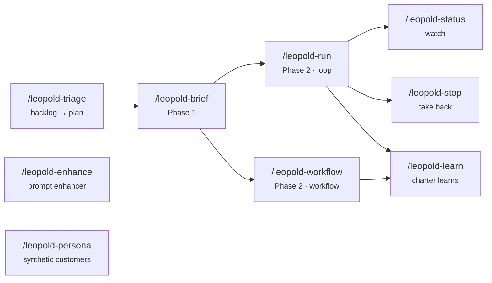

# Skills

Leopold ships a family of Claude Code skills, installed to `~/.claude/skills/`. They
are authored in the gstack-compatible format (frontmatter + markdown body). The core
skills are documented below.

## `/leopold-brief`

Phase 1. A structured debate that captures the mission and your decision-making,
then writes the brief (`MISSION`, `CHARTER`, `GUARDRAILS`, `PLAN`) to `.leopold/`.

- **Use it** to start a mission, or to revise an existing brief.
- **Output** the four artifacts plus an empty `DECISIONS.md`.

## `/leopold-run`

Phase 2. Activates the run (writes `state.json` with `active:true`) and begins
the turn loop. The Stop hook carries it forward; the guard hook locks git.

- **Preflight** aborts if the brief is missing — run `/leopold-brief` first.
- **Behavior** adopts spawned-session mode so gstack skills auto-decide.

## `/leopold-workflow`

Phase 2, the workflow way. Compiles the same brief into a
[dynamic workflow](https://code.claude.com/docs/en/workflows) — a JavaScript harness
Claude Code's runtime executes in the background — and runs it. The plan lives in code
instead of one context window, so a long run doesn't drift into agentic laziness,
self-preferential bias, or goal drift; each item gets an independent adversarial review.

- **Compiles** `PLAN.md` into dependency-ordered waves and risk-classifies each item
  (effort + `critical` + `sensitive`) with the driver's keyword rules, then launches the
  canonical script (`reference/leopold-run.workflow.js`) via the `Workflow` tool.
- **Preflight** needs Dynamic workflows enabled (`/config`) and an existing brief.
- **Git stays locked for free** — a workflow can't commit; it stages, you commit.
- **Resumable** and visible in `/workflows`; saving the compiled script to
  `.claude/workflows/leopold-run.js` makes the brief a re-runnable harness.
- **When to reach for it** vs `/leopold-run`: large or parallelizable plans → workflow;
  short or interactive plans → the loop.

## `/leopold-learn`

The self-improving charter. Mines the decision log (`DECISIONS.md` + archived runs),
this project's session transcripts, and git history with three miners over **disjoint**
sources; clusters the recurring signals (a pattern surfacing in more than one
independent source is the strongest); puts a kill-biased skeptic on every candidate;
and distills the survivors into `.leopold/CHARTER-amendments.md`.

- **Hard boundary:** it never edits `CHARTER.md` itself — the charter is the user's
  identity. The human reviews the proposal and applies what sounds like them.
- **Cadence:** after each substantial run, or whenever you notice yourself repeating
  the same correction. Each pass compounds: a sharper charter means fewer escalations
  and fewer wrong-direction decisions next run.
- Requires Dynamic workflows enabled.

## `/leopold-triage`

Backlog triage as a workflow, with the **quarantine** pattern: the agents that read
untrusted item content (issue bodies) have no repo access and only emit structured
classifications; the agents that touch the repo (fix planners) see only those
structured fields. A prompt injection in an issue can distort at most its own item's
classification.

- **Input:** GitHub issues (`gh issue list`), a file/directory of reports, or pasted
  content; dedupes against open PRs and `PLAN.md`.
- **Output:** a severity-ranked actionable list, duplicate groups, already-tracked
  items, and (in `fix` mode) grounded fix plans for quick wins — which can become
  `PLAN.md` items for a `/leopold-workflow` run.
- **Continuous:** pair with `/loop` (e.g. every 6h) for a standing queue.

## `/leopold-enhance`

Control plane for the [global prompt enhancer](enhance.md) — the `UserPromptSubmit`
hook that has Haiku (your own account) interpret weak prompts, charter-aware.

- **`status`** — enabled/off, mode, and the tail of the enhancement ledger.
- **`on` / `off`** — the same toggle as `leopold menu` → enhance.
- **`preview "text"`** — the gate's verdict (per-signal score breakdown) and the
  exact block that would be injected; the threshold-tuning tool.
- **`learn`** — mines the ledger + session transcripts for enhanced prompts you
  corrected right after (plus statistical gate misfires), skeptic-verifies each
  candidate, and proposes rules into `~/.claude/enhance/PROFILE-amendments.md`.
- **Hard boundary:** `learn` never edits `PROMPT-PROFILE.md` itself — the profile
  shapes every future interpretation; you review and apply.
- `learn` requires Dynamic workflows enabled.

## `/leopold-persona`

[Synthetic-customer testing](../concepts/persona-testing.md), conducted: an
evidence-grounded persona walks a declared product flow — perceiving the real
interface, reacting in character, journaling every turn — and the run ends with a
structured report of bugs, confusion, accessibility problems and friction.

- **`init`** — scaffolds the `.leopold/persona/` namespace (personas / flows / runs)
  and the flow template.
- **`build <id>`** — compiles a persona contract through `persona-contract-builder`.
- **`run <flow> [--persona <id>|all]`** — walks the flow; the headless twin is
  `leopold persona run` (same run tree, driver-conducted, bounds enforced in code).
- Ships with two support skills, vendored verbatim and installed on both harnesses:
  **`persona-contract-builder`** (compiles an evidence-grounded
  `persona-contract/1.0` — claim catalog, source ledger, epistemic boundaries,
  validation gate) and **`persona-contract-runtime`** (enacts a contract one bounded
  turn at a time — sincerity protocol, anti-drift gate, instrumented results). They
  are the persona semantics; `/leopold-persona` conducts around them and never
  redefines their schemas.

## `/leopold-status`

Read-only dashboard: active or not, plan progress, decisions logged, recent
events. Never mutates anything.

## `/leopold-stop`

Clean shutdown. Flips the run inactive so the Stop hook allows the session to
halt at the next turn boundary. The blunt alternative is `touch .leopold/STOP`.

!!! note "Frontmatter shape"
    Each skill declares `name`, `version`, `description`, `allowed-tools`, and
    `triggers`, so Claude Code can route to it by intent.
