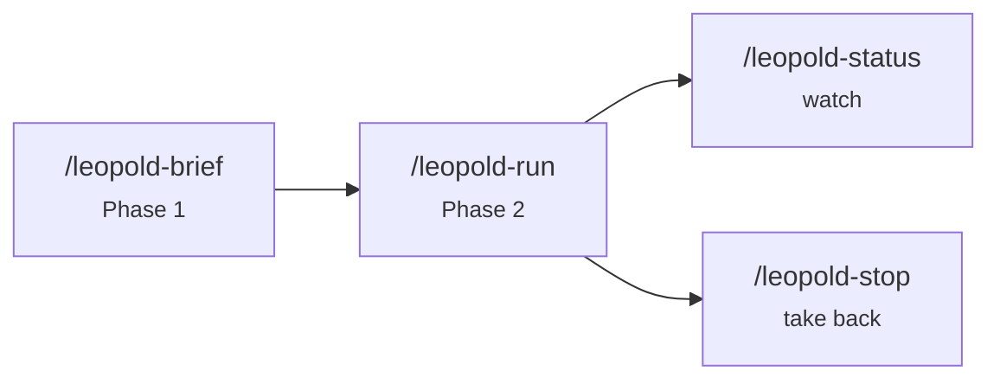

# Skills

Leopold ships four Claude Code skills, installed to `~/.claude/skills/`. They are
authored in the gstack-compatible format (frontmatter + markdown body).

## `/leopold-brief`

Phase 1. A structured debate that captures the mission and your decision-making,
then writes the brief (`MISSION`, `CHARTER`, `GUARDRAILS`, `PLAN`) to `.leopold/`.

- **Use it** to start a mission, or to revise an existing brief.
- **Output** the four artifacts plus an empty `DECISIONS.md`.

## `/leopold-run`

Phase 2. Activates the run (writes `state.json` with `active:true`) and begins
the turn loop. The Stop hook carries it forward; the guard hook locks git.

- **Preflight** aborts if the brief is missing — run `/leopold-brief` first.
- **Behavior** adopts spawned-session mode so gstack skills auto-decide.

## `/leopold-status`

Read-only dashboard: active or not, plan progress, decisions logged, recent
events. Never mutates anything.

## `/leopold-stop`

Clean shutdown. Flips the run inactive so the Stop hook allows the session to
halt at the next turn boundary. The blunt alternative is `touch .leopold/STOP`.

!!! note "Frontmatter shape"
    Each skill declares `name`, `version`, `description`, `allowed-tools`, and
    `triggers`, so Claude Code can route to it by intent.
