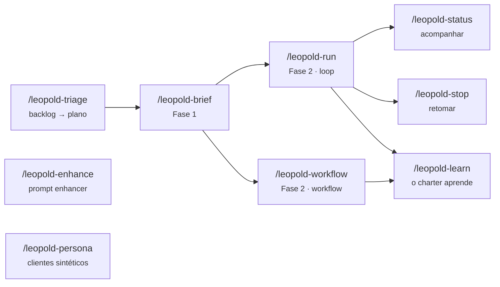

# Skills

O Leopold traz uma família de skills do Claude Code, instaladas em `~/.claude/skills/`.
Elas são escritas no formato compatível com gstack (frontmatter + corpo em markdown).
As skills principais estão documentadas abaixo.

## `/leopold-brief`

Fase 1. Um debate estruturado que captura a missão e o seu jeito de decidir,
e então escreve o brief (`MISSION`, `CHARTER`, `GUARDRAILS`, `PLAN`) em `.leopold/`.

- **Use** para iniciar uma missão ou revisar um brief existente.
- **Saída:** os quatro artefatos mais um `DECISIONS.md` vazio.

## `/leopold-run`

Fase 2. Ativa a run (escreve `state.json` com `active:true`) e inicia o loop
de turnos. O hook de Stop a leva adiante; o hook de guarda tranca o git.

- **Preflight** aborta se o brief não existir — rode `/leopold-brief` antes.
- **Comportamento** adota o modo spawned-session para que as skills do gstack decidam sozinhas.

## `/leopold-workflow`

Fase 2, do jeito workflow. Compila o mesmo brief em um
[dynamic workflow](https://code.claude.com/docs/en/workflows) — um harness em JavaScript
que o runtime do Claude Code executa em background — e o roda. O plano vive em código
em vez de uma única janela de contexto, então uma run longa não deriva para preguiça
agêntica, viés autopreferencial ou desvio de objetivo; cada item recebe uma revisão adversarial independente.

- **Compila** o `PLAN.md` em waves ordenadas por dependência e classifica o risco de cada item
  (esforço + `critical` + `sensitive`) com as regras de palavra-chave do driver, e então dispara o
  script canônico (`reference/leopold-run.workflow.js`) via a ferramenta `Workflow`.
- **Preflight** exige Dynamic workflows habilitado (`/config`) e um brief existente.
- **O git fica trancado de graça** — um workflow não consegue commitar; ele deixa staged, você commita.
- **Retomável** e visível em `/workflows`; salvar o script compilado em
  `.claude/workflows/leopold-run.js` transforma o brief em um harness re-executável.
- **Quando escolher esse caminho** vs `/leopold-run`: planos grandes ou paralelizáveis → workflow;
  planos curtos ou interativos → o loop.

## `/leopold-learn`

O charter que se auto-aprimora. Minera o log de decisões (`DECISIONS.md` + runs arquivadas),
os transcripts de sessão deste projeto e o histórico do git com três mineradores sobre
fontes **disjuntas**; agrupa os sinais recorrentes (um padrão que aparece em mais de uma
fonte independente é o mais forte); coloca um cético com viés de rejeição em cima de cada
candidato; e destila os sobreviventes em `.leopold/CHARTER-amendments.md`.

- **Limite rígido:** ele nunca edita o `CHARTER.md` — o charter é a identidade do
  usuário. O humano revisa a proposta e aplica o que soa como ele.
- **Cadência:** depois de cada run substancial, ou sempre que você se pegar repetindo
  a mesma correção. Cada passada compõe: um charter mais afiado significa menos escalações
  e menos decisões na direção errada na próxima run.
- Requer Dynamic workflows habilitado.

## `/leopold-triage`

Triagem de backlog como workflow, com o padrão de **quarentena**: os agentes que leem
conteúdo não confiável dos itens (corpos de issues) não têm acesso ao repositório e só
emitem classificações estruturadas; os agentes que tocam no repositório (planejadores
de correção) veem apenas esses campos estruturados. Um prompt injection em uma issue
distorce, no máximo, a classificação do próprio item.

- **Entrada:** issues do GitHub (`gh issue list`), um arquivo/diretório de relatórios ou
  conteúdo colado; deduplica contra PRs abertos e o `PLAN.md`.
- **Saída:** uma lista acionável ordenada por severidade, grupos de duplicatas, itens já
  rastreados e (no modo `fix`) planos de correção fundamentados para vitórias rápidas —
  que podem virar itens do `PLAN.md` para uma run de `/leopold-workflow`.
- **Contínuo:** combine com `/loop` (ex.: a cada 6h) para uma fila permanente.

## `/leopold-enhance`

Plano de controle do [prompt enhancer global](enhance.md) — o hook de `UserPromptSubmit`
que faz o Haiku (na sua própria conta) interpretar prompts fracos, ciente do charter.

- **`status`** — ligado/desligado, modo e o final do ledger de enhancements.
- **`on` / `off`** — o mesmo toggle de `leopold menu` → enhance.
- **`preview "text"`** — o veredito do gate (pontuação detalhada por sinal) e o
  bloco exato que seria injetado; a ferramenta para calibrar o threshold.
- **`learn`** — minera o ledger + transcripts de sessão em busca de prompts aprimorados
  que você corrigiu logo em seguida (mais os disparos errados estatísticos do gate),
  verifica cada candidato com um cético e propõe regras em `~/.claude/enhance/PROFILE-amendments.md`.
- **Limite rígido:** o `learn` nunca edita o `PROMPT-PROFILE.md` — o profile
  molda toda interpretação futura; você revisa e aplica.
- O `learn` requer Dynamic workflows habilitado.

## `/leopold-persona`

[Teste com clientes sintéticos](../concepts/persona-testing.md), conduzido: uma
persona fundamentada em evidência percorre um fluxo declarado do produto —
percebendo a interface real, reagindo em personagem, registrando cada turno no
diário — e o run termina com um relatório estruturado de bugs, confusão,
problemas de acessibilidade e fricção.

- **`init`** — cria o namespace `.leopold/persona/` (personas / flows / runs) e o
  template de fluxo.
- **`build <id>`** — compila um contrato de persona via `persona-contract-builder`.
- **`run <flow> [--persona <id>|all]`** — percorre o fluxo; o gêmeo headless é
  `leopold persona run` (mesma árvore de run, conduzido pelo driver, limites
  aplicados em código).
- Vem com duas skills de apoio, vendorizadas byte a byte e instaladas nos dois
  harnesses: **`persona-contract-builder`** (compila um `persona-contract/1.0`
  fundamentado em evidência — catálogo de claims, ledger de fontes, fronteiras
  epistêmicas, gate de validação) e **`persona-contract-runtime`** (executa um
  contrato um turno limitado por vez — protocolo de sinceridade, gate anti-drift,
  resultados instrumentados). Elas são a semântica de persona; o
  `/leopold-persona` conduz em volta delas e nunca redefine seus schemas.

## `/leopold-status`

Dashboard somente leitura: ativa ou não, progresso do plano, decisões registradas,
eventos recentes. Nunca altera nada.

## `/leopold-stop`

Encerramento limpo. Marca a run como inativa para que o hook de Stop permita a sessão
parar no próximo limite de turno. A alternativa bruta é `touch .leopold/STOP`.

!!! note "Formato do frontmatter"
    Cada skill declara `name`, `version`, `description`, `allowed-tools` e
    `triggers`, para que o Claude Code consiga roteá-la por intenção.
