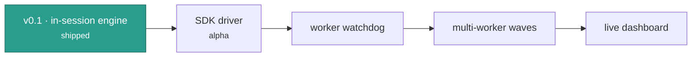

# Roadmap

## Shipped

- [x] In-session engine: `/leopold-brief`, `/leopold-run`, `/leopold-status`,
      `/leopold-stop`
- [x] Stop hook (continuity) and PreToolUse hook (git lock), behavior-tested
- [x] Brief artifact templates and `install.sh` with idempotent settings merge
- [x] SDK driver (alpha): persistent conductor + fresh workers, conductor/worker
      status protocol, charter-grounded decisions, git-locked `canUseTool`,
      notifications — uses your Claude Code auth, no API key

## Next

- [x] `leopold doctor` — verify install, hooks, and gstack wiring
- [ ] Worker watchdog for turns that end without a status block
- [ ] gstack playbook router as first-class config
- [ ] Multi-worker fan-out for independent plan items (parallel waves)
- [ ] SSE event stream and a web dashboard for live run state and the decision log
- [ ] Sandboxed workers (E2B / Daytona) for isolated parallel execution

Have an idea? Open an issue or a discussion on
[GitHub](https://github.com/Jonhvmp/leopold).
