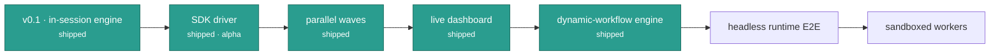

# Roadmap

## Shipped

- [x] In-session engine: `/leopold-brief`, `/leopold-run`, `/leopold-status`,
      `/leopold-stop`
- [x] Stop hook (continuity) and PreToolUse hook (git lock), behavior-tested +
      red-teamed
- [x] Brief artifact templates and `install.sh` with idempotent settings merge
- [x] SDK driver (alpha): persistent conductor + fresh workers, conductor/worker
      status protocol, charter-grounded decisions, git-locked `canUseTool`,
      notifications — uses your Claude Code auth, no API key
- [x] `leopold doctor`, toolchain manager (`leopold menu`), `leopold up` (Phase 0)
- [x] **Parallel waves** — `run --parallel N`: dependency-aware scheduler, one
      worktree per item, staged-patch replay onto the main tree
- [x] **Live dashboard** — `leopold watch`: SSE event stream, cost meters, the
      decision log, and the native dynamic-workflow **phase tree**
- [x] **Dynamic-workflow engine** — `/leopold-workflow` (brief compiled into a
      workflow), `leopold workflow` (the compiler as tested code; `--run`
      experimental headless runtime), `/leopold-learn` (the self-improving
      charter + `learn_on_finish`), `/leopold-triage` (quarantined backlog
      triage), plan-by-tournament in the brief
- [x] **Quality panels in the driver** — diverse-lens review panel, root-cause
      hypothesis panel on retries, opt-in smart routing
- [x] **Hardcore CI** — CLI smoke of the built binary, shellcheck gate,
      macOS + Ubuntu matrix, npm provenance, Dependabot, CodeQL

## Next

- [ ] End-to-end exercise of the experimental `workflow --run` query shim (a
      manual `workflow_dispatch` CI job with a real key — it spends tokens)
- [ ] Worker watchdog for turns that end without a status block
- [ ] Toolchain manager: acceptance-test the ovmem installer on a clean Linux
      box + macOS
- [ ] ovmem extension: fully-local Ollama/GGUF provider profile (no API key)
- [ ] gstack playbook router as first-class config
- [ ] Sandboxed workers (E2B / Daytona) for isolated parallel execution

Have an idea? Open an issue or a discussion on
[GitHub](https://github.com/Jonhvmp/leopold).
