# Roadmap

```mermaid
flowchart LR
    V01["v0.1 · engine in-session<br/><small>shipped</small>"] --> DRV["driver SDK<br/><small>shipped · alpha</small>"]
    DRV --> FAN["ondas paralelas<br/><small>shipped</small>"]
    FAN --> DASH["dashboard ao vivo<br/><small>shipped</small>"]
    DASH --> WF["engine de workflow dinâmico<br/><small>shipped</small>"]
    WF --> ENH["prompt enhancer<br/><small>shipped · v0.11</small>"]
    ENH --> E2E["E2E do runtime headless"]
    E2E --> SBX["workers em sandbox"]
    classDef done fill:#2a9d8f,stroke:#1b6b5f,color:#fff;
    class V01,DRV,FAN,DASH,WF,ENH done;
```

## Entregue

- [x] Engine in-session: `/leopold-brief`, `/leopold-run`, `/leopold-status`,
      `/leopold-stop`
- [x] Stop hook (continuidade) e hook PreToolUse (lock de git), com testes de
      comportamento + red team
- [x] Templates dos artefatos do brief e `install.sh` com merge idempotente de
      settings
- [x] Driver SDK (alpha): maestro persistente + workers novos, protocolo de
      status maestro/worker, decisões fundamentadas no charter, `canUseTool`
      com git travado, notificações — usa a sua auth do Claude Code, sem chave
      de API
- [x] `leopold doctor`, gerenciador de toolchain (`leopold menu`), `leopold up` (Fase 0)
- [x] **Ondas paralelas** — `run --parallel N`: escalonador ciente de
      dependências, uma worktree por item, replay do patch staged na árvore
      principal
- [x] **Dashboard ao vivo** — `leopold watch`: stream de eventos via SSE,
      medidores de custo, o log de decisões e a **árvore de fases** nativa de
      workflow dinâmico
- [x] **Engine de workflow dinâmico** — `/leopold-workflow` (o brief compilado
      num workflow), `leopold workflow` (o compilador como código testado;
      `--run` é o runtime headless experimental), `/leopold-learn` (o charter
      que se aprimora sozinho + `learn_on_finish`), `/leopold-triage` (triagem
      de backlog em quarentena), plano por torneio no brief
- [x] **Painéis de qualidade no driver** — painel de revisão com lentes
      diversas, painel de hipóteses de causa raiz em novas tentativas,
      roteamento inteligente opt-in
- [x] **CI hardcore** — smoke test de CLI do binário compilado, gate de
      shellcheck, matriz macOS + Ubuntu, npm provenance, Dependabot, CodeQL
- [x] **Prompt enhancer (v0.11)** — hook global de `UserPromptSubmit`: prompts
      fracos ganham uma interpretação estruturada e ciente do charter, gerada
      pelo Haiku na conta do próprio usuário (desligado por padrão, fail-open,
      veto por âncora), `/leopold-enhance` com um loop de aprendizado que
      minera o ledger e propõe regras de prompt-profile

## Próximos

- [ ] Exercitar de ponta a ponta o shim de query experimental do
      `workflow --run` (um job de CI manual via `workflow_dispatch` com uma
      chave real — gasta tokens)
- [ ] Watchdog de worker para turnos que terminam sem bloco de status
- [ ] Gerenciador de toolchain: teste de aceitação do instalador do ovmem numa
      máquina Linux limpa + macOS
- [ ] Extensão do ovmem: perfil de provider totalmente local com Ollama/GGUF
      (sem chave de API)
- [ ] Roteador de playbooks do gstack como config de primeira classe
- [ ] Workers em sandbox (E2B / Daytona) para execução paralela isolada

Tem uma ideia? Abra uma issue ou uma discussão no
[GitHub](https://github.com/Jonhvmp/leopold).
